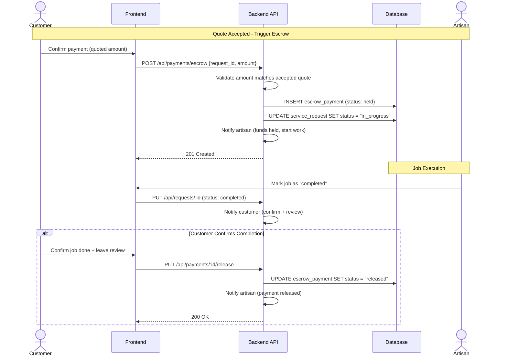
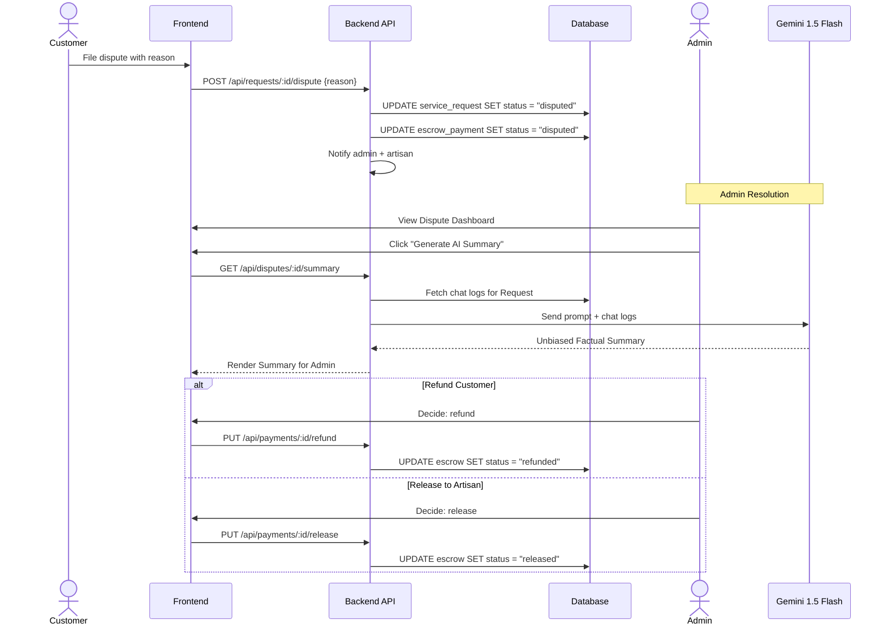

# ArtisanConnect Ghana

ArtisanConnect Ghana is a state-of-the-art, AI-powered service marketplace designed to bridge the gap between customers and skilled artisans in Ghana. It features intelligent matching, real-time messaging, simulated escrow payments, AI-assisted dispute resolution, and interactive location-based discovery.

## 🗺️ Architectural Documentation

The project includes an extremely detailed set of architectural and design documentation located in the [`docs/design`](docs/design/) directory. This includes:
- [System Architecture](docs/design/01-system-architecture.md)
- [Database Schema & ERD](docs/design/02-database-schema.md)
- [Workflow Diagrams](docs/design/03-workflow-diagrams.md)
- [AI Intelligence Layer](docs/design/05-ai-intelligence-layer.md)

## 🚀 Key Features

### 1. Identity Verification & Roles
- **Multi-tenant Roles:** Seamlessly switch between Customer, Artisan, and Admin capabilities based on database-level Role-Based Access Control (RBAC).
- **Artisan Profiles:** Artisans can manage their public presence by editing their bio, managing services offered, and uploading portfolio items to showcase their work.
- **Admin Verification:** Robust administrative dashboard for manually verifying artisan identities, maintaining platform trust.

### 2. Intelligent Artisan Discovery
- **Unified Hybrid Search:** Search by exact Artisan name/profession or use **AI Natural Language Processing**. A customer can search for *"my sink is leaking water everywhere"*, and the AI (powered by Google Gemini 1.5 Flash) intelligently parses the request, infers the need for a "Plumber", and extracts urgency levels to suggest the best matches.
- **Interactive Mapbox Geolocation:** Explore available artisans visually on an interactive map. Geolocation queries calculate the precise distance from the customer's coordinates to the artisan's service radius.

### 3. Service Requests & Real-time Messaging
- Customers can submit detailed service requests to specific artisans.
- The built-in **Chat & Messaging System** allows real-time communication between customers and artisans to negotiate scope, share images, and finalize job details.

### 4. Escrow Payments & Financial Workflows
- **Quoting System:** Artisans can review a pending request and submit a formal Quote detailing the cost breakdown in GHS.
- **Simulated Escrow Checkout:** When a customer accepts a quote, they undergo a simulated checkout process. The funds are held in a secure Escrow state, automatically upgrading the request to `IN_PROGRESS`.
- **Fund Release:** Upon successful job completion, the customer can securely release the held funds to the Artisan.

<b>View Escrow Payment Flow Diagram</b>

### 5. AI-Assisted Dispute Resolution
- **Filing a Dispute:** If a job goes wrong, the customer can halt the Escrow payment by filing a dispute, freezing the funds.
- **Admin Dashboard & Gemini Flash Analysis:** Admins gain access to a dedicated dispute dashboard. The platform uses **Gemini 1.5 Flash** to securely read through the entire chat history between the two parties and generate a perfectly impartial, factual summary of what happened.
- **Final Rulings:** Admins can decisively review the AI summary and issue a verdict: **Refund Customer** or **Release to Artisan**, safely ending the dispute and finalizing the payment lifecycle.

<b>View AI Dispute Resolution Flow</b>

## 🛠️ Tech Stack

- **Frontend Framework:** [Next.js 15](https://nextjs.org/) (App Router)
- **UI & Styling:** React 19, Tailwind CSS, [ShadCN UI](https://ui.shadcn.com/), Lucide Icons
- **Database & ORM:** [PostgreSQL](https://www.postgresql.org/) (hosted on Supabase) accessed via [Prisma](https://www.prisma.io/)
- **Authentication:** [Supabase Auth](https://supabase.com/docs/guides/auth)
- **AI & NLP:** [Google Gemini 1.5 Flash](https://aistudio.google.com/) via the Vercel AI SDK
- **Maps:** [Mapbox GL JS](https://www.mapbox.com/)
- **Email:** [Resend](https://resend.com/)

## 🏗️ Local Setup & Development

Please refer to [docs/SETUP.md](docs/SETUP.md) for local development setup instructions.

## 🤝 Contributing

Please refer to [docs/CONTRIBUTING.md](docs/CONTRIBUTING.md) for contribution guidelines. Testing guidelines can be found in [TESTING.md](TESTING.md).
