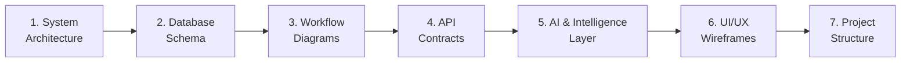

# ArtisanConnect Ghana — Design Phase Implementation Plan

> **Goal**: Produce all system design artifacts (architecture diagrams, database schemas, workflow diagrams, UI wireframes, API contracts, and component specifications) before writing a single line of production code.

> **AI Strategy**: **Groq-only architecture** — Groq handles **both** vector embeddings and LLM inference. Fully free, ultra-fast, zero OpenAI dependency.

---

## Phase Overview

We will produce **7 design deliverables** in sequence. Each deliverable builds on the previous one. All artifacts will be created as visual diagrams (Mermaid), detailed markdown documents, and generated UI mockups inside the project's `docs/design/` directory.

| # | Deliverable | Format | Description |
|---|-------------|--------|-------------|
| 1 | System Architecture Diagram | Mermaid + Markdown | Three-tier architecture, AI service layer, data flow |
| 2 | Database Schema Design | Mermaid ERD + SQL DDL | Full relational schema with pgvector columns, AI log tables, indexes |
| 3 | Core Workflow Diagrams | Mermaid Sequence/State | All business workflows including AI-augmented flows |
| 4 | API Contract Specification | Markdown tables | Every endpoint including Groq-powered AI endpoints |
| 5 | AI & Intelligence Layer Design | Mermaid + Markdown | **Groq embeddings + Groq LLM features**, search pipeline, smart features |
| 6 | UI/UX Wireframes & Design System | Generated mockups + Markdown | Page-by-page wireframes with AI feature integration points |
| 7 | Project Structure & DevOps Plan | Markdown | Monorepo layout, AI service module, deployment pipeline |

---

## Deliverable 1 — System Architecture Diagram

### What We'll Design

A complete three-tier architecture diagram showing:

- **Presentation Layer** (Next.js 15 + React + TypeScript + Tailwind + ShadCN)
  - Pages: Landing, Auth, Onboarding, Customer Dashboard, Artisan Dashboard, Admin/Superadmin Dashboard, Search, Profile, Portfolio, Chat, Service Request, Quotes
  - Client-side state management approach
  - API communication layer
  - Social sharing integration (WhatsApp, copy link)

- **Application Layer** (Node.js + Express.js + TypeScript)
  - 13 microservice-style modules:
    1. Auth Service (Supabase Auth + role management)
    2. User Service (profiles, onboarding)
    3. Search Service (semantic + nearby + history)
    4. Verification Service (Ghana Card + Groq Vision)
    5. Payment Service (escrow simulation)
    6. Messaging Service (WebSocket chat)
    7. Notification Service (in-app + email via Resend)
    8. AI Service (Groq embeddings + LLM + vision)
    9. **Availability Service** — Working hours, day-off management, busy/available status
    10. **Quoting Service** — Price quotes, negotiation, quote acceptance
    11. **Media Service** — File uploads, image compression, portfolio management
    12. **Moderation Service** — Reports, flags, content moderation queue
    13. **Admin Service** — Audit logging, role promotion, superadmin functions
  - **WebSocket Server** (Socket.io) — Real-time messaging, notifications, availability status
  - Middleware pipeline (JWT validation via Supabase, **4-tier RBAC**: customer/artisan/admin/superadmin, rate limiting, error handling)
  - Service-to-service communication patterns

- **AI / Intelligence Layer** (Groq API — Single Provider)
  - **Groq Embeddings** — Vector embedding generation for semantic search
  - **Groq LLM Inference** — Ultra-fast chat completions (Llama 3.3 70B / Mixtral 8x7B)
    - Smart query understanding & intent extraction
    - Artisan profile bio generation
    - Review sentiment analysis
    - Ghana Card text extraction (Groq vision/multimodal)
    - Dispute summarization
    - Customer recommendation chatbot
  - **Free tier**: 30 requests/min, 14,400 requests/day

- **Data Layer** (PostgreSQL + Supabase + pgvector)
  - Primary database (PostgreSQL via Supabase)
  - Vector store (pgvector extension)
  - File storage (Supabase Storage for Ghana Card images, selfies, portfolio)
  - Auth provider (Supabase Auth — primary auth, handles JWT internally)

- **Maps Layer**
  - **Mapbox GL JS** — Interactive maps, geocoding, distance calculations

- **Email Notification Layer**
  - **Supabase Auth Emails** — Registration verification, password reset (built-in)
  - **Resend** — All other transactional emails (free tier: 100 emails/day)
    - New service request notifications
    - Request accepted/rejected alerts
    - Job completion & review prompts
    - Payment release confirmations
    - Verification approval/rejection
    - Dispute updates

### Diagrams to Produce

1. **High-Level Architecture** — Three-tier block diagram with Groq AI layer + WebSocket layer highlighted
2. **Backend Service Architecture** — Internal service modules including AI Service (Groq-only) and Socket.io server
3. **Data Flow Diagram** — How data moves through the AI pipeline (user query → Groq intent → Groq embedding → pgvector → ranked results)
4. **AI Integration Map** — All Groq features mapped: embeddings, chat, vision, classification
5. **Infrastructure Diagram** — Vercel (frontend) ↔ Railway (backend + Socket.io) ↔ Supabase (data + auth) ↔ Groq API ↔ Mapbox API

---

## Deliverable 2 — Database Schema Design

### What We'll Design

Full relational schema with **21 tables**:

#### Core Tables
| Table | Key Design Decisions |
|-------|---------------------|
| `users` | Shared table for all roles, `role` enum (**customer/artisan/admin/superadmin**), GPS coordinates, onboarding_completed flag |
| `artisan_profiles` | FK to users, profession, bio, **ai_generated_bio** (Groq), experience, service_radius, verification_status enum, average_rating |
| `ghana_verifications` | FK to artisan, card_number, image URLs, status enum, **ai_extraction_result** (Groq Vision), admin reviewer FK |
| `services` | FK to artisan, **FK to service_subcategories**, title, description, **embedding vector** via pgvector |
| `service_requests` | FK to customer + artisan, description, **ai_clarified_description** (Groq), status enum, **accepted_quote_id** FK, timestamps |
| `reviews` | FK to customer + artisan + request, 1-5 rating, comment, **sentiment** (Groq analysis), created_at |
| `messages` | FK sender + receiver, content, read status, timestamps |
| `escrow_payments` | FK to request, amount, status enum (held/released/refunded), timestamps |
| `notifications` | FK to user, type enum, content, read status, reference_id |

#### Category Tables
| Table | Key Design Decisions |
|-------|---------------------|
| `service_categories` | Admin-managed parent categories (Plumbing, Electrical, Carpentry, etc.) |
| `service_subcategories` | **NEW** — FK to category, name, description (e.g., Plumbing → Pipe Repair, Toilet Fix, Water Heater) |

#### New Feature Tables
| Table | Key Design Decisions |
|-------|---------------------|
| `artisan_availability` | **NEW** — FK to artisan, day_of_week, start_time, end_time, is_available, days_off (date array) |
| `quotes` | **NEW** — FK to service_request + artisan, amount, description, status (pending/accepted/rejected), valid_until, created_at |
| `favorites` | **NEW** — FK to customer + artisan, created_at (unique constraint: one per customer-artisan pair) |
| `reports` | **NEW** — FK to reporter + reported_user, reason enum, description, status (pending/reviewed/resolved/dismissed), admin_notes, reviewed_by FK |
| `portfolio_items` | **NEW** — FK to artisan, title, description, image_url (Supabase Storage), before_image_url, after_image_url, created_at |
| `search_history` | **NEW** — FK to user, query_text, result_count, created_at (for recently viewed & recommendations) |

#### System Tables
| Table | Key Design Decisions |
|-------|---------------------|
| `admin_audit_log` | **NEW** — actor_id (admin/superadmin), action enum, target_type, target_id, details JSON, ip_address, created_at |
| `chat_conversations` | For WebSocket chat: conversation_id, participant_ids, last_message_at, created_at |
| `ai_interactions` | Logs all Groq API calls: user_id, feature, prompt_hash, model, tokens_used, latency_ms, created_at |
| `email_logs` | Tracks sent emails via Resend: user_id, template_type, resend_id, status (sent/delivered/bounced), created_at |

### Diagrams to Produce

1. **Entity-Relationship Diagram** — Full Mermaid ERD with all relationships and cardinalities
2. **SQL DDL Script** — Complete CREATE TABLE statements with constraints, indexes, triggers
3. **pgvector Index Design** — IVFFlat vs HNSW index strategy for embedding search
4. **Data Dictionary** — Every column: name, type, constraints, description

---

## Deliverable 3 — Core Workflow Diagrams

### Workflows to Design

#### 3.1 Authentication Flow
```
Register (Supabase Auth) → Email Verification → Login → Supabase JWT Issued → Authenticated Requests
Password Reset → Supabase Email Link → New Password → Login
```

#### 3.2 Ghana Card Verification Flow (Groq Vision)
```
Artisan Uploads Card Image + Selfie → Image sent to Groq Vision API
→ Groq Extracts Card Details directly from image (name, number, DOB, expiry)
→ Auto-fills Verification Form → Admin Queue with AI Extraction Summary
→ Admin Reviews (card image + AI extraction + selfie) → Approve/Reject → Artisan Notified
```

#### 3.3 AI-Powered Search Flow (Groq Only)
```
Customer Types Natural Language Query
→ Groq LLM: Intent Extraction (service type, urgency, special requirements)
→ Groq Embeddings: Vector Generated from clarified intent
→ pgvector Similarity Search → Mapbox Distance Calculation
→ Composite Score Ranking → Results Returned
→ Groq LLM: Generate result summary ("Found 5 verified plumbers near you...")
```

#### 3.4 Service Request Lifecycle
```
Customer → Select Artisan → Create Request (Pending)
→ Artisan Accepts → In Progress → Job Complete
→ Customer Confirms → Review → Escrow Released
```
Including cancellation and dispute paths.

#### 3.5 Quoting & Price Negotiation Flow (NEW)
```
Customer Creates Service Request → Artisan Receives Request
→ Artisan Sends Price Quote (amount, description, validity period)
→ Customer Reviews Quote → Accept / Reject / Counter
→ If Accepted: Quote locks in → Escrow amount set from quote → Job begins
→ If Rejected: Artisan can revise or customer can cancel
```

#### 3.6 Escrow Payment Flow (Updated)
```
Quote Accepted → Customer Pays quoted amount → Escrow Hold
→ Job Completes → Customer Confirms → Funds Released to Artisan
OR → Dispute → Admin/Superadmin Resolution → Refund/Release
```

#### 3.7 Messaging Flow (WebSocket)
```
Customer/Artisan Opens Chat → WebSocket Connection Established (Socket.io)
→ Message Sent via WebSocket → Stored in DB → Real-time Push to Recipient
→ Typing Indicators → Read Receipts → Online Status
```

#### 3.8 Notification Flow
```
System Event → Create Notification → Store in DB → Push via WebSocket
→ Send Email via Resend (for important events) → Mark Read on View
```

#### 3.9 AI-Powered Dispute Resolution Flow (Groq)
```
Customer/Artisan Files Dispute → Groq Summarizes Case
→ Groq Analyzes Chat History + Request Details
→ Generates Recommendation for Admin
→ Admin Reviews AI Summary + Makes Decision → Resolved
→ Action logged to admin_audit_log
```

#### 3.10 Artisan Profile Enhancement Flow (Groq)
```
Artisan Enters Basic Info (profession, experience, skills)
→ Groq LLM Generates Professional Bio Draft
→ Artisan Reviews/Edits → Saves Profile
→ Service Descriptions → Groq Generates Embeddings → Stored in pgvector
```

#### 3.11 Artisan Availability Flow (NEW)
```
Artisan Sets Weekly Schedule (Mon-Sun working hours)
→ Marks Specific Days Off → Sets Status (Available/Busy/Offline)
→ Status visible on public profile and search results
→ Customers can only request service during available hours
→ Status auto-updates to "Busy" when job is in progress
```

#### 3.12 Report & Moderation Flow (NEW)
```
User Reports Another User/Review → Selects Reason (fraud, spam, inappropriate, other)
→ Adds Description → Report Created (Pending)
→ Admin Sees in Moderation Queue → Reviews Report
→ Takes Action (warn, suspend, dismiss) → Reporter Notified
→ Action logged to admin_audit_log
```

#### 3.13 Favorites & Sharing Flow (NEW)
```
Customer Bookmarks Artisan → Saved to Favorites List
→ Customer Views "My Favorites" → Quick access to saved artisans
Customer Shares Artisan Profile → Generate Share Link
→ Share via WhatsApp / Copy Link → Recipient views public profile
```

#### 3.14 Admin Role Management Flow (NEW)
```
Superadmin (seeded at deployment) → Views User Management
→ Selects User → "Promote to Admin" → Confirmation
→ User role updated → Admin privileges granted
→ Action logged to admin_audit_log
Superadmin can also: Demote Admin → Remove admin privileges
Admins CANNOT: Promote/demote other admins or access superadmin settings
```

#### 3.15 Onboarding Flow (NEW)
```
New User Registers → Role-specific onboarding wizard:
  Customer: Set location → Browse categories → First search
  Artisan: Complete profile → Set services → Set availability → Upload verification
→ Progress tracked (% complete) → Prompts until onboarding_completed = true
```

#### 3.10 Email Notification Flow (NEW — Resend)
```
System Event (request created, accepted, completed, payment, verification)
→ Notification Service triggers email
→ Resend API sends transactional email (templated HTML)
→ Delivery status logged to email_logs table
→ In-app notification also created (DB + WebSocket push)
```

Email triggers:
| Event | Recipient | Email Content |
|-------|-----------|---------------|
| New service request | Artisan | "You have a new service request from [Customer]" |
| Request accepted | Customer | "[Artisan] accepted your request" |
| Request rejected | Customer | "[Artisan] is unavailable" |
| Job completed | Customer | "Your job is complete — please review and release payment" |
| Payment released | Artisan | "Payment of GHS [amount] has been released" |
| Verification approved | Artisan | "Your Ghana Card verification is approved ✓" |
| Verification rejected | Artisan | "Your verification needs attention" |
| Dispute update | Both | "Update on your dispute case #[id]" |

### Diagram Types

- **Sequence Diagrams** — For multi-actor workflows (search, request, quoting, payment, verification, moderation)
- **State Machine Diagrams** — For entity lifecycle (request status, verification status, escrow status, quote status, report status)
- **Flowcharts** — For decision-based flows (admin verification, dispute resolution, role promotion, onboarding)
- **Pipeline Diagrams** — For AI processing chains (query → Groq LLM → Groq Embed → pgvector → results)

---

## Deliverable 4 — API Contract Specification

### What We'll Design

Complete REST API specification for all endpoints:

| Group | Endpoints | Details |
|-------|-----------|---------|
| **Auth** | `POST /register`, `POST /login`, `POST /logout`, `POST /forgot-password`, `POST /reset-password` | Request/response schemas, validation rules, error codes |
| **Users** | `GET /profile`, `PUT /profile`, `DELETE /profile`, `PUT /profile/onboarding` | Role-specific fields, file upload for avatar, onboarding progress |
| **Artisans** | `GET /`, `GET /:id`, `POST /`, `PUT /:id` | Filtering, pagination, service radius logic |
| **Search** | `POST /semantic`, `GET /nearby`, `GET /history`, `GET /recently-viewed` | Query params, ranking, search history, recently viewed artisans |
| **Verification** | `POST /upload`, `GET /status`, `PUT /review` (admin) | File upload specs, admin-only routes |
| **Requests** | `POST /`, `PUT /:id`, `GET /`, `GET /:id` | Status transitions, validation rules |
| **Quotes** | `POST /`, `GET /:requestId`, `PUT /:id/accept`, `PUT /:id/reject` | **NEW** — Price quoting and negotiation |
| **Reviews** | `POST /`, `GET /:artisanId` | One review per request, rating validation |
| **Payments** | `POST /escrow`, `PUT /release`, `PUT /refund` | Amount comes from accepted quote, status checks |
| **Messages** | `POST /`, `GET /conversations`, `GET /conversations/:id` | Pagination, read receipts |
| **Notifications** | `GET /`, `PUT /:id/read`, `PUT /read-all` | Filtering by type, unread count |
| **Availability** | `GET /:artisanId`, `PUT /`, `PUT /status`, `POST /day-off` | **NEW** — Working hours, availability status, days off |
| **Favorites** | `POST /`, `DELETE /:artisanId`, `GET /` | **NEW** — Bookmark/unbookmark artisans, list favorites |
| **Portfolio** | `POST /`, `PUT /:id`, `DELETE /:id`, `GET /:artisanId` | **NEW** — Upload before/after photos, manage portfolio items |
| **Reports** | `POST /`, `GET /` (admin), `PUT /:id/review` (admin) | **NEW** — Submit reports, admin moderation queue |
| **Categories** | `GET /`, `GET /:id/subcategories`, `POST /` (admin), `POST /:id/subcategories` (admin) | **UPDATED** — Hierarchical categories + subcategories |
| **Share** | `GET /artisan/:id/share-link` | **NEW** — Generate shareable profile link with metadata |
| **Admin** | `GET /users`, `PUT /users/:id/suspend`, `GET /analytics`, `GET /verification-queue`, `GET /audit-log`, `GET /reports` | Admin-only RBAC, audit trail |
| **Superadmin** | `PUT /users/:id/promote`, `PUT /users/:id/demote`, `GET /admins` | **NEW** — Superadmin-only: role promotion/demotion |
| **AI (Groq)** | `POST /ai/generate-bio`, `POST /ai/clarify-request`, `POST /ai/analyze-review`, `POST /ai/extract-card`, `POST /ai/summarize-dispute`, `POST /ai/chat` | All Groq-powered endpoints |
| **Email** | `POST /email/send`, `GET /email/logs` | Trigger transactional emails via Resend, view delivery logs (admin) |
| **Media** | `POST /upload`, `DELETE /:id`, `GET /user/:userId` | **NEW** — File upload (images), compression, validation, CDN URLs |

### For Each Endpoint

- HTTP Method + Path
- Auth requirement (public / customer / artisan / admin)
- Request body / query params schema
- Success response schema
- Error response codes and messages
- Example request/response

---

## Deliverable 5 — AI & Intelligence Layer Design

> This deliverable covers the **Groq-only AI architecture**: Groq handles both embeddings and LLM inference. **Zero OpenAI dependency. Fully free.**

### 5A — Semantic Search Pipeline (100% Groq)

1. **Smart Query Understanding (Groq LLM — Pre-Search)**
   - Model: `llama-3.3-70b-versatile` via Groq
   - Input: Raw customer query (e.g., "my toilet is making a weird noise and leaking")
   - Output: Structured intent JSON
     ```json
     {
       "service_type": "Plumbing",
       "specific_issue": "Toilet repair - noise and leak",
       "urgency": "medium",
       "search_query": "plumber toilet repair leak fix"
     }
     ```
   - Why Groq: Sub-200ms inference means no perceptible delay in the search UX

2. **Embedding Generation (Groq Embeddings)**
   - Model: Groq's available embedding model (free tier)
   - What gets embedded: artisan service descriptions (on creation/update)
   - Query embedding: generated from Groq LLM's `search_query` output at search time
   - Dimension: determined by Groq's embedding model (stored in pgvector)

3. **Vector Storage Design**
   - pgvector column type matching Groq embedding dimensions
   - Index type (HNSW recommended for this scale)
   - Index parameters (m, ef_construction)

4. **Composite Ranking Formula**
   ```
   Final Score = (0.40 × Semantic Similarity) + (0.30 × Distance Score) + (0.20 × Rating Score) + (0.10 × Verification Score)
   ```
   - Distance Score: inverse normalized distance via Mapbox Distance API (closer = higher)
   - Rating Score: normalized 0–1 from average rating
   - Verification Score: 1.0 if verified, 0.0 if not

5. **Search Results Enhancement (Groq LLM — Post-Search)**
   - Generate natural language result summary
   - Example: "Found 5 verified plumbers near Kasoa. Kwame A. is the closest (1.2km) with a 4.8★ rating."

6. **Full Search Pipeline Diagram**
   ```
   User Query → [Groq LLM] Intent Extraction → [Groq Embed] Embed Query
   → [pgvector] Similarity Search → [Mapbox] Distance Calc → Score Ranking
   → [Groq LLM] Result Summary → Response to Client
   ```
   - Fallback: If Groq is unavailable, use basic keyword matching against service descriptions
   - Caching: Cache Groq intent results for identical queries (TTL: 1 hour)
   - Rate limiting: Budget ~10 Groq calls per search (intent + embed + summary), leaving headroom within 30 req/min

---

### 5B — Groq-Powered Smart Features

All LLM features use **Groq API** for ultra-fast inference (~100-300ms). Here are the 8 features we'll design:

#### Feature 1: Smart Query Understanding
| Aspect | Detail |
|--------|--------|
| **Trigger** | Customer searches for a service |
| **Model** | `llama-3.3-70b-versatile` |
| **Input** | Raw natural language query |
| **Output** | Structured JSON: service_type, specific_issue, urgency, refined search_query |
| **Latency Target** | < 200ms |
| **Fallback** | Use raw query directly for embedding if Groq fails |

#### Feature 2: Artisan Profile Bio Generator
| Aspect | Detail |
|--------|--------|
| **Trigger** | Artisan creates/edits profile |
| **Model** | `llama-3.3-70b-versatile` |
| **Input** | Profession, years of experience, skills, location |
| **Output** | Professional bio paragraph (150-200 words) |
| **UX** | "✨ Generate Bio" button → editable text field pre-filled with AI draft |
| **Prompt Strategy** | System prompt enforces Ghanaian context, professional tone, highlights trust signals |

#### Feature 3: Review Sentiment Analysis
| Aspect | Detail |
|--------|--------|
| **Trigger** | Review submitted by customer |
| **Model** | `mixtral-8x7b-32768` (efficient for classification) |
| **Input** | Review text + rating |
| **Output** | Sentiment (positive/neutral/negative), key themes, flag if rating contradicts sentiment |
| **Use Case** | Admin dashboard shows sentiment trends; flag suspicious reviews |

#### Feature 4: Ghana Card Verification Assistant (Groq Vision)
| Aspect | Detail |
|--------|--------|
| **Trigger** | Artisan uploads Ghana Card image |
| **Model** | `llama-3.3-70b-versatile` (with vision/multimodal) |
| **Input** | Ghana Card image sent directly to Groq Vision API (no OCR library needed) |
| **Output** | Structured extraction: full_name, card_number, date_of_birth, expiry_date, confidence_score |
| **UX** | Auto-fills verification form; admin sees AI extraction alongside card image |
| **Advantage** | Eliminates Tesseract.js dependency — Groq handles image → text → structured data in one call |

#### Feature 5: Dispute Summarization
| Aspect | Detail |
|--------|--------|
| **Trigger** | Admin opens a disputed service request |
| **Model** | `llama-3.3-70b-versatile` |
| **Input** | Service request details, chat history between customer and artisan, payment status |
| **Output** | Concise dispute summary, timeline of events, suggested resolution |
| **UX** | Admin sees AI summary card at top of dispute review page |

#### Feature 6: Service Request Clarifier
| Aspect | Detail |
|--------|--------|
| **Trigger** | Customer creates a vague service request |
| **Model** | `llama-3.3-70b-versatile` |
| **Input** | Customer's service description |
| **Output** | Clarifying questions or enhanced description |
| **UX** | "💡 AI suggests adding more details..." prompt below the description field |

#### Feature 7: Admin Analytics Insights
| Aspect | Detail |
|--------|--------|
| **Trigger** | Admin views analytics dashboard |
| **Model** | `llama-3.3-70b-versatile` |
| **Input** | Aggregated metrics (registrations, requests, completions, ratings this period) |
| **Output** | Natural language insights: trends, anomalies, recommendations |
| **UX** | "AI Insights" card on admin dashboard with bullet-point observations |

#### Feature 8: Customer Recommendation Chatbot (Dual-Mode)
| Aspect | Detail |
|--------|--------|
| **Trigger** | Customer clicks "Help me find an artisan" chat widget |
| **Model** | `llama-3.3-70b-versatile` |
| **Input** | Conversational messages describing the customer's need |
| **Output** | Guided questions → service type identification → triggers search → presents results conversationally |
| **Mode 1: Quick Guide** | Asks 2-3 structured questions (What service? Where? When?) → directly triggers search |
| **Mode 2: Full Conversation** | Free-form chat where customer describes problem naturally → AI extracts intent progressively → presents artisan recommendations conversationally |
| **UX** | Floating chat widget on search page; starts in Quick Guide mode, "Tell me more" expands to Full Conversation |
| **Context** | Has access to service categories, nearby artisans, and recent search trends |
| **Rate Limit Awareness** | Quick Guide: ~3 Groq calls; Full Conversation: ~5-8 calls per session |

---

### 5C — AI Service Architecture (Groq-Only)

```
┌──────────────────────────────────────────────────┐
│               AI Service Module                  │
│               (Groq-Only Stack)                  │
├──────────────────────────────────────────────────┤
│                                                  │
│  ┌────────────────────────────────────────────┐  │
│  │              Groq Client                   │  │
│  │                                            │  │
│  │  - Chat Completions (LLM inference)        │  │
│  │  - Embeddings (vector generation)          │  │
│  │  - Vision (Ghana Card image extraction)    │  │
│  │  - Classification (sentiment analysis)     │  │
│  └──────────────────┬─────────────────────────┘  │
│                     │                            │
│  ┌──────────────────┴─────────────────────────┐  │
│  │         Prompt Template Engine              │  │
│  │  (versioned prompts per feature)            │  │
│  └────────────────────────────────────────────┘  │
│                                                  │
│  ┌────────────────────────────────────────────┐  │
│  │         AI Interaction Logger               │  │
│  │  (logs to ai_interactions table)            │  │
│  └────────────────────────────────────────────┘  │
│                                                  │
│  ┌────────────────────────────────────────────┐  │
│  │         Rate Limiter & Fallback            │  │
│  │  (30 req/min budget, graceful degradation) │  │
│  │  (keyword fallback if Groq quota exceeded) │  │
│  └────────────────────────────────────────────┘  │
│                                                  │
└──────────────────────────────────────────────────┘
```

### 5D — AI Design Decisions

| Decision | Choice | Rationale |
|----------|--------|-----------|
| AI provider | **Groq only** (embeddings + LLM + vision) | Fully free, sub-200ms latency, single API key, no OpenAI dependency |
| Primary LLM model | `llama-3.3-70b-versatile` | Best balance of quality and speed on Groq |
| Classification model | `mixtral-8x7b-32768` | Efficient for simple classification tasks (sentiment) |
| Embedding model | Groq's embedding endpoint | Free, consistent with single-provider strategy |
| Vision model | `llama-3.3-70b-versatile` (multimodal) | Direct image → structured data for Ghana Card extraction |
| Prompt management | Versioned template files | Easy to iterate without code changes |
| Failure mode | Graceful degradation | All AI features are enhancements; core functionality works without them |
| Logging | `ai_interactions` table | Track usage, latency, and costs for the academic paper |
| Rate limiting | Per-user, per-feature (30 req/min total) | Stay within Groq free tier; budget allocation per feature |
| Maps & geocoding | **Mapbox GL JS** + Mapbox APIs | Polished map UX, geocoding, distance matrix |
| Auth | **Supabase Auth** | Handles JWT internally, email verification, password reset built-in |
| Real-time | **Socket.io** (WebSockets) | True real-time chat, typing indicators, online status |

---

## Deliverable 6 — UI/UX Wireframes & Design System

### Design System

- **Color Palette**: Ghana-inspired (gold, green, red, black) with modern dark/light mode
- **Typography**: Inter (headings) + system sans-serif (body)
- **Spacing Scale**: 4px base unit
- **Border Radius**: Rounded (8px cards, 6px inputs, full for avatars)
- **Component Library**: ShadCN UI components mapped to each feature

### Pages to Wireframe

#### Public Pages
| Page | Key Elements |
|------|-------------|
| Landing Page | Hero with search bar, featured artisans, trust indicators, how-it-works, share buttons |
| Login / Register | Role selection (Customer/Artisan), form fields, social login |
| **Onboarding Wizard** | **NEW** — Role-specific steps: set location, browse categories, complete profile |
| Artisan Public Profile | Photo, verification badge, bio, **portfolio gallery**, services, reviews, availability status, **favorite button**, **share button** |
| Search Results | Map view + list view, filters (category, **subcategory**, distance, rating, verified, **available now**) |

#### Customer Pages
| Page | Key Elements |
|------|-------------|
| Customer Dashboard | Active requests, recent messages, nearby artisans, **recently viewed**, **favorites** |
| Service Request Form | Artisan details, service description, preferred date, budget, **availability check** |
| **Quote Review** | **NEW** — View artisan's price quote, accept/reject/counter, quote details |
| My Requests | Status cards with workflow progress, **quote status** |
| **My Favorites** | **NEW** — Saved artisans grid with quick actions |
| **Search History** | **NEW** — Recent searches, recently viewed artisans |
| Chat Interface | Conversation list + message thread |
| Review Form | Star rating, comment, submit |
| **Report Form** | **NEW** — Report user/review (reason dropdown, description) |

#### Artisan Pages
| Page | Key Elements |
|------|-------------|
| Artisan Dashboard | Incoming requests, **pending quotes**, job stats, rating summary, **availability toggle** |
| Profile Editor | Bio, services, **portfolio management**, service radius map |
| **Portfolio Manager** | **NEW** — Upload before/after photos, add descriptions, reorder items |
| **Availability Settings** | **NEW** — Weekly schedule editor, day-off calendar, status toggle (Available/Busy/Offline) |
| **Quoting Interface** | **NEW** — Review request → set price → add description → send quote |
| Verification Upload | Ghana Card photo, selfie capture, status tracker |
| My Jobs | Active/completed/cancelled jobs, **earnings summary** |

#### Admin Pages
| Page | Key Elements |
|------|-------------|
| Admin Dashboard | Key metrics, recent activity, alerts, **AI insights card** |
| Verification Queue | Pending reviews, card/selfie comparison, approve/reject |
| User Management | User table with search, filter, suspend, **role badge** |
| **Moderation Queue** | **NEW** — Reported users/reviews, report details, take action (warn/suspend/dismiss) |
| **Audit Log** | **NEW** — Chronological log of all admin actions with filters |
| Analytics | Charts: registrations, requests, completions, revenue, **AI usage** |
| Category Management | CRUD for service categories **+ subcategories** |

#### Superadmin Pages
| Page | Key Elements |
|------|-------------|
| **Admin Management** | **NEW** — List admins, promote users to admin, demote admins |
| **System Settings** | **NEW** — Platform configuration, category hierarchy, role permissions |

### Wireframe Generation Plan

I will create **structural wireframes** (boxes and labels showing layout) for the following key screens:
1. Landing Page (hero + search bar + featured artisans)
2. Search Results (Mapbox map view + list view + filters including subcategories)
3. Artisan Public Profile (badge, bio, **portfolio gallery**, services, reviews, **availability**, **favorite/share**)
4. Customer Dashboard (requests, messages, nearby artisans, **favorites**, **recently viewed**)
5. Artisan Dashboard (incoming requests, **quotes**, stats, rating, **availability toggle**)
6. Admin Dashboard (metrics, verification queue, **moderation queue**, AI insights card)
7. Chat Interface (WebSocket-powered conversation list + thread)
8. Ghana Card Verification Upload (image upload + Groq extraction preview)
9. AI Chatbot Widget (dual-mode: quick guide + full conversation)
10. **Quoting Interface** (artisan sends quote → customer reviews)
11. **Availability Settings** (weekly schedule editor + day-off calendar)
12. **Portfolio Manager** (before/after photo upload + gallery)
13. **Moderation Queue** (reported users/reviews, admin actions)
14. **Superadmin Panel** (admin management, role promotion)

---

## Deliverable 7 — Project Structure & DevOps Plan

### Monorepo Structure
```
artisanconnect-ghana/
├── apps/
│   ├── web/                  # Next.js 15 frontend
│   │   ├── app/              # App Router pages
│   │   ├── components/       # Shared UI components
│   │   │   └── ai/           # AI-specific UI (chat widget, bio generator, insights card)
│   │   ├── lib/              # Utilities, API client
│   │   └── styles/           # Global styles
│   └── api/                  # Express.js backend
│       ├── src/
│       │   ├── controllers/
│       │   ├── services/
│       │   │   └── ai/       # ★ AI Service Module (Groq-Only)
│       │   │       ├── groq.client.ts       # Groq SDK wrapper (embeddings + LLM + vision)
│       │   │       ├── prompts/             # Versioned prompt templates
│       │   │       │   ├── query-intent.ts
│       │   │       │   ├── bio-generator.ts
│       │   │       │   ├── review-sentiment.ts
│       │   │       │   ├── card-extraction.ts
│       │   │       │   ├── dispute-summary.ts
│       │   │       │   ├── request-clarifier.ts
│       │   │       │   ├── analytics-insights.ts
│       │   │       │   └── recommendation-chat.ts
│       │   │       ├── ai.service.ts         # Unified AI service facade
│       │   │       ├── ai.logger.ts          # Interaction logging
│       │   │       └── ai.rate-limiter.ts    # Free tier budget manager (30 req/min)
│       │   ├── middleware/
│       │   ├── routes/
│       │   │   └── ai.routes.ts              # /api/ai/* endpoints
│       │   ├── models/
│       │   ├── utils/
│       │   ├── websocket/
│       │   │   └── socket.ts             # Socket.io server (chat, notifications, presence)
│       │   └── email/
│       │       ├── email.service.ts       # Resend SDK wrapper
│       │       └── templates/            # HTML email templates
│       │           ├── request-new.ts
│       │           ├── request-accepted.ts
│       │           ├── job-completed.ts
│       │           ├── payment-released.ts
│       │           ├── verification-status.ts
│       │           └── dispute-update.ts
│       └── prisma/           # Schema & migrations
├── packages/
│   └── shared/               # Shared types, constants, AI response types
├── docs/
│   └── design/               # All design artifacts (wireframes, diagrams)
├── supabase/                 # Supabase config, migrations, auth
├── package.json              # npm workspaces root
└── docker-compose.yml        # Local development (PostgreSQL + pgvector)
```

### Monorepo Tooling
- **npm workspaces** — Simple, zero-config monorepo management
- Shared `packages/shared/` for types, constants, and role enums between frontend and backend

### Environment & Configuration
- Environment variables: `GROQ_API_KEY`, `SUPABASE_URL`, `SUPABASE_ANON_KEY`, `SUPABASE_SERVICE_KEY`, `MAPBOX_ACCESS_TOKEN`, `RESEND_API_KEY`
- **Superadmin seed**: Migration script creates initial superadmin account (email/password from env vars `SUPERADMIN_EMAIL`, `SUPERADMIN_PASSWORD`)
- Local development setup (Docker Compose for PostgreSQL + pgvector)
- Supabase project configuration (Auth, Storage, Database)

### Deployment Pipeline
- Frontend: Vercel (auto-deploy from main branch)
- Backend: Railway (auto-deploy from main branch)
- Database: Supabase (managed PostgreSQL)
- CI/CD: GitHub Actions (lint, test, build, deploy)

### Testing Strategy
- Unit tests (Jest/Vitest)
- API integration tests (Supertest)
- E2E tests (Playwright)
- Test coverage targets

---

## Execution Order

The deliverables will be created in this sequence, as each builds on the previous:



> [!IMPORTANT]
> **All 7 deliverables will be completed before any production code is written.** Each deliverable will be saved as a separate document in `docs/design/` within your project.

---

## Resolved Decisions

All design questions have been resolved. Here is the locked-in tech stack:

| Decision | Resolution |
|----------|------------|
| **AI Provider** | Groq only — embeddings + LLM + vision. No OpenAI. Fully free. |
| **Real-time Messaging** | WebSockets via Socket.io (full real-time: chat, typing indicators, presence) |
| **Ghana Card OCR** | Groq Vision API — direct image-to-structured-data extraction (no Tesseract.js) |
| **Map Provider** | Mapbox GL JS (maps, geocoding, distance calculations) |
| **Authentication** | Supabase Auth (handles JWT internally, email verification, password reset) |
| **Monorepo Tooling** | npm workspaces (simple, no extra tooling) |
| **Design Fidelity** | Structural wireframes (boxes and labels showing layout) |
| **Groq Tier** | Free tier (30 req/min, 14,400 req/day) — rate limiter built into AI service |
| **Chatbot Scope** | Dual-mode: Quick Guide (2-3 questions) + Full Conversation (expandable) |
| **Email Notifications** | Resend (free tier: 100 emails/day) for transactional emails. Auth emails via Supabase. No SMS. |
| **Admin Hierarchy** | 4-tier RBAC: customer → artisan → admin → superadmin. Superadmin seeded at deployment. Admins promoted by superadmin only. |
| **Quoting** | Artisans send price quotes before accepting jobs. Quote amount becomes escrow amount. |
| **Availability** | Artisans set weekly hours + day-off calendar. Status: Available/Busy/Offline. Auto-busy during jobs. |
| **File Uploads** | Supabase Storage with server-side validation (type, size). Images compressed before storage. |
| **Categories** | Two-level hierarchy: Categories → Subcategories. Admin-managed. |
| **Moderation** | User-submitted reports → Admin moderation queue → Action (warn/suspend/dismiss) → Audit logged. |
| **Audit Trail** | All admin/superadmin actions logged to admin_audit_log with actor, action, target, timestamp. |

---

## Verification Plan

### Design Review Checklist
After all 7 deliverables are complete, we will verify:

- [ ] Every functional requirement (FR-001 through FR-011) is covered by at least one workflow diagram
- [ ] Every API endpoint in the PRD has a complete contract specification
- [ ] Every database table (21 total) is represented in the ERD with proper relationships
- [ ] Every user role (**customer, artisan, admin, superadmin**) has wireframes for all their accessible pages
- [ ] The AI search pipeline covers the full ranking formula
- [ ] The project structure supports all specified technologies
- [ ] All non-functional requirements are addressed in the architecture design
- [ ] Admin audit log covers every admin/superadmin action
- [ ] Quoting flow integrates properly with escrow payment flow
- [ ] Availability system blocks requests during non-available hours
- [ ] Category hierarchy (parent → subcategory) works in search and service creation

### Manual Verification
- Walk through each user story against the wireframes
- Trace each workflow end-to-end through the architecture (including quoting → escrow → review)
- Validate API contracts against database schema for consistency
- Verify RBAC: superadmin > admin > artisan > customer permission boundaries
- Test onboarding flow for both customer and artisan paths
