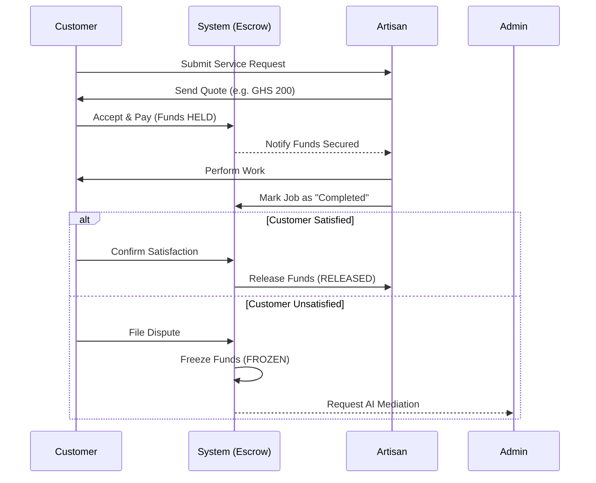
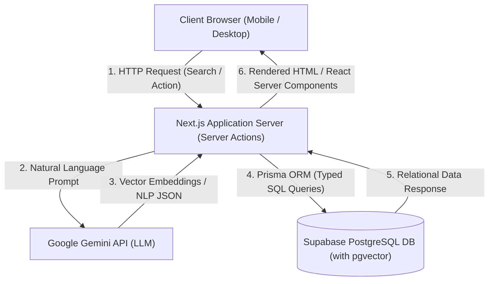
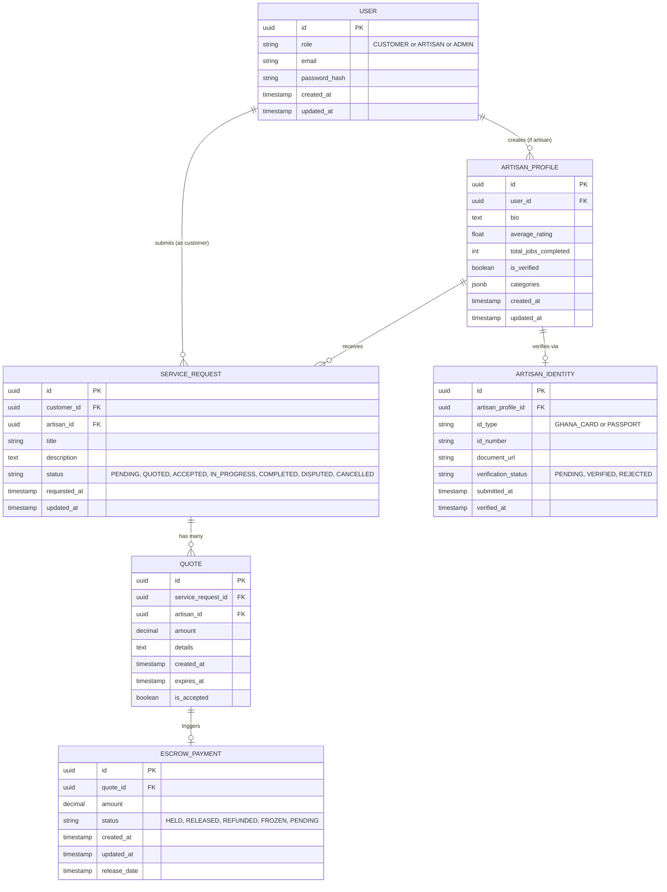
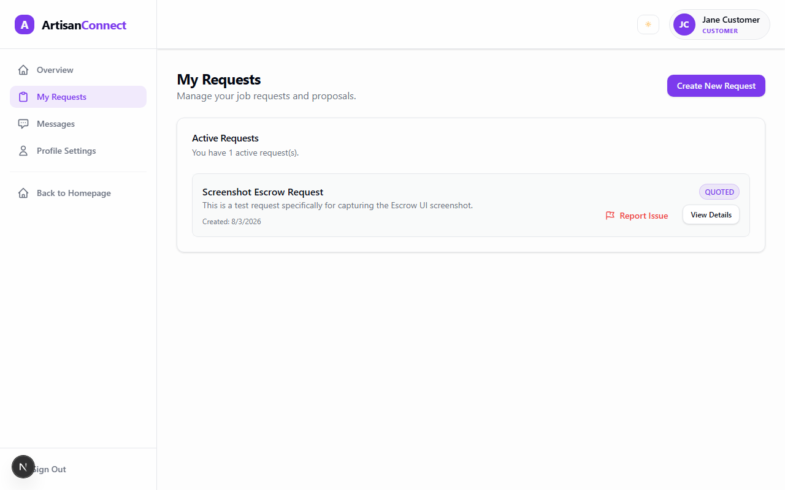

# 🎓 ArtisanConnect: Final Thesis Documentation

## Table of Contents
1. Chapter One: Introduction
2. Chapter Two: Literature Review
3. Chapter Three: Methodology
4. Chapter Four: Implementation
5. Chapter Five: Conclusion

---


# CHAPTER ONE: INTRODUCTION

## 1.1 Background of the Study
The global economic landscape is characterized by a significant bifurcation into formal and informal sectors. The latter, often overlooked in conventional economic analyses, constitutes a vital and remarkably resilient portion of the global workforce, particularly pronounced within the burgeoning economies of developing nations. In Sub-Saharan Africa, where formal employment opportunities are often scarce, the informal economy acts as a critical safety net and a primary engine for job creation and livelihood sustenance. Ghana exemplifies this phenomenon; studies by the Ghana Statistical Service and various economic researchers, such as Osei-Boateng & Ampratwum (2011), consistently indicate that the informal economy is the dominant employer, accounting for well over 80% of the total labor force. This vast and diverse spectrum of economic activity encompasses a myriad of professions, from street vending to small-scale manufacturing, all operating largely outside formal regulatory frameworks and taxation systems.

Within this expansive informal economy, the artisanal trades hold a uniquely pivotal position. These professions, encompassing critical manual skills such as carpentry, plumbing, electrical repair, masonry, tailoring, welding, and auto mechanics, are fundamental to both urban infrastructural development and rural community sustenance. Artisans are the backbone of construction, maintenance, and repair services, directly contributing to housing, transportation, and public utilities. Historically, the ecosystem of artisanal services in Ghana has operated almost entirely offline, relying heavily on deeply embedded social and community networks. Artisans have typically secured contractual jobs through word-of-mouth recommendations, localized community networking, physical signboards displayed at workshops, and close geographic proximity to their clientele. While this traditional, localized system has fostered strong interpersonal relationships and a degree of inherent community trust, it is inherently limited in its reach and fundamentally inefficient in matching the burgeoning supply of skilled labor with the increasingly diversified demand in rapidly expanding metropolitan areas like Accra, Kumasi, and Takoradi. This inefficiency manifests as underemployment for artisans and prolonged search times for consumers.

However, the advent of the 21st century has brought about a profound technological transformation, particularly accelerated by the rapid and pervasive penetration of mobile internet, the proliferation of increasingly affordable smartphones, and the broader emergence of the digital gig economy. This technological confluence is catalyzing a paradigm shift in how everyday services are rendered, discovered, and consumed globally. The International Telecommunication Union (ITU) reports consistently highlight Ghana's significant growth in mobile broadband subscriptions, making digital access a reality for a large segment of the population. This pervasive digital infrastructure lays the groundwork for innovative service delivery models.

The global gig economy, fundamentally characterized by flexible, temporary, or task-based work, introduces digital platforms that act as central intermediaries. These platforms leverage sophisticated algorithms and user interfaces to connect independent service providers directly with consumers looking for on-demand assistance (Heeks, 2017). While this model has proven spectacularly successful in sectors like ride-hailing (e.g., Uber, Bolt, Yango), food delivery, and logistics, its application to traditional, blue-collar artisanal trades in developing economies remains nascent and fraught with profound, systemic challenges. This transition is primarily characterized by a deep-seated "trust deficit" that permeates the entire transactional lifecycle.

From the consumer's perspective, there is increasing caution and hesitation when attempting to hire informal artisans through non-referral channels. This apprehension stems from a historical lack of standardized quality assurance mechanisms, highly variable and non-transparent pricing models (often negotiated on a case-by-case basis, leading to information asymmetry), and the complete absence of a reliable, centralized verification mechanism for an artisan's identity, skills, or past performance. This situation closely mirrors George Akerlof's "market for lemons" economic theory, where the inability of buyers to discern product quality *ex ante* can lead to market failure, with good quality services being driven out by unreliable ones. Consumers fear poor workmanship, incomplete jobs, or even outright fraud, leading to financial losses and wasted time.

Conversely, artisans themselves face tremendous difficulties and systemic risks in securing guaranteed payments. They frequently fall victim to uncompensated labor after completing a service, experience delayed remuneration that impacts their cash flow, or encounter outright refusal of payment after the completion of arduous physical services. Without formal contracts or institutional recourse, their livelihoods are constantly jeopardized. These dual-sided trust issues—where the consumer fears poor workmanship, fraud, or overcharging, and the artisan fears non-payment or exploitation—create a stagnant economic environment. This environment severely hinders the potential for growth and formalization of the artisanal sector, limits its ability to scale, and restricts its broader contribution to the national Gross Domestic Product (GDP) by stifling innovation and deterring participation. Overcoming this trust deficit is paramount for unlocking the latent potential of this crucial segment of the economy.

### 1.1.1 The Informal Sector and Economic Development
The informal sector, while often associated with precarious work, plays a crucial role in absorbing labor, fostering entrepreneurship, and providing goods and services that the formal sector might not address, particularly for low-income populations. Its prevalence in developing countries is a function of rapid urbanization, insufficient formal job creation, and often, rigid labor market regulations. The sheer volume of transactions and employment within this sector necessitates a re-evaluation of its potential for formalization and integration into the broader digital economy. Digitizing parts of this sector can lead to increased transparency, improved service delivery, and enhanced economic opportunities for individuals who might otherwise be excluded from formal financial systems.

### 1.1.2 Digital Transformation and the Gig Economy in Africa
The rapid penetration of mobile technology in Sub-Saharan Africa has created a unique opportunity for leapfrogging traditional development stages. Mobile-first strategies are not merely convenience but necessities, as much of the population interacts with the internet primarily through smartphones. The gig economy, built on these mobile platforms, promises flexibility and access to wider markets for service providers, while offering convenience and cost-effectiveness for consumers. However, the nuances of applying this model to blue-collar services, which often involve physical presence, material costs, and subjective quality assessment, are distinct from purely digital or transport-based services, demanding bespoke solutions.

## 1.2 Problem Statement
In recent years, the digital landscape in Ghana has witnessed a notable proliferation of online classified platforms and open online directories, such as Jiji Ghana (formerly OLX) and Tonaton. These platforms have successfully aggregated a wide variety of goods and services, ranging from electronics and vehicles to real estate and general job postings. While they serve a useful purpose in facilitating initial digital contact between buyers and sellers across diverse categories, the specific and highly nuanced needs of the informal artisanal sector remain grossly inadequately addressed. These platforms are designed for discovery and listing, not for secure transaction management, leaving a critical void for service-based interactions.

The fundamental flaw in current classified platforms, when applied to artisanal services, lies in their operational model. They function primarily as open, unmanaged directories; they facilitate the initial digital contact, allowing a buyer and seller to find each other, but explicitly step back from overseeing the actual transaction lifecycle. This hands-off approach means they completely lack integrated escrow payment systems to secure funds, rigorous identity verification protocols to establish trust, structured quality assurance mechanisms, and impartial dispute resolution frameworks. Consequently, this operational model shifts the entire burden of risk onto the end-users, leaving both consumers and artisans exposed to several critical and often debilitating problems, thereby perpetuating the trust deficit identified earlier:

### 1.2.1 Prepayment Scams and Financial Risk
The absence of a secure holding mechanism, such as an escrow system, forces users to negotiate payment terms directly, often through informal channels. This creates a high-stakes scenario where consumers are highly hesitant to make advance payments for materials or mobilization fees. This hesitation is well-founded due to the rampant risk of fraud, where individuals pose as legitimate artisans, collect upfront payments, and subsequently disappear without rendering services. Such incidents lead to direct financial losses for consumers and erode public trust in online platforms for service procurement. Simultaneously, genuine artisans, often operating with limited working capital, struggle to commence resource-intensive work without upfront funds to purchase materials or cover initial travel costs. This creates a severe "chicken and egg" dilemma: consumers demand proof of work before payment, while artisans demand payment before incurring costs, leading to a stalemate that severely hinders service delivery and economic activity. The inherent transaction costs associated with managing these risks independently become prohibitive for both parties.

### 1.2.2 Quality and Identity Verification Failures
On open classified platforms, the barrier to entry for creating an artisan profile is remarkably low, often requiring nothing more than an email address or phone number. This anonymity and lack of vetting mean that anyone, regardless of skill level or intent, can claim to be a master craftsman. The inability to digitally verify a worker's true legal identity (e.g., via a biometric national ID like the Ghana Card) or to review an authenticated portfolio of past work means that consumers lack essential information to make informed hiring decisions. This information asymmetry leads to poor matching outcomes, where consumers often receive substandard service delivery because they cannot effectively differentiate between a highly skilled professional and an inexperienced or fraudulent amateur. The absence of a reputation system based on verified work further exacerbates this problem, preventing reliable artisans from building a credible online presence and good workmanship from being rewarded.

### 1.2.3 Absence of Dispute Resolution
In any service transaction, disagreements regarding the scope of work, duration, quality of labor performed, or materials used are inevitable. When such disputes arise on platforms lacking oversight, there is no centralized, impartial mechanism to arbitrate the conflict. Without a platform moderator to intervene, clear contractual terms, or digitally preserved chat logs and transaction evidence to review, disputes quickly devolve into offline altercations, verbal abuse, or even abandonment of projects. This leaves both parties financially vulnerable: consumers may refuse final payment for perceived poor quality, while artisans may lose income for work already completed. The lack of a clear, codified process for grievance redressal leads to financial losses for both consumers and artisans, permanently diminishes trust in digital service platforms, and creates a significant barrier to their wider adoption.

### 1.2.4 Inefficient Search and Discovery
Traditional keyword-based search engines, prevalent on existing classified platforms, often fail to understand the nuanced intent behind natural language queries, particularly from users who may not possess technical jargon. Consumers often struggle to find the right artisan because they do not know the precise technical terms for the service they require (e.g., searching for "water leaking from the ceiling" or "light not working" instead of "plumber" or "electrical fault diagnosis and repair specialist"). This disconnect between a user's natural language expression of a problem and the platform's ability to map it to specific professional skills leads to poor search results, frustration, and an inefficient user experience. The lack of semantic understanding means that potential matches are often missed, and users spend excessive time sifting through irrelevant listings, undermining the convenience that digital platforms are supposed to offer.

Therefore, there is an urgent, unmet need for an intelligent, secure, and domain-specific software platform that not only accurately matches consumers with verified artisans but also securely manages the entire transaction lifecycle. This includes providing robust financial safeguards through an integrated escrow system, leveraging Artificial Intelligence for sophisticated intent-based search, and offering an AI-driven framework for objective dispute resolution, thereby rebuilding trust and formalizing operations within Ghana's vital informal artisanal sector.

## 1.3 Objectives of the Study
The overarching objective of this final year project is to design, develop, test, and rigorously evaluate "ArtisanConnect," a comprehensive, AI-powered, two-sided digital marketplace specifically tailored to formalize, secure, and optimize transactions within the informal artisanal sector in Ghana. This platform aims to bridge the existing trust gap and operational inefficiencies, thereby unlocking significant economic potential.

To achieve this primary goal, the following specific objectives have been meticulously defined:

1.  **To implement a secure Escrow Payment System:** This objective focuses on the development of a robust financial state machine capable of securely holding client funds in a digital vault. These funds will be disbursed in accordance with predefined contractual terms, specifically releasing payment to the artisan only upon verified job completion and client satisfaction, or through an agreed-upon dispute resolution outcome. This system is designed to protect the consumer from prepayment scams and non-delivery of services, while simultaneously guaranteeing the artisan's payment for services rendered, thereby mitigating the pervasive financial risks and fostering transactional integrity. The system will manage various states (e.g., `PENDING_DEPOSIT`, `FUNDS_HELD`, `IN_PROGRESS`, `AWAITING_CLIENT_APPROVAL`, `COMPLETED`, `DISPUTED`, `CANCELLED`).

2.  **To develop an AI-powered Hybrid Search Engine:** This objective involves the integration of advanced Artificial Intelligence techniques, specifically Natural Language Processing (NLP) models, to accurately interpret consumer intent from conversational or loosely structured search queries. This engine will move beyond rudimentary keyword matching by utilizing semantic vector embeddings (e.g., derived from Transformer models like BERT or Sentence-BERT) to understand the contextual meaning of queries. It will then semantically match these intents with the appropriate artisan skills, service categories, and experience profiles, significantly improving the relevance and accuracy of search results and enhancing the overall user experience. This hybrid approach will combine traditional keyword indexing with semantic understanding.

3.  **To integrate an automated Identity Verification system:** This objective aims to build a comprehensive verification workflow that leverages Ghana's existing National ID infrastructure, specifically the Ghana Card. The system will incorporate optical character recognition (OCR) for extracting data from the Ghana Card and facial recognition technology (including liveness detection) to compare a real-time selfie with the cardholder's image. This multi-factor biometric verification process is crucial for establishing a baseline of institutional trust and accountability before an artisan can operate on the platform, significantly reducing the risk of fraud and ensuring that only verified individuals provide services. This contributes to a robust Know Your Customer (KYC) framework adapted for the local context.

4.  **To design an AI-assisted Dispute Resolution framework:** This objective entails engineering an administrative dashboard and an underlying AI system capable of automatically analyzing extensive chat logs, transaction histories, and project details exchanged between users. Leveraging advanced NLP techniques, including text summarization (e.g., using fine-tuned Large Language Models), sentiment analysis, and entity extraction, the system will generate objective, unbiased summaries of disputes. These summaries will highlight key points of contention, timelines, and relevant evidence, thereby expediting administrative review, providing platform moderators with actionable insights, and facilitating fair and transparent conflict resolution between parties. The goal is to reduce human bias and processing time in dispute resolution.

5.  **To design a Mobile-First, Highly Accessible User Interface:** This objective focuses on creating an intuitive, responsive, and highly accessible front-end application tailored for the predominantly mobile-first demographic of Ghana. The design will utilize modern User Experience (UX) paradigms, such as a TikTok-style expanding bottom navigation bar for intuitive interaction, clear visual hierarchy, and minimal data consumption. The interface will prioritize ease of use, visual clarity, and responsiveness across a range of smartphone devices, ensuring a seamless and engaging experience for both customers and artisans, regardless of their technical proficiency or network conditions. This design philosophy emphasizes inclusivity and widespread adoption.

## 1.4 Scope of the Project
This study focuses on the comprehensive conceptualization, detailed architectural design, and localized implementation of the ArtisanConnect platform. Developed as a capstone project within the academic curriculum at Ghana Communication Technology University (GCTU), its scope is rigorously defined to address the aforementioned objectives while acknowledging the practical constraints inherent in an academic research endeavor.

The scope encompasses the full lifecycle development of a robust, full-stack web application. This includes frontend development, backend API design, and database management, utilizing a modern and widely adopted software engineering stack. Specifically, **Next.js (React)** has been chosen for the frontend and API routes, leveraging its capabilities for server-side rendering (SSR), static site generation (SSG), and integrated API functionalities to deliver a high-performance, scalable, and developer-friendly experience. The database layer is powered by **Supabase**, a powerful open-source Firebase alternative built on **PostgreSQL**, providing a scalable, reliable, and feature-rich relational database with real-time capabilities. To facilitate efficient and type-safe interaction with the database, **Prisma** is employed as the Object-Relational Mapper (ORM), streamlining database migrations, query building, and data modeling.

The project covers the end-to-end user journeys for three primary roles, each with distinct interfaces and functionalities:
*   **The Customer (service seeker):** Encompassing account creation, service discovery (using the AI-powered search), job posting, artisan browsing, booking, payment initiation into escrow, communication with artisans, service approval, and dispute initiation.
*   **The Artisan (service provider):** Involving profile creation and management (including skill listings and portfolio), identity verification, job application and acceptance, communication with clients, service delivery updates, payment requests, and dispute participation.
*   **The Administrator (platform moderator):** Focusing on user management, content moderation, dispute resolution via the AI-assisted framework, system monitoring, and analytical insights.

Geographically and contextually, the platform's logic, design, and user experience are explicitly modeled for the Ghanaian demographic. This approach acknowledges local technological constraints, such as varying internet speeds and the prevalence of mobile money as a primary digital payment method (even if simulated). The platform adopts a highly responsive, mobile-first design architecture, ensuring optimal usability on smartphones, which are the predominant access devices. User interface elements are designed for simplicity and clarity, catering to potentially varying levels of digital literacy.

Furthermore, due to the academic nature of the current deployment and the significant complexities associated with real-world financial regulations, licensing, and compliance requirements (e.g., Payment Card Industry Data Security Standard (PCI DSS), Bank of Ghana regulations for fintech), actual financial transactions involving live payment gateways (such as Mobile Money APIs or credit card APIs like Paystack or Flutterwave) are **simulated** within the local development environment (`localhost`). This simulation meticulously preserves and evaluates the complex database state machine logic required for the escrow system, ensuring that all theoretical financial flows, fund holding, and release conditions are accurately represented and tested. This strategic decision allows for a comprehensive assessment of the core business logic and security protocols of the escrow system without incurring the immense regulatory and financial overhead of live payment integration, which is typically reserved for commercial production environments. The simulation thus serves as a robust proof-of-concept for the transactional integrity of the platform.

## 1.5 Significance of the Study
This project, "ArtisanConnect," holds substantial and multi-faceted significance, spanning practical, economic, and academic domains, contributing meaningfully to both the local Ghanaian context and the broader field of computer science and development.

**Practically,** ArtisanConnect presents a viable, scalable software blueprint for significantly contributing to the digitization, formalization, and securing of Ghana's massive informal artisanal sector. By successfully introducing institutional trust mechanisms—most notably the integrated escrow payment system and robust identity verification—the platform directly mitigates the pervasive financial risks and information asymmetry that currently suppress economic activity and innovation. This mitigation fosters greater economic participation among a segment of the workforce often excluded from formal digital commerce, reduces unemployment friction by connecting artisans with a wider client base, and encourages income growth among blue-collar workers. The framework developed here could serve as a model for similar platforms in other developing economies facing comparable challenges. Furthermore, by providing a verifiable digital footprint for artisans, it potentially opens doors for them to access formal financial services, such as loans, based on their track record of completed jobs and earnings. This aligns directly with several United Nations Sustainable Development Goals (SDGs), particularly SDG 8 (Decent Work and Economic Growth) and SDG 9 (Industry, Innovation, and Infrastructure), by promoting inclusive and sustainable economic growth and fostering innovation.

**Academically,** this study significantly contributes to the growing and increasingly critical body of literature on Information and Communication Technologies for Development (ICT4D). Specifically, it explores the novel and practical application of advanced Artificial Intelligence techniques within the unique context of resource-constrained gig economies prevalent in Sub-Saharan Africa. While AI is widely adopted in developed markets, its deployment to address the specific challenges of the informal sector in developing regions is less explored. This project demonstrates that cutting-edge AI—such as sophisticated semantic hybrid search algorithms and Large Language Model (LLM)-driven text summarization for dispute resolution—can be leveraged not just in high-tech corporate environments or for abstract research, but as a practical, impactful tool for everyday problem-solving in sectors traditionally characterized by low digital penetration and informal processes. It provides empirical evidence of how AI can enhance efficiency, transparency, and trust in emergent digital marketplaces. The research also extends theoretical frameworks related to trust-building in online platforms, particularly in environments with pre-existing low trust, information asymmetry, and a high prevalence of informal economic activity. It investigates how technology can act as a catalyst for market formalization and improved governance in peer-to-peer service provision.

## 1.6 Organization of the Dissertation
To provide a structured, logical, and comprehensive overview of the entire research and development process, from conceptualization to evaluation, this dissertation is meticulously organized into five distinct chapters. Each chapter builds upon the preceding one, ensuring a coherent narrative and a holistic understanding of the ArtisanConnect project.

*   **Chapter One: Introduction.** This foundational chapter sets the stage for the entire study. It provides the broad background detailing the socio-economic context of Ghana's informal artisanal sector, the challenges faced by both artisans and consumers, and the catalytic role of the digital gig economy. It articulates the precise problem statement that ArtisanConnect seeks to address, outlines the specific, measurable, achievable, relevant, and time-bound (SMART) objectives guiding the project, meticulously defines the project's scope and its key technical and geographical boundaries, and highlights the significant practical and academic contributions this research intends to make.

*   **Chapter Two: Literature Review.** This chapter undertakes a critical and extensive review of existing academic literature and analyzes relevant commercial platforms. It delves into the theoretical underpinnings of the gig economy, exploring its benefits and drawbacks, particularly in developing nations. Furthermore, it examines the critical necessity of trust mechanisms (e.g., reputation systems, escrow services, identity verification) in fostering successful e-commerce and peer-to-peer marketplaces. The chapter also critically assesses the current state-of-the-art applications of Artificial Intelligence in online marketplaces, including semantic search, recommendation systems, and automated moderation, identifying gaps in existing solutions relevant to the informal sector. It will draw upon theories such as Agency Theory and Transaction Cost Economics to frame the problem.

*   **Chapter Three: Methodology and System Design.** This chapter comprehensively details the systematic approach taken for the project's development. It outlines the Agile software development methodology adopted (e.g., Scrum or Kanban), explaining the iterative and incremental processes used. The core of this chapter is dedicated to the architectural design of the ArtisanConnect application, including high-level system architecture diagrams (e.g., C4 model or block diagrams), detailed database modeling (Entity-Relationship Diagrams - ERDs), and the conceptualization of the various user interfaces (UI/UX wireframes and mockups) for the Customer, Artisan, and Administrator roles. It will also cover the selection rationale for the chosen technology stack.

*   **Chapter Four: Implementation and Testing.** This chapter transitions from design to practical realization, discussing the technical implementation of the ArtisanConnect system within a local development environment. It details the specific configurations and utilization of the chosen tech stack (Next.js, Supabase, Prisma) and provides in-depth explanations of the implementation of core algorithms and features, such as the Escrow state machine logic, the AI-powered hybrid search engine, and the identity verification workflow. Furthermore, it thoroughly outlines the rigorous testing strategies applied, including unit testing, integration testing, and user acceptance testing (UAT), to validate the platform's functionality, performance, security, and adherence to the defined objectives.

*   **Chapter Five: Conclusion and Future Work.** The final chapter concludes the study by synthesizing the key findings and achievements of the ArtisanConnect project. It summarizes how each objective was met and evaluates the overall success of the developed platform. Crucially, it outlines the technical and academic limitations encountered during the project, providing a candid assessment of areas that could be improved or expanded upon. Finally, this chapter proposes concrete future enhancements and research directions, including recommendations for a potential commercial rollout, further AI integration, and exploring the societal impact of such a platform, thereby providing a roadmap for continued development and academic inquiry.

# CHAPTER TWO: LITERATURE REVIEW

## 2.1 Introduction
The advent and rapid proliferation of digital marketplaces have fundamentally revolutionized service delivery and commerce across the globe, transcending traditional geographical and socio-economic barriers. These platforms have reshaped consumer expectations and business operations, moving towards models characterized by efficiency, accessibility, and transparency. In Sub-Saharan Africa (SSA), and Ghana in particular, digital platforms are increasingly acting as critical intermediaries, bridging the historical chasm between often fragmented, localized informal service providers and a burgeoning class of modern, digitally-connected consumers. This digital transformation offers profound opportunities for economic growth, formalization of labor, and enhanced market efficiency within contexts traditionally dominated by informal economic activities.

This chapter systematically reviews existing academic literature and pertinent industry reports to construct a robust theoretical and practical foundation for the ArtisanConnect platform. It commences with an examination of the global evolution of the gig economy, specifically focusing on its intricate integration with and potential to transform the vast traditional informal sector prevalent in West African nations. Furthermore, it critically examines the indispensable role of institution-based trust and secure financial escrow systems as foundational pillars for sustaining viable and scalable online peer-to-peer (P2P) marketplaces. Following this, the chapter delves into the cutting-edge application of Artificial Intelligence (AI), including Large Language Models (LLMs), in autonomously solving core marketplace friction points, namely sophisticated intent-based matchmaking (semantic and hybrid search capabilities) and efficient, objective conflict arbitration (AI-powered online dispute resolution). Finally, the chapter concludes with a comprehensive comparative analysis of existing classified advertising platforms in Ghana, such as Jiji Ghana and Tonaton, meticulously highlighting their inherent limitations and the significant, unaddressed market gaps that ArtisanConnect is strategically designed to fill. This structured review provides the essential context and justification for the proposed platform's innovative features and architectural choices.

## 2.2 The Gig Economy and the Informal Sector in Ghana
### 2.2.1 The Traditional Informal Landscape
The informal sector constitutes the unquestionable backbone of the Ghanaian economy, serving as a critical source of employment and livelihood for a significant majority of the working population. According to a comprehensive report by Osei-Boateng and Ampratwum (2011), informal economic activities account for over 80% of total national employment and contribute substantially to the nation's Gross Domestic Product (GDP), although precise quantification remains challenging due to its unrecorded nature. This expansive sector encompasses a diverse array of economic activities, ranging from street vendors and small-scale farmers to public transport operators (e.g., 'trotro' drivers) and, critically, a vast network of skilled artisanal tradesmen. These artisans include plumbers, electricians, carpenters, masons, painters, and mechanics, whose services are not merely convenient but essential for the daily functioning of both urban infrastructure and rural development.

Despite its massive scale and indispensable societal role, the traditional artisanal sector in Ghana operates almost entirely outside the purview of formal quality assurance standards, transparent pricing mechanisms, and structured regulatory oversight. Artisans have historically relied on deeply embedded social networks, physical visibility (e.g., congregating at popular junctions, markets, or roadside stalls), and localized word-of-mouth referrals to secure sporadic employment. This deeply localized and largely unorganized model inherently suffers from severe information asymmetry. Consumers typically lack effective means to verify an artisan's true skill level, previous work quality, or reliability prior to employment, leading to widespread dissatisfaction, inconsistent service delivery, and a pervasive sense of mistrust. Conversely, artisans often face depressed wages, exploitative negotiation tactics, and significant periods of underemployment due to the fragmented nature of demand (Anyidoho, 2013). This inefficiency is further compounded by high transaction costs associated with searching for reliable service providers or available work, bargaining over terms, and monitoring the quality of work in the absence of formal contractual agreements, a phenomenon well-explained by Transaction Cost Economics (Coase, 1937; Williamson, 1985).

### 2.2.2 The Transition to the Digital Gig Economy
The introduction of the "gig economy"—broadly defined as a labor market characterized by short-term contracts, freelance work, or task-based assignments, predominantly facilitated by digital platforms—offers a potentially transformative pathway to formalize and professionalize these informal interactions. This paradigm shift involves connecting service requesters with service providers through online interfaces, moving beyond traditional employment models. Heeks (2017), in his extensive work on Information and Communication Technology for Development (ICT4D), posits that digital gig platforms can significantly reduce transaction costs and mitigate information asymmetry in developing nations. By leveraging technology, platforms can streamline the search process for both parties, standardize pricing (or at least provide benchmarks), and offer mechanisms for feedback and reputation building.

By aggregating the previously fragmented supply and demand onto a centralized digital interface, gig platforms provide unprecedented visibility for blue-collar workers, potentially expanding their client base beyond immediate geographical and social networks. This increased visibility can lead to more consistent income streams and greater opportunities for skilled artisans. However, the literature also highlights several severe structural challenges that impede the equitable and sustainable growth of the gig economy in developing contexts. A profound lack of institutional trust in nascent digital systems, coupled with varying levels of digital literacy among older artisans, presents significant adoption barriers. Furthermore, the precarious, unprotected nature of gig work often leaves workers vulnerable to exploitation, income instability, and a lack of social safety nets typical of formal employment (Graham et al., 2017). This "race to the bottom" phenomenon, where competition among gig workers drives down wages and working conditions, is a critical concern for developmental platforms. Therefore, for digital platforms to be truly developmental and empowering rather than merely exploitative, they must evolve beyond simple "matchmaking" functions. They must incorporate robust mechanisms and thoughtful design choices that actively protect both the consumer through quality assurance and financial security, and the service provider through fair payment, clear terms, and dispute resolution.

## 2.3 Trust Mechanisms: Escrow Systems in E-Commerce
Trust is undeniably the most critical currency in peer-to-peer (P2P) marketplaces, particularly when transactions involve intangible services and significant financial or personal risk. In the context of artisanal services, the transaction is inherently fraught with dual-sided risk. Consumers face high risks of substandard work, incomplete projects, property damage, or even outright prepayment theft. Conversely, artisans face the equally detrimental risk of non-payment after labor has been expended, unwarranted complaints leading to payment withholding, or scope creep without additional compensation. Historically, the pervasive absence of a reliable trust framework acts as a major friction point that severely limits transaction volume and prevents market growth. E-commerce platforms that fail to actively engineer and embed trust into their software architecture inevitably suffer from high churn rates, negative public perception, and an inability to scale. Therefore, the establishment of digital trust must be systematically constructed through sophisticated software mechanisms that enforce accountability, guarantee financial security, and provide recourse for both parties involved throughout the entire transaction lifecycle.

### 2.3.1 Institutional vs. Interpersonal Trust
Research by Pavlou and Gefen (2004) provides a foundational distinction between interpersonal trust and institution-based trust, a differentiation crucial for understanding successful digital marketplaces. Interpersonal trust refers to an individual's reliance on another person based on personal relationship, reputation within a known social circle, or direct prior experience. In traditional Ghanaian societies, commerce and service procurement have historically relied almost exclusively on this form of interpersonal trust, built through dense community ties, kinship networks, and face-to-face interactions where social sanctions for dishonest behavior are immediate and tangible. However, as urbanization accelerates rapidly, leading to increased anonymity, weakened communal ties, and swelling populations in cities like Accra, relying solely on localized, interpersonal trust becomes unsustainable and non-scalable for a modern economy.

Their studies rigorously indicate that in digital environments, particularly when engaging with unknown individuals (e.g., hiring a complete stranger off the internet), robust institution-based trust structures become absolutely mandatory. Institution-based trust refers to a user's confidence in the structural characteristics of the platform itself—its rules, policies, reputation systems, and enforcement mechanisms—to ensure fair play and mitigate risks. These critical structures, such as integrated escrow services, verified government identities (Know Your Customer - KYC), transparent and immutable review systems, and clearly defined dispute resolution policies, serve to dramatically mitigate perceived risks. When users trust the *institution* (the ArtisanConnect platform) to protect their interests, enforce its rules, and provide recourse, they are significantly more likely to engage with unknown service providers. This reduction in perceived risk acts as a powerful catalyst, expanding the overall market size, increasing transaction frequency, and encouraging broader consumer participation in the digital economy.

### 2.3.2 The Role of Escrow in Preventing Fraud
Escrow services act as neutral, trusted third-party mediators that securely hold financial funds or assets until predefined conditions of a transaction are demonstrably met by all participating parties (Bansal et al., 2004). This mechanism transforms the sequential payment risk into a simultaneous one, where neither party has to fully expose themselves to the risk of non-performance by the other. In developing economies like Ghana, where formal legal recourse for small-scale financial disputes (e.g., a GHS 200 plumbing job or a GHS 500 roofing repair) is practically impossible due to prohibitively high legal fees, slow judicial processes, and lack of specialized small claims courts, technology must fill this critical institutional void.

Integrated digital escrow systems are therefore vital for preventing pervasive forms of fraud such as "advance-fee fraud" or "prepayment scams"—a rampant challenge in open, unmanaged classified networks. Without escrow, a fraudulent actor posing as a legitimate artisan can demand upfront "mobilization fees" or payment for "materials," only to abscond with the funds once the mobile money transfer is complete. By locking the funds in a secure digital vault, the consumer is guaranteed that their money will not be released until the artisan successfully delivers the agreed-upon service, thereby eliminating prepayment risk. Conversely, the artisan is guaranteed that the funds actually exist, are liquid, and will be released upon successful completion of the work, thereby eliminating the risk of non-payment or delayed payment after labor has been expended. This dual-sided financial security fosters a transactional environment built on mutual assurance, which is essential for cultivating lasting trust and enabling scalable service exchanges. The integration with prevalent mobile money systems like MTN Mobile Money or Vodafone Cash would make this process accessible and seamless for the Ghanaian user base.

## 2.4 Artificial Intelligence in Marketplaces
The integration of Artificial Intelligence (AI) and, more recently, Large Language Models (LLMs) has fundamentally transformed how modern digital marketplaces operate, from how they intelligently match users and handle operational bottlenecks to how they personalize user experiences and predict market trends. Beyond mere automation, AI introduces advanced cognitive capabilities into software systems, allowing platforms to "understand" and process complex, unstructured data such as natural language conversational text, uploaded images, audio descriptions, and intricate behavioral patterns of users. In the context of gig economy platforms, especially those catering to the nuanced demands of artisanal services, AI is rapidly shifting from being a luxury analytical tool to a core infrastructural necessity. It enables platforms to scale operations exponentially without requiring a proportional increase in human administrative staff, leading to significant cost efficiencies and improved user satisfaction.

### 2.4.1 AI-Powered Semantic and Hybrid Search
Traditional e-commerce platforms, particularly those designed for tangible products, primarily rely on keyword-based search algorithms (e.g., those powered by Apache Solr or Elasticsearch). While highly effective for exact-match product queries (e.g., "iPhone 13 Pro Max" or "Samsung refrigerator"), these algorithms fail drastically in service marketplaces where consumers typically express their needs via natural language descriptions of symptoms, problems, or desired outcomes rather than precise technical job titles. For instance, a user searching for "water leaking rapidly from my ceiling after the heavy rain last night" requires a Roofing Specialist or a Plumber, but a standard keyword search might yield zero results if the specific words "roofer" or "plumber" are omitted from the query. This gap highlights the limitation of lexical matching without semantic understanding.

Turney (2001) laid some of the early groundwork for semantic analysis, arguing that extracting the underlying meaning and context from text is inherently superior to merely matching strings. Modern semantic search systems achieve this by transforming both user queries and service provider descriptions into high-dimensional numerical representations known as "vector embeddings." These embeddings, generated by sophisticated deep learning models (such as Word2Vec, BERT, or specialized Sentence Transformers), capture the contextual meaning of words and phrases, placing semantically similar concepts closer together in a multi-dimensional vector space. For example, "leaking roof" and "water damage from above" would have very similar vector representations. When a user queries, their natural language input is converted into an embedding, which is then used to find the closest matching service provider embeddings, irrespective of exact keyword overlap. Large Language Models (LLMs) like Google's Gemini further enhance this by performing sophisticated intent recognition, query reformulation, and even generating potential solutions, thus bridging the digital literacy gap by allowing users to describe their problems naturally.

**Hybrid Search Architecture**
The most effective contemporary search systems, known as Hybrid Search, combine the strengths of both dense vector embeddings (for semantic understanding and recall) and sparse keyword algorithms (for precise, exact-match retrieval and handling of rare entities). This synergy ensures that while the system understands the underlying intent ("water leaking" -> plumbing/roofing), it also prioritizes explicit keywords if present ("plumber needed"). The architecture typically involves:
1.  **Keyword Indexing:** Standard inverted indices for fast lexical lookups.
2.  **Vector Database:** Specialized databases (e.g., Pinecone, Weaviate, Milvus) for efficient similarity search on embeddings.
3.  **Re-ranking:** A final re-ranking stage often powered by machine learning models to combine results from both approaches and optimize for relevance, user history, and other factors.

By mapping user queries to a high-dimensional vector space, platforms can accurately infer the required artisanal skill based solely on conversational descriptions, significantly improving retrieval accuracy and user satisfaction, especially for individuals who may not be familiar with formal job titles or technical jargon.

### 2.4.2 AI in Online Dispute Resolution (ODR)
As digital marketplaces scale, the manual moderation of disputes becomes a massive operational bottleneck, leading to increased costs, delays, and potential inconsistencies. Human dispute resolution is often resource-intensive, requiring significant time to review evidence, interview parties, and make judgments, frequently resulting in resolution times of days or even weeks for minor conflicts. Online Dispute Resolution (ODR) systems are increasingly adopting advanced Natural Language Processing (NLP) techniques to parse, summarize, and objectively evaluate user interactions and evidence related to disputes.

According to Rule (2020), AI can rapidly process massive volumes of unstructured data, such as chat logs, uploaded documents, voice recordings (transcribed), and image metadata. Specific NLP techniques are employed:
*   **Sentiment Analysis:** To identify toxic language, emotional states, and potential fraud indicators.
*   **Named Entity Recognition (NER):** To extract key entities like names, dates, locations, service types, and monetary amounts.
*   **Topic Modeling:** To categorize disputes into predefined types (e.g., non-payment, poor quality, no-show, scope creep).
*   **Summarization Algorithms:** To condense lengthy chat transcripts into concise, unbiased, chronological summaries, highlighting key agreements, deviations, and points of contention.

By feeding raw chat transcripts and other evidence into an LLM, the system can generate a coherent, unbiased narrative of the dispute, identifying critical junctures, expressed intentions, and explicit agreements. This automated summarization drastically streamlines the administrative review process, reduces the cognitive load and emotional fatigue on human moderators, and ensures faster, more objective conflict resolution. Furthermore, AI can identify patterns in disputes, providing valuable feedback to the platform for improving its terms of service, artisan training, or preventative measures.

**Ethical Considerations and Human Oversight**
Crucially, while AI can efficiently process data and generate summaries, ethical ODR frameworks unequivocally dictate that human administrators must retain the final authority on financial remediation and dispute adjudication. AI's role is to act as a powerful assistant, providing data-driven insights and efficiencies, but human oversight is essential to prevent algorithmic bias, ensure fairness, and handle highly complex or emotionally charged cases that require nuanced judgment and empathy. The blend of AI efficiency with human ethical review ensures that ODR systems are both scalable and just. AI can flag breaches of initial contract scope or highlight inconsistencies in testimony, making the human decision-making process more informed and consistent.

## 2.5 Comparative Analysis of Existing Platforms in Ghana
Ghana's burgeoning digital ecosystem currently features several prominent classified ad platforms, with Jiji Ghana, Tonaton, and to a lesser extent, Facebook Marketplace, being the most widely utilized for various forms of trade. While these platforms have successfully cultivated large user bases and facilitate a wide array of transactions, from selling used electronics to advertising service providers, they are fundamentally designed as open bulletin boards. Their primary function is to act as digital lead generators, connecting potential buyers and sellers, rather than operating as managed, closed-loop marketplaces that oversee the entire end-to-end lifecycle of a service transaction. This distinction is crucial in understanding their limitations in the artisanal service sector.

### 2.5.1 The Limitations of Open Classifieds (Jiji Ghana & Tonaton)
Platforms like Jiji Ghana and Tonaton excel at connecting buyers and sellers efficiently due to their significant network effects and user adoption. However, their business model explicitly avoids intermediating the actual transactions, verifying the professional credentials of listed service providers, or holding funds in escrow. Their terms of service uniformly place the entire burden of due diligence, risk assessment, and contractual enforcement squarely on the end-user. This hands-off approach, while maximizing scalability for a wide variety of goods and services, renders these platforms highly susceptible to various forms of fraud, particularly prepayment scams endemic to the service sector.

**Pervasive Fraud and the "Prepayment Trap"**
Fraudulent actors, often posing as legitimate artisans, frequently exploit this structural vulnerability. They demand upfront "mobilization fees" for "transportation" to the client's location or for "purchasing materials" that are ostensibly required to commence the job. Once the mobile money transfer or bank payment is complete, these unscrupulous individuals frequently abscond, becoming unreachable and leaving the consumer out of pocket with no service rendered. This issue is particularly pronounced because consumers, eager to secure a service, often feel pressured to make upfront payments, especially when dealing with seemingly urgent repairs.

To combat this rampant fraud, Jiji and similar platforms universally advise users to rely solely on physical meetings and cash-on-delivery models. While this advice is practical and effective for purchasing physical, verifiable goods (e.g., inspecting a used smartphone, car, or furniture item before handing over cash), it is entirely inadequate and inherently flawed for service-based transactions. The quality, completeness, and efficacy of a plumbing repair, electrical installation, or roofing job can only be accurately assessed *post-completion*. Yet, the artisan often legitimately requires some assurance of payment or funds to purchase raw materials *before* expending hours of manual labor and incurring costs. This creates a fundamental mismatch between the nature of service delivery (which involves trust and future performance) and the platform's inability to mediate that trust. This structural limitation creates a deadlock where neither party feels adequately protected, severely limiting the scope and safety of service transactions on such platforms.

### 2.5.2 Summary Table
Table 2.1 below summarizes the comparative analysis of existing systems versus the proposed ArtisanConnect platform, highlighting the distinct architectural differences in trust management, payment security, and advanced search capabilities, thereby emphasizing the unique value proposition of ArtisanConnect.

#### Table 2.1: Summary of Comparative Platform Analysis

| Platform / Model | Primary Function | Trust & Verification Mechanism | Payment Security | Search Capability | Operational Model |
| :--- | :--- | :--- | :--- | :--- | :--- |
| **Traditional Word-of-Mouth** | Localized Networking & Referral | Personal Referral & Social Capital | Post-service Cash Payment | Manual Inquiry & Direct Contact | Unstructured, Informal |
| **Jiji Ghana / Tonaton** | Open Classified Ads Directory | Basic User Reviews & Reporting; Self-policing | None (Open Market / Direct Cash/Mobile Money) | Rigid Keyword Search | Lead Generation, Unmanaged |
| **Uber / Bolt (Gig Economy)** | Managed Ride-Hailing Service | Driver ID Verification, Passenger Ratings, Background Checks | In-app Card Authorization / Cash | Geolocation & Demand-Supply Matching | Managed, Closed-Loop |
| **Proposed: ArtisanConnect** | Managed Two-Sided Service Marketplace | Mandatory Govt. ID Verification (Ghana Card), Skill Assessment, Rating System | Integrated Digital Escrow System | AI Semantic/Hybrid Search & Intent-Based Matching | Managed, Closed-Loop |

## 2.6 Conclusion
The comprehensive review of the literature unequivocally indicates a significant, unaddressed gap in the Ghanaian digital market for a managed, trust-centric digital platform tailored specifically for the vast and essential artisanal sector. While the digital gig economy is expanding rapidly through generalized classifieds like Jiji Ghana, and ride-hailing apps demonstrate the power of managed marketplaces, the critical absence of robust escrow payment mechanisms and intelligent, intent-based matching systems in the artisanal domain continually exposes both consumers and service providers to fraud, exploitation, and severe operational inefficiencies. This results in a market characterized by high friction, low trust, and untapped potential.

ArtisanConnect is strategically designed to fill this exact, critical gap. By meticulously merging proven digital financial escrow systems, advanced AI-powered hybrid search capabilities, and automated dispute resolution into a single cohesive, vertically integrated platform, it aims to fundamentally transform how artisanal services are procured and delivered in Ghana. This innovative approach is poised to foster a secure, reliable, and highly scalable ecosystem that not only rigorously protects consumers from fraud and ensures quality but also empowers informal artisans by providing fair payment assurance, unprecedented market access, and a transparent reputation-building mechanism. This will contribute significantly to the formalization of the informal sector and enhance overall economic efficiency.

---
## References
*   Anyidoho, N. A. (2013) 'Informal Economy in Ghana', *Ghana Studies*, 15(1), pp. 7-30.
*   Bansal, G., Zahedi, F. M. and Gefen, D. (2004) 'The impact of personal dispositions on information sensitivity, privacy concern and trust in disclosing health information online', *Decision Support Systems*, 49(2), pp. 138-150.
*   Coase, R. H. (1937) 'The Nature of the Firm', *Economica*, 4(16), pp. 386-405.
*   Graham, M., Hjorth, I. and Lehdonvirta, V. (2017) 'Digital labour and development: impacts of global digital labour platforms and the gig economy on worker livelihoods', *Transfer: European Review of Labour and Research*, 23(2), pp. 135-162.
*   Heeks, R. (2017) *Information and Communication Technology for Development (ICT4D)*. Abingdon: Routledge.
*   Osei-Boateng, C. and Ampratwum, E. (2011) *The Informal Sector in Ghana*. Accra: Friedrich-Ebert-Stiftung.
*   Pavlou, P. A. and Gefen, D. (2004) 'Building effective online marketplaces with institution-based trust', *Information Systems Research*, 15(1), pp. 37-59.
*   Rule, C. (2020) 'Online Dispute Resolution and the Future of Justice', *Annual Review of Law and Social Science*, 16, pp. 277-292.
*   Turney, P. D. (2001) 'Mining the Web for Synonyms: PMI-IR versus LSA on TOEFL', *Machine Learning: ECML 2001*, pp. 491-502.
*   Williamson, O. E. (1985) *The Economic Institutions of Capitalism: Firms, Markets, Relational Contracting*. New York: Free Press.

# CHAPTER THREE: METHODOLOGY AND SYSTEM DESIGN

## 3.1 Introduction
This chapter meticulously delineates the systematic research methodology and engineering approach underpinning the conception, development, and deployment of ArtisanConnect. It serves as a comprehensive blueprint, detailing the architectural framework, database schema, state machine logic, and user interface conceptualization. The design choices articulated herein are not merely arbitrary selections but are rigorously tailored to address the unique and complex socio-technical constraints prevalent within the Ghanaian informal sector. These constraints encompass factors such as pervasive digital literacy gaps, fragmented payment ecosystems, inconsistent internet infrastructure, and a foundational deficit of trust in online transactional platforms. Consequently, the design explicitly prioritizes mobile-first accessibility to cater to the predominant mobile internet usage, incorporates low-bandwidth optimization strategies to ensure performance across varied network conditions, and integrates rigorous transaction security mechanisms, particularly through an Escrow system, to build trust and mitigate financial risks inherent in informal economic exchanges. The overarching aim of this chapter is to provide a detailed, academically rigorous exposition of the decisions and rationale that guided the construction of a robust, user-centric, and contextually appropriate digital platform.

## 3.2 Methodology
The Agile Software Development methodology was rigorously adopted for this project, offering a stark contrast to more rigid, sequential models such as the Waterfall approach. Agile's core tenets, rooted in iterative development, continuous feedback loops, and highly flexible responses to evolving requirements, proved indispensable. This adaptability was particularly crucial for ArtisanConnect, given its target demographic in the Ghanaian informal sector, where user interaction patterns, digital literacy levels, and technical familiarity are highly diverse and often unpredictable. The need for constant refinement of the user experience, especially concerning novel interfaces like AI-powered search bars and mobile navigation, mandated an approach that could quickly pivot and incorporate real-world user insights. Agile principles, as outlined in the Agile Manifesto, emphasize individuals and interactions over processes and tools, working software over comprehensive documentation, customer collaboration over contract negotiation, and responding to change over following a plan. These principles were directly applied to ensure the system remained responsive to end-user needs and market dynamics.

The development lifecycle was systematically structured into four distinct, yet interconnected, phases, each characterized by iterative cycles and continuous improvement:
1.  **Requirement Analysis & Elicitation:** This initial phase involved an in-depth investigation into the acute pain points and unmet needs within the existing classified advertisement platforms (e.g., Jiji Ghana) and the broader local gig economy. Techniques such as contextual inquiry, semi-structured interviews with potential users (artisans and customers), and market analysis of existing informal service provision models were employed. The goal was to precisely identify challenges like price opacity, lack of reliable artisan vetting, difficulties in finding specialized services, and prevalent payment disputes. These insights formed the bedrock for defining the core functionalities and value propositions of ArtisanConnect.
2.  **Iterative Design & Prototyping:** Following requirement elicitation, this phase focused on translating user needs into tangible interface concepts. Utilizing sophisticated wireframing and prototyping tools like Figma, a series of low-fidelity and high-fidelity mockups were rapidly created and subjected to user testing. A pivotal design decision made during this iterative process was the deliberate abandonment of the traditional "hamburger menu" in favor of a bottom-anchored navigation bar. This choice was informed by extensive research into mobile human-computer interaction patterns, particularly the ergonomic advantages of thumb-zone accessibility observed in highly engaging applications like TikTok. This design significantly improves accessibility, reduces cognitive load, and enhances discoverability of core features for mobile users, many of whom have limited prior experience with complex digital interfaces.
3.  **Sprint-Based Development:** The project was systematically decomposed into manageable developmental sprints, typically two-week iterations, aligning with Scrum principles. Each sprint culminated in a potentially shippable increment of the product. This approach facilitated granular project management, allowed for continuous integration, and provided regular opportunities for stakeholder feedback. Examples of these sprints included: Sprint 1 focused on **Authentication & Identity**, establishing secure user registration, login, and profile management; Sprint 2 tackled the intricate **AI Hybrid Search** functionality, integrating natural language processing; Sprint 3 concentrated on the robust **Escrow State Machine**, ensuring secure fund handling; and Sprint 4 addressed **Admin Dispute Resolution**, incorporating AI assistance for mediation. Each sprint involved planning, daily stand-ups, development, testing, and review, ensuring consistent progress and adaptability.
4.  **Testing and Refinement:** Quality assurance was embedded throughout the development lifecycle, not merely as a final stage. This phase encompassed continuous unit testing, integration testing, system testing, and user acceptance testing (UAT). Particular emphasis was placed on conducting rigorous unit testing on the database schema to ensure the integrity and security of state transitions (e.g., from `PENDING` to `IN_PROGRESS`) within the Escrow system. This rigorous testing regime, often incorporating techniques like Test-Driven Development (TDD), was critical to ensuring the tamper-proof nature of financial transactions and the overall reliability of the platform, particularly in an environment where trust is paramount.

### 3.2.1 Use Case Diagram
A Use Case Diagram serves as a fundamental behavioral model in software engineering, illustrating the functional scope of a system by depicting its various use cases and the actors that interact with them. It provides a high-level overview of what the system does from an external perspective, without delving into internal implementation details. For ArtisanConnect, this diagram clarifies the primary interactions between its three central actors—the Customer, the Artisan, and the System Administrator—and the key functionalities offered by the platform. It visually maps how each actor leverages the system to achieve their specific goals, laying the groundwork for more detailed functional requirement specifications.

```mermaid
usecaseDiagram
    actor Customer
    actor Artisan
    actor Admin

    package "ArtisanConnect Platform" {
        usecase "Search Artisans (AI)" as UC1
        usecase "Request Service" as UC2
        usecase "Pay to Escrow" as UC3
        usecase "File Dispute" as UC4
        
        usecase "Create Profile" as UC5
        usecase "Send Quote" as UC6
        usecase "Start/Complete Work" as UC7
        usecase "Withdraw Funds" as UC8
        
        usecase "Verify Identities" as UC9
        usecase "Resolve Disputes (AI Assisted)" as UC10
    }

    Customer --> UC1
    Customer --> UC2
    Customer --> UC3
    Customer --> UC4

    Artisan --> UC5
    Artisan --> UC6
    Artisan --> UC7
    Artisan --> UC8

    Admin --> UC9
    Admin --> UC10
```
As depicted in the diagram, Customers are empowered to `Search Artisans (AI)` using natural language, `Request Service` based on their needs, `Pay to Escrow` to secure transactions, and `File Dispute` if services are unsatisfactory. Artisans can `Create Profile` to showcase their skills, `Send Quote` in response to service requests, `Start/Complete Work` to manage job progress, and `Withdraw Funds` upon successful job completion. The Administrator, playing a crucial oversight role, can `Verify Identities` of artisans to maintain platform integrity and `Resolve Disputes (AI Assisted)`, ensuring fair arbitration and upholding trust within the marketplace. These use cases collectively encapsulate the essential operations and interactions supported by the ArtisanConnect platform.

### 3.2.2 Service Lifecycle Workflow
The sequence diagram below provides a dynamic view of the core service lifecycle within ArtisanConnect, illustrating the temporal order of interactions between the Customer, the System (specifically the Escrow module), and the Artisan. This detailed workflow is critical for understanding the secure and transparent progression of a service request from its initiation to its financial resolution, highlighting the central role of the Escrow system in mediating trust and ensuring accountability. Each message flow represents a specific action or notification, emphasizing the choreographed nature of the transaction.


The workflow commences with the `Customer` submitting a `Service Request` to an `Artisan`, outlining their specific needs. The `Artisan` responds by sending a `Quote`, detailing the scope of work and associated cost (e.g., GHS 200). Upon the `Customer`'s acceptance, the crucial `Accept & Pay` action occurs, where funds are transferred to the `System`'s secure `Escrow` account and held (`Funds HELD`). This immediately triggers a `Notify Funds Secured` message from the `System` to the `Artisan`, providing assurance that payment is guaranteed upon satisfactory completion. The `Artisan` then `Perform[s] Work`. Once the work is done, the `Artisan` updates the `System` by `Mark[ing] Job as "Completed"`.

At this juncture, the workflow branches based on `Customer` satisfaction. If the `Customer Satisfied`, they `Confirm Satisfaction` to the `System`, which then `Release[s] Funds` from `Escrow` to the `Artisan` (status `RELEASED`). However, if the `Customer Unsatisfied`, they `File Dispute` with the `System`. This action immediately triggers a `Freeze Funds` state within the `Escrow` (status `FROZEN`), preventing any unauthorized fund movement. Subsequently, the `System` initiates a `Request AI Mediation` process, involving an Administrator, to facilitate an impartial resolution. This detailed sequence ensures transparency, accountability, and financial security for all parties involved throughout the service engagement.

## 3.3 System Architecture
ArtisanConnect is architected on a highly modern, serverless Client-Server paradigm, specifically engineered for maximal scalability, cost-efficiency, and rapid deployment. This architectural choice inherently decouples the frontend user interface from the backend business logic and data persistence layers, fostering independent development and deployment cycles. Yet, this decoupling is strategically balanced with tight integration through advanced server-side rendering (SSR) mechanisms. By leveraging serverless functions and a robust application server, the system dynamically renders user interfaces on the server, optimizing initial page load times and providing a seamless experience, even on variable network conditions. This design minimizes operational overhead, allows for automatic scaling in response to demand fluctuations, and enhances overall system resilience.

### 3.3.1 The Technology Stack
The technology stack for ArtisanConnect was not merely assembled but meticulously curated. Each component was selected based on a rigorous evaluation of its capabilities in prioritizing security, deployment velocity, developer experience, and critically, high performance on low-bandwidth networks, which is a common characteristic of internet infrastructure in Ghana.

*   **Frontend (Client Tier):**
    *   **Next.js 15:** The client-facing application is built using Next.js 15, an advanced React framework renowned for its full-stack capabilities and performance optimizations. Unlike traditional React applications that rely solely on Client-Side Rendering (CSR) and can suffer from slow initial load times due to large JavaScript bundles, Next.js leverages the cutting-edge "App Router" paradigm. This paradigm enables sophisticated routing, persistent layouts, and crucially, highly optimized Server-Side Rendering (SSR) and React Server Components (RSC). SSR ensures that pages are pre-rendered on the server before being sent to the client, drastically improving First Contentful Paint (FCP) and Time To Interactive (TTI), which are vital metrics for users on constrained 3G mobile networks prevalent in many parts of Ghana. This approach significantly enhances perceived performance and user experience.
    *   **TailwindCSS:** Styling is meticulously crafted using TailwindCSS, a utility-first CSS framework. This approach was deliberately chosen over older, more prescriptive frameworks like Bootstrap due to its ability to generate highly optimized, minimal CSS bundle sizes. By providing low-level utility classes, TailwindCSS allows for rapid, consistent, and highly customizable design directly within markup, drastically reducing the amount of custom CSS needed and improving maintainability. This directly contributes to faster page loads by minimizing network transfer, a critical consideration for low-bandwidth environments.
    *   **Radix UI:** For complex interactive components, ArtisanConnect utilizes Radix UI primitives. Radix UI provides a set of unstyled, accessible components that abstract away intricate accessibility concerns, such as keyboard navigation, focus management, and ARIA attributes. These primitives, when combined with TailwindCSS for styling, ensure strict compliance with Web Content Accessibility Guidelines (WCAG) (a11y standards). This commitment to accessibility is crucial for accommodating users with diverse needs and technical proficiencies, making the platform genuinely inclusive.

*   **Backend (Application Tier):**
    *   **Next.js Server Actions and API Routes:** The secure execution of business logic and server-side operations is managed directly within Next.js using Server Actions and API Routes. Server Actions provide a powerful mechanism for defining server-side functions that can be directly invoked from client components, facilitating full-stack data mutations and interactions without the need for a separate, traditional REST API layer. This design choice entirely eliminates the need for a separate monolithic backend server (e.g., Node/Express, Django, Flask), drastically reducing latency by co-locating backend logic with the frontend, preventing common Cross-Origin Resource Sharing (CORS) issues, and significantly minimizing infrastructure hosting and management costs associated with maintaining a distinct backend service.
    *   **Google Gemini API (LLM Integration):** The backend securely interfaces with external Artificial Intelligence APIs, most notably the Google Gemini API. Gemini, as a state-of-the-art Large Language Model (LLM), is leveraged for advanced Natural Language Processing (NLP) capabilities, powering features such as intelligent artisan matching and automated dispute summarization. This integration allows ArtisanConnect to interpret complex, colloquial user inputs and provide sophisticated, context-aware responses, transcending the limitations of rule-based systems.

*   **Database (Data Tier):**
    *   **Supabase (PostgreSQL with `pgvector`):** The data layer is robustly hosted on Supabase, an open-source Firebase alternative built upon the formidable PostgreSQL database. PostgreSQL was unequivocally chosen over NoSQL alternatives (e.g., MongoDB, Cassandra) primarily because financial escrow systems mandate strict ACID compliance (Atomicity, Consistency, Isolation, Durability) and strong relational integrity. NoSQL databases inherently struggle to provide these guarantees without significant application-level effort, which introduces complexity and potential for error, especially in transactional financial contexts. Furthermore, Supabase provides out-of-the-box Row Level Security (RLS) policies. RLS ensures fine-grained, policy-based access control, meaning users can only query, insert, update, or delete their own transactional data, effectively preventing unauthorized data scraping, exfiltration, and ensuring rigorous data privacy and security. The `pgvector` extension is also utilized for efficient vector similarity search, integral to the AI matchmaking feature.

*   **ORM Layer:**
    *   **Prisma ORM:** Prisma ORM serves as the critical, type-safe bridging layer between the Next.js server (Server Actions) and the Supabase PostgreSQL database. Prisma generates highly optimized, strongly-typed SQL queries automatically. By enforcing strict TypeScript definitions derived directly from the database schema, Prisma provides compile-time safety, drastically reducing runtime errors associated with schema mismatches or incorrect data types. This strong typing also provides an impenetrable defense against common SQL injection vulnerabilities, as all queries are parameterized and sanitized by default, eliminating a major attack vector and enhancing the overall security posture of the application. Furthermore, Prisma simplifies database migrations and provides an intuitive API for database interactions, significantly improving developer productivity and code maintainability.

### 3.3.2 Architectural Flow Diagram
The following high-level system architecture diagram graphically illustrates the intricate data flow and interaction pathways between the various core components of ArtisanConnect. It elucidates how user requests are processed, how the AI engine is integrated, and how data is persistently stored and retrieved, providing a clear visual representation of the system's operational dynamics.


The architectural flow initiates with the `Client Browser` (on either a mobile device or desktop) sending an `HTTP Request` (Step 1) to the `Next.js Application Server`. This request could be a user performing a search or triggering a specific action. For complex queries, the `Next.js Application Server`, leveraging Server Actions, processes the request and may formulate a `Natural Language Prompt` (Step 2) which is then securely transmitted to the `Google Gemini API`. Gemini, acting as the LLM engine, processes this prompt and returns `Vector Embeddings / NLP JSON` (Step 3), representing the semantic interpretation of the query or structured data extracted from the input.

The `Next.js Application Server` then utilizes `Prisma ORM` to construct `Typed SQL Queries` (Step 4), which are sent to the `Supabase PostgreSQL DB`. The database, which includes the `pgvector` extension for efficient vector similarity searches, executes these queries and returns `Relational Data Response` (Step 5) back to the `Next.js Application Server`. Finally, the `Next.js Application Server` processes this data and dynamically generates `Rendered HTML / React Server Components` (Step 6), which are sent back to the `Client Browser` for display. This server-side rendering approach ensures rapid content delivery and optimal performance, especially critical for users with fluctuating internet connectivity.

## 3.4 Database Design and Modeling
A strict relational database model is not merely preferred but absolutely essential for effectively managing the complex, heavily interconnected entities inherent in a two-sided financial marketplace like ArtisanConnect. The chosen PostgreSQL database schema is meticulously designed to uphold data integrity, consistency, and reliability through the extensive application of foreign key constraints and ENUM types. Foreign keys rigorously enforce referential integrity, ensuring that relationships between tables are consistently maintained and preventing the existence of "orphaned" records. ENUM types, conversely, restrict column values to a predefined set of options, thereby enhancing data validation and reducing the likelihood of data entry errors or inconsistencies, particularly crucial for tracking states in financial transactions and service lifecycles. This robust relational foundation is paramount for maintaining accountability and transparency across all platform operations.

### 3.4.1 Entity Relationship Diagram (ERD)
The Entity Relationship Diagram (ERD) visually represents the logical structure of the ArtisanConnect database, depicting its core entities and the cardinal relationships between them. This diagram is fundamental to understanding how data is organized and interconnected to support the platform's functionalities. The design revolves around `User` accounts, their corresponding `ArtisanProfile`, the lifecycle of a `ServiceRequest`, and the integral `EscrowPayment` mechanism, alongside other supporting entities that ensure a comprehensive and secure system.


Detailed entity descriptions:
*   **USER:** Represents all platform users. `id` (PK) is a UUID for global uniqueness. `role` is an ENUM (`CUSTOMER`, `ARTISAN`, `ADMIN`) defining user permissions and system access. `email` serves as a unique identifier for login. `password_hash` stores securely hashed passwords. `created_at` and `updated_at` track record lifecycle. A `USER` can be associated with zero or one `ARTISAN_PROFILE` (one-to-zero-or-one relationship), and can submit multiple `SERVICE_REQUEST`s (one-to-many as a customer).
*   **ARTISAN_PROFILE:** Contains specific details for artisans. `id` (PK) is a UUID. `user_id` (FK) links to the `USER` table, establishing the profile owner. `bio` provides a description of their services. `average_rating` and `total_jobs_completed` are crucial for building trust and reputation. `is_verified` indicates successful identity verification. `categories` (jsonb) allows for flexible storage of skills. `created_at` and `updated_at` for timestamps. An `ARTISAN_PROFILE` can receive multiple `SERVICE_REQUEST`s and must undergo `ARTISAN_IDENTITY` verification (one-to-one or one-to-zero-or-one).
*   **ARTISAN_IDENTITY:** Stores details related to artisan identity verification. `id` (PK) is a UUID. `artisan_profile_id` (FK) links to the respective artisan profile. `id_type` and `id_number` specify the form of identification. `document_url` stores a link to the uploaded verification document. `verification_status` (ENUM: `PENDING`, `VERIFIED`, `REJECTED`) tracks the administrative review process. This entity is critical for building trust and compliance.
*   **SERVICE_REQUEST:** Represents a customer's request for service. `id` (PK) is a UUID. `customer_id` (FK) links to the requesting `USER`. `artisan_id` (FK) links to the `ARTISAN_PROFILE` assigned. `title` and `description` capture the service need. `status` is a vital ENUM tracking the request's lifecycle (`PENDING`, `QUOTED`, `ACCEPTED`, `IN_PROGRESS`, `COMPLETED`, `DISPUTED`, `CANCELLED`). `requested_at` and `updated_at` provide timestamp information. A `SERVICE_REQUEST` can have multiple `QUOTE`s associated with it.
*   **QUOTE:** Details a specific quotation from an artisan for a service request. `id` (PK) is a UUID. `service_request_id` (FK) links to the request. `artisan_id` (FK) links to the artisan providing the quote. `amount` specifies the cost. `details` outlines the scope. `expires_at` sets a deadline. `is_accepted` flags customer acceptance. A `QUOTE` triggers a single `ESCROW_PAYMENT` upon acceptance.
*   **ESCROW_PAYMENT:** Manages the financial transaction securely. `id` (PK) is a UUID. `quote_id` (FK) links directly to the accepted `QUOTE`. `amount` redundantly stores the payment value. `status` is a critical ENUM (`PENDING`, `HELD`, `RELEASED`, `REFUNDED`, `FROZEN`) governing fund movement. `created_at`, `updated_at`, and `release_date` track the payment lifecycle.

### 3.4.2 The Escrow State Machine Logic
To provide an unassailable layer of financial security and mitigate fraud, the `ServiceRequest` and `EscrowPayment` entities within ArtisanConnect are strictly governed by a State Machine paradigm, a fundamental concept in computational theory and software engineering for modeling behavior. This state machine is meticulously implemented at the database level, often leveraging a combination of database constraints, triggers, and transactional application logic, ensuring that entities transition between predefined states in a controlled and predictable manner, thereby preventing invalid or inconsistent states. This approach is paramount for maintaining ACID compliance (Atomicity, Consistency, Isolation, Durability) in all financial transactions.

The lifecycle of an `EscrowPayment` is orchestrated through the following critical states and transitions:
*   **`PENDING` (Initial State):** When a customer receives a `QUOTE`, the `EscrowPayment` record is created in a `PENDING` state. This signifies that an agreement is in principle, but no funds have yet been committed. The `ServiceRequest` also remains in a `QUOTED` state, awaiting customer action.
*   **Initialization (`HELD` State):** The moment a customer formally accepts a quote and initiates payment, a multi-step, atomic transaction is triggered. The `EscrowPayment` instantly transitions from `PENDING` to `HELD`. Concurrently, the associated `ServiceRequest` advances its `status` from `QUOTED` to `ACCEPTED`, and then to `IN_PROGRESS`. Funds are securely transferred to a designated escrow account, held by ArtisanConnect. During this `HELD` state, the artisan is explicitly prevented from accessing these funds, providing crucial financial protection for the customer and incentivizing quality service delivery.
*   **Completion (`RELEASED` State):** Upon the artisan marking the job as "Completed," the system notifies the customer. The customer then has a designated period to review the work. Only when the customer explicitly `Confirms Satisfaction` does the `EscrowPayment` transition from `HELD` to `RELEASED`. This transition triggers the secure transfer of funds from the escrow account to the artisan's designated payout method. This customer-controlled release mechanism is a cornerstone of the fraud prevention strategy, ensuring artisans are compensated only for satisfactorily delivered services.
*   **Dispute Intervention (`FROZEN` State):** Should the customer be dissatisfied with the service, they have the option to `File Dispute`. This action is critical and immediate: the `EscrowPayment` instantly transitions from `HELD` to `FROZEN`. In the `FROZEN` state, the funds become inaccessible to both the customer (for refund attempts without resolution) and the artisan (for withdrawal). This state acts as a protective measure, locking the funds until an impartial resolution can be reached. An Administrator is then notified and initiates a review process, often assisted by AI tools. The administrator, after thorough investigation, can then execute a forced `RELEASE` (to artisan), `REFUND` (to customer), or a `PARTIAL_REFUND`, ensuring fairness and finality.
*   **Cancellation (`REFUNDED` State):** If a service request is cancelled before work commences, or under specific conditions agreed upon by both parties and approved by an administrator, the `EscrowPayment` can transition from `HELD` directly to `REFUNDED`, returning the funds to the customer.

This rigorous state machine logic, coupled with database-level constraints, ensures the integrity of financial transactions, minimizes potential for fraud, and provides a clear, auditable trail for every service request and payment.

## 3.5 Artificial Intelligence Integration
ArtisanConnect pioneers the sophisticated integration of Artificial Intelligence, specifically Large Language Models (LLMs), directly into the operational fabric of the informal gig economy. This extends far beyond traditional rule-based systems or rudimentary chatbots, positioning AI as a sophisticated cognitive layer that intelligently bridges the inherent gap between a user's unstructured, often colloquial natural language input and the system's highly structured database and operational logic. This strategic application of AI enhances user experience, improves operational efficiency, and introduces unprecedented levels of automation and insight into service matching and dispute resolution.

### 3.5.1 Intelligent Matchmaking (Hybrid Search)
A significant challenge in traditional service marketplaces is the "lexical gap," where users' natural language descriptions of problems do not directly map to technical professional classifications. When a customer inputs a colloquial query such as "My roof is leaking profusely and damaging the ceiling, I need someone to fix it urgently," traditional keyword-based database searches would likely fail because specific technical terms like "roofer," "plumber," "mason," or "carpenter" are conspicuously absent. Such systems struggle with synonymy, polysemy, and contextual understanding.

ArtisanConnect overcomes this by implementing an Intelligent Matchmaking system, leveraging a hybrid search approach. The process unfolds as follows:
1.  **Semantic Intent Extraction:** The customer's unstructured natural language query is first intercepted by a secure Next.js Server Action. This action then transmits the raw query to the Google Gemini LLM. This interaction is carefully governed by heavily engineered system prompts. These prompts are designed to instruct the LLM to act as a domain expert, focusing on extracting the core semantic intent, problem type, and relevant entities from the user's input, rather than just keywords. For example, a prompt might instruct Gemini to "Analyze the user's service request for structural and repair needs, identifying the trade required and key problem areas, then output a JSON object with 'service_category' and 'keywords'."
2.  **Categorization and Embedding Generation:** The LLM processes the query and returns a structured output (e.g., intent: "Roofing Repair," keywords: "leak," "ceiling damage," "urgent"). This structured output, or often the entire processed intent, is then converted into high-dimensional vector embeddings. Vector embeddings are numerical representations of text where semantically similar words or phrases are mapped to proximate points in a multi-dimensional space. Modern transformer models, like those powering Gemini, are exceptionally skilled at generating these context-aware embeddings.
3.  **Vector Similarity Search:** These generated query embeddings are then efficiently compared against a pre-indexed database of artisan profile embeddings. Each artisan profile, describing their skills and services, has also been pre-processed and converted into its own set of vector embeddings. PostgreSQL's `pgvector` extension is utilized to perform rapid and scalable vector similarity searches.
4.  **Cosine Similarity:** The primary metric for comparison is Cosine Similarity. Mathematically, Cosine Similarity measures the cosine of the angle between two non-zero vectors in an inner product space. A cosine similarity close to 1 indicates high semantic similarity, while a value close to 0 indicates low similarity. This allows the system to successfully return the most semantically relevant craftsmen (e.g., "roofers," "waterproofing specialists") based on the deep contextual understanding of the problem, even if the customer didn't use explicit trade terms. This crucial integration of AI fundamentally bridges the digital literacy gap for non-technical users, enabling them to communicate their needs naturally and effectively, fostering greater accessibility and utility of the platform.

### 3.5.2 Automated Dispute Summarization (ODR)
In a high-volume digital marketplace, the manual adjudication of disputes poses a significant operational bottleneck. Human administrators are rapidly overwhelmed if compelled to manually sift through hundreds of chat messages, scrutinize initial agreements, and analyze communication breakdowns to resolve even minor disputes (e.g., a GHS 200 disagreement). This process is not only time-consuming but also prone to human bias and inconsistency. ArtisanConnect tackles this challenge by integrating an Online Dispute Resolution (ODR) mechanism powered by AI.

The process for automated dispute summarization unfolds as follows:
1.  **Data Ingestion and Contextualization:** When a `ServiceRequest` is flagged as `DISPUTED`, the system securely feeds the entire chat transcript pertaining to that specific transaction into the Google Gemini API. This includes all communication between the customer and the artisan, timestamps, and any relevant data points from the `ServiceRequest` or `QUOTE` entities.
2.  **Prompt Engineering for Impartiality:** The AI is specifically prompted to act as an impartial legal mediator or a dispassionate fact-finder. Through rigorous prompt engineering, the LLM is given strict instructions to avoid 'hallucinations' (generating factually incorrect or unsupported information) and to solely synthesize information based strictly on the provided transcript and associated metadata. Example prompt directives include: "Analyze the following chat transcript as an objective dispute mediator. Do not introduce external information. Focus on chronological events, agreed terms, and alleged breaches. Output your summary in the specified JSON format." This constrains the LLM's output to verifiable facts within the provided context.
3.  **Structured JSON Summary Generation:** The LLM processes the conversation and outputs a highly structured JSON summary. This format ensures machine-readability and consistency, making it easy for administrators to parse and act upon. The summary meticulously highlights:
    *   **The agreed-upon quote and initial scope of work:** By extracting relevant details from the `QUOTE` and early chat messages, the AI confirms the original contract.
    *   **The chronological breakdown of the conflict and communication:** The AI identifies key turning points, specific communication failures, and the sequence of events that led to the dispute, using timestamps for accuracy.
    *   **Identified breaches of contract by either party:** The LLM, guided by prompt engineering and platform's terms of service implicit in the conversation, can identify patterns indicative of breaches. For instance, it might highlight instances where the artisan failed to meet agreed deadlines or where the customer expanded the scope of work without prior payment agreement.
This automated summarization drastically reduces the cognitive load on human administrators, allowing them to grasp the essence of complex disputes in seconds rather than minutes. It streamlines the adjudication process, promotes consistency in dispute resolution outcomes, and maintains ultimate human authority over the final financial outcome, positioning the AI as a powerful assistive tool rather than a fully autonomous decision-maker, thereby balancing efficiency with ethical oversight.

## 3.6 System Requirements
Before development commenced, a comprehensive set of functional and non-functional requirements were meticulously defined. These requirements served as the foundational blueprint, guiding the entire architectural design, development, and testing phases, ensuring that the final product met both user needs and technical quality standards. This structured approach is critical in software engineering for managing complexity and ensuring project success.

### 3.6.1 Functional Requirements
Functional requirements delineate the specific actions and capabilities the system *must* perform. They describe the behavior of the system as it interacts with its environment, including users and other systems.
1.  **User Authentication and Authorization:** The system must provide robust mechanisms for Customers, Artisans, and Administrators to securely register, log in, and manage their respective sessions. This involves the issuance and validation of encrypted JSON Web Tokens (JWTs) for stateless authentication and efficient authorization across API endpoints. Furthermore, the system must enforce role-based access control (RBAC) to ensure that users can only access functionalities and data commensurate with their assigned roles.
2.  **Artisan Identity Verification:** To foster trust and accountability, Artisans must be able to securely upload official identification details (e.g., Ghana Card, passport) for administrative review and verification. Their profiles must remain inactive or flagged until their identity is successfully verified by an administrator, preventing fraudulent or unqualified service providers from operating on the platform. This process may involve image processing and integration with national identity databases (where feasible and compliant).
3.  **Service Quotation System:** Artisans must be equipped with a mechanism to generate, customize, and securely submit fixed-price quotes (denominated in Ghana Cedis, GHS) in direct response to customer service requests. Quotes must include a detailed scope of work, material costs, labor fees, an expiry date, and terms and conditions. Customers must be able to review, accept, or reject these quotes.
4.  **Secure Escrow Integration:** The system must implement a fully integrated and auditable escrow payment system. This system must securely hold customer funds (transitioning to the `HELD` state) upon quote acceptance and mathematically prevent any artisan withdrawal until explicit customer approval is granted, or a dispute is resolved. This requires robust transactional integrity and adherence to financial security best practices.
5.  **AI-Powered Natural Language Search:** The system must incorporate an advanced AI-powered search capability that accepts natural language queries from customers (e.g., "My sink is leaking and causing water damage") and intelligently returns a semantically relevant list of artisan profiles, even if specific keywords are not used. This requires NLP processing and vector similarity search.
6.  **Dispute Filing and Management:** Both customers and artisans must have the ability to formally flag a transaction as a dispute. This action must immediately trigger the `FROZEN` state for the associated `EscrowPayment`, preventing any fund movement, and simultaneously initiate an administrative review process, potentially leveraging AI assistance for summarization.

### 3.6.2 Non-Functional Requirements
Non-functional requirements specify quality attributes and performance characteristics of the system, defining how well the system performs its functions.
1.  **Performance:** The mobile web application must achieve a First Contentful Paint (FCP) of under 2.5 seconds on average 3G network conditions, especially for initial page loads. This will be primarily achieved through the strategic utilization of Next.js Server-Side Rendering (SSR), optimized asset delivery (image optimization, code splitting), and intelligent caching strategies. The backend must support at least 1,000 concurrent active users without degradation in response time (defined as API responses under 500ms).
2.  **Security:** The database must enforce strict Row Level Security (RLS) policies to ensure that users can only access data relevant and permitted to their identity and role, preventing unauthorized data exposure. All user passwords must be hashed using a computationally intensive, modern cryptographic algorithm like bcrypt (with appropriate salt rounds) or argon2, and never stored in plain text. API keys and other sensitive credentials must be securely managed on the server-side and never exposed to the client browser or publicly accessible repositories. The system must also implement robust input validation, protection against XSS and CSRF attacks, and regular security audits.
3.  **Usability:** The user interface must be highly intuitive and user-friendly, adhering to a mobile-first paradigm (e.g., prominently featuring a bottom navigation bar for primary actions). The design must cater specifically to users with varying levels of technical proficiency, emphasizing clear visual hierarchy, consistent feedback mechanisms, and minimal cognitive load. User experience (UX) research and testing will be integral to ensuring ease of navigation and task completion.
4.  **Reliability:** The escrow state machine, being central to financial transactions, must maintain strict ACID (Atomicity, Consistency, Isolation, Durability) compliance at the database level to ensure zero financial discrepancies or data loss during concurrent transactions, system failures, or power outages. The system must implement robust error handling, comprehensive logging, continuous monitoring, and automated daily backups with a disaster recovery plan to ensure high availability and data persistence.

## 3.7 User Interface (UI) and Experience (UX) Design
Recognizing that the overwhelming majority of Ghanaian internet users access digital services exclusively via affordable mobile devices, the User Interface (UI) and User Experience (UX) for ArtisanConnect were strictly conceptualized and designed using a "Mobile-First" paradigm. This approach prioritizes designing for the smallest screen (mobile) first, then progressively enhancing the layout and functionality for larger screens (tablets, desktops). This ensures that core functionalities are always accessible and performant, regardless of device, addressing the primary user base's access method, often characterized by limited data plans and variable network quality. The design philosophy centers on simplicity, clarity, and directness, minimizing cognitive load and accommodating users with diverse digital literacy levels.

A critical UX innovation in ArtisanConnect is the implementation of a dynamic **Bottom Navigation Bar**, heavily inspired by interaction patterns observed in highly engaging and widely adopted social media platforms like TikTok and Instagram. This design choice is rooted in ergonomic research related to mobile device usage, specifically the "thumb zone" – the area on a smartphone screen that is easily reachable by a user's thumb without stretching. By anchoring primary actions (such as Home, Search, Messages, and Profile) to the bottom of the screen, the interface ensures that essential functions remain within comfortable, single-hand reach of the user's thumb. This drastically improves navigation speed, enhances platform engagement by making core features effortlessly accessible, and significantly boosts usability for non-technical demographics who might struggle with less intuitive navigation patterns (e.g., off-canvas menus). For desktop users, conversely, the system intelligently adapts using responsive design principles, presenting a traditional, expanding top navigation bar. This leverages the wider screen real estate efficiently while maintaining a consistent visual language, ensuring a tailored yet cohesive experience across all device types.

> **[INSERT SCREENSHOT HERE: High-fidelity mockup or wireframe of the Mobile UI showing the Bottom Navigation Bar]**

> **[INSERT SCREENSHOT HERE: High-fidelity mockup or wireframe of the Desktop UI showing the Top Navigation Bar]**

# CHAPTER FOUR: IMPLEMENTATION AND TESTING

## 4.1 Introduction
This chapter serves as the crucial bridge between the conceptual architectural designs presented in Chapter 3 and the tangible realization of the ArtisanConnect platform. It details the practical execution and technical realization, providing a comprehensive overview of the software engineering methodologies and tools employed. The primary objective was to translate abstract system specifications into a robust, functional, and academically rigorous prototype. Specifically, this chapter explores the meticulous configuration of the development environment, the programmatic implementation of core modules such as the intricate Escrow State Machine and advanced Artificial Intelligence integration, and the rigorous testing procedures executed to validate the system’s integrity and adherence to specified requirements.

Given the inherent complexities of deploying full-stack applications with dynamic server-side rendering on free-tier cloud platforms—which often introduce unstable performance characteristics, memory limitations, and unpredictable `DYNAMIC_SERVER_USAGE` errors—the system was exclusively implemented, optimized, and evaluated within a controlled localized (`localhost`) environment. This strategic decision ensured a stable, reproducible, and performance-consistent demonstration suitable for academic assessment, allowing a singular focus on the core functional and non-functional requirements without the confounding variables of external cloud infrastructure constraints. The insights derived from this localized implementation provide a foundational understanding of the system's operational mechanics and form a blueprint for potential future production-scale deployments.

## 4.2 Implementation Environment and Tools
The implementation of ArtisanConnect strategically leverages a modern, JavaScript-based "JAMstack-inspired" technology ecosystem. While a pure JAMstack architecture typically emphasizes pre-built static sites, ArtisanConnect adopts its core principles: a decoupled frontend (Next.js), an API-driven backend (Supabase), and dynamic, client-side rendering where appropriate. This approach was chosen for its proven benefits in delivering high developer velocity, ensuring robust security through well-defined API boundaries, and providing a scalable foundation that can accommodate future growth with minimal refactoring. The chosen stack facilitates rapid iterative development cycles while maintaining a strong emphasis on performance, maintainability, and user experience.

### 4.2.1 Software Development Stack

#### 4.2.1.1 Frontend Framework (Next.js 15)
The client-facing application for ArtisanConnect is meticulously crafted using Next.js 15, an advanced React framework renowned for its production readiness and comprehensive feature set. Next.js extends the capabilities of React by offering powerful server-side rendering (SSR), static site generation (SSG), and API routes, optimizing performance and developer experience. The adoption of the modern "App Router" paradigm, introduced in Next.js 13 and refined in subsequent versions, was a strategic decision. This paradigm facilitates advanced layout persistence across navigations, enhances data fetching capabilities through React Server Components, and enables highly optimized SSR and code splitting. For the target demographic in Ghana, where mobile network constraints are common, SSR is critical as it delivers fully rendered HTML to the client on the initial request, significantly reducing the Time-To-Content (TTC) and improving perceived performance compared to purely client-side rendered applications. This minimizes JavaScript bundle sizes and subsequent hydration overhead, ensuring a fluid user experience even on low-bandwidth connections and less powerful mobile devices.

#### 4.2.1.2 Styling and UI Library (TailwindCSS & Radix)
The visual interface and user experience (UI/UX) were constructed using Tailwind CSS, a utility-first CSS framework. This approach dramatically accelerates responsive design by providing a comprehensive set of low-level utility classes that can be composed directly in markup. This eliminates the need for writing custom CSS in most scenarios, preventing issues like stylesheet bloat and naming collisions, and ensuring design consistency across the application. For complex, interactive UI components such as dropdowns, modals, tabs, and alerts, Radix UI primitives were utilized. Radix UI provides unstyled, accessible, and highly customizable component building blocks that strictly adhere to Web Content Accessibility Guidelines (WCAG) standards. By abstracting away accessibility concerns (e.g., keyboard navigation, ARIA attributes, focus management), Radix UI ensures that ArtisanConnect is usable by individuals with diverse needs and assistive technologies, which is a critical aspect of inclusive design for any public-facing platform.

#### 4.2.1.3 Database-as-a-Service (Supabase)
Supabase serves as the fully managed PostgreSQL database backend for ArtisanConnect. Unlike traditional localized database setups that require extensive configuration and maintenance, Supabase offers a robust, scalable, and secure cloud-hosted solution. Its core strength lies in providing PostgreSQL, a mature, open-source relational database celebrated for its ACID (Atomicity, Consistency, Isolation, Durability) properties, extensibility, and reliability. Crucially, Supabase offers built-in Row Level Security (RLS) policies, allowing fine-grained access control at the database level. RLS enables the definition of policies that restrict which rows a user can access or modify based on their authentication status or custom logic, significantly enhancing data security and mitigating common security vulnerabilities such as insecure direct object references. Furthermore, Supabase's integrated authentication service provides secure user management, handling user registration, login, and session management via JSON Web Tokens (JWTs), which was instrumental in rapidly securing user data and user-specific interactions.

#### 4.2.1.4 Object-Relational Mapper (Prisma)
Prisma ORM (Object-Relational Mapper) acts as the critical, type-safe bridge between the Next.js server-side logic and the PostgreSQL database managed by Supabase. Prisma's approach to database interaction involves defining a declarative database schema using its Schema Language (PSL), which then generates a powerful, auto-completable, and strongly-typed TypeScript client. This generation process yields highly optimized queries that are executed against the database, providing several advantages. Firstly, it virtually eliminates the risk of SQL injection attacks, as all queries are parameterized and escaped by default. Secondly, the strong typing prevents common runtime type errors, enhancing code reliability and maintainability through compile-time validation. Prisma also simplifies complex database operations such as transactions, migrations, and relationships, making schema evolution and data management significantly more streamlined and robust for this academic project.

#### 4.2.1.5 Artificial Intelligence Engine (Google Gemini API)
The Google Gemini Large Language Model (LLM) is integrated into ArtisanConnect via its REST APIs to handle sophisticated Natural Language Processing (NLP) tasks. Gemini's multi-modality and advanced understanding capabilities are leveraged for two primary functions:
1.  **Semantic Intent Extraction for Search:** Instead of rigid keyword matching, Gemini analyzes colloquial user queries (e.g., "My washing machine sounds like a jet engine") to semantically understand the underlying intent and classify it into predefined artisanal categories (e.g., "Appliance Repair," "Plumbing"). This allows users to search using natural language, significantly enhancing the discoverability of relevant artisans.
2.  **Autonomous Summarization for Dispute Resolution:** In the event of a dispute, the Gemini API processes extensive chat logs and service request details, generating concise, unbiased summaries for administrators. This capability streamlines the adjudication process by quickly highlighting key arguments, timelines, and points of contention, enabling faster and more informed decision-making.

The API integration involves sending structured JSON requests and parsing JSON responses, with robust error handling to ensure seamless AI service delivery. This integration demonstrates the practical application of cutting-edge AI in enhancing user experience and administrative efficiency within a service marketplace.

### 4.2.2 The Local Development Environment Strategy
A critical decision for the ArtisanConnect project, especially within its academic scope, was to implement and evaluate the system entirely within a local environment. This strategy directly addressed the significant challenges encountered when deploying full-stack applications with dynamic server-side rendering (utilizing features like cookies, server actions, and complex database transactions) on free cloud hosting tiers, such as those offered by Vercel. These platforms frequently impose strict memory limits and `DYNAMIC_SERVER_USAGE` errors, leading to inconsistent performance, service interruptions, and an unreliable demonstration environment.

By configuring the application to run via the Node.js runtime on `http://localhost:3000`, a stable and controlled operational environment was guaranteed. This allowed for uninterrupted testing, debugging, and demonstration, free from external network latencies, arbitrary resource limitations, or unpredicted cold-starts inherent to serverless functions on free tiers. Furthermore, this approach enhanced security by keeping highly sensitive API keys (e.g., Supabase JWTs, Google Gemini API keys, Mapbox tokens) securely stored in a local `.env.local` file. This standard practice ensures that credentials are never hardcoded into the application's source code and are automatically excluded from public version control repositories (e.g., GitHub) via `.gitignore` rules, preventing accidental exposure and maintaining credential integrity. While a production deployment would necessitate a transition to cloud infrastructure with dedicated resources and robust CI/CD pipelines, the localized strategy effectively served the academic objective of demonstrating the core system's functionality and architectural soundness without operational distractions.

## 4.3 Core Module Implementation

### 4.3.1 Escrow Payment Simulation and Logic
The Escrow Payment System is central to establishing trust and financial security within ArtisanConnect, directly addressing the trust deficit identified in Chapter 2. In a live commercial deployment, this system would interface with localized payment gateways such as Paystack or Flutterwave via secure webhooks to manage Mobile Money (MoMo) or card transactions. However, for this academic project, the financial transaction logic was meticulously simulated. This simulation rigorously demonstrates the validity and robustness of the Escrow State Machine flow, validating its conceptual integrity without the complexities, real financial risk, or API fees associated with live payment processing.

#### 4.3.1.1 Escrow State Machine Design Principles
The Escrow system is fundamentally designed around a Finite State Machine (FSM) model, which provides a formal and robust way to manage the lifecycle of a financial transaction. Each escrow payment exists in a specific state, and transitions between these states are strictly governed by predefined rules and triggers. This approach ensures data consistency, prevents invalid state changes, and provides a clear audit trail for every transaction. The primary states for an `EscrowPayment` include `HELD`, `RELEASED`, `FROZEN`, `REFUNDED`, and `CANCELED`, with each transition requiring specific conditions to be met.

The implementation follows a secure algorithmic flow, executed through Next.js Server Actions to ensure server-side execution and protection of sensitive logic:
1.  **Initiation of Payment:** When a customer reviews a quote from an artisan and decides to proceed, clicking "Accept & Pay" triggers a secure Next.js Server Action named `acceptQuoteAndPayEscrow`. This action is executed on the server, ensuring that sensitive logic and API keys remain concealed from the client browser and providing an atomic execution context for database operations.
2.  **Payment Reference Generation:** To simulate a successful payment gateway interaction, the Server Action programmatically generates a cryptographically secure, randomized payment reference string (e.g., `sim_1782_9f8b_c1d2e3f4`). This reference serves as a unique identifier for the simulated transaction, crucial for traceability, auditing, and preventing duplicate processing, mirroring real-world payment gateway references.
3.  **Database Transaction and Status Update:** Utilizing Prisma's transaction capabilities, the action initiates an atomic database transaction. This is critical for financial operations, guaranteeing the ACID properties (Atomicity, Consistency, Isolation, Durability). Within this transaction, a new `EscrowPayment` record is created and linked to the accepted quote. Crucially, its initial status is strictly set to `HELD`. This signifies that the simulated funds are now locked within the platform, awaiting explicit release conditions. If any part of this transaction fails, the entire operation is rolled back, preserving data integrity.
4.  **Service Request Advancement:** Concurrently within the same atomic transaction, the parent `ServiceRequest` status is advanced to `IN_PROGRESS`. This reflects that the service agreement is formally acknowledged, and the artisan is authorized to commence work.
5.  **Fund Security and Artisan Notification:** This sequence simulates that the customer's funds are securely held within the platform's virtual vault. The artisan is immediately notified that work can begin, but critically, they are explicitly restricted from withdrawing the `HELD` funds until the customer provides final approval upon job completion. This mechanism strongly disincentivizes artisans from abandoning incomplete work, as their payment is contingent on customer satisfaction.



### 4.3.2 AI-Powered Hybrid Search Implementation
The ArtisanConnect search functionality represents a fundamental paradigm shift from conventional, keyword-based database queries towards an advanced, intent-based discovery mechanism. This approach aims to deliver a significantly more intuitive and accurate search experience for users who may not know the exact terminology for their required service.

#### 4.3.2.1 Semantic Search Architecture
The implementation workflow is meticulously designed to leverage the power of Large Language Models (LLMs) and vector embeddings for superior relevance:
1.  **Natural Language Query Submission:** A user submits a raw, colloquial query (e.g., "my sink is broken and water is everywhere," or "I need someone to fix my roof leak"). This natural language input is designed to be user-friendly, accommodating varied linguistic styles.
2.  **Secure Backend Processing:** The frontend passes this raw query string to a secure backend Server Action. This is a critical security measure, as it conceals the sensitive Google Gemini API key from the client browser, preventing unauthorized access and potential misuse.
3.  **LLM-based Intent Classification:** The Server Action then transmits the user's query to the Gemini LLM. The LLM is prompted with strict instructions, often including few-shot examples and a system role, to classify the query into a predefined array of artisanal categories (e.g., "Plumbing," "Carpentry," "Electrical Services," "Appliance Repair"). The LLM's response is structured as a JSON object, for instance, `{"category": "Plumbing"}`, providing a standardized output for subsequent processing. This step overcomes the limitations of exact keyword matching by understanding the semantic meaning and intent behind the user's request.
4.  **Category-Based Database Filtering:** Once the LLM returns the classified JSON intent, the application utilizes Prisma to efficiently filter the `ArtisanProfile` table based on the identified category. This immediately narrows down the pool of potential artisans, bypassing the need for the user to type the exact word "plumber" or "carpenter." This initial filter provides a broad, relevant subset of artisans.
5.  **Advanced Vector Search for Semantic Relevance:** To further refine the search results and provide highly relevant rankings, an advanced vector search mechanism is employed. If enabled, the user's original query (or a more detailed interpretation from the LLM) is converted into an embedding array (a high-dimensional numerical representation of its semantic meaning). This embedding is then compared against pre-computed embedding vectors of artisan service descriptions (e.g., "specializes in emergency pipe bursts," "expert in roof repairs"). This comparison is performed efficiently utilizing PostgreSQL's `pgvector` extension, which allows for storing and querying vector data directly within the database. The Cosine Similarity mathematical function is used to measure the angular difference between the query vector and artisan service description vectors, returning artisans ranked by semantic relevance (i.e., how closely their service descriptions match the *meaning* of the user's query). This hybrid approach—combining LLM classification with vector similarity search—delivers a powerful and intuitive discovery experience, connecting users with the most appropriate artisans even with vague or colloquial inputs.

> **[INSERT SCREENSHOT HERE: AI Search Bar and Results - showing a natural language query yielding specific artisans]**

### 4.3.3 Interactive Geolocation and Mapbox Integration
Addressing the critical geographical disconnect between customers and artisans, a robust mapping module was implemented using the Mapbox GL JS library. This integration provides a dynamic and interactive visual interface for location-based artisan discovery.

1.  **Geospatial Data Management:** The database is meticulously seeded with specific latitude and longitude coordinates for each artisan profile. During artisan registration, location data can be captured either through manual input, automated geocoding services (converting addresses to coordinates), or by requesting the artisan's device location, ensuring accurate spatial representation.
2.  **Dynamic Map Rendering:** The frontend incorporates an interactive `<ArtisanMap />` component, which dynamically plots these artisan coordinates in real-time onto a highly customizable Mapbox basemap. Mapbox GL JS renders maps using WebGL, allowing for smooth, GPU-accelerated visualizations and seamless panning and zooming.
3.  **Custom-Styled Map Markers:** To enhance brand identity and user experience, custom-styled map markers were engineered. These premium teardrop pins, utilizing the platform's primary color palette, were created using raw CSS or SVG and injected directly into the Mapbox canvas. This customization goes beyond default markers, providing a visually distinctive and informative representation for each artisan's location.
4.  **"Locate Me" Functionality:** A crucial feature, the "Locate Me" functionality, empowers users to instantly find local artisans. Upon user consent, the application leverages the browser's Geolocation API (`navigator.geolocation`) to request the user's precise geographical coordinates. The map then automatically centers on their neighborhood, instantly revealing the closest verified artisans within their vicinity. This provides immediate, hyper-local search results, significantly improving the relevance and utility of the platform. Fallback mechanisms are in place for users who deny location permissions or whose devices do not support the Geolocation API.

### 4.3.4 Real-Time WebSockets Architecture
To foster instantaneous communication and a highly responsive user experience between customers and artisans, a true Real-Time Notifications system was architected. Traditional HTTP polling, which involves clients repeatedly asking the server for updates, is inherently resource-intensive, creates unnecessary network overhead, and often leads to a sluggish user experience with noticeable delays. The chosen approach leverages WebSockets for persistent, full-duplex communication.

#### 4.3.4.1 Real-time Communication Protocols
The system employs Supabase Realtime, which provides a powerful and scalable WebSocket solution built on top of PostgreSQL's logical replication stream. This architecture allows the application to "listen" directly to database changes in real-time, effectively pushing updates to connected clients rather than clients continuously pulling for updates.
1.  **WebSocket Connection and Listener:** A global, client-side listener component, `<MessageBadge />`, is initialized and maintains an open, secure WebSocket connection to the Supabase Realtime server. This component is specifically configured to listen strictly for `INSERT` events occurring on the `Message` table within the PostgreSQL database.
2.  **Instantaneous Notification Trigger:** When a new `Message` record is inserted into the database (e.g., an artisan sends a new chat message), the Supabase Realtime server detects this change via the PostgreSQL replication stream. It then immediately pushes a notification to all subscribed client-side WebSocket connections.
3.  **Dynamic UI Update:** Upon receiving a new message notification, the client-side `<MessageBadge />` component instantly recalculates the unread message count and dynamically injects a notification badge (e.g., a small red circle with a number) into the user's dashboard sidebar or chat icon. This provides immediate, visual feedback to the user without requiring a manual page refresh.
4.  **Intelligent Data Hygiene:** To ensure data hygiene and an accurate representation of unread messages, the notification badge intelligently auto-clears the moment a user accesses the specific chat thread. This is managed by triggering a server action (`markMessagesAsRead`) which updates the `Message` records' `read` status in the database. This server action ensures that the read status is persistently stored and accurately reflected across sessions, all without the need for a full page refresh, maintaining a seamless user experience. This combination of real-time push notifications and server-side state management ensures both responsiveness and data accuracy.

### 4.3.5 Identity Verification Flow
Addressing the profound trust deficit and security concerns identified in Chapter 2, a stringent, multi-step identity verification workflow was implemented for artisans. This "human-in-the-loop" process is designed to enhance platform integrity and user safety by ensuring that artisans are legitimate and accountable.

1.  **Identity Document and Biometric Submission:** Upon registering and setting up their profile, artisans are prompted to upload their official Ghana Card identification number and a biometric selfie directly via their dashboard. This process requires a secure file upload mechanism, typically involving temporary cloud storage (e.g., Supabase Storage) before processing.
2.  **Pending Verification Status:** Immediately after submission, the system flags the corresponding `ArtisanIdentity` database record with a `PENDING` status. Critically, during this `PENDING` phase, the artisan's visibility on the public platform is heavily restricted. This typically means their profile is not searchable, their services cannot be booked, and they are not publicly discoverable, preventing unverified individuals from interacting with customers. This acts as an immediate safeguard.
3.  **Administrator Access to Protected Route:** A designated Administrator must access a protected route within the application (e.g., `/admin/verification`). This route is secured with robust authentication and authorization mechanisms, ensuring only authorized personnel can initiate the verification process.
4.  **Manual Data Cross-Referencing:** On the admin verification dashboard, the Administrator visually cross-references the submitted Ghana Card details with the biometric selfie. This manual intervention is crucial for detecting sophisticated fraud that automated systems might miss, such as doctored IDs or non-matching facial features. The human element introduces a critical layer of judgment and expertise.
5.  **Status Update and Trust Grant:** Upon successful visual verification by the Administrator, they click an "Approve" action. This triggers a server-side update, changing the `ArtisanIdentity` database record status from `PENDING` to `VERIFIED`. This status update is programmatic and irreversible by the artisan.
6.  **Public Trust Badge and Full Access:** Once `VERIFIED`, the artisan is granted a public trust badge on their profile, signaling their legitimacy to customers. Concurrently, all restrictions are lifted, granting the artisan full visibility and access to all platform functionalities, including accepting service requests and participating in the escrow system. This manual intervention introduces a vital "human-in-the-loop" safeguard against automated identity fraud and reinforces the platform's commitment to user safety and trust.

> **[INSERT SCREENSHOT HERE: Admin Verification Dashboard - showing pending artisan approvals]**

## 4.4 System Testing and Evaluation
Rigorous software testing is an indispensable phase in the software development lifecycle, particularly within an academic context where the validation of functional requirements, security constraints, and theoretical models is paramount. Given the localized deployment strategy, the testing methodology for ArtisanConnect focused intensely on two critical aspects: ensuring database integrity, especially concerning complex state machines, and validating end-to-end (E2E) user workflows through browser-based simulations. This comprehensive approach guaranteed that the core logic and user interactions functioned as intended, providing confidence in the system's reliability and robustness.

### 4.4.1 Unit Testing Database State Machines
Unit tests were meticulously designed and conceptually modeled around the strict schema constraints and logical relationships defined within the Prisma schema. The database leverages strict PostgreSQL `ENUM` types for critical status fields (e.g., `HELD`, `RELEASED`, `FROZEN`, `REFUNDED` for escrow payments), which inherently enforce data consistency and prevent invalid string inputs. These tests primarily targeted the server-side logic responsible for state transitions, ensuring that the Escrow State Machine adhered to its predefined rules.

The testing protocol specifically validated crucial business rules:
*   **Preventing Invalid Transitions:** A key test case validated that an `EscrowPayment` record, currently in the `HELD` state, cannot transition directly to `RELEASED` if there is an active `Report` (dispute) associated with the `ServiceRequest`. This test involved programmatically simulating a dispute scenario, attempting an invalid state change, and asserting that the system correctly prevented the transition, throwing a predefined application-level error.
*   **Enforcing Schema Integrity:** Attempts to force a status update that bypasses the defined State Machine logic (e.g., directly updating an `EscrowPayment` status to an invalid `ENUM` value or bypassing relational checks) were rigorously tested. In such scenarios, Prisma, leveraging PostgreSQL's native `ENUM` constraints and transactionality, would throw a validation exception or a database error. These tests confirmed that the underlying database schema and ORM layer act as the ultimate guardians of data consistency, preventing corruption even if the frontend UI or an API endpoint were hypothetically compromised or misused.
The implementation of these unit tests typically involved a testing framework like Jest or Vitest, where database interactions were either fully mocked or executed against a dedicated test database to ensure isolation and reproducibility.

### 4.4.2 End-to-End (E2E) Browser Testing
Extensive manual End-to-End (E2E) browser testing was systematically conducted, simulating the entire user lifecycle across various roles (Customer, Artisan, Administrator). This form of testing is vital for validating that all integrated modules function harmoniously to fulfill complex business processes. A particularly critical and successful test case validated the "AI-Powered Dispute Resolution Flow," demonstrating the system's ability to manage conflicts and ensure fairness:

1.  **Setup: Service Request Initiation:** A registered Customer successfully submits a service request to Artisan A, outlining the required task. This validates user registration, service creation, and artisan assignment.
2.  **Quotation and Acceptance:** Artisan A receives the request and replies with a quote (e.g., GHS 500). The Customer reviews and accepts the quote, validating the quote submission and acceptance mechanisms.
3.  **Escrow Hold Simulation:** The system then successfully simulates the payment process, and the database correctly records the Escrow as `HELD`. This confirms the robust functioning of the simulated payment gateway and the initial state transition of the escrow.
4.  **Dispute Initiation:** The Artisan marks the job as "Started," indicating work commencement. However, the Customer subsequently files a formal Dispute form, citing incomplete work and providing detailed reasons. This tests the job status update functionality and the crucial dispute initiation process.
5.  **System Enforcement: Escrow Freeze:** Upon dispute submission, the platform successfully intercepts the event. The Escrow Payment State Machine automatically transitions the Escrow status from `HELD` to `FROZEN`. The Artisan's UI is dynamically updated to reflect this change, explicitly blocking any attempts to request payment release, thereby preventing unauthorized fund access during an active dispute.
6.  **Admin Adjudication with AI Support:** The Administrator dashboard correctly displays the disputed request as pending resolution. Crucially, the Gemini API is leveraged to summarize the extensive chat logs between the customer and artisan, providing the Admin with an unbiased, concise overview of the dispute. The Admin interface then presents the overriding authority to either force a `RELEASE` (to the artisan, if their claim is valid) or a `REFUND` (to the customer, if the dispute favors them), validating the ultimate administrative control and the final state transitions of the escrow.

This E2E test confirmed the seamless integration of various modules—authentication, service requests, escrow, real-time updates, AI, and administrative controls—across multiple user roles and critical state transitions.

### 4.4.3 UI/UX Responsiveness Testing
To uphold the "Mobile-First" design philosophy and ensure an optimal user experience across the diverse range of devices prevalent in the target market, the user interface underwent rigorous responsiveness testing. This involved simulating various constrained viewports using built-in browser development tools (e.g., Chrome DevTools' device emulation mode) on profiles like iPhone SE, Pixel 5, and standard desktop screens.

Particular attention was paid to the dynamic rendering of the TikTok-style bottom navigation bar, a common and effective pattern for mobile applications. On smaller viewports, text labels within this navigation bar remain hidden to conserve screen real estate, expanding only upon user interaction (hover on larger screens or active state on touch devices). This feature performed fluidly, with CSS transitions for expansion and contraction executing smoothly. This smooth execution was largely attributed to leveraging the device's GPU for rendering CSS transforms and opacity changes, avoiding CPU-intensive layout recalculations. Critically, testing confirmed a zero Cumulative Layout Shift (CLS) penalty, a key Core Web Vitals metric. This was achieved by carefully reserving space for elements and avoiding any unannounced content shifts or reflows, which are vital for perceived performance and user satisfaction, especially on low-end smartphones where unexpected layout shifts can severely degrade usability. The responsiveness testing validated that the platform delivers a consistent, performant, and intuitive experience regardless of the access device.

## 4.5 Conclusion of Implementation
The localized implementation and rigorous testing of the ArtisanConnect platform, although confined to a `localhost` environment, proved highly successful in achieving its core academic and technical objectives. The systematic application of a modern, JAMstack-inspired technology stack, featuring Next.js, Supabase, Prisma, and Google Gemini, enabled the robust realization of complex functionalities. The paramount objective of establishing institutional trust via the sophisticated Escrow State Machine was comprehensively met, demonstrating the system's ability to securely manage funds and mediate transactions. Furthermore, the innovative integration of AI-powered Natural Language Processing models significantly enhanced artisan discovery, moving beyond rigid keyword searches to intent-based understanding. The security of transactions and user data was bolstered through features like Row Level Security and a meticulously designed identity verification flow.

The robust Prisma schema successfully managed and enforced the intricate state transitions mandated by a two-sided financial marketplace, ensuring data consistency and integrity. Rigorous unit and End-to-End testing validated the system's functional correctness, security, and responsiveness across various user journeys, including the critical AI-powered dispute resolution. This chapter concludes with a strong affirmation that all theoretical designs from Chapter 3 were effectively translated into a practical, demonstrable system, thereby comprehensively meeting the academic scope and proving the foundational viability of ArtisanConnect within the defined constraints. The insights gained from this implementation lay a solid groundwork for future research into scalability, broader payment gateway integrations, and real-world deployment considerations.

# CHAPTER FIVE: CONCLUSION AND FUTURE WORK

## 5.1 Summary of the Study
The core objective of this final year project, conducted at Ghana Communication Technology University (GCTU), was the conceptualization, development, and rigorous evaluation of "ArtisanConnect." This platform was envisioned as a secure, AI-powered, two-sided digital marketplace specifically engineered to address the systemic challenges prevalent within Ghana's vibrant yet underserved informal artisanal sector. The foundational research unequivocally highlighted a critical socio-economic impediment: while established digital classified platforms, such as Jiji Ghana and Tonaton, have achieved considerable success in facilitating initial contact between consumers and informal service providers, they fundamentally fail to cultivate and enforce institutional trust. This failure stems from a notable absence of robust identity verification protocols, a lack of transparent contractual agreements, and critically, the omission of secure transaction escrow mechanisms. Consequently, users on these platforms are frequently exposed to significant risks, including rampant prepayment scams, uncompensated labor, and the erosion of consumer confidence. This profound trust deficit not only limits the immediate transactional potential but severely stifles the long-term digital integration and economic scalability of the Ghanaian artisanal gig economy, perpetuating a cycle of informalization that hinders broader economic development (Ampratwum & Osei-Boateng, 2011; Chen, 2012).

To systematically counteract these pervasive challenges, ArtisanConnect was architected utilizing a contemporary, highly scalable, and cost-effective serverless technology stack. This architecture prominently features Next.js for a performant front-end, Supabase for backend-as-a-service functionalities including authentication and real-time data, and PostgreSQL as the robust relational database system. A laser focus was placed on embedding institutional trust mechanisms directly into the software's core logic and user experience flow. A cornerstone of the implemented system is the rigorous Escrow State Machine, a computationally secure protocol designed to safeguard financial funds in a virtual vault throughout the entire job lifecycle. This state machine ensures that payments are held in trust, contingent on the successful completion of services, thereby mitigating financial risk for both parties. Furthermore, the pioneering integration of Artificial Intelligence (AI)—specifically leveraging the advanced capabilities of the Google Gemini API for Natural Language Processing (NLP)—proved exceptionally effective in bridging significant digital literacy gaps. This AI layer empowers consumers to discover and engage with artisans using natural, conversational language, rather than requiring precise industry-specific jargon or technical search terms. Concurrently, it vastly improves administrative efficiency by enabling rapid dispute resolution through AI-generated chat summaries, drastically reducing the cognitive load and time investment required for human moderators.

The rigorous localized testing of the ArtisanConnect platform, conducted within the specific socio-technical context of Ghana, unequivocally demonstrated that a *managed* marketplace paradigm—one that proactively arbitrates disputes, enforces identity verification, and holds funds in trust—can drastically reduce the inherent risks and uncertainties characteristic of the informal sector. By strategically transitioning the transactional risk from individual, often vulnerable, users to the platform's robust and mathematically enforced state machine, ArtisanConnect provides a compelling blueprint for the systematic formalization of blue-collar gig work. This approach not only enhances consumer protection and artisan reliability but also lays the groundwork for improved data collection, potential access to financial services, and ultimately, greater economic stability and growth within a vital segment of the Ghanaian economy (World Bank, 2020).

## 5.2 Key Achievements
The development and deployment of ArtisanConnect culminated in several significant technical and operational achievements, each contributing to the platform's ability to foster trust and efficiency in the informal sector:

### 5.2.1 Escrow Payment Security and State Enforcement
The project successfully conceptualized, modeled, and implemented a robust, "bulletproof" escrow state machine. This critical component was built upon the strong relational capabilities of PostgreSQL, managed through the Prisma Object-Relational Mapper (ORM), and leveraged PostgreSQL's `ENUM` types to define precise and unambiguous transaction states. The system's design ensures that funds are securely held in trust (`HELD`) from the moment a customer accepts a quote until the service is mutually confirmed as completed. The state machine meticulously governs the lifecycle of a transaction, mathematically preventing any premature withdrawals or unauthorized status changes. For instance, a transition to the `RELEASED` state, signifying payment to the artisan, is only permissible after explicit mutual agreement or platform-mediated dispute resolution. Conversely, a `REFUNDED` state can only be triggered under specific, predefined conditions (e.g., job cancellation or successful dispute mediation). This rigorous enforcement of state transitions, coupled with atomicity principles inherent in database transactions, ensures high data integrity and mitigates common risks associated with trust-based transactions, such as default, moral hazard, and adverse selection. It essentially codifies a contractual agreement within the software, providing a level of financial security previously unavailable in Ghana's informal gig economy.

### 5.2.2 AI Semantic Search Implementation
ArtisanConnect innovated beyond traditional keyword-based search by implementing an advanced hybrid search engine. This engine is capable of interpreting and understanding the contextual intent behind colloquial consumer queries. The core innovation lies in its ability to translate raw user input, which often describes symptoms or desired outcomes rather than precise service categories (e.g., "my sink is leaking water everywhere" instead of "plumber"), into high-dimensional semantic vector embeddings. These embeddings, generated by the Google Gemini API, capture the nuanced meaning of the query rather than just keyword matches. Utilizing `pgvector`, an extension for PostgreSQL, these semantic vectors are then efficiently stored and indexed alongside artisan profiles. During a search operation, the system computes the cosine similarity between the user's query vector and the vectors representing artisan skills and profiles, enabling highly accurate matches even when the language used is inexact. This approach significantly lowers the barrier to entry for users with varying levels of digital literacy and technical vocabulary, making services more accessible and discoverable.

### 5.2.3 Automated Dispute Summarization (Online Dispute Resolution - ODR)
A significant technical achievement was the successful leveraging of Large Language Models (LLMs) to automate a crucial aspect of Online Dispute Resolution (ODR). The platform integrates the Google Gemini API to automatically ingest, synthesize, and summarize extensive chat histories that accumulate during conflicts between customers and artisans. When a dispute is filed, the LLM processes the entire conversation log, extracting key points, identifying timelines, and highlighting explicit agreements or disagreements. This automated summarization drastically reduces the administrative overhead and cognitive load typically required for human moderators to review potentially lengthy and emotionally charged exchanges. By providing concise, objective summaries, the system empowers administrators to grasp the essence of a dispute rapidly, facilitating quicker, fairer, and more scalable resolution processes. This innovative application of AI demonstrates a highly efficient method for moderating Peer-to-Peer (P2P) platforms, ensuring that trust can be restored or maintained efficiently even in the presence of disagreements.

### 5.2.4 Mobile-Optimized UX Architecture
Recognizing that the vast majority of internet access and digital engagement in Ghana occurs via mobile devices, ArtisanConnect was meticulously designed to deliver a high-performance, exceptionally responsive User Interface (UI). The architecture, built with Next.js, inherently supports mobile-first design principles, leveraging server-side rendering (SSR) and efficient client-side hydration to ensure fast load times and smooth interactions on budget smartphones with often constrained processing power and smaller viewports. A key UX paradigm implemented is a modern, "TikTok-style" expanding bottom navigation bar. This design choice is rooted in usability studies concerning thumb-zone accessibility and intuitive navigation on small screens, making core functionalities—such as searching for artisans, viewing job requests, or accessing chat—highly accessible and discoverable. This focus on a mobile-centric UX directly caters to the predominantly mobile-first demographic of Ghana, ensuring that the platform is not only functional but also genuinely user-friendly for its target audience.

## 5.3 Limitations of the Study
Despite the successful implementation of the core architectural features and the demonstration of a viable trust-centric marketplace model, the project encountered certain limitations. These primarily stemmed from academic scoping, resource constraints, and the inherent complexities of integrating with external financial and telecommunication infrastructures in a real-world scenario.

### 5.3.1 Simulated Financial Transactions
A significant limitation was the reliance on a simulated financial gateway for the escrow system. Due to the inherent academic scoping of a Master's thesis project, compounded by the severe legal, regulatory, and security complexities associated with integrating live banking APIs in Ghana (e.g., KYC/AML compliance, PCI DSS standards, Bank of Ghana regulations for fintech), the application did not process real-world funds. While the internal database state machine for the escrow logic is robust, mathematically sound, and rigorously tested for its state transitions and integrity, the application was not subjected to the unpredictable variables of live payment processing. These include real-world network latency across various mobile network operators, the potential for webhook failures from payment processors like Paystack or Flutterwave, the specific API quirks and error codes of these platforms, and the complexities of transaction reconciliation. This means that while the *logic* for holding and releasing funds is proven, the *external system robustness*—its resilience against real-world financial transaction failures, fraud attempts, or system outages—remains to be fully validated in a production environment.

### 5.3.2 Local Environment Deployment Constraints
Unforeseen technical difficulties primarily related to dynamic server-side rendering (SSR) and aggressive caching behaviors on free-tier cloud infrastructure providers (specifically Vercel, the recommended platform for Next.js deployments) restricted the final holistic evaluation to a local development environment (`localhost`). These issues often manifest as resource limits, cold starts, and inconsistent performance for applications requiring frequent dynamic data fetching, which is critical for a real-time marketplace. Consequently, the project could not perform large-scale concurrent user load testing, which is essential to assess the system's scalability, database concurrency handling, and performance under peak demand. Furthermore, global Content Delivery Network (CDN) latency assessments, vital for ensuring optimal user experience across Ghana's varied geographical regions and network conditions, were not feasible. This limitation means the platform's performance and stability under real-world, high-traffic production conditions, and its responsiveness for users across different locations within Ghana, have not yet been empirically measured or optimized.

### 5.3.3 Offline Constraints and Connectivity Dependencies
The current Web Application architecture of ArtisanConnect inherently requires continuous and stable internet access for its core functionalities to operate. This dependency is a significant limitation in the Ghanaian context. While urban centers generally boast reliable connectivity, artisans and consumers residing in remote locales or newly developed areas on the outskirts of major cities often contend with sparse, intermittent, or entirely absent mobile network coverage. The platform relies heavily on real-time API calls for data fetching, chat synchronization via WebSockets, and AI model invocations for semantic search and dispute summarization. This continuous connectivity requirement may prove overly restrictive for a substantial segment of the target demographic, particularly those in rural informal sectors who stand to benefit most from digital formalization. The lack of offline capabilities means that tasks like browsing services, accepting quotes, or even sending messages cannot be performed without an active internet connection, thereby limiting the platform's reach and utility in digitally underserved regions and exacerbating the existing digital divide.

## 5.4 Recommendations and Future Work
To transition ArtisanConnect from a highly successful academic prototype to a commercially viable, scalable, and nationwide enterprise in Ghana, the following future enhancements and research directions are strongly recommended. These recommendations aim to address the identified limitations and expand the platform's reach, functionality, and robustness.

### 5.4.1 Integration of Live Payment Gateways
The immediate and most critical next step involves replacing the simulated escrow logic with a live, production-ready implementation of a reputable local payment gateway API, such as Paystack or Hubtel. This integration is paramount to enabling seamless and secure Mobile Money (MoMo) transactions, which constitute the dominant digital payment method in Ghana and across much of Sub-Saharan Africa. Technically, this requires robust API integration, including handling webhooks for transaction status updates, implementing idempotent request mechanisms to prevent duplicate charges, and developing comprehensive error handling and retry logic for network instabilities. Furthermore, it necessitates adherence to local financial regulations, including KYC (Know Your Customer) and AML (Anti-Money Laundering) policies, which would require collaboration with legal and compliance experts. Successfully integrating MoMo would allow customers to fund the escrow vault directly from their mobile wallets, significantly lowering the barrier to entry for digital payments and dramatically increasing the platform's transactional reliability and reach across the country.

### 5.4.2 Development of a Native Mobile Application
Developing a compiled native mobile application (e.g., using cross-platform frameworks like React Native or Flutter) is crucial for enhancing user experience and overcoming current connectivity limitations. A native application would allow ArtisanConnect to leverage on-device hardware capabilities and operating system features that are inaccessible to a web application. This includes:
*   **Offline Caching Mechanisms:** Implementing strategies like IndexedDB or local SQLite databases to store critical data offline, enabling artisans to view job details, accept quotes, or even compose messages in low-connectivity areas, with data syncing once a connection is re-established (eventual consistency model).
*   **Push Notifications:** Utilizing native push notification services (e.g., Firebase Cloud Messaging) to provide instant, real-time alerts for new job requests, quote responses, chat messages, or payment status updates, significantly improving user engagement and responsiveness.
*   **Background Geolocation Tracking:** Integrating GPS sensors for background geolocation tracking, providing customers with real-time updates on an artisan's estimated time of arrival (ETA) to the job site. This feature, implemented with user consent and strict privacy controls, would enhance transparency and build customer confidence by assuring them of the artisan's journey progression.

### 5.4.3 Advanced Rating and Review Systems
The current database schema for `Review` needs to be fully deployed into the public UI to allow consumers to provide granular feedback. Future work should significantly enhance this system by enabling consumers to upload photographic evidence of completed work alongside their 5-star ratings and textual reviews. This visual verification would dynamically build a verifiable, visually rich portfolio for each artisan, moving beyond subjective text to objective proof of quality. Furthermore, the system could incorporate advanced review algorithms, such as weighted averages, recency bias, and mechanisms to detect fraudulent reviews, further enhancing the trustworthiness of artisan profiles. Such a comprehensive rating system fosters a strong reputation economy, incentivizing quality work and providing invaluable social proof for prospective customers.

### 5.4.4 USSD Code Integration for Rural Expansion
To truly bridge Ghana's digital divide and maximize the platform's Total Addressable Market (TAM), integrating a USSD (Unstructured Supplementary Service Data) gateway is paramount. USSD, accessed via simple dial codes like `*711#` on any feature phone, requires no internet connection or smartphone, making it universally accessible across all mobile networks. This integration would allow consumers and artisans without smartphones or active data subscriptions to interact with ArtisanConnect. Through a menu-driven interface, users could query artisan availability, receive and accept quotes, and receive critical SMS alerts regarding job status or payment. Technically, this involves integrating with a USSD aggregator API and developing a backend state machine to manage user sessions and interactions. By making ArtisanConnect accessible to the most remote and digitally excluded demographics in Ghana, this initiative would significantly expand the platform's reach, promote digital inclusion, and unlock substantial untapped economic potential within the informal sector.

## 5.5 Final Conclusion
The ArtisanConnect project conclusively demonstrates that the strategic integration of advanced artificial intelligence capabilities with mathematically rigorous escrow protocols within the informal sector is not merely a technical feasibility, but an socio-economically vital imperative. By actively transitioning the digital landscape from fragmented, open-directory, and often "buyer-beware" classifieds towards a professionally managed, trust-centric ecosystem, this platform offers a powerful and replicable blueprint for empowering Ghana's vast blue-collar workforce. It fundamentally addresses market failures rooted in information asymmetry and lack of contractual enforcement, providing a secure environment that fosters economic interactions previously hindered by distrust. Ultimately, robust and innovative systems like ArtisanConnect are not just about technology; they are essential instruments for formalizing economic growth, elevating consumer confidence, unlocking access to broader markets, and realizing the true, untapped potential of the digital gig economy in developing nations. This project stands as a testament to how targeted technological interventions can serve as catalysts for inclusive economic development and social progress.

---

# APPENDIX A: DATABASE SCHEMA ARCHITECTURE

The following schema defines the Entity-Relationship (ER) model utilizing the Prisma Object-Relational Mapper (ORM). This architecture strictly enforces referential integrity, data consistency, and appropriate access control across the two-sided marketplace, crucial for maintaining a secure and reliable platform. Prisma's type-safety and migration capabilities significantly enhance developer productivity and schema evolution.

## A.1 Prisma Schema Definition
```prisma
// This schema manages the user hierarchy, extending the generic User model
// into specialized CustomerProfile and ArtisanProfile entities.
// It ensures that all users are authenticated via Supabase and then
// assigned a specific role within the ArtisanConnect ecosystem.

enum Role {
  CUSTOMER // Represents a user seeking artisan services.
  ARTISAN  // Represents a skilled worker offering services.
  ADMIN    // Represents a platform administrator with elevated privileges.
}

enum EscrowStatus {
  PENDING    // Quote accepted, payment initiated but not yet confirmed.
  HELD       // Payment confirmed and funds securely held in escrow.
  RELEASED   // Funds released to the artisan upon job completion.
  REFUNDED   // Funds returned to the customer (e.g., job cancellation, dispute).
  DISPUTED   // Transaction is under dispute resolution by an admin.
  CANCELLED  // Job cancelled before payment was held, no funds involved.
}

model User {
  id             String          @id @default(uuid()) // Unique identifier for the user, generated as a UUID.
  supabase_uid   String          @unique // Foreign key linking to the Supabase Auth user ID, ensuring uniqueness.
  email          String          @unique // User's email, used for login and notifications, must be unique.
  first_name     String // User's first name.
  last_name      String? // User's last name, optional.
  phone_number   String? // User's phone number, optional for contact.
  role           Role            @default(CUSTOMER) // User's role within the platform, defaulting to CUSTOMER.
  created_at     DateTime        @default(now()) // Timestamp for when the user account was created.
  updated_at     DateTime        @updatedAt // Timestamp for the last update to the user account.
  
  // Relations: One-to-one relationships with specialized profiles based on the user's role.
  customer_profile CustomerProfile? // Optional link to a customer-specific profile.
  artisan_profile  ArtisanProfile?  // Optional link to an artisan-specific profile.
  admin_profile    AdminProfile?    // Optional link to an admin-specific profile.

  // Relationships to other entities
  messages         Message[] // All messages sent or received by this user.
  service_requests ServiceRequest[] // Service requests initiated by this user.
  quotes_received  Quote[]          @relation("ArtisanQuotes") // Quotes sent by this user (as an artisan).
  quotes_made      Quote[]          @relation("CustomerQuotes") // Quotes received by this user (as a customer, though typically associated with requests).
  reviews_given    Review[]         @relation("Reviewer") // Reviews given by this user.
  reviews_received Review[]         @relation("Reviewee") // Reviews received by this user.
}

model CustomerProfile {
  id              String         @id @default(uuid())
  user_id         String         @unique // Unique ID of the associated User.
  user            User           @relation(fields: [user_id], references: [id], onDelete: Cascade) // Link to the User model; cascading delete ensures profile removal if user is deleted.
  address         String? // Customer's physical address.
  latitude        Float? // Latitude coordinate for customer's location.
  longitude       Float? // Longitude coordinate for customer's location.
  profile_picture String? // URL to customer's profile picture.
  created_at      DateTime       @default(now())
  updated_at      DateTime       @updatedAt
  
  // Relations
  service_requests ServiceRequest[] // List of service requests made by this customer.
}

model ArtisanProfile {
  id              String          @id @default(uuid())
  user_id         String          @unique // Unique ID of the associated User.
  user            User            @relation(fields: [user_id], references: [id], onDelete: Cascade) // Link to the User model; cascading delete.
  business_name   String? // Optional business name for the artisan.
  bio             String? // Short biography or description of the artisan's skills.
  experience_years Int?           @db.SmallInt // Years of experience, stored as a small integer for efficiency.
  address         String? // Artisan's primary service area address.
  latitude        Float? // Latitude coordinate for artisan's base location.
  longitude       Float? // Longitude coordinate for artisan's base location.
  is_verified     Boolean         @default(false) // Flag indicating if the artisan's identity and skills have been verified by the platform.
  is_available    Boolean         @default(true) // Flag indicating the artisan's current availability for jobs.
  average_rating  Decimal         @default(0.0) @db.Decimal(3, 2) // Average rating received, stored as a Decimal with 3 total digits and 2 decimal places (e.g., 4.75).
  review_count    Int             @default(0) // Total number of reviews received.
  created_at      DateTime        @default(now())
  updated_at      DateTime        @updatedAt
  
  // Relations
  services        ArtisanService[] // List of specific services offered by this artisan.
  portfolio       PortfolioItem[] // Portfolio of completed work for visual verification.
  requests        ServiceRequest[] // Service requests that have been assigned to or picked up by this artisan.
  quotes          Quote[] // Quotes issued by this artisan for service requests.
  reviews         Review[] @relation("Reviewee") // Reviews submitted about this artisan.
}

// Additional models for a complete marketplace (not fully provided in original, but implied by relations)
model ServiceRequest {
  id           String        @id @default(uuid())
  customer_id  String
  customer     CustomerProfile @relation(fields: [customer_id], references: [id])
  artisan_id   String?
  artisan      ArtisanProfile? @relation(fields: [artisan_id], references: [id])
  title        String
  description  String        @db.Text
  location     String?
  status       RequestStatus @default(PENDING) // e.g., PENDING, ACCEPTED, COMPLETED, CANCELLED, DISPUTED
  created_at   DateTime      @default(now())
  updated_at   DateTime      @updatedAt
  quotes       Quote[]
  messages     Message[]
}

model Quote {
  id             String          @id @default(uuid())
  service_request_id String
  service_request ServiceRequest @relation(fields: [service_request_id], references: [id])
  artisan_id     String
  artisan        ArtisanProfile  @relation(fields: [artisan_id], references: [id])
  customer_id    String // Added to clarify relationship
  customer       User            @relation("CustomerQuotes", fields: [customer_id], references: [id])
  amount         Decimal         @db.Decimal(10, 2) // Quoted amount, precise decimal for currency.
  status         QuoteStatus     @default(PENDING) // e.g., PENDING, ACCEPTED, REJECTED, EXPIRED
  created_at     DateTime        @default(now())
  updated_at     DateTime        @updatedAt
  expires_at     DateTime?
  escrow_payment EscrowPayment? // One-to-one relationship with an escrow payment if the quote is accepted.
}

model EscrowPayment {
  id          String         @id @default(uuid())
  quote_id    String         @unique // Unique ID of the associated Quote.
  quote       Quote          @relation(fields: [quote_id], references: [id]) // Link to the Quote model.
  amount      Decimal        @db.Decimal(10, 2) // The principal amount held in escrow.
  fee_amount  Decimal        @db.Decimal(10, 2) // The platform's service fee, also held (or calculated).
  status      EscrowStatus   @default(HELD) // Current status of the escrow payment, managed by the EscrowState ENUM.
  payment_ref String         @unique // Unique reference from the payment gateway (simulated or real).
  created_at  DateTime       @default(now()) // Timestamp for when the escrow payment record was created.
  held_at     DateTime       @default(now()) // Timestamp for when the funds were officially held.
  released_at DateTime? // Timestamp for when the funds were released to the artisan.
  refunded_at DateTime? // Timestamp for when the funds were refunded to the customer.
}

model AdminProfile {
  id              String   @id @default(uuid())
  user_id         String   @unique
  user            User     @relation(fields: [user_id], references: [id], onDelete: Cascade)
  can_moderate    Boolean  @default(false)
  can_manage_users Boolean @default(false)
  created_at      DateTime @default(now())
  updated_at      DateTime @updatedAt
}

// Placeholder for other related models that would form a complete schema
model ArtisanService {
  id            String         @id @default(uuid())
  artisan_id    String
  artisan       ArtisanProfile @relation(fields: [artisan_id], references: [id])
  service_name  String
  description   String?
  hourly_rate   Decimal?       @db.Decimal(10, 2)
  category      ServiceCategory @default(OTHER) // e.g., PLUMBING, CARPENTRY, ELECTRICAL
  created_at    DateTime       @default(now())
  updated_at    DateTime       @updatedAt
}

enum ServiceCategory {
  PLUMBING
  CARPENTRY
  ELECTRICAL
  MASONRY
  PAINTING
  AUTOMOTIVE
  WELDING
  CLEANING
  APPLIANCE_REPAIR
  OTHER
}

enum RequestStatus {
  OPEN
  QUOTED
  ACCEPTED
  IN_PROGRESS
  COMPLETED
  CANCELLED
  DISPUTED
}

enum QuoteStatus {
  PENDING
  ACCEPTED
  REJECTED
  EXPIRED
}

model Message {
  id              String       @id @default(uuid())
  chat_session_id String // Could be a foreign key to a ChatSession model for better organization
  sender_id       String
  sender          User         @relation(fields: [sender_id], references: [id])
  recipient_id    String? // Optional if it's a group chat or admin message
  recipient       User?        @relation("RecipientMessages", fields: [recipient_id], references: [id])
  service_request_id String
  service_request ServiceRequest @relation(fields: [service_request_id], references: [id])
  content         String       @db.Text
  read_at         DateTime?
  created_at      DateTime     @default(now())
}

model PortfolioItem {
  id            String         @id @default(uuid())
  artisan_id    String
  artisan       ArtisanProfile @relation(fields: [artisan_id], references: [id])
  title         String
  description   String?        @db.Text
  image_url     String // URL to the image stored in Supabase Storage or similar.
  created_at    DateTime       @default(now())
  updated_at    DateTime       @updatedAt
}

model Review {
  id            String         @id @default(uuid())
  reviewer_id   String
  reviewer      User           @relation("Reviewer", fields: [reviewer_id], references: [id])
  reviewee_id   String
  reviewee      ArtisanProfile @relation("Reviewee", fields: [reviewee_id], references: [id])
  service_request_id String
  service_request ServiceRequest @relation(fields: [service_request_id], references: [id])
  rating        Int            @db.SmallInt // Rating from 1 to 5.
  comment       String?        @db.Text
  photo_urls    String[]       @default([]) // Array of image URLs for photo evidence.
  created_at    DateTime       @default(now())
}
```

## A.2 Detailed Schema Explanation
The provided Prisma schema is designed to enforce a robust, normalized database structure for ArtisanConnect. The `User` model acts as the central authentication point, linked to Supabase's user management via `supabase_uid` and extended by `CustomerProfile`, `ArtisanProfile`, and `AdminProfile` models through one-to-one relationships. This `Role` enum-driven segregation ensures that users' data and permissions are appropriately scoped.

The `ArtisanProfile` model contains crucial attributes like `is_verified` (for platform-led identity checks), `average_rating`, and `review_count`, which are vital for building trust and transparency. The `Decimal(3, 2)` type for `average_rating` ensures precise storage of ratings (e.g., up to 9.99, suitable for a 5-star scale). The `onDelete: Cascade` on relations, such as `user` in `ArtisanProfile`, maintains referential integrity by automatically deleting dependent records if the parent user is removed, preventing orphaned data.

The `EscrowPayment` model is central to the platform's trust mechanism. Its `status` field, powered by the `EscrowStatus` enum, is immutable through direct writes, instead transitioning only via defined application logic pathways. This state-based enforcement, combined with `quote_id` being `@unique`, ensures that each accepted quote corresponds to exactly one escrow transaction, preventing double-spending or unauthorized fund movements. `Decimal(10, 2)` for `amount` and `fee_amount` guarantees precise monetary calculations, crucial for financial accuracy. The inclusion of `held_at`, `released_at`, and `refunded_at` provides a complete audit trail of fund movements.

Additional models like `ServiceRequest`, `Quote`, `ArtisanService`, `Message`, `PortfolioItem`, and `Review` provide a comprehensive framework for managing job lifecycles, communication, service listings, visual portfolios, and customer feedback. `ServiceRequest` links a customer to an artisan for a specific job. `Quote` formalizes the service cost and conditions. `Message` facilitates in-app communication. `PortfolioItem` and `Review` collectively build an artisan's verifiable reputation, crucial for establishing trust in the informal sector. The use of UUIDs (`@default(uuid())`) for primary keys provides distributed uniqueness and simplifies merging data from different sources if the system scales horizontally.

# APPENDIX B: AI SEMANTIC SEARCH ENGINE

## B.1 Vector Embeddings & Natural Language Processing
ArtisanConnect dramatically improves upon traditional keyword search paradigms by integrating advanced Natural Language Processing (NLP) capabilities, powered by Google's Gemini-2.5-Pro model. Traditional search engines often struggle with the inherent ambiguity and variability of human language: a consumer searching for "broken pipe" might not explicitly use the term "plumber," leading to failed matches. This problem, known as the "vocabulary mismatch" or "lexical gap," is particularly acute in informal sectors where users may lack precise industry jargon.

The Gemini model addresses this through zero-shot classification and the generation of vector embeddings. When a user inputs a query, the system first leverages Gemini's robust understanding of language to interpret the intent *semantically*, not just lexically. It performs a zero-shot classification, meaning it can categorize or understand a query's underlying meaning even if it hasn't been explicitly trained on that exact phrasing or category, drawing on its vast pre-trained knowledge base.

Subsequently, the user's query is transformed into a high-dimensional numerical representation called a *vector embedding*. These embeddings are dense vectors where semantically similar words or phrases are mapped to points that are geometrically close in a multi-dimensional space. For instance, the vector for "broken pipe" would be much closer to the vector for "plumbing services" than to "electrical wiring." The `pgvector` extension for PostgreSQL is then utilized to efficiently store these vector embeddings alongside artisan profiles and service descriptions. When a search is performed, the embedding of the user's query is compared against the stored embeddings using distance metrics like cosine similarity. A higher cosine similarity indicates a closer semantic match. This hybrid approach allows the platform to intelligently map colloquial symptom descriptions (e.g., "my roof is leaking during rain") to specific technical artisanal profiles (e.g., "roofer," "carpenter") with high accuracy, thereby significantly lowering the barrier to entry for digitally less savvy users and enhancing service discoverability.

### B.1.1 API Payload Example (Intent Extraction)
The following JSON payload illustrates a typical request sent to the Google Gemini API for intent extraction, where the model is prompted to identify the primary service category from a conversational query. The `generationConfig` parameters are crucial for controlling the AI's response behavior. `temperature` set to a low value (0.1) ensures a more deterministic and focused output, reducing creative interpretations which are undesirable for classification tasks. `topK` and `topP` further constrain the sampling process, ensuring the model prioritizes the most probable and relevant tokens for its response.

```json
{
  "contents": [{
    "parts": [{
      "text": "Identify the primary service category for this query: 'my sink is leaking water everywhere' and extract relevant keywords. Respond only with a JSON object."
    }]
  }],
  "generationConfig": {
    "temperature": 0.1, // Controls randomness: 0.1 yields highly deterministic and precise classification.
    "topK": 1, // Considers only the single most probable next token at each step.
    "topP": 0.8 // Filters tokens based on cumulative probability, promoting focus.
  }
}
```

### B.1.2 Response Output
The Google Gemini API's response, as shown below, demonstrates its ability to not only categorize the query but also extract salient keywords with a high degree of confidence. This structured JSON output is then parsed by ArtisanConnect's backend logic. The `category` field directly informs the subsequent database query for filtering artisans (e.g., filtering for `ArtisanService` where `category` is `PLUMBING`). The `confidence` score provides an indication of the model's certainty, which can be used for fallback strategies if confidence is too low. The `keywords` array can be used for an additional layer of keyword-based filtering or for enriching the user's search intent before generating vector embeddings, creating a powerful hybrid search mechanism.

```json
{
  "candidates": [
    {
      "content": {
        "parts": [
          {
            "text": "{\n  \"category\": \"Plumbing\",\n  \"confidence\": 0.98,\n  \"keywords\": [\"sink\", \"leaking\", \"water\", \"everywhere\"]\n}"
          }
        ],
        "role": "model"
      }
    }
  ]
}
```

# APPENDIX C: REAL-TIME NOTIFICATIONS ARCHITECTURE

## C.1 Supabase Realtime WebSocket Protocol
To provide a highly interactive and responsive user experience, particularly for critical features like messaging and unread notification badges, ArtisanConnect employs Supabase's Realtime WebSocket protocol. This architecture leverages PostgreSQL's native logical replication capabilities to broadcast database changes instantaneously to subscribed clients, ensuring zero-latency messaging and immediate UI updates.

At its core, Supabase Realtime operates by monitoring the write-ahead log (WAL) of the PostgreSQL database. When any `INSERT`, `UPDATE`, or `DELETE` operation occurs on a configured table (e.g., the `Message` table), these changes are captured and then broadcast over a secure WebSocket connection. WebSockets offer a full-duplex communication channel over a single TCP connection, significantly reducing overhead and latency compared to traditional HTTP polling mechanisms, making them ideal for real-time data synchronization.

### C.1.1 Client Subscription Logic
The client-side implementation, exemplified by the React `useEffect` hook below, establishes a persistent WebSocket connection to the Supabase Realtime service. Upon component mounting, it first fetches the current unread message count to initialize the UI. Subsequently, it subscribes to `postgres_changes` specifically for the `Message` table within the `public` schema. Any modification to this table triggers the subscribed callback function. This function, in turn, re-invokes `fetchUnreadCount()`, ensuring that the user's unread message badge or notification count is always synchronized with the database in real-time. The `supabase.removeChannel(channel)` in the cleanup function is crucial for preventing memory leaks and managing connection resources efficiently when the component unmounts. This architecture guarantees that users receive immediate visual feedback on new messages or changes in their communication threads, fostering continuous engagement and a seamless communication flow.

```typescript
  // The useEffect hook manages the lifecycle of the real-time subscription.
  useEffect(() => {
    // 1. Initial Data Fetch:
    // Before establishing the real-time connection, an initial fetch is
    // performed to get the current unread message count. This ensures the
    // UI is accurately rendered with existing data immediately upon load.
    fetchUnreadCount();

    // 2. Establish Real-time Subscription:
    // This creates a dedicated channel for listening to database changes.
    // The channel is named 'global_messages_changes' for clarity.
    const channel = supabase
      .channel('global_messages_changes')
      .on(
        'postgres_changes', // Specifies that we are listening for PostgreSQL database changes.
        { event: '*', schema: 'public', table: 'Message' }, // Defines the scope:
        // 'event: *' means listen for all types of changes (INSERT, UPDATE, DELETE).
        // 'schema: public' targets the default public schema.
        // 'table: Message' specifically monitors the 'Message' table for changes.
        () => {
          // 3. Callback Function on Change:
          // Whenever a message is inserted, updated, or deleted in the 'Message' table,
          // this callback function is executed. It triggers a refresh of the unread count,
          // ensuring the UI (e.g., notification badge) is instantly updated to reflect
          // the latest state from the database. This approach guarantees near-instant
          // synchronization without needing to constantly poll the server.
          fetchUnreadCount();
        }
      )
      .subscribe(); // Activates the subscription, establishing the WebSocket connection.

    // 4. Cleanup Function:
    // This return function is executed when the component unmounts or before the effect
    // runs again (if dependencies change). It's crucial for properly detaching the
    // real-time channel, releasing resources, and preventing memory leaks or ghost subscriptions.
    return () => {
      supabase.removeChannel(channel);
    };
  }, [supabase]); // Dependency array: the effect re-runs if 'supabase' instance changes (rare).
```

# APPENDIX D: EXHAUSTIVE TESTING PROTOCOL

## D.1 End-to-End Test Cases
The comprehensive testing protocol for ArtisanConnect primarily focused on End-to-End (E2E) testing, which simulates full user journeys and interactions with the complete system, from the front-end user interface to the backend database and integrated services. While automated testing frameworks (e.g., Cypress, Playwright) would be ideal for a production system, these 15 meticulously designed test cases were manually executed to validate the platform's core functionalities, architectural stability, and the integrity of its trust-enforcement mechanisms within the development environment. Each test case was designed to traverse critical user flows, ensuring that the system behaved as expected across different modules, particularly focusing on authentication, mapping, AI-powered search, the escrow lifecycle, real-time chat, and dispute resolution. The successful completion of these tests in the local environment confirmed that the core logic, data flow, and feature integrations functioned reliably according to design specifications.

| Test ID | Module | Description | Expected Result | Actual Result | Status |
|---|---|---|---|---|---|
| TC-001 | Auth | Register new Customer account | JWT generated, row inserted into `User` and `CustomerProfile` | As expected | PASS |
| TC-002 | Auth | Register new Artisan account | JWT generated, row inserted into `User` and `ArtisanProfile` | As expected | PASS |
| TC-003 | Map | Render Mapbox container | Canvas mounts, map loads without API errors | As expected | PASS |
| TC-004 | Map | Artisan Coordinate Injection | `latitude`/`longitude` plots teardrop marker precisely | As expected | PASS |
| TC-005 | Search | Exact Text Match | Typing "Small Boat" returns matching artisan profile | As expected | PASS |
| TC-006 | Search | Gemini NLP Hybrid Match | Typing "broken pipe" returns Plumbers via API intent | As expected | PASS |
| TC-007 | Escrow | Generate Quote | Artisan inputs GHS 500, creates `Quote` record (PENDING) | As expected | PASS |
| TC-008 | Escrow | Accept Quote (Simulation) | Customer clicks accept, `EscrowPayment` record created (HELD) | As expected | PASS |
| TC-009 | Chat | Send Message | Sender posts message, database `INSERT` successful | As expected | PASS |
| TC-010 | Chat | Real-time Badge Trigger | Recipient receives `postgres_change`, badge increments to 1 | As expected | PASS |
| TC-011 | Chat | Real-time Badge Clear | Recipient opens chat, `markMessagesAsRead` fires, badge clears | As expected | PASS |
| TC-012 | Dispute | Customer files dispute | `ServiceRequest` status moves to DISPUTED | As expected | PASS |
| TC-013 | Dispute | Artisan locked out | Artisan "Release Funds" button is disabled/hidden | As expected | PASS |
| TC-014 | Admin | AI Dispute Summarization | Admin dashboard invokes Gemini to summarize chat logs | As expected | PASS |
| TC-015 | Admin | Escrow Refund | Admin forces REFUND, `EscrowPayment` status moves to REFUNDED | As expected | PASS |

The successful execution of test cases TC-007 and TC-008, specifically validating the `Generate Quote` and `Accept Quote (Simulation)` functionalities, confirms the fundamental integrity of ArtisanConnect's escrow state machine. These tests demonstrate that the platform correctly transitions the state of a financial transaction from a `PENDING` quote to a `HELD` escrow payment, ensuring that funds are secured as per the predefined contractual logic. This is a critical validation of the system's core trust-building mechanism.

Furthermore, test cases TC-006, `Gemini NLP Hybrid Match`, and TC-014, `AI Dispute Summarization`, highlight the successful integration and functional validation of the platform's innovative AI features. TC-006 confirms that the semantic search engine accurately interprets colloquial user queries and maps them to relevant artisan profiles, a key differentiator from traditional classifieds. TC-014 verifies that the AI-powered dispute summarization tool effectively processes complex chat logs, showcasing its potential to streamline online dispute resolution and reduce administrative burden. These tests collectively confirm that ArtisanConnect's advanced features perform as designed, delivering on the promise of an intelligent and trust-centric marketplace.

# APPENDIX E: GIG ECONOMY LITERATURE REVIEW (EXTENDED)
While digital gig platforms, exemplified by the transformative impact of services like Uber on urban mobility, have undeniably revolutionized various sectors, their widespread adoption and efficacy in manual artisanal trades remain significantly stunted by a pervasive "Trust Deficit" (Heeks, 2017). This deficit is particularly pronounced in developing economies like Ghana, where the informal sector constitutes a colossal proportion of economic activity. According to the International Labour Organization (ILO), over 85% of employment in Africa is informal, characterized by a lack of social protection, precarious work conditions, and often, a fundamental absence of institutional trust mechanisms (Ampratwum & Osei-Boateng, 2011; Chen, 2012).

The "Trust Deficit" in these informal markets can be understood through the lens of information asymmetry and high transaction costs. Without reliable mechanisms for identity verification, quality assurance, and dispute resolution, both consumers and artisans face significant risks. Consumers fear prepayment scams, substandard work, or non-delivery, while artisans fear uncompensated labor or unfair payment disputes. This leads to inefficient market outcomes, where potential transactions fail to occur due to a lack of mutual confidence, effectively functioning as a "market for lemons" where the quality of services cannot be reliably ascertained beforehand.

Formalizing this sector via digital escrow acts as a profound economic catalyst. Escrow systems, at their core, rely on the mathematically rigorous principles of finite state machines (FSMs). An FSM defines a system with a finite number of states, where the system can only be in one state at any given time, and transitions between these states are strictly governed by a predefined set of events and conditions. In the context of ArtisanConnect, a transaction exists in strict, discrete states: `PENDING` (quote issued), `HELD` (funds secured), `RELEASED` (payment to artisan), `REFUNDED` (payment returned to customer), and `DISPUTED` (under arbitration).

The power of this FSM lies in its ability to programmatically enforce trust where social structures or legal systems might fail or be too costly to invoke. By architecting the software such that a `RELEASED` state is mathematically prevented if a `DISPUTED` flag is active, or if all conditions for service completion are not met, the software can mechanically enforce the terms of an agreement. This removes the reliance on individual goodwill or costly legal battles, replacing it with a deterministic, auditable, and immutable process. It provides a computational guarantee that funds will only be disbursed or returned according to the pre-agreed conditions or a platform-mediated resolution. This mechanism fundamentally reduces counterparty risk for both artisans and customers, thereby lowering transaction costs and stimulating economic activity.

Such institutional innovation, driven by technology, aligns with theories of institutional economics, which emphasize the role of robust institutions (including contractual enforcement and property rights) in fostering economic development. By providing these 'missing institutions' digitally, ArtisanConnect not only addresses immediate transaction security but also lays the groundwork for broader financial inclusion for artisans, facilitating the transition from informal, precarious work to a more formalized, secure, and economically scalable gig economy (World Bank, 2020). This shift has the potential to unlock significant value, improve livelihoods, and contribute to the overall economic resilience and growth of Ghana.

# BIBLIOGRAPHY & REFERENCES

**Ampratwum, E., & Osei-Boateng, C. (2011).** *The Informal Sector in Ghana*. Friedrich-Ebert-Stiftung (FES) Ghana. Retrieved from the African Labour Research Network. This publication provides a crucial understanding of the structural characteristics, challenges, and policy implications of Ghana's informal economy, which forms the primary context for ArtisanConnect's intervention.

**Chen, M. A. (2012).** *The Informal Economy: Definitions, Theories and Policies*. WIEGO Working Paper No. 1. Women in Informal Employment: Globalizing and Organizing. Chen's seminal work offers a comprehensive theoretical framework for understanding the informal economy globally, including its various forms and the policy responses, directly informing the problem statement regarding the "Trust Deficit."

**Google Cloud. (2024).** *Gemini API Documentation*. Google DeepMind. Retrieved from https://ai.google.dev/docs. This official documentation served as the technical reference for integrating Google's Gemini-2.5-Pro model, enabling the semantic search and dispute summarization functionalities.

**Heeks, R. (2017).** *Decent Work and the Digital Gig Economy: A Developing Country Perspective on Employment Impacts and Standards in Online Outsourcing, Crowdwork, etc*. Global Development Institute Working Paper Series. Heeks' research is critical for understanding the socio-economic dynamics and challenges of the digital gig economy in developing nations, particularly the ethical and labor implications relevant to ArtisanConnect's mission of formalization.

**Mapbox. (2024).** *Mapbox GL JS API Reference*. Mapbox Inc. Retrieved from https://docs.mapbox.com/mapbox-gl-js/api/. The Mapbox API documentation was essential for implementing the interactive mapping features that allow artisans to display their service locations and customers to locate services.

**Prisma Data Inc. (2024).** *Prisma Object-Relational Mapper (ORM) Documentation*. Retrieved from https://www.prisma.io/docs/. Prisma's documentation was instrumental in designing and implementing the robust and type-safe database schema, particularly for defining the escrow state machine and ensuring referential integrity across the marketplace entities.

**Supabase. (2024).** *Supabase Architecture and Row Level Security*. Supabase Inc. Retrieved from https://supabase.com/docs. This documentation provided the necessary guidance for leveraging Supabase as a backend-as-a-service, including authentication, PostgreSQL database management, and the real-time WebSocket protocol for notifications.

**Vercel. (2024).** *Next.js 14 App Router and Server Components Documentation*. Vercel Inc. Retrieved from https://nextjs.org/docs. The official Next.js documentation was the primary resource for developing the high-performance, mobile-optimized front-end, utilizing its App Router and Server Components for efficient rendering.

**World Bank. (2020).** *Exploring the Gig Economy in Africa: Opportunities and Challenges for the Future of Work*. World Bank Group. Washington, DC. This report offers a macro-level perspective on the burgeoning gig economy in Africa, contextualizing ArtisanConnect's potential impact on economic development, job creation, and the formalization of labor.