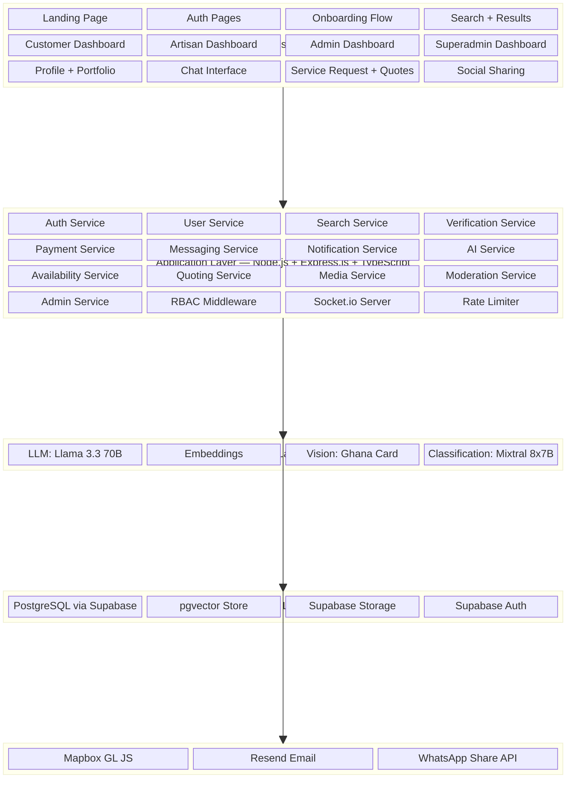
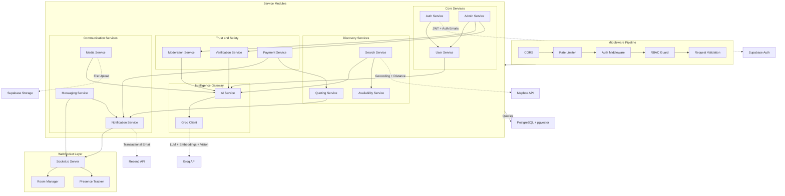
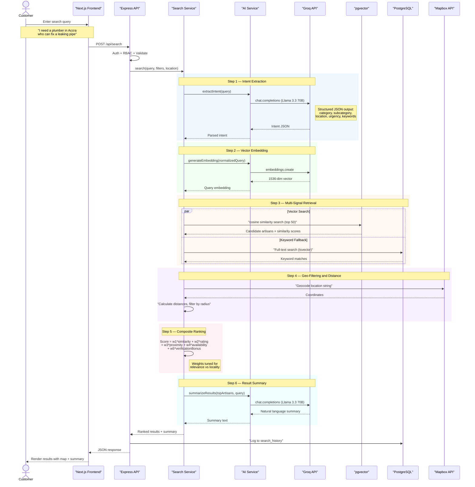
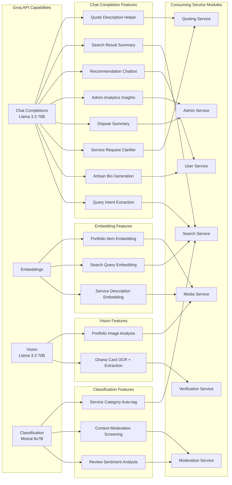
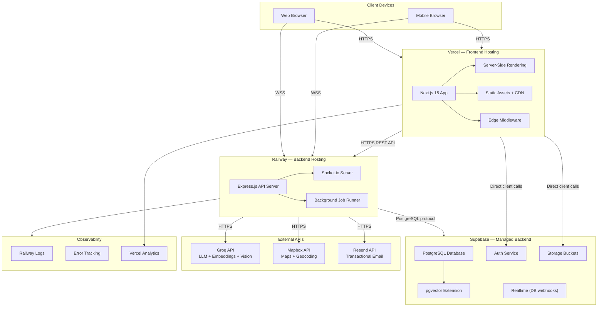

# System Architecture — ArtisanConnect Ghana

> **Document**: Deliverable 1 — System Architecture Diagram  
> **Version**: 1.0  
> **Last Updated**: 2026-06-20  
> **Status**: Draft  

---

## Table of Contents

1. [Overview](#overview)
2. [High-Level Architecture](#1-high-level-architecture)
3. [Backend Service Architecture](#2-backend-service-architecture)
4. [Data Flow Diagram — AI-Powered Search Pipeline](#3-data-flow-diagram--ai-powered-search-pipeline)
5. [AI Integration Map](#4-ai-integration-map)
6. [Infrastructure Diagram](#5-infrastructure-diagram)
7. [Key Design Decisions](#key-design-decisions)

---

## Overview

ArtisanConnect Ghana is an AI-powered artisan discovery platform that connects customers with skilled artisans across Ghana. The system is built on a modern three-tier architecture with an embedded intelligence layer powered by a single AI provider (Groq). The platform supports real-time messaging, semantic search with vector embeddings, identity verification through document vision analysis, and location-aware service matching via Mapbox.

### Core Tenets

| Tenet | Rationale |
|---|---|
| **Single AI Provider** | Groq provides LLM, embeddings, vision, and classification through one API — simplifying ops, billing, and rate-limit management. |
| **Supabase as Managed Backend** | PostgreSQL + Auth + Storage + Realtime in a single managed service reduces operational overhead for a lean team. |
| **pgvector for Semantic Search** | Embedding artisan services and search queries into the same vector space enables intent-aware discovery beyond keyword matching. |
| **4-Tier RBAC** | Customer → Artisan → Admin → Superadmin hierarchy enforces least-privilege across all API endpoints. |
| **Socket.io for Real-time** | Bi-directional WebSockets power chat, presence indicators, and push notifications without polling. |
| **Ghana-first Design** | SMS/WhatsApp sharing, Ghana Card verification, GHS currency, and location-aware search are first-class features. |

---

## 1. High-Level Architecture

The high-level architecture follows a layered pattern with clear boundaries between presentation, application logic, intelligence, and data persistence. Each layer communicates only with its adjacent layers, except for the AI layer which is accessed exclusively through the Application Layer's AI Service module.



### Layer Responsibilities

| Layer | Technology | Responsibilities |
|---|---|---|
| **Presentation** | Next.js 15, React 19, TypeScript, Tailwind CSS, ShadCN/UI | Server-side rendering, client-side interactivity, responsive UI, Mapbox map rendering, Socket.io client |
| **Application** | Node.js, Express.js, TypeScript | API routing, business logic, 13 service modules, WebSocket server, RBAC enforcement, rate limiting |
| **AI / Intelligence** | Groq API (llama-3.3-70b-versatile, mixtral-8x7b-32768) | Intent extraction, embedding generation, document OCR, sentiment classification. Free tier: 30 req/min. |
| **Data** | PostgreSQL (Supabase), pgvector, Supabase Storage, Supabase Auth | 21 tables, vector similarity search, file uploads (images, documents), JWT-based auth |
| **External** | Mapbox, Resend, WhatsApp Web API | Geocoding, distance calculation, transactional email, social sharing |

### Key Design Decisions

- **Next.js 15 App Router** — Uses React Server Components for initial page loads (SEO, performance) and client components for interactive features (maps, chat, search).
- **Tailwind + ShadCN/UI** — Utility-first CSS with a headless component library ensures consistent design without heavy bundle overhead.
- **Social Sharing** — WhatsApp integration and copy-link are prioritised over Western social platforms, reflecting Ghana's communication patterns.
- **Supabase Auth over custom JWT** — Supabase manages token issuance, refresh, and email verification internally, reducing surface area for auth bugs.

---

## 2. Backend Service Architecture

The backend is decomposed into 13 service modules, each owning a distinct domain. Services communicate internally through direct function calls (not HTTP) since they are co-located in the same Express.js process. The AI Service acts as the single gateway to Groq — no other service calls Groq directly.



### Service Module Catalog

| Service | Domain | Key Responsibilities | Dependencies |
|---|---|---|---|
| **Auth** | Authentication | Login, register, password reset, session management, Supabase Auth integration | User, Supabase Auth |
| **User** | Profile Management | CRUD profiles, artisan onboarding, preference updates, role management | AI (bio generation) |
| **Search** | Artisan Discovery | Intent extraction, vector search, geo-filtering, composite ranking, result summarisation | AI, Availability, Mapbox |
| **Verification** | Identity | Ghana Card upload, OCR extraction, manual review queue, status tracking | AI (vision), Media |
| **Payment** | Transactions | Quote payments, payment tracking, escrow concepts, refund handling | Quoting, Notification |
| **Messaging** | Real-time Chat | 1:1 conversations, message persistence, read receipts, typing indicators | Socket.io, Notification |
| **Notification** | Alerts | In-app push, email dispatch, notification preferences, badge counts | Socket.io, Resend |
| **AI** | Intelligence Gateway | Groq client wrapper, rate-limit management, prompt templates, embedding cache | Groq API |
| **Availability** | Scheduling | Working hours, day-off management, real-time availability status | — |
| **Quoting** | Service Quotes | Quote creation, negotiation, acceptance/rejection, expiry management | Notification |
| **Media** | File Management | Image upload/resize, portfolio management, Ghana Card document handling | Supabase Storage, AI |
| **Moderation** | Content Safety | Review moderation, report handling, content flagging, automated screening | AI (classification) |
| **Admin** | Platform Management | User management, audit logs, analytics, verification review, system config | User, Moderation, Verification |

### Middleware Pipeline

Every HTTP request passes through the middleware pipeline in order:

1. **CORS** — Allows requests from the Vercel-hosted frontend origin.
2. **Rate Limiter** — Token-bucket per IP (general) and per user (authenticated). Prevents abuse.
3. **Auth Middleware** — Validates Supabase JWT, extracts user context, attaches to `req.user`.
4. **RBAC Guard** — Checks `req.user.role` against the route's required permission level.
5. **Request Validation** — Zod schemas validate request body, query params, and path params.

### WebSocket Architecture

Socket.io runs on the same Express server, sharing the auth middleware for the initial handshake. Key real-time features:

- **Room Manager** — Creates rooms per conversation (`chat:{conversationId}`) and per user (`user:{userId}`) for targeted messaging.
- **Presence Tracker** — Maintains online/offline/away status using heartbeats. Broadcasts presence changes to relevant rooms.
- **Event Taxonomy** — `message:new`, `message:read`, `typing:start`, `typing:stop`, `notification:new`, `presence:update`.

---

## 3. Data Flow Diagram — AI-Powered Search Pipeline

The search pipeline is the most AI-intensive flow in the system. It makes up to 4 Groq API calls per search request (intent extraction, query embedding, optional clarification, result summary). Given the 30 req/min free-tier limit, aggressive caching and debouncing are critical.



### Search Pipeline Design Decisions

| Decision | Rationale |
|---|---|
| **Intent extraction before embedding** | Parsing the user's natural-language query into structured fields (category, location, urgency) allows us to apply hard filters before vector search, dramatically reducing the candidate set. |
| **Hybrid retrieval (vector + keyword)** | Vector search excels at semantic matches ("fix leaky pipe" → plumber) while keyword search catches exact terms the embedding might miss (specific tool names, brand names). |
| **Geocode at query time** | User queries often contain fuzzy location references ("near Osu" or "in East Legon"). Mapbox geocoding normalizes these into coordinates for distance calculation. |
| **Composite ranking formula** | A weighted multi-signal score prevents any single factor (e.g., proximity) from dominating results. Weights are configurable via admin settings. |
| **Deferred summarisation** | The LLM summary is generated last, only for the top N results, to conserve Groq rate-limit budget. It can be skipped entirely under rate-limit pressure. |
| **Search history logging** | Every search is logged (query, intent, result count, latency) for analytics, recommendation improvement, and audit purposes. |

### Rate-Limit Budget per Search

| Groq Call | Model | Est. Tokens | Required? |
|---|---|---|---|
| Intent Extraction | llama-3.3-70b-versatile | ~200 in / ~150 out | Yes |
| Query Embedding | embedding model | ~50 in | Yes |
| Result Summary | llama-3.3-70b-versatile | ~500 in / ~200 out | Optional (can skip) |
| Clarification | llama-3.3-70b-versatile | ~100 in / ~80 out | Conditional |

At 30 req/min, the system can handle **~10 full search requests/min** (3 Groq calls each) or **~15/min** if summaries are cached or skipped.

---

## 4. AI Integration Map

All AI capabilities flow through the single **AI Service** module, which wraps the Groq client with rate limiting, retry logic, prompt template management, and response caching. This centralised design ensures consistent error handling and makes it easy to monitor Groq usage across the entire platform.



### AI Feature Catalog

| Feature | Groq Capability | Model | Trigger | Priority |
|---|---|---|---|---|
| **Query Intent Extraction** | Chat | llama-3.3-70b-versatile | Every search query | Critical |
| **Search Query Embedding** | Embeddings | Groq embeddings | Every search query | Critical |
| **Service Description Embedding** | Embeddings | Groq embeddings | Artisan profile create/update | Critical |
| **Search Result Summary** | Chat | llama-3.3-70b-versatile | After search ranking | Medium (skippable) |
| **Ghana Card OCR** | Vision | llama-3.3-70b-versatile | Verification upload | High |
| **Review Sentiment Analysis** | Classification | mixtral-8x7b-32768 | New review submitted | Medium |
| **Content Moderation Screening** | Classification | mixtral-8x7b-32768 | User-generated content | High |
| **Artisan Bio Generation** | Chat | llama-3.3-70b-versatile | Artisan onboarding | Low |
| **Service Request Clarifier** | Chat | llama-3.3-70b-versatile | Ambiguous service request | Low |
| **Dispute Summary** | Chat | llama-3.3-70b-versatile | Admin dispute review | Low |
| **Admin Analytics Insights** | Chat | llama-3.3-70b-versatile | Admin dashboard load | Low |
| **Recommendation Chatbot** | Chat | llama-3.3-70b-versatile | Customer interaction | Medium |
| **Portfolio Item Embedding** | Embeddings | Groq embeddings | Portfolio upload | Medium |
| **Portfolio Image Analysis** | Vision | llama-3.3-70b-versatile | Portfolio upload | Low |
| **Quote Description Helper** | Chat | llama-3.3-70b-versatile | Quote creation | Low |
| **Service Category Auto-tag** | Classification | mixtral-8x7b-32768 | Service creation | Medium |

### Rate-Limit Strategy

```
Priority Queue:
  P0 (Critical)  → Always execute. Block and retry on 429.
  P1 (High)      → Execute with single retry. Degrade gracefully.
  P2 (Medium)    → Execute if budget allows. Skip with fallback.
  P3 (Low)       → Queue for off-peak. User sees "generating..." state.
```

| Strategy | Implementation |
|---|---|
| **Priority Queue** | AI Service maintains a priority queue. Critical calls (search intent, embedding) pre-empt low-priority calls (bio generation). |
| **Response Caching** | Embedding results are cached in PostgreSQL. Identical queries within 24h reuse cached vectors. |
| **Debouncing** | Frontend debounces search input (300ms). Prevents rapid-fire Groq calls during typing. |
| **Graceful Degradation** | If Groq is unavailable or rate-limited, search falls back to keyword-only mode. Summaries are skipped. Sentiment defaults to "neutral". |
| **Batch Embedding** | When artisans update profiles, embedding generation is queued and batched (up to 10 per batch call). |

---

## 5. Infrastructure Diagram

The platform is deployed across four managed services, connected through HTTPS and WebSocket protocols. This serverless/managed approach eliminates the need for infrastructure operations, aligning with the lean team's capacity.



### Deployment Topology

| Component | Platform | Plan | Key Config |
|---|---|---|---|
| **Frontend** | Vercel | Hobby / Pro | Auto-deploy from `main` branch. Preview deploys on PRs. Edge middleware for geo-routing. |
| **Backend API** | Railway | Starter / Developer | Single service running Express + Socket.io. Auto-scaling by Railway. Health check at `/api/health`. |
| **Database** | Supabase | Free / Pro | PostgreSQL 15 with pgvector extension. Connection pooling via Supavisor. Row-Level Security (RLS) policies. |
| **Auth** | Supabase Auth | Included | Email/password + magic links. JWT auto-refresh. Auth emails via Supabase's built-in provider. |
| **Storage** | Supabase Storage | Included | Buckets: `avatars`, `portfolios`, `ghana-cards` (private), `service-images`. Size limits enforced per bucket. |
| **AI** | Groq Cloud | Free | API key rotation not required at free tier. 30 req/min rate limit enforced client-side. |
| **Maps** | Mapbox | Free tier | 100K free tile loads/month, 100K free geocoding requests/month. |
| **Email** | Resend | Free / Pro | 100 emails/day free. Templates for: welcome, quote received, booking confirmed, verification status. |

### Network and Security

| Concern | Approach |
|---|---|
| **HTTPS everywhere** | Vercel and Railway provide automatic TLS certificates. All API communication is encrypted in transit. |
| **CORS** | Backend allows only the Vercel frontend origin. Credentials mode enabled for auth cookies. |
| **API Key Security** | All third-party API keys (Groq, Mapbox, Resend) stored as Railway environment variables. Never exposed to the frontend. |
| **Supabase RLS** | Row-Level Security ensures users can only access their own data at the database level, even if application logic has bugs. |
| **WebSocket Auth** | Socket.io handshake validates the Supabase JWT before upgrading to WebSocket. Unauthenticated connections are rejected. |
| **File Upload Security** | Supabase Storage buckets enforce file type whitelists (JPEG, PNG, PDF) and size limits (5MB avatars, 10MB documents). |
| **Ghana Card Privacy** | Ghana Card images are stored in a private bucket with RLS. Only the owning user and admin/superadmin roles can access them. Extracted data is stored separately and the image can be purged after verification. |

### Environment Configuration

```
# Railway Environment Variables
NODE_ENV=production
PORT=3000
DATABASE_URL=postgresql://...@db.supabase.co:5432/postgres
SUPABASE_URL=https://xxx.supabase.co
SUPABASE_SERVICE_ROLE_KEY=eyJ...
SUPABASE_ANON_KEY=eyJ...
GROQ_API_KEY=gsk_...
MAPBOX_ACCESS_TOKEN=pk.eyJ...
RESEND_API_KEY=re_...
FRONTEND_URL=https://artisanconnect.vercel.app
JWT_SECRET=<from-supabase>
SOCKET_CORS_ORIGIN=https://artisanconnect.vercel.app
```

---

## Key Design Decisions

### Why These Choices?

| Decision | Alternatives Considered | Rationale |
|---|---|---|
| **Groq as sole AI provider** | OpenAI, Anthropic, Hugging Face | Groq offers LLM, embeddings, and vision in a single API with a generous free tier. Avoids multi-provider complexity. Fast inference via LPU hardware. |
| **Supabase over raw PostgreSQL** | AWS RDS, PlanetScale, Neon | Supabase bundles Auth, Storage, Realtime, and a dashboard with PostgreSQL. Dramatically reduces setup time and operational burden. |
| **pgvector over Pinecone** | Pinecone, Weaviate, Qdrant | Keeping vectors in PostgreSQL avoids a separate vector database, simplifies joins between vector results and relational data (ratings, availability), and reduces costs. |
| **Socket.io over Supabase Realtime** | Supabase Realtime, Pusher, Ably | Socket.io provides more control over room management, typing indicators, and presence tracking. Supabase Realtime is used only for DB webhook triggers. |
| **Railway over AWS/GCP** | AWS ECS, Google Cloud Run, Fly.io | Railway offers simple container deployment with built-in CI/CD, logging, and environment management. No Kubernetes knowledge required. |
| **Resend over SendGrid** | SendGrid, Mailgun, AWS SES | Resend has a modern API, excellent developer experience, and React Email integration for template management. |
| **Mapbox over Google Maps** | Google Maps Platform | Mapbox offers more customisable map styles, better pricing for tile loads, and the GL JS library is more performant for interactive features. |

### Scalability Considerations

The current architecture is designed for **MVP to early growth** (hundreds of concurrent users). Key scaling levers for future growth:

1. **Horizontal API scaling** — Railway supports multiple replicas. Socket.io would need a Redis adapter for cross-instance room management.
2. **Read replicas** — Supabase Pro supports read replicas for heavy search traffic.
3. **pgvector indexing** — IVFFlat or HNSW indexes on the embedding column as the artisan count grows beyond 10K.
4. **Groq tier upgrade** — Moving to a paid Groq plan removes the 30 req/min limit.
5. **CDN for media** — Supabase Storage integrates with CDN for portfolio images at scale.
6. **Background job queue** — Migrate from in-process worker to a dedicated job queue (BullMQ + Redis) for embedding generation, email sending, and moderation tasks.
