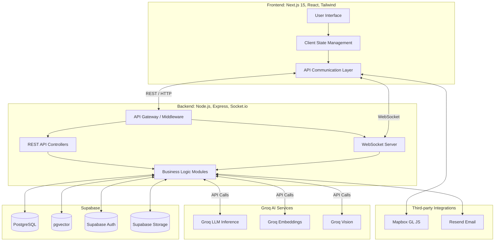
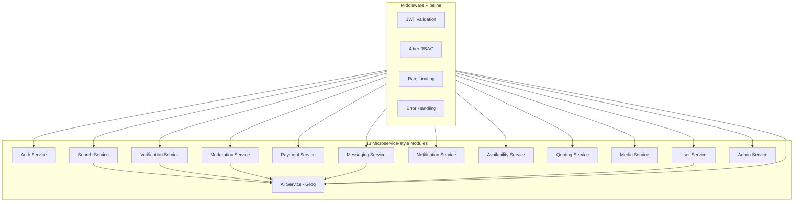
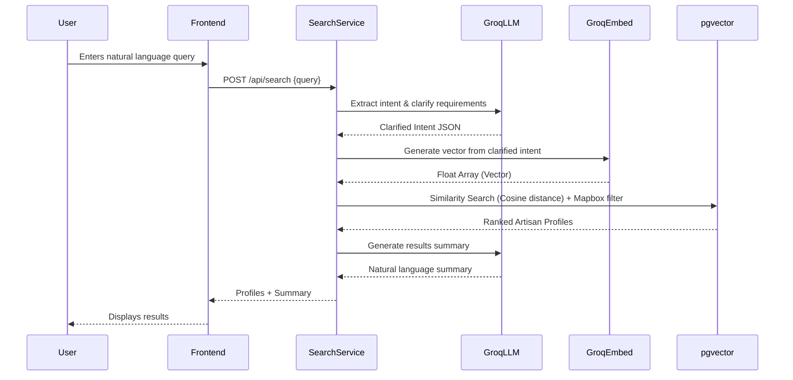
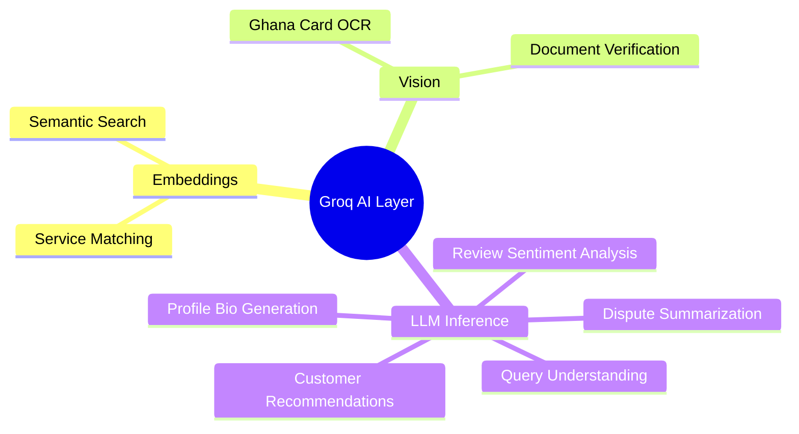
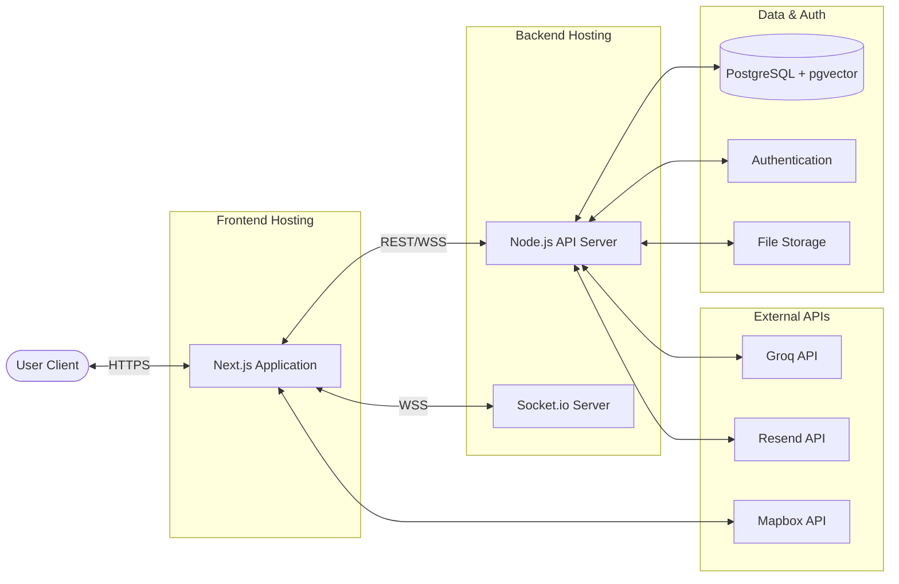

# Deliverable 1: System Architecture Diagram

## 1. High-Level Architecture

## 2. Backend Service Architecture

## 3. Data Flow Diagram: AI Pipeline

## 4. AI Integration Map

## 5. Infrastructure Diagram

