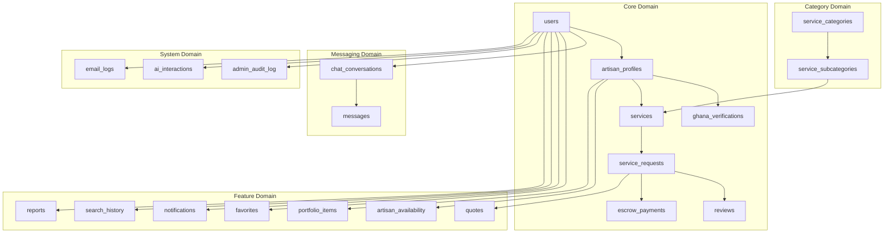
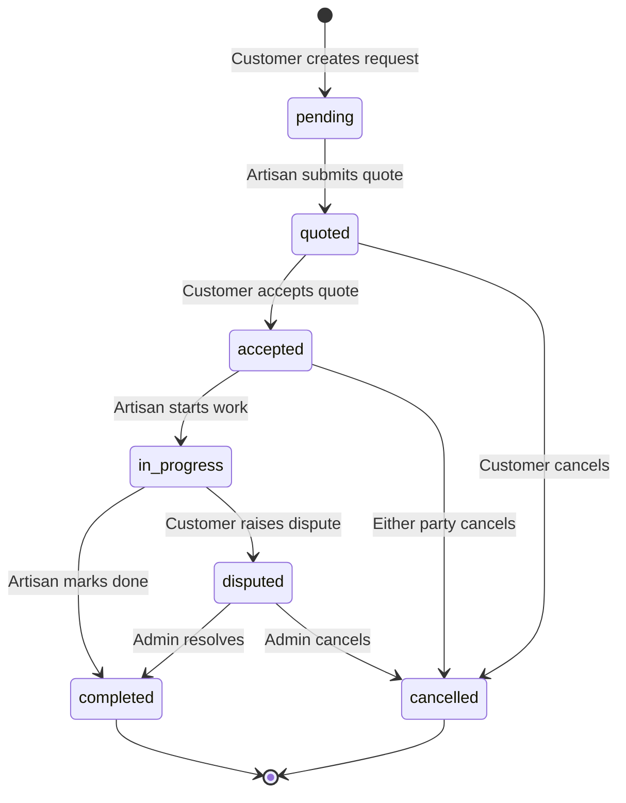
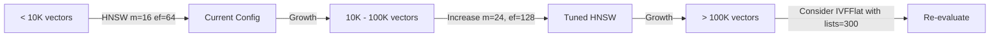
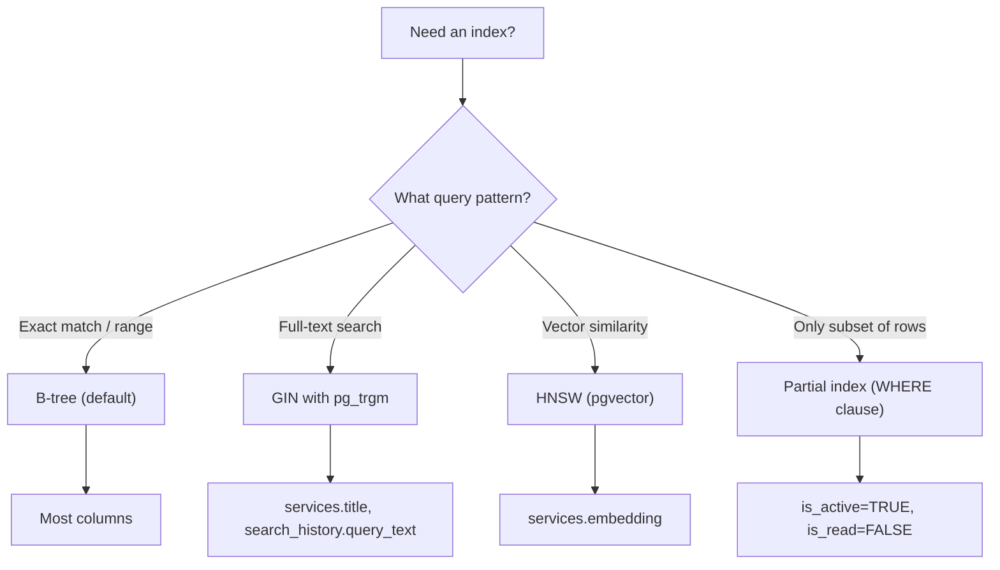

# Deliverable 2: Database Schema Design

> **ArtisanConnect Ghana — AI-Powered Artisan Discovery Platform**
> Version 1.0 · June 2026

---

## Table of Contents

1. [Overview](#1-overview)
2. [Entity-Relationship Diagram](#2-entity-relationship-diagram)
3. [Schema Architecture](#3-schema-architecture)
4. [SQL DDL Script](#4-sql-ddl-script)
5. [pgvector Index Design](#5-pgvector-index-design)
6. [Data Dictionary](#6-data-dictionary)
7. [Index Strategy](#7-index-strategy)
8. [Row-Level Security Considerations](#8-row-level-security-considerations)

---

## 1. Overview

### 1.1 Database Technology

| Property | Value |
|---|---|
| **Platform** | Supabase (managed PostgreSQL 15+) |
| **Extensions** | `pgvector`, `uuid-ossp`, `pg_trgm` |
| **Hosting** | Supabase Cloud (Free → Pro tier) |
| **Backup** | Supabase automatic daily backups |
| **Connection Pooling** | Supavisor (built-in) |

### 1.2 Design Principles

1. **UUID Primary Keys** — Every table uses `gen_random_uuid()` for distributed-safe, non-sequential IDs.
2. **Explicit Enum Types** — PostgreSQL `CREATE TYPE` enums for type-safe constrained values.
3. **Soft Conventions** — `is_suspended` flag on users rather than hard deletes; status enums for workflow states.
4. **Audit Trail** — `admin_audit_log` captures every privileged action with actor, target, and JSONB details.
5. **Vector Embeddings** — `pgvector` on `services.embedding` enables semantic search via Groq-generated embeddings.
6. **Temporal Tracking** — `created_at` / `updated_at` timestamps on mutable tables with trigger-based `updated_at`.

### 1.3 Table Inventory (21 Tables)

| # | Table | Domain | Purpose |
|---|---|---|---|
| 1 | `users` | Core | All platform users (customers, artisans, admins) |
| 2 | `artisan_profiles` | Core | Extended profile for artisan-role users |
| 3 | `ghana_verifications` | Core | Ghana Card ID verification records |
| 4 | `services` | Core | Artisan service listings with vector embeddings |
| 5 | `service_requests` | Core | Customer-to-artisan service request workflow |
| 6 | `reviews` | Core | Post-completion customer reviews |
| 7 | `messages` | Core | Chat messages within conversations |
| 8 | `escrow_payments` | Core | Payment escrow for service requests |
| 9 | `notifications` | Core | In-app notification delivery |
| 10 | `service_categories` | Category | Top-level service categories |
| 11 | `service_subcategories` | Category | Subcategories within a category |
| 12 | `artisan_availability` | Feature | Weekly availability schedule slots |
| 13 | `quotes` | Feature | Artisan price quotes for requests |
| 14 | `favorites` | Feature | Customer-saved artisans |
| 15 | `reports` | Feature | User/content reports for moderation |
| 16 | `portfolio_items` | Feature | Artisan work portfolio images |
| 17 | `search_history` | Feature | User search query log |
| 18 | `admin_audit_log` | System | Admin action audit trail |
| 19 | `chat_conversations` | System | Chat conversation pairs |
| 20 | `ai_interactions` | System | AI/LLM usage tracking |
| 21 | `email_logs` | System | Transactional email delivery log |

---

## 2. Entity-Relationship Diagram

### 2.1 Complete ERD

```mermaid
erDiagram
    users {
        uuid id PK
        text full_name
        text email UK
        text phone
        text password_hash
        user_role role
        text avatar_url
        decimal latitude
        decimal longitude
        text region
        text district
        boolean onboarding_completed
        boolean is_suspended
        timestamptz created_at
        timestamptz updated_at
    }

    artisan_profiles {
        uuid id PK
        uuid user_id FK,UK
        text profession
        text bio
        text ai_generated_bio
        int experience_years
        int service_radius_km
        verification_status verification_status
        artisan_status status
        decimal average_rating
        int total_reviews
        timestamptz created_at
        timestamptz updated_at
    }

    ghana_verifications {
        uuid id PK
        uuid artisan_id FK
        text card_number
        text card_image_url
        text selfie_url
        jsonb ai_extraction_result
        verification_status verification_status
        text admin_notes
        uuid verified_by FK
        timestamptz verified_at
        timestamptz created_at
    }

    service_categories {
        uuid id PK
        text name UK
        text description
        text icon
        boolean is_active
        timestamptz created_at
    }

    service_subcategories {
        uuid id PK
        uuid category_id FK
        text name
        text description
        timestamptz created_at
    }

    services {
        uuid id PK
        uuid artisan_id FK
        uuid subcategory_id FK
        text title
        text description
        decimal price_range_min
        decimal price_range_max
        vector embedding
        boolean is_active
        timestamptz created_at
        timestamptz updated_at
    }

    service_requests {
        uuid id PK
        uuid customer_id FK
        uuid artisan_id FK
        uuid service_id FK
        text description
        text ai_clarified_description
        uuid accepted_quote_id FK
        request_status status
        timestamptz preferred_date
        timestamptz created_at
        timestamptz updated_at
    }

    quotes {
        uuid id PK
        uuid request_id FK
        uuid artisan_id FK
        decimal amount
        text description
        quote_status status
        timestamptz valid_until
        timestamptz created_at
    }

    reviews {
        uuid id PK
        uuid customer_id FK
        uuid artisan_id FK
        uuid request_id FK,UK
        int rating
        text comment
        sentiment sentiment
        timestamptz created_at
    }

    escrow_payments {
        uuid id PK
        uuid request_id FK,UK
        decimal amount
        escrow_status status
        timestamptz released_at
        timestamptz created_at
    }

    chat_conversations {
        uuid id PK
        uuid participant_1_id FK
        uuid participant_2_id FK
        timestamptz last_message_at
        timestamptz created_at
    }

    messages {
        uuid id PK
        uuid conversation_id FK
        uuid sender_id FK
        text content
        boolean is_read
        timestamptz created_at
    }

    notifications {
        uuid id PK
        uuid user_id FK
        notification_type type
        text title
        text content
        boolean is_read
        text reference_type
        uuid reference_id
        timestamptz created_at
    }

    favorites {
        uuid id PK
        uuid customer_id FK
        uuid artisan_id FK
        timestamptz created_at
    }

    reports {
        uuid id PK
        uuid reporter_id FK
        uuid reported_user_id FK
        uuid reported_review_id FK
        report_reason reason
        text description
        report_status status
        text admin_notes
        uuid reviewed_by FK
        timestamptz reviewed_at
        timestamptz created_at
    }

    portfolio_items {
        uuid id PK
        uuid artisan_id FK
        text title
        text description
        text image_url
        text before_image_url
        text after_image_url
        int display_order
        timestamptz created_at
    }

    artisan_availability {
        uuid id PK
        uuid artisan_id FK
        int day_of_week
        time start_time
        time end_time
        boolean is_available
    }

    search_history {
        uuid id PK
        uuid user_id FK
        text query_text
        int result_count
        jsonb filters_used
        timestamptz created_at
    }

    admin_audit_log {
        uuid id PK
        uuid actor_id FK
        audit_action action
        audit_target_type target_type
        uuid target_id
        jsonb details
        inet ip_address
        timestamptz created_at
    }

    ai_interactions {
        uuid id PK
        uuid user_id FK
        ai_feature feature
        text model
        text prompt_hash
        int tokens_used
        int latency_ms
        timestamptz created_at
    }

    email_logs {
        uuid id PK
        uuid user_id FK
        text template_type
        text resend_id
        text recipient_email
        email_status status
        timestamptz created_at
    }

    %% ── Core Relationships ──
    users ||--o| artisan_profiles : "has profile"
    artisan_profiles ||--o| ghana_verifications : "verified via"
    artisan_profiles ||--o{ services : "offers"
    artisan_profiles ||--o{ artisan_availability : "schedules"
    artisan_profiles ||--o{ portfolio_items : "showcases"

    %% ── Category Hierarchy ──
    service_categories ||--o{ service_subcategories : "contains"
    service_subcategories ||--o{ services : "classifies"

    %% ── Service Request Flow ──
    users ||--o{ service_requests : "creates as customer"
    users ||--o{ service_requests : "receives as artisan"
    services ||--o{ service_requests : "requested via"
    service_requests ||--o{ quotes : "receives"
    service_requests ||--o| escrow_payments : "paid via"
    service_requests ||--o| reviews : "reviewed in"
    quotes ||--o| service_requests : "accepted in"

    %% ── Messaging ──
    users ||--o{ chat_conversations : "participates in"
    chat_conversations ||--o{ messages : "contains"
    users ||--o{ messages : "sends"

    %% ── User Features ──
    users ||--o{ favorites : "saves"
    users ||--o{ notifications : "receives"
    users ||--o{ search_history : "searches"

    %% ── Moderation ──
    users ||--o{ reports : "files"
    users ||--o{ reports : "is reported in"
    reviews ||--o{ reports : "flagged in"

    %% ── Admin / System ──
    users ||--o{ admin_audit_log : "performs"
    users ||--o{ ai_interactions : "triggers"
    users ||--o{ email_logs : "receives"
    users ||--o{ ghana_verifications : "verifies as admin"
    users ||--o{ reports : "reviews as admin"
```



### 2.2 Domain Grouping Diagram



### 2.3 Service Request State Machine



---

## 3. Schema Architecture

### 3.1 Enum Type Inventory

| Enum Type | Values | Used In |
|---|---|---|
| `user_role` | `customer`, `artisan`, `admin`, `superadmin` | `users.role` |
| `verification_status` | `pending`, `approved`, `rejected` | `artisan_profiles.verification_status`, `ghana_verifications.verification_status` |
| `artisan_status` | `available`, `busy`, `offline` | `artisan_profiles.status` |
| `request_status` | `pending`, `quoted`, `accepted`, `in_progress`, `completed`, `cancelled`, `disputed` | `service_requests.status` |
| `quote_status` | `pending`, `accepted`, `rejected`, `expired` | `quotes.status` |
| `escrow_status` | `held`, `released`, `refunded`, `disputed` | `escrow_payments.status` |
| `sentiment` | `positive`, `neutral`, `negative` | `reviews.sentiment` |
| `notification_type` | `new_request`, `quote_received`, `quote_accepted`, `request_completed`, `new_message`, `payment_released`, `verification_update`, `report_update`, `system` | `notifications.type` |
| `report_reason` | `fraud`, `spam`, `inappropriate`, `fake_review`, `other` | `reports.reason` |
| `report_status` | `pending`, `reviewed`, `resolved`, `dismissed` | `reports.status` |
| `audit_action` | `verify_artisan`, `reject_artisan`, `suspend_user`, `unsuspend_user`, `promote_admin`, `demote_admin`, `resolve_dispute`, `review_report`, `manage_category` | `admin_audit_log.action` |
| `audit_target_type` | `user`, `artisan`, `verification`, `report`, `dispute`, `category` | `admin_audit_log.target_type` |
| `ai_feature` | `query_intent`, `bio_generation`, `sentiment_analysis`, `card_extraction`, `dispute_summary`, `request_clarifier`, `analytics_insights`, `recommendation_chat`, `embedding` | `ai_interactions.feature` |
| `email_status` | `sent`, `delivered`, `bounced`, `failed` | `email_logs.status` |

### 3.2 Key Design Decisions

| Decision | Rationale |
|---|---|
| **UUID keys over serial** | Supabase convention; safe for client-side generation; no sequence contention |
| **Separate `artisan_profiles` from `users`** | Not all users are artisans; keeps `users` lean; allows artisan-specific columns and 1:1 extension |
| **`accepted_quote_id` on `service_requests`** | Denormalized FK avoids scanning `quotes` to find the accepted one; single source of truth |
| **`embedding` column on `services`** | Enables pgvector semantic search on service descriptions; indexed with HNSW |
| **JSONB for `ai_extraction_result`** | Ghana Card OCR output schema may evolve; JSONB gives flexibility without migrations |
| **JSONB for `filters_used` in search_history** | Filter combinations are variable and evolving; schema-less storage is appropriate |
| **`chat_conversations` as a bridge** | Prevents message fan-out; enables participant-pair uniqueness; supports `last_message_at` for sorting |
| **`average_rating` denormalized** | Avoids expensive `AVG()` aggregation on every artisan card render; updated by trigger |

---

## 4. SQL DDL Script

```sql
-- ============================================================
-- ArtisanConnect Ghana — Complete Database Schema
-- PostgreSQL 15+ / Supabase
-- ============================================================

-- ────────────────────────────────────────────────────────────
-- 0. EXTENSIONS
-- ────────────────────────────────────────────────────────────

CREATE EXTENSION IF NOT EXISTS "uuid-ossp";
CREATE EXTENSION IF NOT EXISTS "vector";       -- pgvector
CREATE EXTENSION IF NOT EXISTS "pg_trgm";      -- trigram fuzzy search

-- ────────────────────────────────────────────────────────────
-- 1. ENUM TYPES
-- ────────────────────────────────────────────────────────────

CREATE TYPE user_role AS ENUM (
    'customer', 'artisan', 'admin', 'superadmin'
);

CREATE TYPE verification_status AS ENUM (
    'pending', 'approved', 'rejected'
);

CREATE TYPE artisan_status AS ENUM (
    'available', 'busy', 'offline'
);

CREATE TYPE request_status AS ENUM (
    'pending', 'quoted', 'accepted', 'in_progress',
    'completed', 'cancelled', 'disputed'
);

CREATE TYPE quote_status AS ENUM (
    'pending', 'accepted', 'rejected', 'expired'
);

CREATE TYPE escrow_status AS ENUM (
    'held', 'released', 'refunded', 'disputed'
);

CREATE TYPE sentiment AS ENUM (
    'positive', 'neutral', 'negative'
);

CREATE TYPE notification_type AS ENUM (
    'new_request', 'quote_received', 'quote_accepted',
    'request_completed', 'new_message', 'payment_released',
    'verification_update', 'report_update', 'system'
);

CREATE TYPE report_reason AS ENUM (
    'fraud', 'spam', 'inappropriate', 'fake_review', 'other'
);

CREATE TYPE report_status AS ENUM (
    'pending', 'reviewed', 'resolved', 'dismissed'
);

CREATE TYPE audit_action AS ENUM (
    'verify_artisan', 'reject_artisan', 'suspend_user',
    'unsuspend_user', 'promote_admin', 'demote_admin',
    'resolve_dispute', 'review_report', 'manage_category'
);

CREATE TYPE audit_target_type AS ENUM (
    'user', 'artisan', 'verification', 'report', 'dispute', 'category'
);

CREATE TYPE ai_feature AS ENUM (
    'query_intent', 'bio_generation', 'sentiment_analysis',
    'card_extraction', 'dispute_summary', 'request_clarifier',
    'analytics_insights', 'recommendation_chat', 'embedding'
);

CREATE TYPE email_status AS ENUM (
    'sent', 'delivered', 'bounced', 'failed'
);

-- ────────────────────────────────────────────────────────────
-- 2. UTILITY: updated_at trigger function
-- ────────────────────────────────────────────────────────────

CREATE OR REPLACE FUNCTION set_updated_at()
RETURNS TRIGGER AS $$
BEGIN
    NEW.updated_at = NOW();
    RETURN NEW;
END;
$$ LANGUAGE plpgsql;

-- ────────────────────────────────────────────────────────────
-- 3. CORE TABLES
-- ────────────────────────────────────────────────────────────

-- 3.1 users
CREATE TABLE users (
    id              UUID PRIMARY KEY DEFAULT gen_random_uuid(),
    full_name       TEXT NOT NULL,
    email           TEXT NOT NULL UNIQUE,
    phone           TEXT,
    password_hash   TEXT NOT NULL,
    role            user_role NOT NULL DEFAULT 'customer',
    avatar_url      TEXT,
    latitude        DECIMAL(10, 7),
    longitude       DECIMAL(10, 7),
    region          TEXT,
    district        TEXT,
    onboarding_completed BOOLEAN NOT NULL DEFAULT FALSE,
    is_suspended    BOOLEAN NOT NULL DEFAULT FALSE,
    created_at      TIMESTAMPTZ NOT NULL DEFAULT NOW(),
    updated_at      TIMESTAMPTZ NOT NULL DEFAULT NOW()
);

CREATE TRIGGER trg_users_updated_at
    BEFORE UPDATE ON users
    FOR EACH ROW EXECUTE FUNCTION set_updated_at();

CREATE INDEX idx_users_email ON users (email);
CREATE INDEX idx_users_role ON users (role);
CREATE INDEX idx_users_region ON users (region);
CREATE INDEX idx_users_created_at ON users (created_at DESC);

-- 3.2 artisan_profiles
CREATE TABLE artisan_profiles (
    id                  UUID PRIMARY KEY DEFAULT gen_random_uuid(),
    user_id             UUID NOT NULL UNIQUE REFERENCES users(id) ON DELETE CASCADE,
    profession          TEXT NOT NULL,
    bio                 TEXT,
    ai_generated_bio    TEXT,
    experience_years    INTEGER CHECK (experience_years >= 0),
    service_radius_km   INTEGER NOT NULL DEFAULT 10 CHECK (service_radius_km > 0),
    verification_status verification_status NOT NULL DEFAULT 'pending',
    status              artisan_status NOT NULL DEFAULT 'offline',
    average_rating      DECIMAL(3, 2) DEFAULT 0.00 CHECK (average_rating >= 0 AND average_rating <= 5),
    total_reviews       INTEGER NOT NULL DEFAULT 0 CHECK (total_reviews >= 0),
    created_at          TIMESTAMPTZ NOT NULL DEFAULT NOW(),
    updated_at          TIMESTAMPTZ NOT NULL DEFAULT NOW()
);

CREATE TRIGGER trg_artisan_profiles_updated_at
    BEFORE UPDATE ON artisan_profiles
    FOR EACH ROW EXECUTE FUNCTION set_updated_at();

CREATE INDEX idx_artisan_profiles_user_id ON artisan_profiles (user_id);
CREATE INDEX idx_artisan_profiles_profession ON artisan_profiles (profession);
CREATE INDEX idx_artisan_profiles_verification ON artisan_profiles (verification_status);
CREATE INDEX idx_artisan_profiles_status ON artisan_profiles (status);
CREATE INDEX idx_artisan_profiles_rating ON artisan_profiles (average_rating DESC);

-- 3.3 ghana_verifications
CREATE TABLE ghana_verifications (
    id                    UUID PRIMARY KEY DEFAULT gen_random_uuid(),
    artisan_id            UUID NOT NULL UNIQUE REFERENCES artisan_profiles(id) ON DELETE CASCADE,
    card_number           TEXT NOT NULL,
    card_image_url        TEXT NOT NULL,
    selfie_url            TEXT NOT NULL,
    ai_extraction_result  JSONB,
    verification_status   verification_status NOT NULL DEFAULT 'pending',
    admin_notes           TEXT,
    verified_by           UUID REFERENCES users(id) ON DELETE SET NULL,
    verified_at           TIMESTAMPTZ,
    created_at            TIMESTAMPTZ NOT NULL DEFAULT NOW()
);

CREATE INDEX idx_ghana_verifications_artisan ON ghana_verifications (artisan_id);
CREATE INDEX idx_ghana_verifications_status ON ghana_verifications (verification_status);

-- 3.4 service_categories
CREATE TABLE service_categories (
    id          UUID PRIMARY KEY DEFAULT gen_random_uuid(),
    name        TEXT NOT NULL UNIQUE,
    description TEXT,
    icon        TEXT,
    is_active   BOOLEAN NOT NULL DEFAULT TRUE,
    created_at  TIMESTAMPTZ NOT NULL DEFAULT NOW()
);

-- 3.5 service_subcategories
CREATE TABLE service_subcategories (
    id          UUID PRIMARY KEY DEFAULT gen_random_uuid(),
    category_id UUID NOT NULL REFERENCES service_categories(id) ON DELETE CASCADE,
    name        TEXT NOT NULL,
    description TEXT,
    created_at  TIMESTAMPTZ NOT NULL DEFAULT NOW(),
    UNIQUE (category_id, name)
);

CREATE INDEX idx_service_subcategories_category ON service_subcategories (category_id);

-- 3.6 services
CREATE TABLE services (
    id              UUID PRIMARY KEY DEFAULT gen_random_uuid(),
    artisan_id      UUID NOT NULL REFERENCES artisan_profiles(id) ON DELETE CASCADE,
    subcategory_id  UUID REFERENCES service_subcategories(id) ON DELETE SET NULL,
    title           TEXT NOT NULL,
    description     TEXT NOT NULL,
    price_range_min DECIMAL(10, 2) NOT NULL CHECK (price_range_min >= 0),
    price_range_max DECIMAL(10, 2) NOT NULL CHECK (price_range_max >= 0),
    embedding       vector(1536),
    is_active       BOOLEAN NOT NULL DEFAULT TRUE,
    created_at      TIMESTAMPTZ NOT NULL DEFAULT NOW(),
    updated_at      TIMESTAMPTZ NOT NULL DEFAULT NOW(),
    CONSTRAINT chk_price_range CHECK (price_range_max >= price_range_min)
);

CREATE TRIGGER trg_services_updated_at
    BEFORE UPDATE ON services
    FOR EACH ROW EXECUTE FUNCTION set_updated_at();

CREATE INDEX idx_services_artisan ON services (artisan_id);
CREATE INDEX idx_services_subcategory ON services (subcategory_id);
CREATE INDEX idx_services_active ON services (is_active) WHERE is_active = TRUE;
CREATE INDEX idx_services_title_trgm ON services USING gin (title gin_trgm_ops);

-- 3.7 service_requests
CREATE TABLE service_requests (
    id                      UUID PRIMARY KEY DEFAULT gen_random_uuid(),
    customer_id             UUID NOT NULL REFERENCES users(id) ON DELETE CASCADE,
    artisan_id              UUID NOT NULL REFERENCES users(id) ON DELETE CASCADE,
    service_id              UUID REFERENCES services(id) ON DELETE SET NULL,
    description             TEXT NOT NULL,
    ai_clarified_description TEXT,
    accepted_quote_id       UUID,  -- FK added after quotes table
    status                  request_status NOT NULL DEFAULT 'pending',
    preferred_date          TIMESTAMPTZ,
    created_at              TIMESTAMPTZ NOT NULL DEFAULT NOW(),
    updated_at              TIMESTAMPTZ NOT NULL DEFAULT NOW(),
    CONSTRAINT chk_different_parties CHECK (customer_id <> artisan_id)
);

CREATE TRIGGER trg_service_requests_updated_at
    BEFORE UPDATE ON service_requests
    FOR EACH ROW EXECUTE FUNCTION set_updated_at();

CREATE INDEX idx_service_requests_customer ON service_requests (customer_id);
CREATE INDEX idx_service_requests_artisan ON service_requests (artisan_id);
CREATE INDEX idx_service_requests_status ON service_requests (status);
CREATE INDEX idx_service_requests_created_at ON service_requests (created_at DESC);

-- 3.8 quotes
CREATE TABLE quotes (
    id          UUID PRIMARY KEY DEFAULT gen_random_uuid(),
    request_id  UUID NOT NULL REFERENCES service_requests(id) ON DELETE CASCADE,
    artisan_id  UUID NOT NULL REFERENCES users(id) ON DELETE CASCADE,
    amount      DECIMAL(10, 2) NOT NULL CHECK (amount > 0),
    description TEXT,
    status      quote_status NOT NULL DEFAULT 'pending',
    valid_until TIMESTAMPTZ NOT NULL,
    created_at  TIMESTAMPTZ NOT NULL DEFAULT NOW()
);

-- Now add the deferred FK from service_requests to quotes
ALTER TABLE service_requests
    ADD CONSTRAINT fk_service_requests_accepted_quote
    FOREIGN KEY (accepted_quote_id) REFERENCES quotes(id) ON DELETE SET NULL;

CREATE INDEX idx_quotes_request ON quotes (request_id);
CREATE INDEX idx_quotes_artisan ON quotes (artisan_id);
CREATE INDEX idx_quotes_status ON quotes (status);

-- 3.9 reviews
CREATE TABLE reviews (
    id          UUID PRIMARY KEY DEFAULT gen_random_uuid(),
    customer_id UUID NOT NULL REFERENCES users(id) ON DELETE CASCADE,
    artisan_id  UUID NOT NULL REFERENCES users(id) ON DELETE CASCADE,
    request_id  UUID NOT NULL UNIQUE REFERENCES service_requests(id) ON DELETE CASCADE,
    rating      INTEGER NOT NULL CHECK (rating >= 1 AND rating <= 5),
    comment     TEXT,
    sentiment   sentiment,
    created_at  TIMESTAMPTZ NOT NULL DEFAULT NOW()
);

CREATE INDEX idx_reviews_artisan ON reviews (artisan_id);
CREATE INDEX idx_reviews_customer ON reviews (customer_id);
CREATE INDEX idx_reviews_rating ON reviews (rating);
CREATE INDEX idx_reviews_created_at ON reviews (created_at DESC);

-- 3.10 escrow_payments
CREATE TABLE escrow_payments (
    id          UUID PRIMARY KEY DEFAULT gen_random_uuid(),
    request_id  UUID NOT NULL UNIQUE REFERENCES service_requests(id) ON DELETE CASCADE,
    amount      DECIMAL(10, 2) NOT NULL CHECK (amount > 0),
    status      escrow_status NOT NULL DEFAULT 'held',
    released_at TIMESTAMPTZ,
    created_at  TIMESTAMPTZ NOT NULL DEFAULT NOW()
);

CREATE INDEX idx_escrow_payments_request ON escrow_payments (request_id);
CREATE INDEX idx_escrow_payments_status ON escrow_payments (status);

-- 3.11 chat_conversations
CREATE TABLE chat_conversations (
    id                UUID PRIMARY KEY DEFAULT gen_random_uuid(),
    participant_1_id  UUID NOT NULL REFERENCES users(id) ON DELETE CASCADE,
    participant_2_id  UUID NOT NULL REFERENCES users(id) ON DELETE CASCADE,
    last_message_at   TIMESTAMPTZ,
    created_at        TIMESTAMPTZ NOT NULL DEFAULT NOW(),
    CONSTRAINT chk_different_participants CHECK (participant_1_id <> participant_2_id),
    CONSTRAINT uq_conversation_pair UNIQUE (
        LEAST(participant_1_id, participant_2_id),
        GREATEST(participant_1_id, participant_2_id)
    )
);

CREATE INDEX idx_chat_conversations_p1 ON chat_conversations (participant_1_id);
CREATE INDEX idx_chat_conversations_p2 ON chat_conversations (participant_2_id);
CREATE INDEX idx_chat_conversations_last_msg ON chat_conversations (last_message_at DESC);

-- 3.12 messages
CREATE TABLE messages (
    id              UUID PRIMARY KEY DEFAULT gen_random_uuid(),
    conversation_id UUID NOT NULL REFERENCES chat_conversations(id) ON DELETE CASCADE,
    sender_id       UUID NOT NULL REFERENCES users(id) ON DELETE CASCADE,
    content         TEXT NOT NULL,
    is_read         BOOLEAN NOT NULL DEFAULT FALSE,
    created_at      TIMESTAMPTZ NOT NULL DEFAULT NOW()
);

CREATE INDEX idx_messages_conversation ON messages (conversation_id, created_at DESC);
CREATE INDEX idx_messages_sender ON messages (sender_id);
CREATE INDEX idx_messages_unread ON messages (conversation_id, is_read) WHERE is_read = FALSE;

-- 3.13 notifications
CREATE TABLE notifications (
    id              UUID PRIMARY KEY DEFAULT gen_random_uuid(),
    user_id         UUID NOT NULL REFERENCES users(id) ON DELETE CASCADE,
    type            notification_type NOT NULL,
    title           TEXT NOT NULL,
    content         TEXT NOT NULL,
    is_read         BOOLEAN NOT NULL DEFAULT FALSE,
    reference_type  TEXT,
    reference_id    UUID,
    created_at      TIMESTAMPTZ NOT NULL DEFAULT NOW()
);

CREATE INDEX idx_notifications_user ON notifications (user_id, created_at DESC);
CREATE INDEX idx_notifications_unread ON notifications (user_id, is_read) WHERE is_read = FALSE;

-- 3.14 favorites
CREATE TABLE favorites (
    id          UUID PRIMARY KEY DEFAULT gen_random_uuid(),
    customer_id UUID NOT NULL REFERENCES users(id) ON DELETE CASCADE,
    artisan_id  UUID NOT NULL REFERENCES users(id) ON DELETE CASCADE,
    created_at  TIMESTAMPTZ NOT NULL DEFAULT NOW(),
    CONSTRAINT uq_favorite UNIQUE (customer_id, artisan_id),
    CONSTRAINT chk_favorite_different CHECK (customer_id <> artisan_id)
);

CREATE INDEX idx_favorites_customer ON favorites (customer_id);
CREATE INDEX idx_favorites_artisan ON favorites (artisan_id);

-- 3.15 reports
CREATE TABLE reports (
    id                UUID PRIMARY KEY DEFAULT gen_random_uuid(),
    reporter_id       UUID NOT NULL REFERENCES users(id) ON DELETE CASCADE,
    reported_user_id  UUID NOT NULL REFERENCES users(id) ON DELETE CASCADE,
    reported_review_id UUID REFERENCES reviews(id) ON DELETE SET NULL,
    reason            report_reason NOT NULL,
    description       TEXT NOT NULL,
    status            report_status NOT NULL DEFAULT 'pending',
    admin_notes       TEXT,
    reviewed_by       UUID REFERENCES users(id) ON DELETE SET NULL,
    reviewed_at       TIMESTAMPTZ,
    created_at        TIMESTAMPTZ NOT NULL DEFAULT NOW()
);

CREATE INDEX idx_reports_reporter ON reports (reporter_id);
CREATE INDEX idx_reports_reported_user ON reports (reported_user_id);
CREATE INDEX idx_reports_status ON reports (status);
CREATE INDEX idx_reports_created_at ON reports (created_at DESC);

-- 3.16 portfolio_items
CREATE TABLE portfolio_items (
    id              UUID PRIMARY KEY DEFAULT gen_random_uuid(),
    artisan_id      UUID NOT NULL REFERENCES artisan_profiles(id) ON DELETE CASCADE,
    title           TEXT NOT NULL,
    description     TEXT,
    image_url       TEXT NOT NULL,
    before_image_url TEXT,
    after_image_url  TEXT,
    display_order   INTEGER NOT NULL DEFAULT 0,
    created_at      TIMESTAMPTZ NOT NULL DEFAULT NOW()
);

CREATE INDEX idx_portfolio_items_artisan ON portfolio_items (artisan_id, display_order);

-- 3.17 artisan_availability
CREATE TABLE artisan_availability (
    id            UUID PRIMARY KEY DEFAULT gen_random_uuid(),
    artisan_id    UUID NOT NULL REFERENCES artisan_profiles(id) ON DELETE CASCADE,
    day_of_week   INTEGER NOT NULL CHECK (day_of_week >= 0 AND day_of_week <= 6),
    start_time    TIME NOT NULL,
    end_time      TIME NOT NULL,
    is_available  BOOLEAN NOT NULL DEFAULT TRUE,
    CONSTRAINT chk_time_range CHECK (end_time > start_time),
    CONSTRAINT uq_artisan_day_slot UNIQUE (artisan_id, day_of_week, start_time)
);

CREATE INDEX idx_availability_artisan ON artisan_availability (artisan_id);
CREATE INDEX idx_availability_day ON artisan_availability (day_of_week);

-- 3.18 search_history
CREATE TABLE search_history (
    id           UUID PRIMARY KEY DEFAULT gen_random_uuid(),
    user_id      UUID NOT NULL REFERENCES users(id) ON DELETE CASCADE,
    query_text   TEXT NOT NULL,
    result_count INTEGER NOT NULL DEFAULT 0 CHECK (result_count >= 0),
    filters_used JSONB,
    created_at   TIMESTAMPTZ NOT NULL DEFAULT NOW()
);

CREATE INDEX idx_search_history_user ON search_history (user_id, created_at DESC);
CREATE INDEX idx_search_history_query_trgm ON search_history USING gin (query_text gin_trgm_ops);

-- ────────────────────────────────────────────────────────────
-- 4. SYSTEM TABLES
-- ────────────────────────────────────────────────────────────

-- 4.1 admin_audit_log
CREATE TABLE admin_audit_log (
    id          UUID PRIMARY KEY DEFAULT gen_random_uuid(),
    actor_id    UUID NOT NULL REFERENCES users(id) ON DELETE CASCADE,
    action      audit_action NOT NULL,
    target_type audit_target_type NOT NULL,
    target_id   UUID NOT NULL,
    details     JSONB,
    ip_address  INET,
    created_at  TIMESTAMPTZ NOT NULL DEFAULT NOW()
);

CREATE INDEX idx_audit_log_actor ON admin_audit_log (actor_id);
CREATE INDEX idx_audit_log_action ON admin_audit_log (action);
CREATE INDEX idx_audit_log_target ON admin_audit_log (target_type, target_id);
CREATE INDEX idx_audit_log_created_at ON admin_audit_log (created_at DESC);

-- 4.2 ai_interactions
CREATE TABLE ai_interactions (
    id          UUID PRIMARY KEY DEFAULT gen_random_uuid(),
    user_id     UUID NOT NULL REFERENCES users(id) ON DELETE CASCADE,
    feature     ai_feature NOT NULL,
    model       TEXT NOT NULL,
    prompt_hash TEXT,
    tokens_used INTEGER NOT NULL DEFAULT 0 CHECK (tokens_used >= 0),
    latency_ms  INTEGER NOT NULL DEFAULT 0 CHECK (latency_ms >= 0),
    created_at  TIMESTAMPTZ NOT NULL DEFAULT NOW()
);

CREATE INDEX idx_ai_interactions_user ON ai_interactions (user_id);
CREATE INDEX idx_ai_interactions_feature ON ai_interactions (feature);
CREATE INDEX idx_ai_interactions_created_at ON ai_interactions (created_at DESC);

-- 4.3 email_logs
CREATE TABLE email_logs (
    id              UUID PRIMARY KEY DEFAULT gen_random_uuid(),
    user_id         UUID NOT NULL REFERENCES users(id) ON DELETE CASCADE,
    template_type   TEXT NOT NULL,
    resend_id       TEXT,
    recipient_email TEXT NOT NULL,
    status          email_status NOT NULL DEFAULT 'sent',
    created_at      TIMESTAMPTZ NOT NULL DEFAULT NOW()
);

CREATE INDEX idx_email_logs_user ON email_logs (user_id);
CREATE INDEX idx_email_logs_status ON email_logs (status);
CREATE INDEX idx_email_logs_created_at ON email_logs (created_at DESC);

-- ────────────────────────────────────────────────────────────
-- 5. TRIGGERS: Auto-update artisan average_rating
-- ────────────────────────────────────────────────────────────

CREATE OR REPLACE FUNCTION update_artisan_rating()
RETURNS TRIGGER AS $$
DECLARE
    v_artisan_profile_id UUID;
    v_avg_rating DECIMAL(3, 2);
    v_total_reviews INTEGER;
BEGIN
    -- Determine which artisan_id (user FK) we're dealing with
    -- then look up their artisan_profiles row
    IF TG_OP = 'DELETE' THEN
        SELECT ap.id INTO v_artisan_profile_id
        FROM artisan_profiles ap
        WHERE ap.user_id = OLD.artisan_id;
    ELSE
        SELECT ap.id INTO v_artisan_profile_id
        FROM artisan_profiles ap
        WHERE ap.user_id = NEW.artisan_id;
    END IF;

    -- If no artisan profile found, exit gracefully
    IF v_artisan_profile_id IS NULL THEN
        RETURN COALESCE(NEW, OLD);
    END IF;

    -- Recalculate from the reviews table
    SELECT
        COALESCE(AVG(r.rating)::DECIMAL(3,2), 0.00),
        COUNT(r.id)
    INTO v_avg_rating, v_total_reviews
    FROM reviews r
    JOIN artisan_profiles ap ON ap.user_id = r.artisan_id
    WHERE ap.id = v_artisan_profile_id;

    -- Update the artisan_profiles row
    UPDATE artisan_profiles
    SET average_rating = v_avg_rating,
        total_reviews  = v_total_reviews
    WHERE id = v_artisan_profile_id;

    RETURN COALESCE(NEW, OLD);
END;
$$ LANGUAGE plpgsql;

CREATE TRIGGER trg_reviews_insert
    AFTER INSERT ON reviews
    FOR EACH ROW EXECUTE FUNCTION update_artisan_rating();

CREATE TRIGGER trg_reviews_update
    AFTER UPDATE OF rating ON reviews
    FOR EACH ROW EXECUTE FUNCTION update_artisan_rating();

CREATE TRIGGER trg_reviews_delete
    AFTER DELETE ON reviews
    FOR EACH ROW EXECUTE FUNCTION update_artisan_rating();

-- ────────────────────────────────────────────────────────────
-- 6. PGVECTOR INDEX (see Section 5 for rationale)
-- ────────────────────────────────────────────────────────────

CREATE INDEX idx_services_embedding_hnsw ON services
    USING hnsw (embedding vector_cosine_ops)
    WITH (m = 16, ef_construction = 64);

-- ────────────────────────────────────────────────────────────
-- 7. SUPERADMIN SEED
-- ────────────────────────────────────────────────────────────

INSERT INTO users (
    id,
    full_name,
    email,
    phone,
    password_hash,
    role,
    onboarding_completed,
    is_suspended,
    region,
    district
) VALUES (
    '00000000-0000-0000-0000-000000000001',
    'System Admin',
    'admin@artisanconnect.gh',
    '+233200000000',
    -- bcrypt hash of a placeholder password; MUST be changed on first login
    '$2b$12$placeholder.hash.change.on.first.login.abcdefghijklmno',
    'superadmin',
    TRUE,
    FALSE,
    'Greater Accra',
    'Accra Metropolitan'
);
```

---

## 5. pgvector Index Design

### 5.1 Why Vector Search?

ArtisanConnect uses **Groq-generated text embeddings** to power semantic service discovery. When a customer searches "I need someone to fix my leaking kitchen pipe", the query is embedded and compared against all `services.embedding` vectors to find semantically relevant matches — even if the artisan's listing says "plumbing repair and maintenance".

### 5.2 Embedding Dimensions

| Property | Value |
|---|---|
| **Embedding Model** | Groq API (llama-based embedding) |
| **Dimension** | 1536 |
| **Distance Metric** | Cosine similarity (`vector_cosine_ops`) |
| **Storage** | `services.embedding vector(1536)` |

### 5.3 HNSW vs. IVFFlat Comparison

| Criterion | HNSW | IVFFlat |
|---|---|---|
| **Algorithm** | Hierarchical Navigable Small World graph | Inverted File with Flat (exhaustive) search within clusters |
| **Build Time** | Slower (builds multi-layer graph) | Faster (k-means clustering) |
| **Query Speed** | Faster (logarithmic traversal) | Slower (scans selected clusters) |
| **Recall at Low K** | Higher (better at top-10 results) | Lower (cluster boundary misses) |
| **Memory Usage** | Higher (graph edges stored) | Lower (only cluster centroids) |
| **Update Performance** | Good (incremental inserts OK) | Poor (requires periodic re-training) |
| **Needs Training** | No | Yes (`CREATE INDEX` scans all rows) |
| **Best Scale** | Up to ~1M vectors | 100K–10M vectors |

### 5.4 Recommendation: HNSW

For ArtisanConnect Ghana's expected scale (**< 10,000 service vectors** at launch, growing to ~50K), **HNSW is the clear choice**:

1. **No training required** — Index works correctly from the first INSERT. IVFFlat requires enough data to cluster meaningfully.
2. **Superior recall** — At small dataset sizes, HNSW delivers near-perfect recall. IVFFlat's cluster boundaries cause misses.
3. **Incremental updates** — Artisans add/edit services continuously. HNSW handles this gracefully; IVFFlat degrades.
4. **Fast queries** — Graph traversal is O(log n), well under 10ms for 10K vectors.

### 5.5 Index Parameters

```
m = 16              -- Maximum number of connections per node per layer
ef_construction = 64 -- Size of dynamic candidate list during build
```

| Parameter | Value | Rationale |
|---|---|---|
| `m` | 16 | Default of 16 is optimal for datasets < 100K. Higher values increase recall but also memory. |
| `ef_construction` | 64 | Controls build-time quality. 64 gives high recall without excessive build time at our scale. |
| `ef_search` | 40 (runtime) | Set via `SET hnsw.ef_search = 40;` before queries. Higher = better recall, slower queries. |

### 5.6 Index DDL

```sql
-- HNSW index for cosine similarity search on service embeddings
CREATE INDEX idx_services_embedding_hnsw ON services
    USING hnsw (embedding vector_cosine_ops)
    WITH (m = 16, ef_construction = 64);
```

### 5.7 Example Semantic Search Query

```sql
-- Find top 10 services most similar to a query embedding
-- Runtime: set ef_search for desired recall
SET LOCAL hnsw.ef_search = 40;

SELECT
    s.id,
    s.title,
    s.description,
    s.price_range_min,
    s.price_range_max,
    ap.profession,
    u.full_name AS artisan_name,
    u.region,
    1 - (s.embedding <=> $1::vector) AS similarity_score
FROM services s
JOIN artisan_profiles ap ON ap.id = s.artisan_id
JOIN users u ON u.id = ap.user_id
WHERE s.is_active = TRUE
  AND ap.verification_status = 'approved'
  AND u.is_suspended = FALSE
ORDER BY s.embedding <=> $1::vector
LIMIT 10;
```

### 5.8 Scaling Plan



---

## 6. Data Dictionary

### 6.1 `users`

| Column | Type | Nullable | Default | Description |
|---|---|---|---|---|
| `id` | `UUID` | NO | `gen_random_uuid()` | Primary key |
| `full_name` | `TEXT` | NO | — | User's display name |
| `email` | `TEXT` | NO | — | Unique email address for login |
| `phone` | `TEXT` | YES | — | Phone number (Ghana format +233...) |
| `password_hash` | `TEXT` | NO | — | bcrypt-hashed password |
| `role` | `user_role` | NO | `'customer'` | RBAC tier: customer, artisan, admin, superadmin |
| `avatar_url` | `TEXT` | YES | — | URL to profile avatar in Supabase Storage |
| `latitude` | `DECIMAL(10,7)` | YES | — | GPS latitude for location-based search |
| `longitude` | `DECIMAL(10,7)` | YES | — | GPS longitude for location-based search |
| `region` | `TEXT` | YES | — | Ghana region (e.g., Greater Accra, Ashanti) |
| `district` | `TEXT` | YES | — | District within region |
| `onboarding_completed` | `BOOLEAN` | NO | `FALSE` | Whether user finished onboarding flow |
| `is_suspended` | `BOOLEAN` | NO | `FALSE` | Admin-controlled suspension flag |
| `created_at` | `TIMESTAMPTZ` | NO | `NOW()` | Row creation timestamp |
| `updated_at` | `TIMESTAMPTZ` | NO | `NOW()` | Last modification (trigger-managed) |

### 6.2 `artisan_profiles`

| Column | Type | Nullable | Default | Description |
|---|---|---|---|---|
| `id` | `UUID` | NO | `gen_random_uuid()` | Primary key |
| `user_id` | `UUID` | NO | — | FK → users.id (unique, one profile per user) |
| `profession` | `TEXT` | NO | — | Primary profession (e.g., "Electrician", "Tailor") |
| `bio` | `TEXT` | YES | — | Artisan-written biography |
| `ai_generated_bio` | `TEXT` | YES | — | Groq-generated enhanced bio suggestion |
| `experience_years` | `INTEGER` | YES | — | Years of professional experience |
| `service_radius_km` | `INTEGER` | NO | `10` | Maximum service travel distance in km |
| `verification_status` | `verification_status` | NO | `'pending'` | Ghana Card verification state |
| `status` | `artisan_status` | NO | `'offline'` | Real-time availability: available, busy, offline |
| `average_rating` | `DECIMAL(3,2)` | YES | `0.00` | Denormalized avg of reviews.rating (trigger-updated) |
| `total_reviews` | `INTEGER` | NO | `0` | Denormalized count of reviews (trigger-updated) |
| `created_at` | `TIMESTAMPTZ` | NO | `NOW()` | Row creation timestamp |
| `updated_at` | `TIMESTAMPTZ` | NO | `NOW()` | Last modification (trigger-managed) |

### 6.3 `ghana_verifications`

| Column | Type | Nullable | Default | Description |
|---|---|---|---|---|
| `id` | `UUID` | NO | `gen_random_uuid()` | Primary key |
| `artisan_id` | `UUID` | NO | — | FK → artisan_profiles.id (unique, one verification per artisan) |
| `card_number` | `TEXT` | NO | — | Ghana Card number (GHA-XXXXXXXXX-X) |
| `card_image_url` | `TEXT` | NO | — | Supabase Storage URL for uploaded card photo |
| `selfie_url` | `TEXT` | NO | — | Supabase Storage URL for selfie comparison photo |
| `ai_extraction_result` | `JSONB` | YES | — | Groq Vision API OCR extraction output (name, DOB, ID#) |
| `verification_status` | `verification_status` | NO | `'pending'` | AI + admin verification outcome |
| `admin_notes` | `TEXT` | YES | — | Admin reviewer notes on verification decision |
| `verified_by` | `UUID` | YES | — | FK → users.id of the admin who reviewed |
| `verified_at` | `TIMESTAMPTZ` | YES | — | Timestamp when verification decision was made |
| `created_at` | `TIMESTAMPTZ` | NO | `NOW()` | Row creation timestamp |

### 6.4 `service_categories`

| Column | Type | Nullable | Default | Description |
|---|---|---|---|---|
| `id` | `UUID` | NO | `gen_random_uuid()` | Primary key |
| `name` | `TEXT` | NO | — | Category name (unique, e.g., "Construction") |
| `description` | `TEXT` | YES | — | Category description for display |
| `icon` | `TEXT` | YES | — | Icon identifier or URL for UI rendering |
| `is_active` | `BOOLEAN` | NO | `TRUE` | Whether category is visible to users |
| `created_at` | `TIMESTAMPTZ` | NO | `NOW()` | Row creation timestamp |

### 6.5 `service_subcategories`

| Column | Type | Nullable | Default | Description |
|---|---|---|---|---|
| `id` | `UUID` | NO | `gen_random_uuid()` | Primary key |
| `category_id` | `UUID` | NO | — | FK → service_categories.id |
| `name` | `TEXT` | NO | — | Subcategory name (unique per category) |
| `description` | `TEXT` | YES | — | Subcategory description |
| `created_at` | `TIMESTAMPTZ` | NO | `NOW()` | Row creation timestamp |

### 6.6 `services`

| Column | Type | Nullable | Default | Description |
|---|---|---|---|---|
| `id` | `UUID` | NO | `gen_random_uuid()` | Primary key |
| `artisan_id` | `UUID` | NO | — | FK → artisan_profiles.id |
| `subcategory_id` | `UUID` | YES | — | FK → service_subcategories.id (nullable for uncategorized) |
| `title` | `TEXT` | NO | — | Service listing title |
| `description` | `TEXT` | NO | — | Detailed service description |
| `price_range_min` | `DECIMAL(10,2)` | NO | — | Minimum price in GHS (Ghana Cedis) |
| `price_range_max` | `DECIMAL(10,2)` | NO | — | Maximum price in GHS |
| `embedding` | `vector(1536)` | YES | — | Groq-generated semantic embedding of title + description |
| `is_active` | `BOOLEAN` | NO | `TRUE` | Whether service is currently offered |
| `created_at` | `TIMESTAMPTZ` | NO | `NOW()` | Row creation timestamp |
| `updated_at` | `TIMESTAMPTZ` | NO | `NOW()` | Last modification (trigger-managed) |

### 6.7 `service_requests`

| Column | Type | Nullable | Default | Description |
|---|---|---|---|---|
| `id` | `UUID` | NO | `gen_random_uuid()` | Primary key |
| `customer_id` | `UUID` | NO | — | FK → users.id (the requesting customer) |
| `artisan_id` | `UUID` | NO | — | FK → users.id (the target artisan) |
| `service_id` | `UUID` | YES | — | FK → services.id (nullable if custom request) |
| `description` | `TEXT` | NO | — | Customer's original request description |
| `ai_clarified_description` | `TEXT` | YES | — | Groq-refined, structured version of request |
| `accepted_quote_id` | `UUID` | YES | — | FK → quotes.id of the accepted quote |
| `status` | `request_status` | NO | `'pending'` | Current workflow state |
| `preferred_date` | `TIMESTAMPTZ` | YES | — | Customer's preferred service date/time |
| `created_at` | `TIMESTAMPTZ` | NO | `NOW()` | Row creation timestamp |
| `updated_at` | `TIMESTAMPTZ` | NO | `NOW()` | Last modification (trigger-managed) |

### 6.8 `quotes`

| Column | Type | Nullable | Default | Description |
|---|---|---|---|---|
| `id` | `UUID` | NO | `gen_random_uuid()` | Primary key |
| `request_id` | `UUID` | NO | — | FK → service_requests.id |
| `artisan_id` | `UUID` | NO | — | FK → users.id (quoting artisan) |
| `amount` | `DECIMAL(10,2)` | NO | — | Quoted price in GHS |
| `description` | `TEXT` | YES | — | Breakdown or explanation of the quote |
| `status` | `quote_status` | NO | `'pending'` | Quote lifecycle state |
| `valid_until` | `TIMESTAMPTZ` | NO | — | Expiration timestamp for the quote |
| `created_at` | `TIMESTAMPTZ` | NO | `NOW()` | Row creation timestamp |

### 6.9 `reviews`

| Column | Type | Nullable | Default | Description |
|---|---|---|---|---|
| `id` | `UUID` | NO | `gen_random_uuid()` | Primary key |
| `customer_id` | `UUID` | NO | — | FK → users.id (reviewing customer) |
| `artisan_id` | `UUID` | NO | — | FK → users.id (reviewed artisan) |
| `request_id` | `UUID` | NO | — | FK → service_requests.id (unique, one review per request) |
| `rating` | `INTEGER` | NO | — | Star rating (1–5), CHECK constrained |
| `comment` | `TEXT` | YES | — | Free-text review comment |
| `sentiment` | `sentiment` | YES | — | Groq-analyzed sentiment: positive, neutral, negative |
| `created_at` | `TIMESTAMPTZ` | NO | `NOW()` | Row creation timestamp |

### 6.10 `escrow_payments`

| Column | Type | Nullable | Default | Description |
|---|---|---|---|---|
| `id` | `UUID` | NO | `gen_random_uuid()` | Primary key |
| `request_id` | `UUID` | NO | — | FK → service_requests.id (unique, one payment per request) |
| `amount` | `DECIMAL(10,2)` | NO | — | Escrowed amount in GHS |
| `status` | `escrow_status` | NO | `'held'` | Payment lifecycle: held → released/refunded/disputed |
| `released_at` | `TIMESTAMPTZ` | YES | — | Timestamp when funds were released to artisan |
| `created_at` | `TIMESTAMPTZ` | NO | `NOW()` | Row creation timestamp |

### 6.11 `chat_conversations`

| Column | Type | Nullable | Default | Description |
|---|---|---|---|---|
| `id` | `UUID` | NO | `gen_random_uuid()` | Primary key |
| `participant_1_id` | `UUID` | NO | — | FK → users.id (first participant) |
| `participant_2_id` | `UUID` | NO | — | FK → users.id (second participant) |
| `last_message_at` | `TIMESTAMPTZ` | YES | — | Timestamp of most recent message (denormalized for sort) |
| `created_at` | `TIMESTAMPTZ` | NO | `NOW()` | Row creation timestamp |

> **Uniqueness**: A `UNIQUE` constraint on `(LEAST(p1, p2), GREATEST(p1, p2))` ensures only one conversation exists per user pair regardless of insertion order.

### 6.12 `messages`

| Column | Type | Nullable | Default | Description |
|---|---|---|---|---|
| `id` | `UUID` | NO | `gen_random_uuid()` | Primary key |
| `conversation_id` | `UUID` | NO | — | FK → chat_conversations.id |
| `sender_id` | `UUID` | NO | — | FK → users.id (message author) |
| `content` | `TEXT` | NO | — | Message body text |
| `is_read` | `BOOLEAN` | NO | `FALSE` | Whether recipient has read the message |
| `created_at` | `TIMESTAMPTZ` | NO | `NOW()` | Row creation timestamp |

### 6.13 `notifications`

| Column | Type | Nullable | Default | Description |
|---|---|---|---|---|
| `id` | `UUID` | NO | `gen_random_uuid()` | Primary key |
| `user_id` | `UUID` | NO | — | FK → users.id (notification recipient) |
| `type` | `notification_type` | NO | — | Category of notification for filtering/display |
| `title` | `TEXT` | NO | — | Short notification headline |
| `content` | `TEXT` | NO | — | Full notification body |
| `is_read` | `BOOLEAN` | NO | `FALSE` | Whether user has seen the notification |
| `reference_type` | `TEXT` | YES | — | Polymorphic type: "service_request", "quote", "message", etc. |
| `reference_id` | `UUID` | YES | — | ID of the referenced entity for deep-linking |
| `created_at` | `TIMESTAMPTZ` | NO | `NOW()` | Row creation timestamp |

### 6.14 `favorites`

| Column | Type | Nullable | Default | Description |
|---|---|---|---|---|
| `id` | `UUID` | NO | `gen_random_uuid()` | Primary key |
| `customer_id` | `UUID` | NO | — | FK → users.id (customer who favorited) |
| `artisan_id` | `UUID` | NO | — | FK → users.id (favorited artisan) |
| `created_at` | `TIMESTAMPTZ` | NO | `NOW()` | Row creation timestamp |

> **Constraint**: `UNIQUE (customer_id, artisan_id)` prevents duplicate favorites.

### 6.15 `reports`

| Column | Type | Nullable | Default | Description |
|---|---|---|---|---|
| `id` | `UUID` | NO | `gen_random_uuid()` | Primary key |
| `reporter_id` | `UUID` | NO | — | FK → users.id (user filing the report) |
| `reported_user_id` | `UUID` | NO | — | FK → users.id (user being reported) |
| `reported_review_id` | `UUID` | YES | — | FK → reviews.id (if reporting a specific review) |
| `reason` | `report_reason` | NO | — | Categorized report reason |
| `description` | `TEXT` | NO | — | Detailed description of the issue |
| `status` | `report_status` | NO | `'pending'` | Moderation workflow state |
| `admin_notes` | `TEXT` | YES | — | Admin's notes on resolution |
| `reviewed_by` | `UUID` | YES | — | FK → users.id (admin who reviewed) |
| `reviewed_at` | `TIMESTAMPTZ` | YES | — | When admin reviewed the report |
| `created_at` | `TIMESTAMPTZ` | NO | `NOW()` | Row creation timestamp |

### 6.16 `portfolio_items`

| Column | Type | Nullable | Default | Description |
|---|---|---|---|---|
| `id` | `UUID` | NO | `gen_random_uuid()` | Primary key |
| `artisan_id` | `UUID` | NO | — | FK → artisan_profiles.id |
| `title` | `TEXT` | NO | — | Portfolio item title |
| `description` | `TEXT` | YES | — | Description of the work |
| `image_url` | `TEXT` | NO | — | Primary image URL in Supabase Storage |
| `before_image_url` | `TEXT` | YES | — | Before-work comparison image URL |
| `after_image_url` | `TEXT` | YES | — | After-work comparison image URL |
| `display_order` | `INTEGER` | NO | `0` | Sort order for portfolio display |
| `created_at` | `TIMESTAMPTZ` | NO | `NOW()` | Row creation timestamp |

### 6.17 `artisan_availability`

| Column | Type | Nullable | Default | Description |
|---|---|---|---|---|
| `id` | `UUID` | NO | `gen_random_uuid()` | Primary key |
| `artisan_id` | `UUID` | NO | — | FK → artisan_profiles.id |
| `day_of_week` | `INTEGER` | NO | — | ISO day: 0=Sunday, 1=Monday, …, 6=Saturday |
| `start_time` | `TIME` | NO | — | Slot start time (e.g., 08:00) |
| `end_time` | `TIME` | NO | — | Slot end time (e.g., 17:00). Must be > start_time |
| `is_available` | `BOOLEAN` | NO | `TRUE` | Whether this slot is active |

> **Constraint**: `UNIQUE (artisan_id, day_of_week, start_time)` prevents duplicate time slots.

### 6.18 `search_history`

| Column | Type | Nullable | Default | Description |
|---|---|---|---|---|
| `id` | `UUID` | NO | `gen_random_uuid()` | Primary key |
| `user_id` | `UUID` | NO | — | FK → users.id |
| `query_text` | `TEXT` | NO | — | Raw search query entered by user |
| `result_count` | `INTEGER` | NO | `0` | Number of results returned |
| `filters_used` | `JSONB` | YES | — | Applied filters (region, category, price range, etc.) |
| `created_at` | `TIMESTAMPTZ` | NO | `NOW()` | Row creation timestamp |

### 6.19 `admin_audit_log`

| Column | Type | Nullable | Default | Description |
|---|---|---|---|---|
| `id` | `UUID` | NO | `gen_random_uuid()` | Primary key |
| `actor_id` | `UUID` | NO | — | FK → users.id (admin/superadmin who performed the action) |
| `action` | `audit_action` | NO | — | Categorized admin action |
| `target_type` | `audit_target_type` | NO | — | Type of entity acted upon |
| `target_id` | `UUID` | NO | — | ID of the target entity |
| `details` | `JSONB` | YES | — | Additional context (before/after values, reason, etc.) |
| `ip_address` | `INET` | YES | — | IP address of the admin at time of action |
| `created_at` | `TIMESTAMPTZ` | NO | `NOW()` | Row creation timestamp |

### 6.20 `ai_interactions`

| Column | Type | Nullable | Default | Description |
|---|---|---|---|---|
| `id` | `UUID` | NO | `gen_random_uuid()` | Primary key |
| `user_id` | `UUID` | NO | — | FK → users.id (user who triggered the AI call) |
| `feature` | `ai_feature` | NO | — | Which AI feature was used |
| `model` | `TEXT` | NO | — | Groq model identifier (e.g., "llama-3.3-70b-versatile") |
| `prompt_hash` | `TEXT` | YES | — | SHA-256 hash of prompt for deduplication/caching |
| `tokens_used` | `INTEGER` | NO | `0` | Total tokens consumed (prompt + completion) |
| `latency_ms` | `INTEGER` | NO | `0` | End-to-end API call latency in milliseconds |
| `created_at` | `TIMESTAMPTZ` | NO | `NOW()` | Row creation timestamp |

### 6.21 `email_logs`

| Column | Type | Nullable | Default | Description |
|---|---|---|---|---|
| `id` | `UUID` | NO | `gen_random_uuid()` | Primary key |
| `user_id` | `UUID` | NO | — | FK → users.id (email recipient user) |
| `template_type` | `TEXT` | NO | — | Email template identifier (e.g., "welcome", "quote_received") |
| `resend_id` | `TEXT` | YES | — | Resend API message ID for tracking |
| `recipient_email` | `TEXT` | NO | — | Actual email address sent to |
| `status` | `email_status` | NO | `'sent'` | Delivery status from Resend webhook |
| `created_at` | `TIMESTAMPTZ` | NO | `NOW()` | Row creation timestamp |

---

## 7. Index Strategy

### 7.1 Index Summary

| Table | Index | Type | Columns | Purpose |
|---|---|---|---|---|
| `users` | `idx_users_email` | B-tree | `email` | Login lookup |
| `users` | `idx_users_role` | B-tree | `role` | Role-based filtering |
| `users` | `idx_users_region` | B-tree | `region` | Regional search |
| `users` | `idx_users_created_at` | B-tree | `created_at DESC` | Admin user listing |
| `artisan_profiles` | `idx_artisan_profiles_user_id` | B-tree | `user_id` | FK join optimization |
| `artisan_profiles` | `idx_artisan_profiles_profession` | B-tree | `profession` | Category filtering |
| `artisan_profiles` | `idx_artisan_profiles_verification` | B-tree | `verification_status` | Admin verification queue |
| `artisan_profiles` | `idx_artisan_profiles_status` | B-tree | `status` | Availability filtering |
| `artisan_profiles` | `idx_artisan_profiles_rating` | B-tree | `average_rating DESC` | Sort by rating |
| `ghana_verifications` | `idx_ghana_verifications_artisan` | B-tree | `artisan_id` | FK lookup |
| `ghana_verifications` | `idx_ghana_verifications_status` | B-tree | `verification_status` | Admin queue filtering |
| `services` | `idx_services_artisan` | B-tree | `artisan_id` | Artisan's service list |
| `services` | `idx_services_subcategory` | B-tree | `subcategory_id` | Category browsing |
| `services` | `idx_services_active` | B-tree (partial) | `is_active` WHERE TRUE | Active-only queries |
| `services` | `idx_services_title_trgm` | GIN (trigram) | `title` | Fuzzy text search |
| `services` | `idx_services_embedding_hnsw` | HNSW | `embedding` | Semantic vector search |
| `service_requests` | `idx_service_requests_customer` | B-tree | `customer_id` | Customer's requests |
| `service_requests` | `idx_service_requests_artisan` | B-tree | `artisan_id` | Artisan's requests |
| `service_requests` | `idx_service_requests_status` | B-tree | `status` | Status filtering |
| `service_requests` | `idx_service_requests_created_at` | B-tree | `created_at DESC` | Chronological listing |
| `quotes` | `idx_quotes_request` | B-tree | `request_id` | Quotes for a request |
| `quotes` | `idx_quotes_artisan` | B-tree | `artisan_id` | Artisan's quotes |
| `quotes` | `idx_quotes_status` | B-tree | `status` | Status filtering |
| `reviews` | `idx_reviews_artisan` | B-tree | `artisan_id` | Artisan's reviews |
| `reviews` | `idx_reviews_customer` | B-tree | `customer_id` | Customer's reviews |
| `reviews` | `idx_reviews_rating` | B-tree | `rating` | Rating filtering |
| `reviews` | `idx_reviews_created_at` | B-tree | `created_at DESC` | Recent reviews |
| `escrow_payments` | `idx_escrow_payments_request` | B-tree | `request_id` | Payment lookup |
| `escrow_payments` | `idx_escrow_payments_status` | B-tree | `status` | Status filtering |
| `chat_conversations` | `idx_chat_conversations_p1` | B-tree | `participant_1_id` | User's conversations |
| `chat_conversations` | `idx_chat_conversations_p2` | B-tree | `participant_2_id` | User's conversations |
| `chat_conversations` | `idx_chat_conversations_last_msg` | B-tree | `last_message_at DESC` | Sort conversations |
| `messages` | `idx_messages_conversation` | B-tree | `conversation_id, created_at DESC` | Message history |
| `messages` | `idx_messages_sender` | B-tree | `sender_id` | Sender lookup |
| `messages` | `idx_messages_unread` | B-tree (partial) | `conversation_id, is_read` WHERE FALSE | Unread count |
| `notifications` | `idx_notifications_user` | B-tree | `user_id, created_at DESC` | User's notifications |
| `notifications` | `idx_notifications_unread` | B-tree (partial) | `user_id, is_read` WHERE FALSE | Unread badge count |
| `favorites` | `idx_favorites_customer` | B-tree | `customer_id` | Customer's favorites |
| `favorites` | `idx_favorites_artisan` | B-tree | `artisan_id` | Artisan popularity |
| `reports` | `idx_reports_status` | B-tree | `status` | Moderation queue |
| `reports` | `idx_reports_created_at` | B-tree | `created_at DESC` | Recent reports |
| `portfolio_items` | `idx_portfolio_items_artisan` | B-tree | `artisan_id, display_order` | Portfolio display |
| `artisan_availability` | `idx_availability_artisan` | B-tree | `artisan_id` | Artisan schedule |
| `artisan_availability` | `idx_availability_day` | B-tree | `day_of_week` | Day filtering |
| `search_history` | `idx_search_history_user` | B-tree | `user_id, created_at DESC` | User's history |
| `search_history` | `idx_search_history_query_trgm` | GIN (trigram) | `query_text` | Query analytics |
| `admin_audit_log` | `idx_audit_log_actor` | B-tree | `actor_id` | Admin activity |
| `admin_audit_log` | `idx_audit_log_action` | B-tree | `action` | Action filtering |
| `admin_audit_log` | `idx_audit_log_target` | B-tree | `target_type, target_id` | Target lookup |
| `admin_audit_log` | `idx_audit_log_created_at` | B-tree | `created_at DESC` | Chronological audit |
| `ai_interactions` | `idx_ai_interactions_user` | B-tree | `user_id` | User AI usage |
| `ai_interactions` | `idx_ai_interactions_feature` | B-tree | `feature` | Feature analytics |
| `ai_interactions` | `idx_ai_interactions_created_at` | B-tree | `created_at DESC` | Usage timeline |
| `email_logs` | `idx_email_logs_user` | B-tree | `user_id` | User email history |
| `email_logs` | `idx_email_logs_status` | B-tree | `status` | Delivery monitoring |
| `email_logs` | `idx_email_logs_created_at` | B-tree | `created_at DESC` | Recent emails |

### 7.2 Index Type Decision Framework



---

## 8. Row-Level Security Considerations

While detailed RLS policies are defined in the API design document, the schema supports the following security boundaries:

| Policy Area | Rule |
|---|---|
| **Users** | Users can only read/update their own row. Admins can read all. |
| **Artisan Profiles** | Public read for approved profiles. Owner can update own profile. |
| **Ghana Verifications** | Only the owning artisan and admins can read. Only admins can update status. |
| **Services** | Public read for active services. Owner artisan can CRUD own services. |
| **Service Requests** | Only involved customer and artisan can read/update. |
| **Messages** | Only conversation participants can read/insert. |
| **Reviews** | Public read. Only the customer of a completed request can insert. |
| **Admin Audit Log** | Only superadmins can read. Insert-only (no updates/deletes). |
| **Notifications** | Users can only read/update their own notifications. |
| **Reports** | Reporter can read own reports. Admins can read/update all. |

---

> **Next**: [Deliverable 3 — API Design](./03-api-design.md) covers RESTful endpoints, request/response schemas, and middleware chain design.
