# Deliverable 2: Database Schema Design

## 1. Entity-Relationship Diagram

```mermaid
erDiagram
    users {
        uuid id PK
        string email
        string password_hash
        enum role
        string phone
        string first_name
        string last_name
        float gps_lat
        float gps_lng
        boolean onboarding_completed
        timestamp created_at
    }

    artisan_profiles {
        uuid id PK
        uuid user_id FK
        string profession
        text bio
        text ai_generated_bio
        int experience_years
        int service_radius_km
        enum verification_status
        float average_rating
    }

    ghana_verifications {
        uuid id PK
        uuid artisan_id FK
        string card_number
        string front_image_url
        string back_image_url
        string selfie_image_url
        enum status
        jsonb ai_extraction_result
        uuid reviewed_by_admin_id FK
        timestamp created_at
    }

    service_categories {
        uuid id PK
        string name
        string description
    }

    service_subcategories {
        uuid id PK
        uuid category_id FK
        string name
        string description
    }

    services {
        uuid id PK
        uuid artisan_id FK
        uuid subcategory_id FK
        string title
        text description
        vector embedding
        decimal base_price
    }

    service_requests {
        uuid id PK
        uuid customer_id FK
        uuid artisan_id FK
        uuid service_id FK
        text description
        text ai_clarified_description
        enum status
        uuid accepted_quote_id FK
        timestamp created_at
    }

    quotes {
        uuid id PK
        uuid service_request_id FK
        uuid artisan_id FK
        decimal amount
        text description
        enum status
        timestamp valid_until
        timestamp created_at
    }

    escrow_payments {
        uuid id PK
        uuid request_id FK
        decimal amount
        enum status
        timestamp created_at
    }

    reviews {
        uuid id PK
        uuid customer_id FK
        uuid artisan_id FK
        uuid request_id FK
        int rating
        text comment
        enum sentiment
        timestamp created_at
    }

    messages {
        uuid id PK
        uuid conversation_id FK
        uuid sender_id FK
        text content
        boolean is_read
        timestamp created_at
    }

    chat_conversations {
        uuid id PK
        uuid customer_id FK
        uuid artisan_id FK
        timestamp last_message_at
    }

    notifications {
        uuid id PK
        uuid user_id FK
        enum type
        text content
        boolean is_read
        uuid reference_id
        timestamp created_at
    }

    artisan_availability {
        uuid id PK
        uuid artisan_id FK
        int day_of_week
        time start_time
        time end_time
        boolean is_available
        date[] days_off
    }

    favorites {
        uuid id PK
        uuid customer_id FK
        uuid artisan_id FK
        timestamp created_at
    }

    reports {
        uuid id PK
        uuid reporter_id FK
        uuid reported_user_id FK
        enum reason
        text description
        enum status
        text admin_notes
        uuid reviewed_by FK
        timestamp created_at
    }

    portfolio_items {
        uuid id PK
        uuid artisan_id FK
        string title
        text description
        string image_url
        string before_image_url
        string after_image_url
        timestamp created_at
    }

    search_history {
        uuid id PK
        uuid user_id FK
        text query_text
        int result_count
        timestamp created_at
    }

    admin_audit_log {
        uuid id PK
        uuid actor_id FK
        enum action
        string target_type
        uuid target_id
        jsonb details
        string ip_address
        timestamp created_at
    }

    ai_interactions {
        uuid id PK
        uuid user_id FK
        string feature
        string prompt_hash
        string model
        int tokens_used
        int latency_ms
        timestamp created_at
    }

    email_logs {
        uuid id PK
        uuid user_id FK
        string template_type
        string resend_id
        enum status
        timestamp created_at
    }

    users ||--o| artisan_profiles : "has"
    users ||--o{ ghana_verifications : "submits"
    users ||--o{ service_requests : "makes (as customer)"
    users ||--o{ reviews : "writes"
    users ||--o{ messages : "sends"
    users ||--o{ notifications : "receives"
    users ||--o{ search_history : "generates"
    users ||--o{ ai_interactions : "initiates"

    artisan_profiles ||--o{ services : "offers"
    artisan_profiles ||--o{ portfolio_items : "shows"
    artisan_profiles ||--o{ artisan_availability : "has schedule"
    
    service_categories ||--o{ service_subcategories : "contains"
    service_subcategories ||--o{ services : "categorizes"
    
    service_requests ||--o{ quotes : "receives"
    service_requests ||--o| escrow_payments : "has"
    service_requests ||--o| reviews : "receives"
    
    chat_conversations ||--o{ messages : "contains"
```



## 2. SQL DDL Script

```sql
-- Enable pgvector extension
CREATE EXTENSION IF NOT EXISTS vector;

-- Create Enums
CREATE TYPE user_role AS ENUM ('customer', 'artisan', 'admin', 'superadmin');
CREATE TYPE verification_status AS ENUM ('pending', 'approved', 'rejected');
CREATE TYPE service_request_status AS ENUM ('pending', 'accepted', 'in_progress', 'completed', 'cancelled', 'disputed');
CREATE TYPE quote_status AS ENUM ('pending', 'accepted', 'rejected');
CREATE TYPE escrow_status AS ENUM ('held', 'released', 'refunded');
CREATE TYPE sentiment_type AS ENUM ('positive', 'neutral', 'negative');
CREATE TYPE report_status AS ENUM ('pending', 'reviewed', 'resolved', 'dismissed');

-- Core Tables
CREATE TABLE users (
    id UUID PRIMARY KEY DEFAULT gen_random_uuid(),
    email VARCHAR(255) UNIQUE NOT NULL,
    password_hash VARCHAR(255) NOT NULL,
    role user_role NOT NULL DEFAULT 'customer',
    phone VARCHAR(20),
    first_name VARCHAR(100),
    last_name VARCHAR(100),
    gps_lat FLOAT,
    gps_lng FLOAT,
    onboarding_completed BOOLEAN DEFAULT false,
    created_at TIMESTAMP DEFAULT NOW()
);

CREATE TABLE artisan_profiles (
    id UUID PRIMARY KEY DEFAULT gen_random_uuid(),
    user_id UUID REFERENCES users(id) ON DELETE CASCADE,
    profession VARCHAR(100) NOT NULL,
    bio TEXT,
    ai_generated_bio TEXT,
    experience_years INT,
    service_radius_km INT DEFAULT 10,
    verification_status verification_status DEFAULT 'pending',
    average_rating FLOAT DEFAULT 0.0
);

-- And other tables...
```

## 3. pgvector Index Design

For `services.embedding`, we will use the **HNSW (Hierarchical Navigable Small World)** index. HNSW provides better recall and faster query performance compared to IVFFlat, which is crucial for delivering fast, high-quality search results to users.

```sql
CREATE INDEX ON services USING hnsw (embedding vector_cosine_ops);
```

## 4. Data Dictionary

* `users.role`: Role enum for RBAC.
* `services.embedding`: pgvector column storing Groq-generated embeddings.
* `service_requests.ai_clarified_description`: Description rewritten by Groq LLM.
* `artisan_profiles.ai_generated_bio`: Enhanced bio generated by Groq.
