# Deliverable 3: Core Workflow Diagrams

> **ArtisanConnect Ghana — AI-Powered Artisan Discovery Platform**
> Version 1.0 · June 2026

---

## Table of Contents

1. [Authentication Flow](#31-authentication-flow)
2. [Ghana Card Verification Flow](#32-ghana-card-verification-flow)
3. [AI-Powered Search Flow](#33-ai-powered-search-flow)
4. [Service Request Lifecycle](#34-service-request-lifecycle)
5. [Quoting & Price Negotiation](#35-quoting--price-negotiation-flow)
6. [Escrow Payment Flow](#36-escrow-payment-flow)
7. [Messaging Flow](#37-messaging-flow-websocket)
8. [Notification Flow](#38-notification-flow)
9. [Dispute Resolution Flow](#39-ai-powered-dispute-resolution-flow)
10. [Artisan Profile Enhancement](#310-artisan-profile-enhancement-flow)
11. [Artisan Availability Flow](#311-artisan-availability-flow)
12. [Report & Moderation Flow](#312-report--moderation-flow)
13. [Favorites & Sharing Flow](#313-favorites--sharing-flow)
14. [Admin Role Management](#314-admin-role-management-flow)
15. [Onboarding Flow](#315-onboarding-flow)
16. [Email Notification Flow](#316-email-notification-flow)

---

## 3.1 Authentication Flow

Handles user registration (with role selection), email verification, login with JWT, password reset, and token refresh. Supabase Auth manages all auth state and JWT issuance.

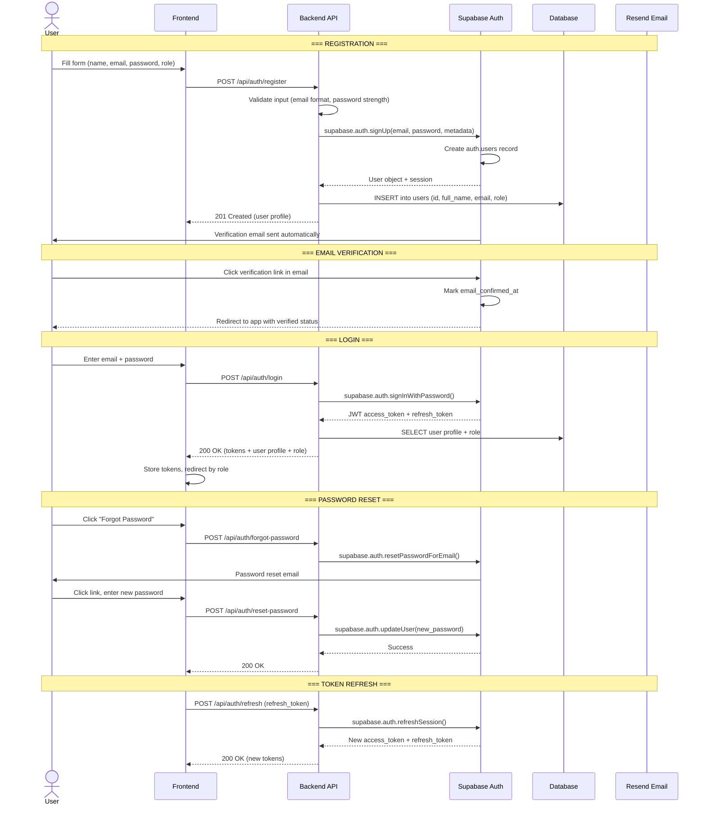
```mermaid
sequenceDiagram
    actor U as User
    participant F as Frontend
    participant B as Backend API
    participant SA as Supabase Auth
    participant DB as Database
    participant R as Resend Email

    Note over U,R: === REGISTRATION ===
    U->>F: Fill form (name, email, password, role)
    F->>B: POST /api/auth/register
    B->>B: Validate input (email format, password strength)
    B->>SA: supabase.auth.signUp(email, password, metadata)
    SA->>SA: Create auth.users record
    SA-->>B: User object + session
    B->>DB: INSERT into users (id, full_name, email, role)
    B-->>F: 201 Created (user profile)
    SA->>U: Verification email sent automatically

    Note over U,R: === EMAIL VERIFICATION ===
    U->>SA: Click verification link in email
    SA->>SA: Mark email_confirmed_at
    SA-->>U: Redirect to app with verified status

    Note over U,R: === LOGIN ===
    U->>F: Enter email + password
    F->>B: POST /api/auth/login
    B->>SA: supabase.auth.signInWithPassword()
    SA-->>B: JWT access_token + refresh_token
    B->>DB: SELECT user profile + role
    B-->>F: 200 OK (tokens + user profile + role)
    F->>F: Store tokens, redirect by role

    Note over U,R: === PASSWORD RESET ===
    U->>F: Click "Forgot Password"
    F->>B: POST /api/auth/forgot-password
    B->>SA: supabase.auth.resetPasswordForEmail()
    SA->>U: Password reset email
    U->>F: Click link, enter new password
    F->>B: POST /api/auth/reset-password
    B->>SA: supabase.auth.updateUser(new_password)
    SA-->>B: Success
    B-->>F: 200 OK

    Note over U,R: === TOKEN REFRESH ===
    F->>B: POST /api/auth/refresh (refresh_token)
    B->>SA: supabase.auth.refreshSession()
    SA-->>B: New access_token + refresh_token
    B-->>F: 200 OK (new tokens)
```

### Key Design Decisions
- **Role stored in both Supabase metadata AND users table** — metadata for fast JWT claims, DB for relational queries
- **Email verification required** before accessing protected routes
- **Tokens stored client-side** in httpOnly cookies (access) and localStorage (refresh)

---

## 3.2 Ghana Card Verification Flow

Artisans verify their identity by uploading a Ghana Card image and selfie. Groq Vision API extracts card details automatically, reducing manual data entry. An admin reviews and approves/rejects.

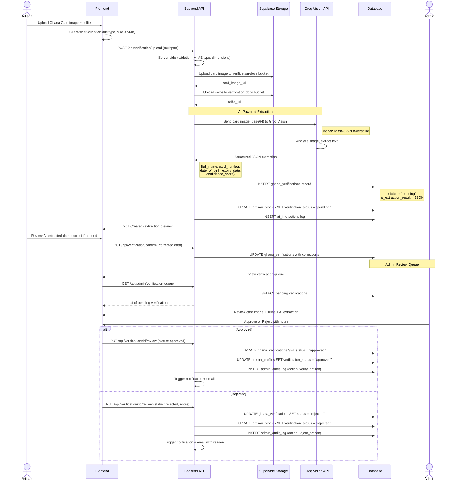
```mermaid
sequenceDiagram
    actor A as Artisan
    participant F as Frontend
    participant B as Backend API
    participant S as Supabase Storage
    participant G as Groq Vision API
    participant DB as Database
    actor AD as Admin

    A->>F: Upload Ghana Card image + selfie
    F->>F: Client-side validation (file type, size < 5MB)
    F->>B: POST /api/verification/upload (multipart)
    B->>B: Server-side validation (MIME type, dimensions)
    B->>S: Upload card image to verification-docs bucket
    S-->>B: card_image_url
    B->>S: Upload selfie to verification-docs bucket
    S-->>B: selfie_url

    Note over B,G: AI-Powered Extraction
    B->>G: Send card image (base64) to Groq Vision
    Note right of G: Model: llama-3.3-70b-versatile
    G->>G: Analyze image, extract text
    G-->>B: Structured JSON extraction
    Note right of B: {full_name, card_number,<br/>date_of_birth, expiry_date,<br/>confidence_score}

    B->>DB: INSERT ghana_verifications record
    Note right of DB: status = "pending"<br/>ai_extraction_result = JSON
    B->>DB: UPDATE artisan_profiles SET verification_status = "pending"
    B->>DB: INSERT ai_interactions log
    B-->>F: 201 Created (extraction preview)

    A->>F: Review AI-extracted data, correct if needed
    F->>B: PUT /api/verification/confirm (corrected data)
    B->>DB: UPDATE ghana_verifications with corrections

    Note over AD,DB: Admin Review Queue
    AD->>F: View verification queue
    F->>B: GET /api/admin/verification-queue
    B->>DB: SELECT pending verifications
    B-->>F: List of pending verifications

    AD->>F: Review card image + selfie + AI extraction
    AD->>F: Approve or Reject with notes

    alt Approved
        F->>B: PUT /api/verification/:id/review (status: approved)
        B->>DB: UPDATE ghana_verifications SET status = "approved"
        B->>DB: UPDATE artisan_profiles SET verification_status = "approved"
        B->>DB: INSERT admin_audit_log (action: verify_artisan)
        B->>B: Trigger notification + email
    else Rejected
        F->>B: PUT /api/verification/:id/review (status: rejected, notes)
        B->>DB: UPDATE ghana_verifications SET status = "rejected"
        B->>DB: UPDATE artisan_profiles SET verification_status = "rejected"
        B->>DB: INSERT admin_audit_log (action: reject_artisan)
        B->>B: Trigger notification + email with reason
    end
```

### Verification Status State Machine

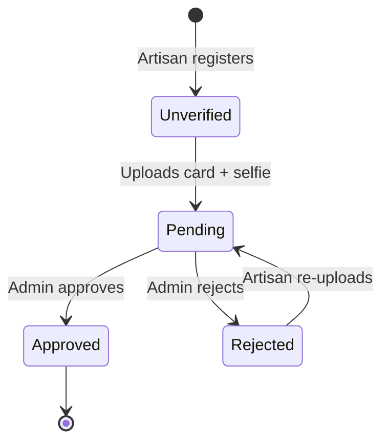
```mermaid
stateDiagram-v2
    [*] --> Unverified: Artisan registers
    Unverified --> Pending: Uploads card + selfie
    Pending --> Approved: Admin approves
    Pending --> Rejected: Admin rejects
    Rejected --> Pending: Artisan re-uploads
    Approved --> [*]
```

---

## 3.3 AI-Powered Search Flow

The core intelligence pipeline. A customer's natural language query is processed through Groq LLM for intent extraction, Groq Embeddings for vectorization, pgvector for similarity search, and Mapbox for distance calculation. Results are ranked using a composite formula.

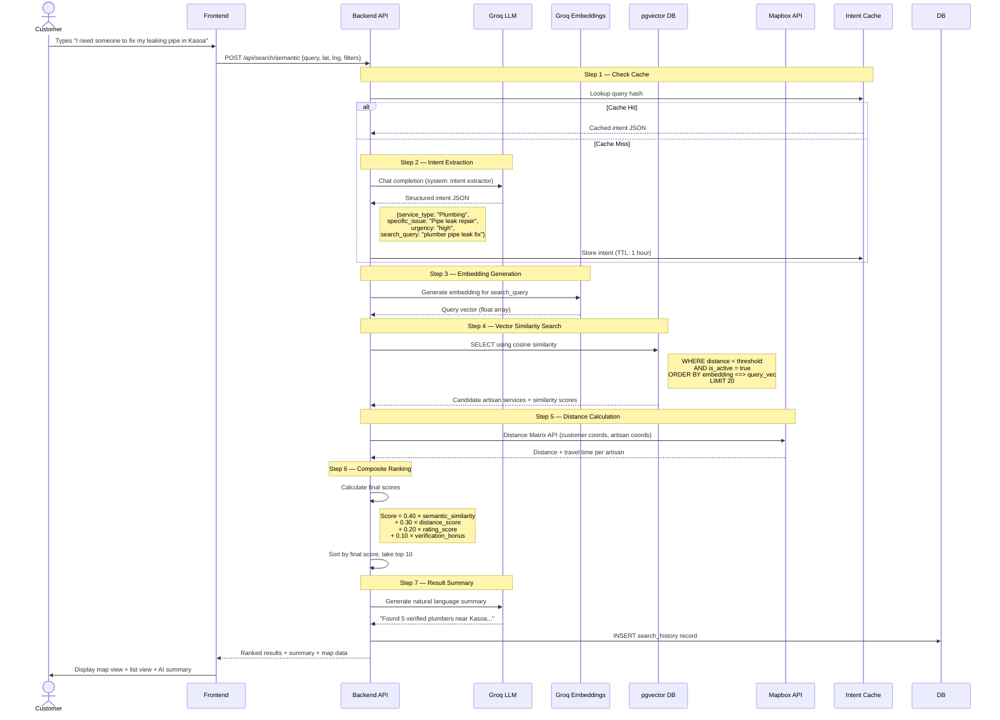
```mermaid
sequenceDiagram
    actor C as Customer
    participant F as Frontend
    participant B as Backend API
    participant GL as Groq LLM
    participant GE as Groq Embeddings
    participant PG as pgvector DB
    participant MB as Mapbox API
    participant Cache as Intent Cache

    C->>F: Types "I need someone to fix my leaking pipe in Kasoa"
    F->>B: POST /api/search/semantic {query, lat, lng, filters}

    Note over B,Cache: Step 1 — Check Cache
    B->>Cache: Lookup query hash
    alt Cache Hit
        Cache-->>B: Cached intent JSON
    else Cache Miss
        Note over B,GL: Step 2 — Intent Extraction
        B->>GL: Chat completion (system: intent extractor)
        GL-->>B: Structured intent JSON
        Note right of B: {service_type: "Plumbing",<br/>specific_issue: "Pipe leak repair",<br/>urgency: "high",<br/>search_query: "plumber pipe leak fix"}
        B->>Cache: Store intent (TTL: 1 hour)
    end

    Note over B,GE: Step 3 — Embedding Generation
    B->>GE: Generate embedding for search_query
    GE-->>B: Query vector (float array)

    Note over B,PG: Step 4 — Vector Similarity Search
    B->>PG: SELECT using cosine similarity
    Note right of PG: WHERE distance < threshold<br/>AND is_active = true<br/>ORDER BY embedding <=> query_vec<br/>LIMIT 20
    PG-->>B: Candidate artisan services + similarity scores

    Note over B,MB: Step 5 — Distance Calculation
    B->>MB: Distance Matrix API (customer coords, artisan coords)
    MB-->>B: Distance + travel time per artisan

    Note over B,B: Step 6 — Composite Ranking
    B->>B: Calculate final scores
    Note right of B: Score = 0.40 × semantic_similarity<br/>+ 0.30 × distance_score<br/>+ 0.20 × rating_score<br/>+ 0.10 × verification_bonus

    B->>B: Sort by final score, take top 10

    Note over B,GL: Step 7 — Result Summary
    B->>GL: Generate natural language summary
    GL-->>B: "Found 5 verified plumbers near Kasoa..."

    B->>DB: INSERT search_history record
    B-->>F: Ranked results + summary + map data
    F->>C: Display map view + list view + AI summary
```

### Fallback Strategy

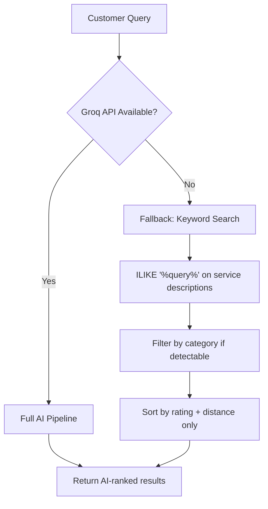
```mermaid
flowchart TD
    A["Customer Query"] --> B{"Groq API Available?"}
    B -->|Yes| C["Full AI Pipeline"]
    B -->|No| D["Fallback: Keyword Search"]
    D --> E["ILIKE '%query%' on service descriptions"]
    E --> F["Filter by category if detectable"]
    F --> G["Sort by rating + distance only"]
    C --> H["Return AI-ranked results"]
    G --> H
```

---

## 3.4 Service Request Lifecycle

The complete lifecycle of a service request from creation through quoting, acceptance, completion, review, and payment release.

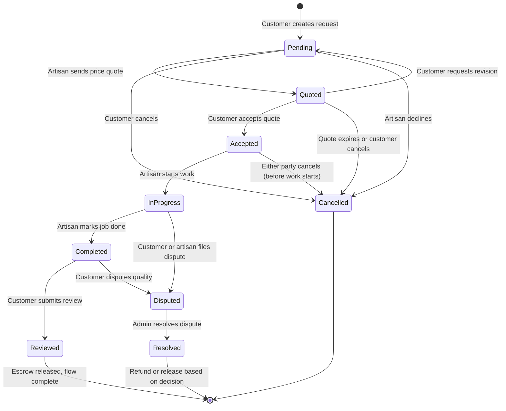
```mermaid
stateDiagram-v2
    [*] --> Pending: Customer creates request

    Pending --> Quoted: Artisan sends price quote
    Pending --> Cancelled: Customer cancels
    Pending --> Cancelled: Artisan declines

    Quoted --> Accepted: Customer accepts quote
    Quoted --> Pending: Customer requests revision
    Quoted --> Cancelled: Quote expires or customer cancels

    Accepted --> InProgress: Artisan starts work
    Accepted --> Cancelled: Either party cancels (before work starts)

    InProgress --> Completed: Artisan marks job done
    InProgress --> Disputed: Customer or artisan files dispute

    Completed --> Reviewed: Customer submits review
    Completed --> Disputed: Customer disputes quality

    Reviewed --> [*]: Escrow released, flow complete

    Disputed --> Resolved: Admin resolves dispute
    Resolved --> [*]: Refund or release based on decision

    Cancelled --> [*]
```

### Status Transition Rules

| From | To | Who Can Trigger | Conditions |
|------|-----|----------------|------------|
| Pending | Quoted | Artisan | Must submit valid quote |
| Pending | Cancelled | Customer or Artisan | No restrictions |
| Quoted | Accepted | Customer | Quote not expired |
| Quoted | Pending | Customer | Requests quote revision |
| Accepted | InProgress | Artisan | Escrow must be held |
| InProgress | Completed | Artisan | Work marked done |
| InProgress | Disputed | Either party | Must provide reason |
| Completed | Reviewed | Customer | One review per request |
| Completed | Disputed | Customer | Within 72 hours of completion |
| Disputed | Resolved | Admin | Must log decision in audit |

---

## 3.5 Quoting & Price Negotiation Flow

Artisans review service requests and send price quotes. Customers can accept, reject, or request a revision. Accepted quotes determine the escrow amount.

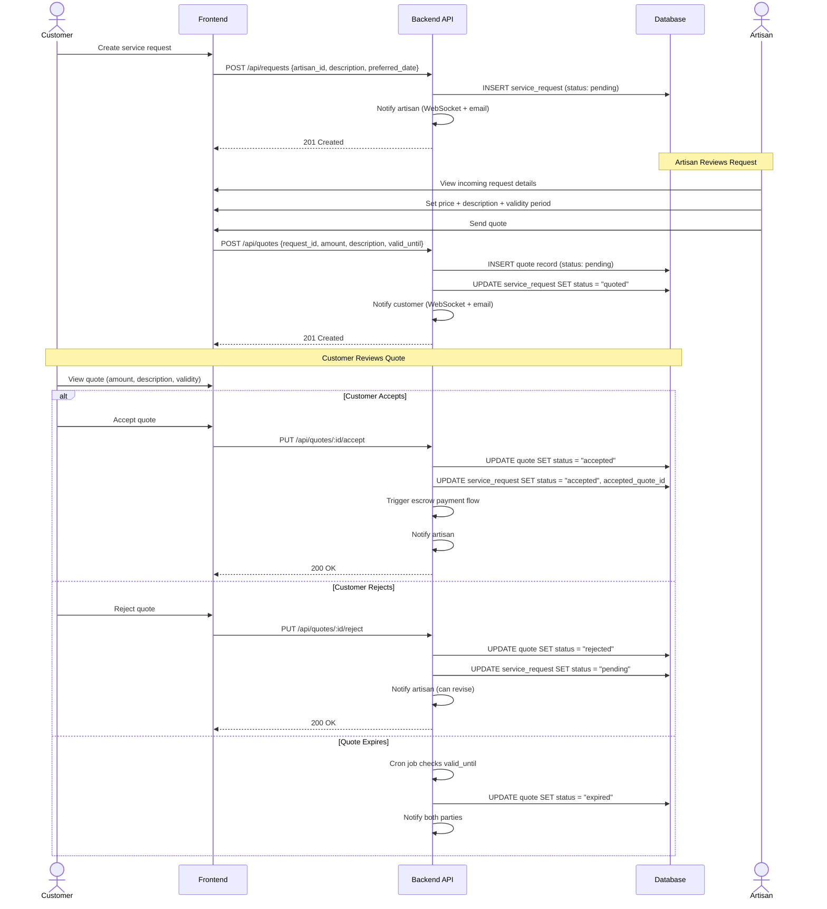
```mermaid
sequenceDiagram
    actor C as Customer
    participant F as Frontend
    participant B as Backend API
    participant DB as Database
    actor A as Artisan

    C->>F: Create service request
    F->>B: POST /api/requests {artisan_id, description, preferred_date}
    B->>DB: INSERT service_request (status: pending)
    B->>B: Notify artisan (WebSocket + email)
    B-->>F: 201 Created

    Note over A,DB: Artisan Reviews Request
    A->>F: View incoming request details
    A->>F: Set price + description + validity period

    A->>F: Send quote
    F->>B: POST /api/quotes {request_id, amount, description, valid_until}
    B->>DB: INSERT quote record (status: pending)
    B->>DB: UPDATE service_request SET status = "quoted"
    B->>B: Notify customer (WebSocket + email)
    B-->>F: 201 Created

    Note over C,DB: Customer Reviews Quote
    C->>F: View quote (amount, description, validity)

    alt Customer Accepts
        C->>F: Accept quote
        F->>B: PUT /api/quotes/:id/accept
        B->>DB: UPDATE quote SET status = "accepted"
        B->>DB: UPDATE service_request SET status = "accepted", accepted_quote_id
        B->>B: Trigger escrow payment flow
        B->>B: Notify artisan
        B-->>F: 200 OK
    else Customer Rejects
        C->>F: Reject quote
        F->>B: PUT /api/quotes/:id/reject
        B->>DB: UPDATE quote SET status = "rejected"
        B->>DB: UPDATE service_request SET status = "pending"
        B->>B: Notify artisan (can revise)
        B-->>F: 200 OK
    else Quote Expires
        B->>B: Cron job checks valid_until
        B->>DB: UPDATE quote SET status = "expired"
        B->>B: Notify both parties
    end
```

### Quote Status State Machine

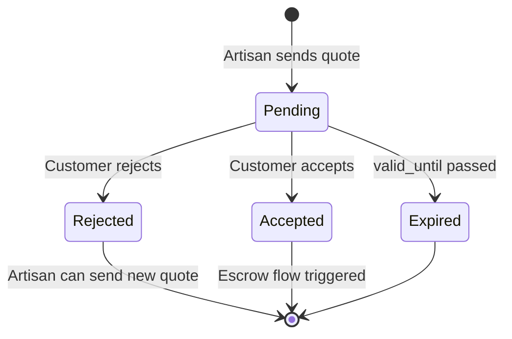
```mermaid
stateDiagram-v2
    [*] --> Pending: Artisan sends quote
    Pending --> Accepted: Customer accepts
    Pending --> Rejected: Customer rejects
    Pending --> Expired: valid_until passed
    Rejected --> [*]: Artisan can send new quote
    Accepted --> [*]: Escrow flow triggered
    Expired --> [*]
```

---

## 3.6 Escrow Payment Flow

Simulated escrow system. When a quote is accepted, the customer "pays" the quoted amount into escrow. Funds are released to the artisan upon job completion confirmation, or refunded during dispute resolution.

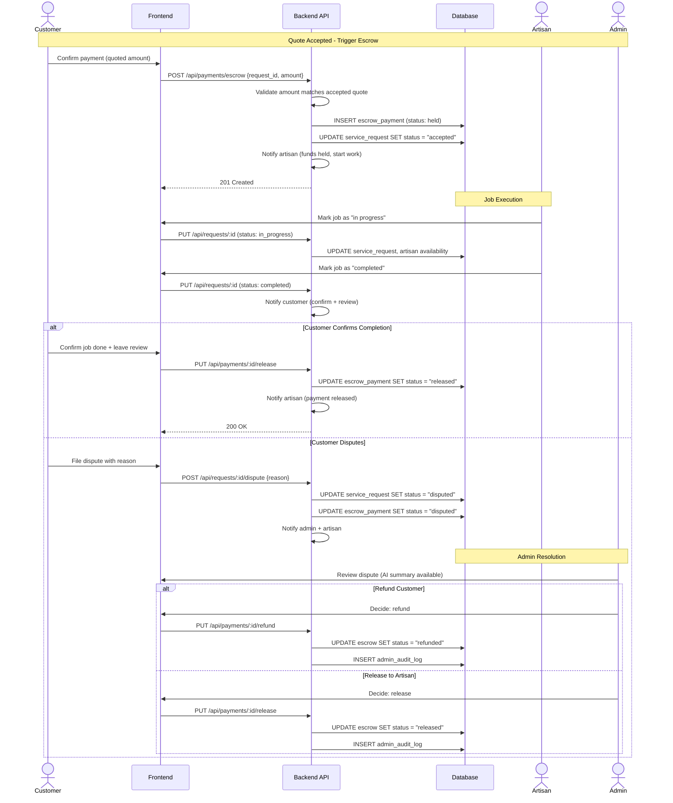
```mermaid
sequenceDiagram
    actor C as Customer
    participant F as Frontend
    participant B as Backend API
    participant DB as Database
    actor A as Artisan
    actor AD as Admin

    Note over C,AD: Quote Accepted - Trigger Escrow
    C->>F: Confirm payment (quoted amount)
    F->>B: POST /api/payments/escrow {request_id, amount}
    B->>B: Validate amount matches accepted quote
    B->>DB: INSERT escrow_payment (status: held)
    B->>DB: UPDATE service_request SET status = "accepted"
    B->>B: Notify artisan (funds held, start work)
    B-->>F: 201 Created

    Note over A,DB: Job Execution
    A->>F: Mark job as "in progress"
    F->>B: PUT /api/requests/:id (status: in_progress)
    B->>DB: UPDATE service_request, artisan availability

    A->>F: Mark job as "completed"
    F->>B: PUT /api/requests/:id (status: completed)
    B->>B: Notify customer (confirm + review)

    alt Customer Confirms Completion
        C->>F: Confirm job done + leave review
        F->>B: PUT /api/payments/:id/release
        B->>DB: UPDATE escrow_payment SET status = "released"
        B->>B: Notify artisan (payment released)
        B-->>F: 200 OK
    else Customer Disputes
        C->>F: File dispute with reason
        F->>B: POST /api/requests/:id/dispute {reason}
        B->>DB: UPDATE service_request SET status = "disputed"
        B->>DB: UPDATE escrow_payment SET status = "disputed"
        B->>B: Notify admin + artisan

        Note over AD,DB: Admin Resolution
        AD->>F: Review dispute (AI summary available)
        alt Refund Customer
            AD->>F: Decide: refund
            F->>B: PUT /api/payments/:id/refund
            B->>DB: UPDATE escrow SET status = "refunded"
            B->>DB: INSERT admin_audit_log
        else Release to Artisan
            AD->>F: Decide: release
            F->>B: PUT /api/payments/:id/release
            B->>DB: UPDATE escrow SET status = "released"
            B->>DB: INSERT admin_audit_log
        end
    end
```

### Escrow Status State Machine

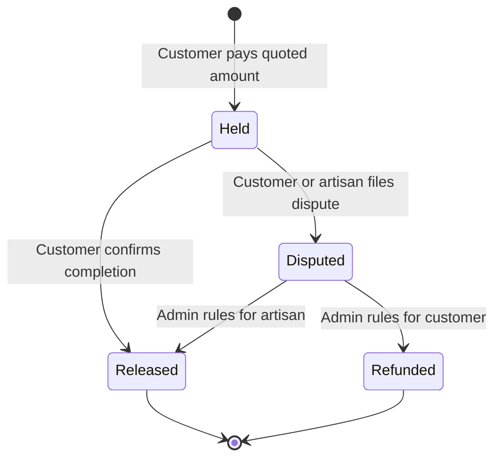
```mermaid
stateDiagram-v2
    [*] --> Held: Customer pays quoted amount
    Held --> Released: Customer confirms completion
    Held --> Disputed: Customer or artisan files dispute
    Disputed --> Released: Admin rules for artisan
    Disputed --> Refunded: Admin rules for customer
    Released --> [*]
    Refunded --> [*]
```

---

## 3.7 Messaging Flow (WebSocket)

Real-time chat between customers and artisans using Socket.io. Supports typing indicators, read receipts, and online presence tracking.

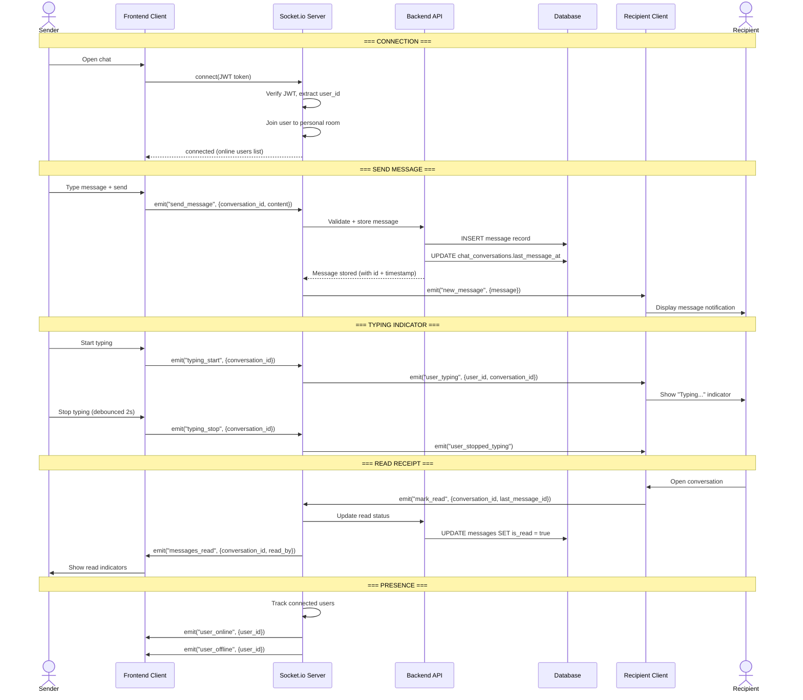
```mermaid
sequenceDiagram
    actor S as Sender
    participant FC as Frontend Client
    participant SI as Socket.io Server
    participant B as Backend API
    participant DB as Database
    participant FR as Recipient Client
    actor R as Recipient

    Note over S,R: === CONNECTION ===
    S->>FC: Open chat
    FC->>SI: connect(JWT token)
    SI->>SI: Verify JWT, extract user_id
    SI->>SI: Join user to personal room
    SI-->>FC: connected (online users list)

    Note over S,R: === SEND MESSAGE ===
    S->>FC: Type message + send
    FC->>SI: emit("send_message", {conversation_id, content})
    SI->>B: Validate + store message
    B->>DB: INSERT message record
    B->>DB: UPDATE chat_conversations.last_message_at
    B-->>SI: Message stored (with id + timestamp)
    SI->>FR: emit("new_message", {message})
    FR->>R: Display message notification

    Note over S,R: === TYPING INDICATOR ===
    S->>FC: Start typing
    FC->>SI: emit("typing_start", {conversation_id})
    SI->>FR: emit("user_typing", {user_id, conversation_id})
    FR->>R: Show "Typing..." indicator

    S->>FC: Stop typing (debounced 2s)
    FC->>SI: emit("typing_stop", {conversation_id})
    SI->>FR: emit("user_stopped_typing")

    Note over S,R: === READ RECEIPT ===
    R->>FR: Open conversation
    FR->>SI: emit("mark_read", {conversation_id, last_message_id})
    SI->>B: Update read status
    B->>DB: UPDATE messages SET is_read = true
    SI->>FC: emit("messages_read", {conversation_id, read_by})
    FC->>S: Show read indicators

    Note over S,R: === PRESENCE ===
    SI->>SI: Track connected users
    SI->>FC: emit("user_online", {user_id})
    SI->>FC: emit("user_offline", {user_id})
```

---

## 3.8 Notification Flow

Dual-channel notifications: in-app (stored in DB + pushed via WebSocket) and email (via Resend for important events).

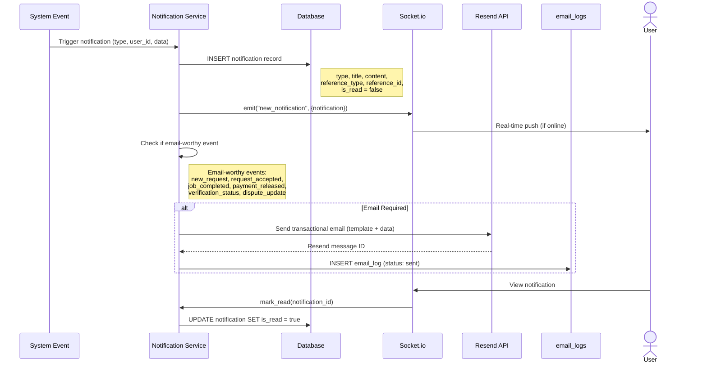
```mermaid
sequenceDiagram
    participant EV as System Event
    participant NS as Notification Service
    participant DB as Database
    participant SI as Socket.io
    participant RS as Resend API
    participant EL as email_logs
    actor U as User

    EV->>NS: Trigger notification (type, user_id, data)
    NS->>DB: INSERT notification record
    Note right of DB: type, title, content,<br/>reference_type, reference_id,<br/>is_read = false

    NS->>SI: emit("new_notification", {notification})
    SI->>U: Real-time push (if online)

    NS->>NS: Check if email-worthy event
    Note right of NS: Email-worthy events:<br/>new_request, request_accepted,<br/>job_completed, payment_released,<br/>verification_status, dispute_update

    alt Email Required
        NS->>RS: Send transactional email (template + data)
        RS-->>NS: Resend message ID
        NS->>EL: INSERT email_log (status: sent)
    end

    U->>SI: View notification
    SI->>NS: mark_read(notification_id)
    NS->>DB: UPDATE notification SET is_read = true
```

### Notification Types

| Type | Trigger | Email? | Template |
|------|---------|--------|----------|
| `new_request` | Customer creates request | ✅ | request-new |
| `request_accepted` | Artisan accepts via quote | ✅ | request-accepted |
| `quote_received` | Artisan sends quote | ✅ | quote-received |
| `job_completed` | Artisan marks done | ✅ | job-completed |
| `payment_released` | Escrow released | ✅ | payment-released |
| `verification_update` | Admin approves/rejects | ✅ | verification-status |
| `dispute_update` | Dispute status changes | ✅ | dispute-update |
| `new_message` | Chat message received | ❌ | — |
| `new_review` | Customer leaves review | ❌ | — |
| `report_resolved` | Admin resolves report | ❌ | — |
| `role_changed` | Superadmin promotes/demotes | ✅ | role-change |

---

## 3.9 AI-Powered Dispute Resolution Flow

When a dispute is filed, Groq LLM analyzes the full context (request details, chat history, payment status) and generates a summary with a recommended resolution for the admin.

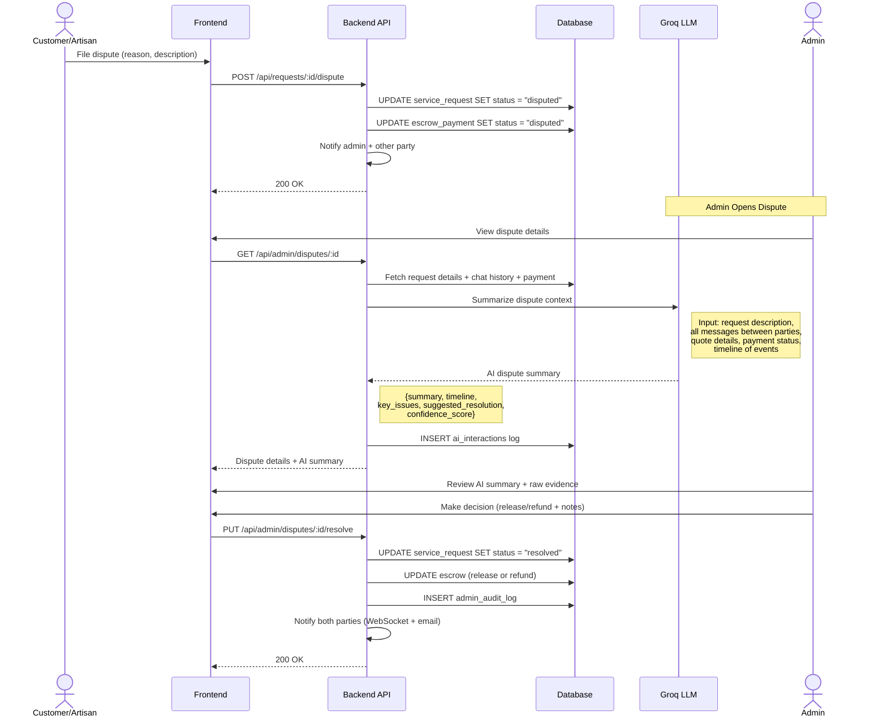
```mermaid
sequenceDiagram
    actor U as Customer/Artisan
    participant F as Frontend
    participant B as Backend API
    participant DB as Database
    participant GL as Groq LLM
    actor AD as Admin

    U->>F: File dispute (reason, description)
    F->>B: POST /api/requests/:id/dispute
    B->>DB: UPDATE service_request SET status = "disputed"
    B->>DB: UPDATE escrow_payment SET status = "disputed"
    B->>B: Notify admin + other party
    B-->>F: 200 OK

    Note over AD,GL: Admin Opens Dispute
    AD->>F: View dispute details
    F->>B: GET /api/admin/disputes/:id

    B->>DB: Fetch request details + chat history + payment
    B->>GL: Summarize dispute context
    Note right of GL: Input: request description,<br/>all messages between parties,<br/>quote details, payment status,<br/>timeline of events
    GL-->>B: AI dispute summary
    Note right of B: {summary, timeline,<br/>key_issues, suggested_resolution,<br/>confidence_score}

    B->>DB: INSERT ai_interactions log
    B-->>F: Dispute details + AI summary

    AD->>F: Review AI summary + raw evidence
    AD->>F: Make decision (release/refund + notes)
    F->>B: PUT /api/admin/disputes/:id/resolve
    B->>DB: UPDATE service_request SET status = "resolved"
    B->>DB: UPDATE escrow (release or refund)
    B->>DB: INSERT admin_audit_log
    B->>B: Notify both parties (WebSocket + email)
    B-->>F: 200 OK
```

---

## 3.10 Artisan Profile Enhancement Flow

Groq LLM generates a professional bio for artisans based on their basic info. Service descriptions are embedded into vectors for semantic search.

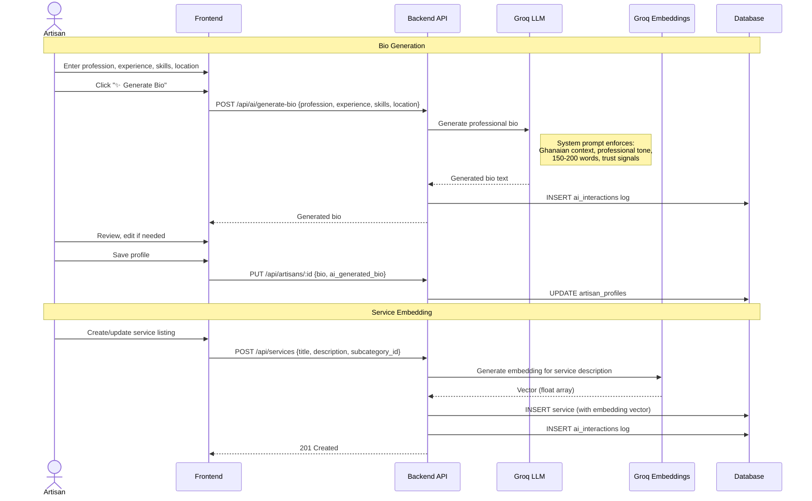
```mermaid
sequenceDiagram
    actor A as Artisan
    participant F as Frontend
    participant B as Backend API
    participant GL as Groq LLM
    participant GE as Groq Embeddings
    participant DB as Database

    Note over A,DB: Bio Generation
    A->>F: Enter profession, experience, skills, location
    A->>F: Click "✨ Generate Bio"
    F->>B: POST /api/ai/generate-bio {profession, experience, skills, location}
    B->>GL: Generate professional bio
    Note right of GL: System prompt enforces:<br/>Ghanaian context, professional tone,<br/>150-200 words, trust signals
    GL-->>B: Generated bio text
    B->>DB: INSERT ai_interactions log
    B-->>F: Generated bio
    A->>F: Review, edit if needed
    A->>F: Save profile
    F->>B: PUT /api/artisans/:id {bio, ai_generated_bio}
    B->>DB: UPDATE artisan_profiles

    Note over A,DB: Service Embedding
    A->>F: Create/update service listing
    F->>B: POST /api/services {title, description, subcategory_id}
    B->>GE: Generate embedding for service description
    GE-->>B: Vector (float array)
    B->>DB: INSERT service (with embedding vector)
    B->>DB: INSERT ai_interactions log
    B-->>F: 201 Created
```

---

## 3.11 Artisan Availability Flow

Artisans manage their weekly schedule, mark days off, and set their availability status. Status auto-updates during active jobs.

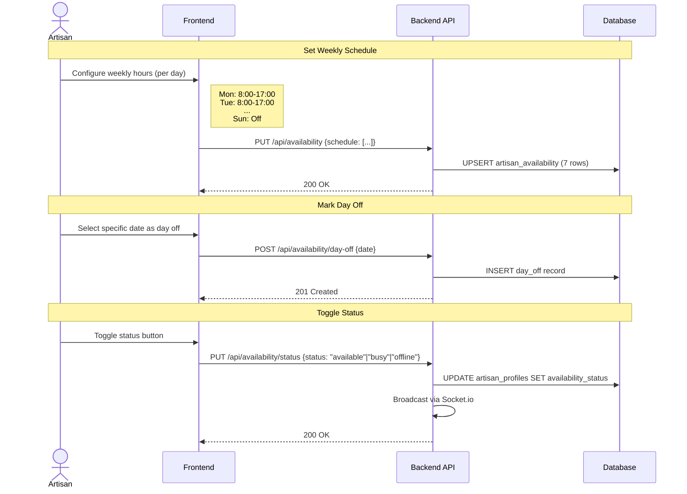
```mermaid
sequenceDiagram
    actor A as Artisan
    participant F as Frontend
    participant B as Backend API
    participant DB as Database

    Note over A,DB: Set Weekly Schedule
    A->>F: Configure weekly hours (per day)
    Note right of F: Mon: 8:00-17:00<br/>Tue: 8:00-17:00<br/>...<br/>Sun: Off
    F->>B: PUT /api/availability {schedule: [...]}
    B->>DB: UPSERT artisan_availability (7 rows)
    B-->>F: 200 OK

    Note over A,DB: Mark Day Off
    A->>F: Select specific date as day off
    F->>B: POST /api/availability/day-off {date}
    B->>DB: INSERT day_off record
    B-->>F: 201 Created

    Note over A,DB: Toggle Status
    A->>F: Toggle status button
    F->>B: PUT /api/availability/status {status: "available"|"busy"|"offline"}
    B->>DB: UPDATE artisan_profiles SET availability_status
    B->>B: Broadcast via Socket.io
    B-->>F: 200 OK
```

### Availability Status State Machine

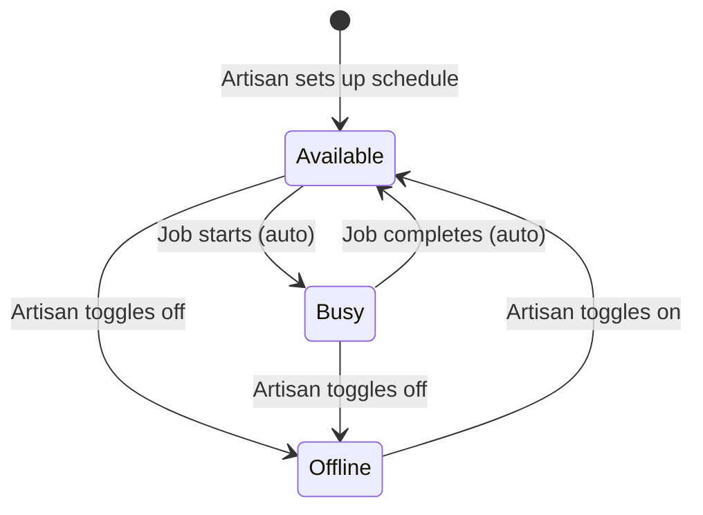
```mermaid
stateDiagram-v2
    [*] --> Available: Artisan sets up schedule
    Available --> Busy: Job starts (auto)
    Available --> Offline: Artisan toggles off
    Busy --> Available: Job completes (auto)
    Busy --> Offline: Artisan toggles off
    Offline --> Available: Artisan toggles on
```

### Status Rules

| Rule | Behavior |
|------|----------|
| **Auto-busy** | When a service request moves to "in_progress", artisan status auto-sets to "busy" |
| **Auto-available** | When job completes, status reverts to "available" (if within working hours) |
| **Schedule check** | Search results filter by current availability (is today a working day? is it within hours?) |
| **Day-off override** | Specific day-off dates override the weekly schedule |

---

## 3.12 Report & Moderation Flow

Users can report other users or reviews for fraud, spam, or inappropriate content. Reports enter an admin moderation queue.

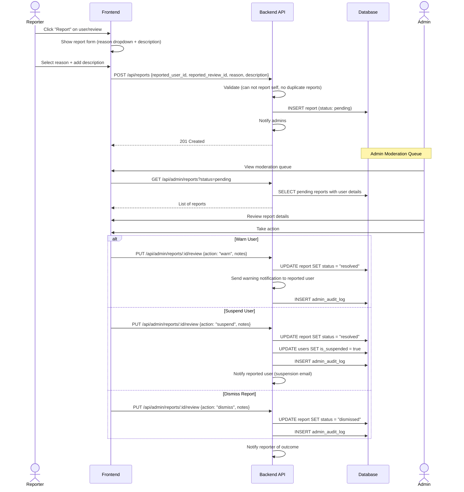
```mermaid
sequenceDiagram
    actor R as Reporter
    participant F as Frontend
    participant B as Backend API
    participant DB as Database
    actor AD as Admin

    R->>F: Click "Report" on user/review
    F->>F: Show report form (reason dropdown + description)
    R->>F: Select reason + add description
    F->>B: POST /api/reports {reported_user_id, reported_review_id, reason, description}
    B->>B: Validate (can not report self, no duplicate reports)
    B->>DB: INSERT report (status: pending)
    B->>B: Notify admins
    B-->>F: 201 Created

    Note over AD,DB: Admin Moderation Queue
    AD->>F: View moderation queue
    F->>B: GET /api/admin/reports?status=pending
    B->>DB: SELECT pending reports with user details
    B-->>F: List of reports

    AD->>F: Review report details
    AD->>F: Take action

    alt Warn User
        F->>B: PUT /api/admin/reports/:id/review {action: "warn", notes}
        B->>DB: UPDATE report SET status = "resolved"
        B->>B: Send warning notification to reported user
        B->>DB: INSERT admin_audit_log
    else Suspend User
        F->>B: PUT /api/admin/reports/:id/review {action: "suspend", notes}
        B->>DB: UPDATE report SET status = "resolved"
        B->>DB: UPDATE users SET is_suspended = true
        B->>DB: INSERT admin_audit_log
        B->>B: Notify reported user (suspension email)
    else Dismiss Report
        F->>B: PUT /api/admin/reports/:id/review {action: "dismiss", notes}
        B->>DB: UPDATE report SET status = "dismissed"
        B->>DB: INSERT admin_audit_log
    end

    B->>B: Notify reporter of outcome
```

### Report Status State Machine

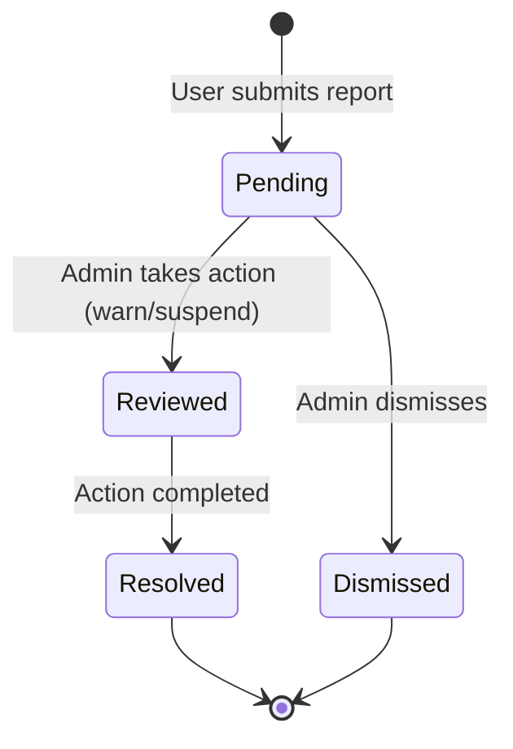
```mermaid
stateDiagram-v2
    [*] --> Pending: User submits report
    Pending --> Reviewed: Admin takes action (warn/suspend)
    Pending --> Dismissed: Admin dismisses
    Reviewed --> Resolved: Action completed
    Resolved --> [*]
    Dismissed --> [*]
```

---

## 3.13 Favorites & Sharing Flow

Customers can bookmark artisans for quick access and share artisan profiles via WhatsApp or a copy link.

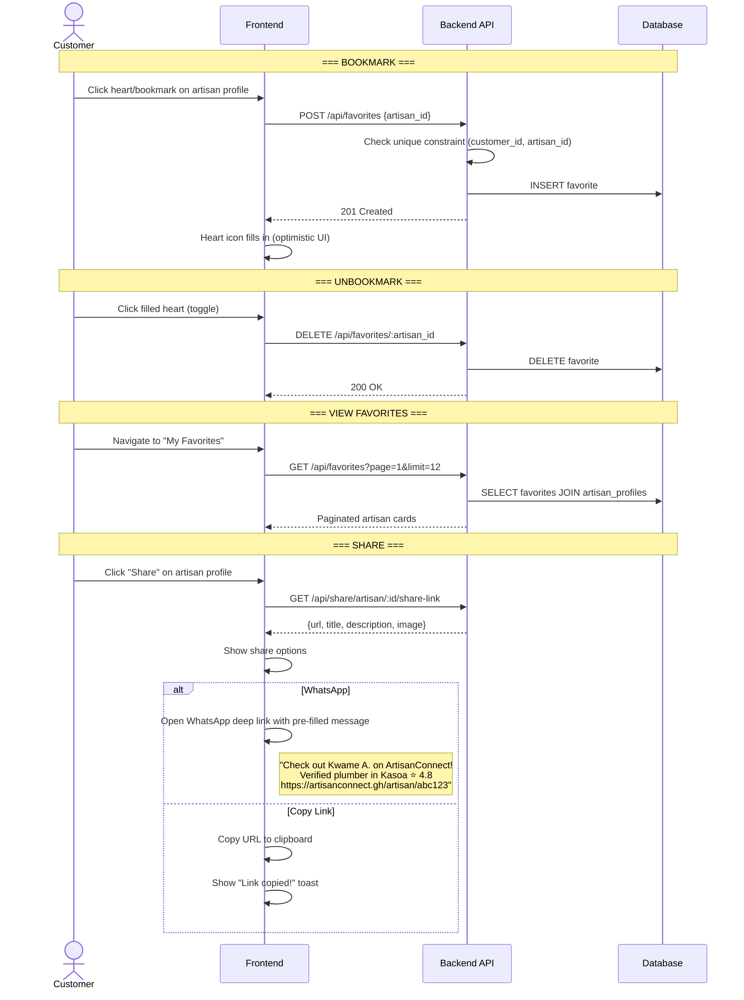
```mermaid
sequenceDiagram
    actor C as Customer
    participant F as Frontend
    participant B as Backend API
    participant DB as Database

    Note over C,DB: === BOOKMARK ===
    C->>F: Click heart/bookmark on artisan profile
    F->>B: POST /api/favorites {artisan_id}
    B->>B: Check unique constraint (customer_id, artisan_id)
    B->>DB: INSERT favorite
    B-->>F: 201 Created
    F->>F: Heart icon fills in (optimistic UI)

    Note over C,DB: === UNBOOKMARK ===
    C->>F: Click filled heart (toggle)
    F->>B: DELETE /api/favorites/:artisan_id
    B->>DB: DELETE favorite
    B-->>F: 200 OK

    Note over C,DB: === VIEW FAVORITES ===
    C->>F: Navigate to "My Favorites"
    F->>B: GET /api/favorites?page=1&limit=12
    B->>DB: SELECT favorites JOIN artisan_profiles
    B-->>F: Paginated artisan cards

    Note over C,DB: === SHARE ===
    C->>F: Click "Share" on artisan profile
    F->>B: GET /api/share/artisan/:id/share-link
    B-->>F: {url, title, description, image}
    F->>F: Show share options

    alt WhatsApp
        F->>F: Open WhatsApp deep link with pre-filled message
        Note right of F: "Check out Kwame A. on ArtisanConnect!<br/>Verified plumber in Kasoa ⭐ 4.8<br/>https://artisanconnect.gh/artisan/abc123"
    else Copy Link
        F->>F: Copy URL to clipboard
        F->>F: Show "Link copied!" toast
    end
```

---

## 3.14 Admin Role Management Flow

Superadmin (seeded at deployment) manages admin roles. Only the superadmin can promote users to admin or demote existing admins.

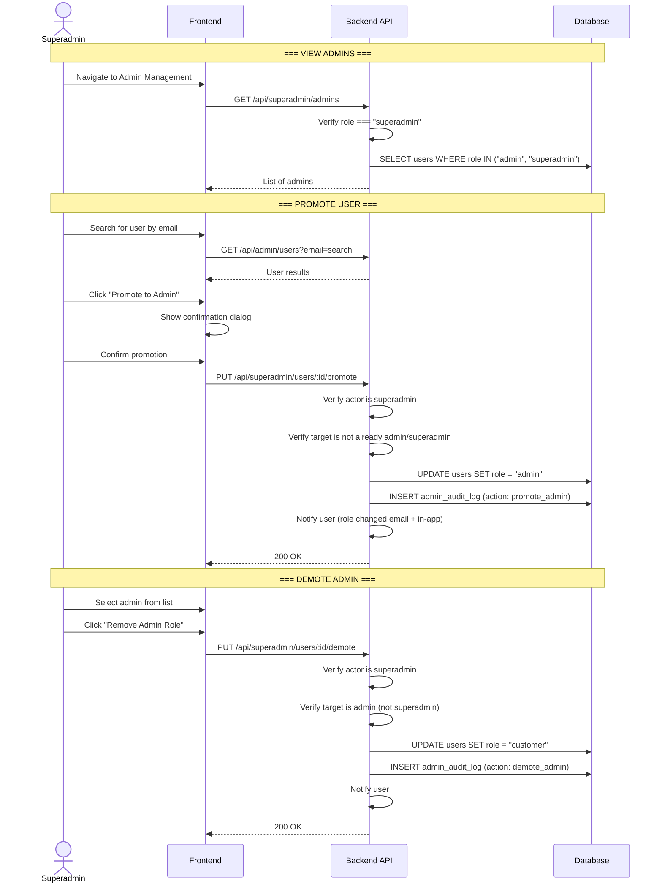
```mermaid
sequenceDiagram
    actor SA as Superadmin
    participant F as Frontend
    participant B as Backend API
    participant DB as Database

    Note over SA,DB: === VIEW ADMINS ===
    SA->>F: Navigate to Admin Management
    F->>B: GET /api/superadmin/admins
    B->>B: Verify role === "superadmin"
    B->>DB: SELECT users WHERE role IN ("admin", "superadmin")
    B-->>F: List of admins

    Note over SA,DB: === PROMOTE USER ===
    SA->>F: Search for user by email
    F->>B: GET /api/admin/users?email=search
    B-->>F: User results
    SA->>F: Click "Promote to Admin"
    F->>F: Show confirmation dialog
    SA->>F: Confirm promotion

    F->>B: PUT /api/superadmin/users/:id/promote
    B->>B: Verify actor is superadmin
    B->>B: Verify target is not already admin/superadmin
    B->>DB: UPDATE users SET role = "admin"
    B->>DB: INSERT admin_audit_log (action: promote_admin)
    B->>B: Notify user (role changed email + in-app)
    B-->>F: 200 OK

    Note over SA,DB: === DEMOTE ADMIN ===
    SA->>F: Select admin from list
    SA->>F: Click "Remove Admin Role"
    F->>B: PUT /api/superadmin/users/:id/demote
    B->>B: Verify actor is superadmin
    B->>B: Verify target is admin (not superadmin)
    B->>DB: UPDATE users SET role = "customer"
    B->>DB: INSERT admin_audit_log (action: demote_admin)
    B->>B: Notify user
    B-->>F: 200 OK
```

### RBAC Permission Matrix

| Action | Customer | Artisan | Admin | Superadmin |
|--------|----------|---------|-------|------------|
| Browse/search artisans | ✅ | ✅ | ✅ | ✅ |
| Create service request | ✅ | ❌ | ❌ | ❌ |
| Manage own services | ❌ | ✅ | ❌ | ❌ |
| Send price quotes | ❌ | ✅ | ❌ | ❌ |
| Verify artisans | ❌ | ❌ | ✅ | ✅ |
| Resolve disputes | ❌ | ❌ | ✅ | ✅ |
| Review reports | ❌ | ❌ | ✅ | ✅ |
| Suspend users | ❌ | ❌ | ✅ | ✅ |
| View analytics | ❌ | ❌ | ✅ | ✅ |
| View audit log | ❌ | ❌ | ✅ | ✅ |
| Manage categories | ❌ | ❌ | ✅ | ✅ |
| Promote/demote admins | ❌ | ❌ | ❌ | ✅ |
| System settings | ❌ | ❌ | ❌ | ✅ |

---

## 3.15 Onboarding Flow

Role-specific onboarding wizard that guides new users through essential setup steps. Progress is tracked until `onboarding_completed = true`.

```mermaid
flowchart TD
    A["User Registers"] --> B{"What role?"}

    B -->|Customer| C1["Step 1: Set Location"]
    C1 --> C2["Step 2: Browse Categories"]
    C2 --> C3["Step 3: Try First Search"]
    C3 --> C4["Mark onboarding_completed = true"]

    B -->|Artisan| D1["Step 1: Complete Profile"]
    D1 --> D2["Step 2: Add Services"]
    D2 --> D3["Step 3: Set Availability"]
    D3 --> D4["Step 4: Upload Ghana Card"]
    D4 --> D5["Mark onboarding_completed = true"]

    C4 --> E["Redirect to Dashboard"]
    D5 --> E

    style C1 fill:#4CAF50,color:#fff
    style C2 fill:#4CAF50,color:#fff
    style C3 fill:#4CAF50,color:#fff
    style D1 fill:#FF9800,color:#fff
    style D2 fill:#FF9800,color:#fff
    style D3 fill:#FF9800,color:#fff
    style D4 fill:#FF9800,color:#fff
```

### Onboarding Progress Tracking

| Role | Steps | Progress Calculation |
|------|-------|---------------------|
| Customer | 3 steps | 33% per step |
| Artisan | 4 steps | 25% per step |

- Users can skip steps but see persistent "Complete your profile" banner
- Dashboard shows progress bar until 100%
- Skipped steps are accessible from settings later

---

## 3.16 Email Notification Flow

Transactional emails sent via Resend API. Auth-related emails (verification, password reset) are handled by Supabase Auth separately.

```mermaid
sequenceDiagram
    participant EV as System Event
    participant ES as Email Service
    participant TP as Template Engine
    participant RS as Resend API
    participant DB as email_logs
    actor U as User

    EV->>ES: sendEmail(type, recipient, data)
    ES->>TP: Render template with data
    Note right of TP: Templates:<br/>request-new<br/>request-accepted<br/>job-completed<br/>payment-released<br/>verification-status<br/>dispute-update<br/>role-change
    TP-->>ES: Rendered HTML email

    ES->>RS: POST /emails (from, to, subject, html)
    RS-->>ES: {id: "resend_msg_id", status: "sent"}

    ES->>DB: INSERT email_log
    Note right of DB: user_id, template_type,<br/>resend_id, recipient_email,<br/>status: "sent"

    RS->>U: Email delivered to inbox
```

### Email Template Matrix

| Template | Subject Line | Trigger Event |
|----------|-------------|---------------|
| `request-new` | "New service request from [Customer]" | Service request created |
| `request-accepted` | "[Artisan] sent you a quote" | Quote submitted |
| `job-completed` | "Your job is complete — review & release payment" | Artisan marks completed |
| `payment-released` | "Payment of GHS [amount] has been released" | Escrow released |
| `verification-status` | "Your verification has been [approved/rejected]" | Admin reviews verification |
| `dispute-update` | "Update on dispute case #[id]" | Dispute status changes |
| `role-change` | "Your account role has been updated" | Superadmin promotes/demotes |

---

> **Next**: [Deliverable 4 — API Contract Specification](./04-api-contracts.md) defines request/response schemas for all endpoints.
