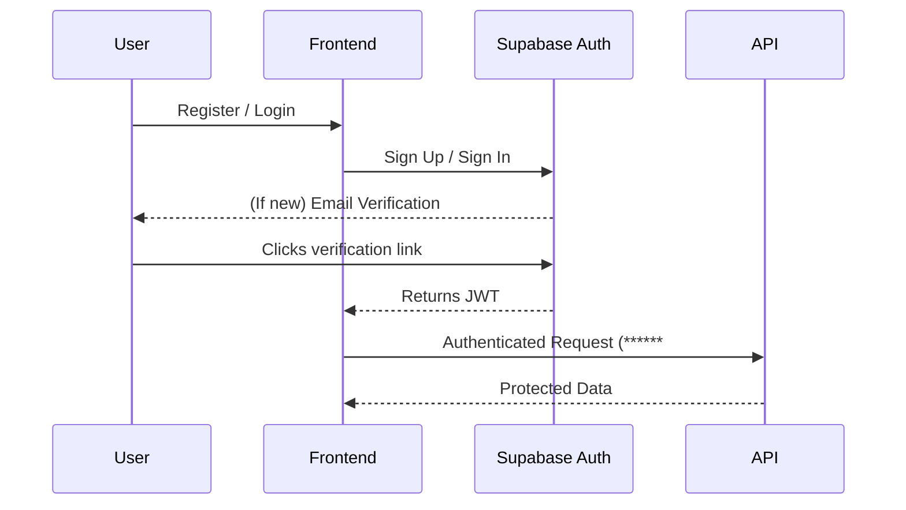
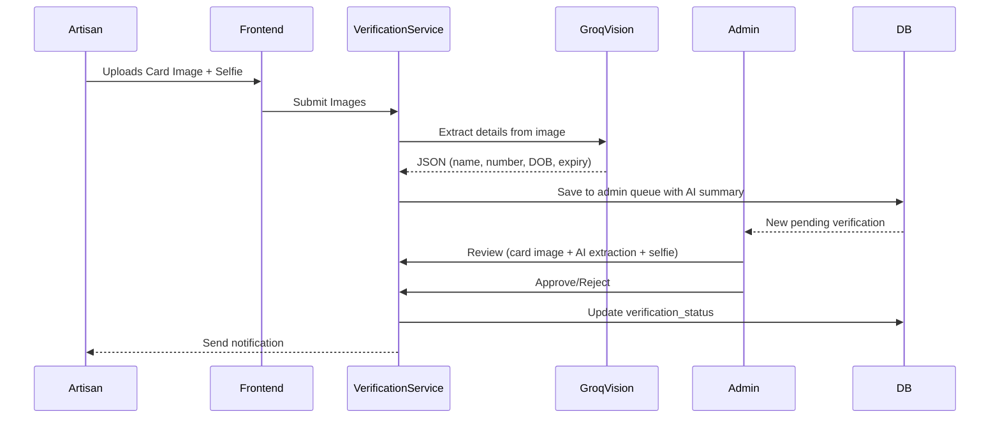
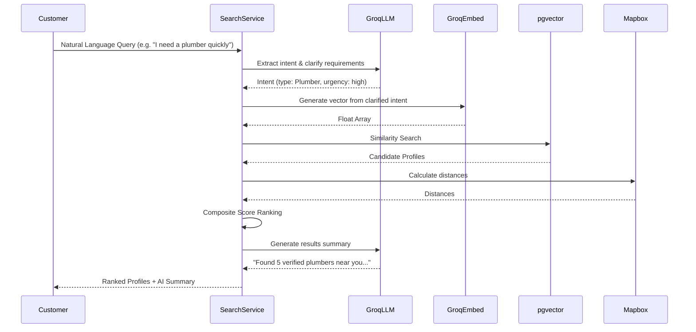
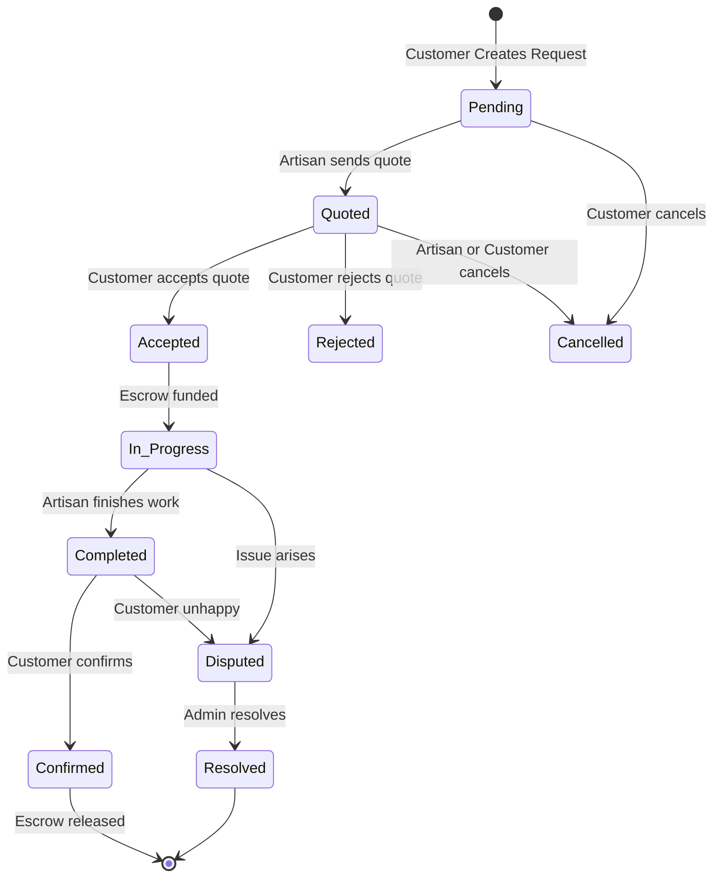
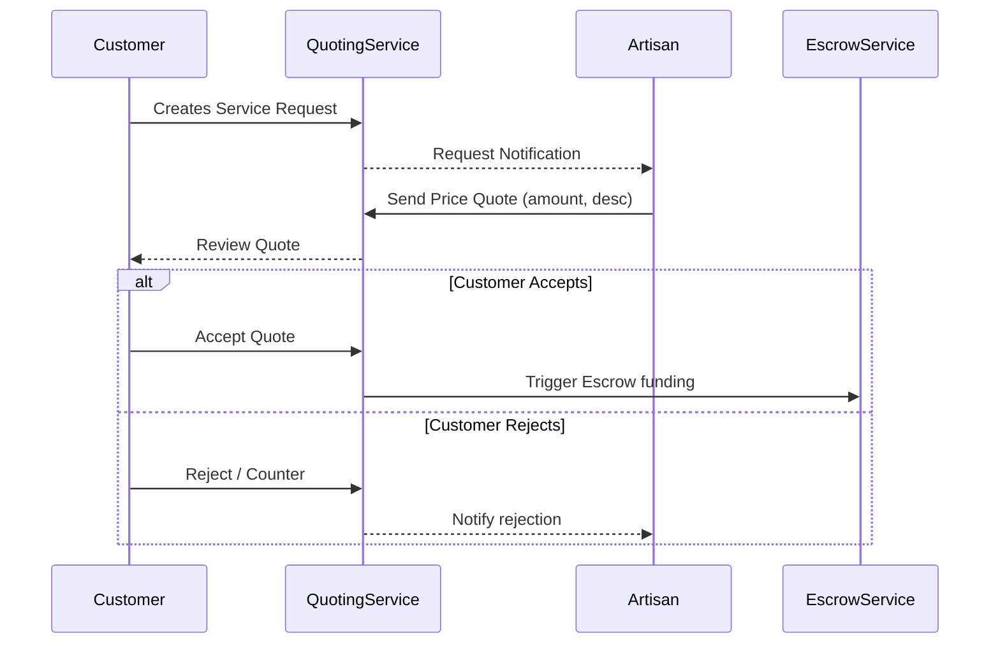
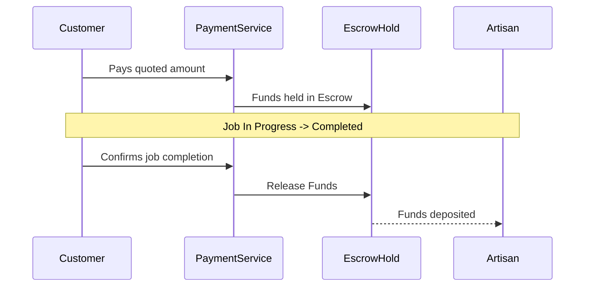
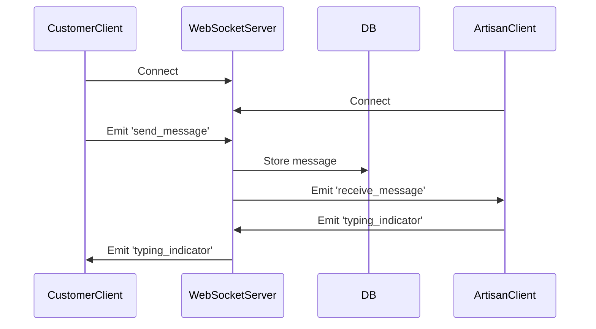

# Deliverable 3: Core Workflow Diagrams

## 3.1 Authentication Flow

## 3.2 Ghana Card Verification Flow (Groq Vision)

## 3.3 AI-Powered Search Flow (Groq Only)

## 3.4 Service Request Lifecycle

## 3.5 Quoting & Price Negotiation Flow

## 3.6 Escrow Payment Flow

## 3.7 Messaging Flow (WebSocket)

