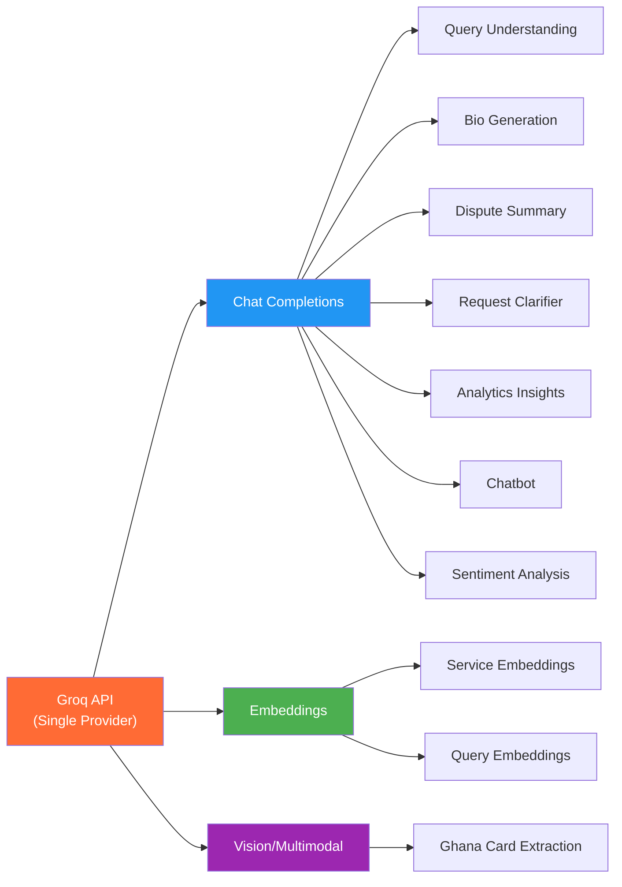
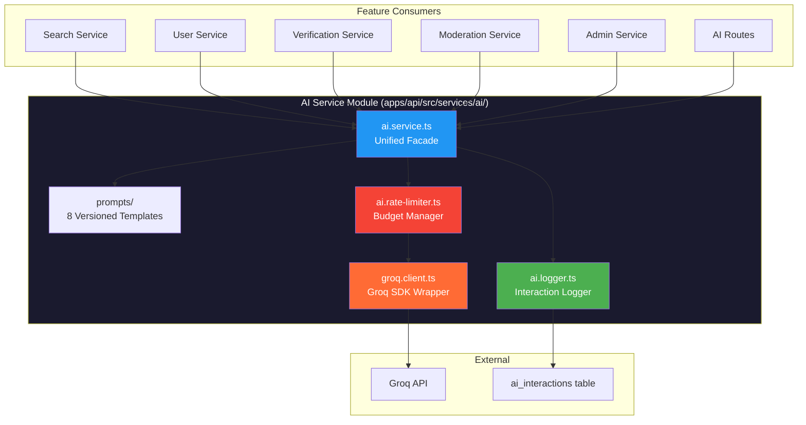
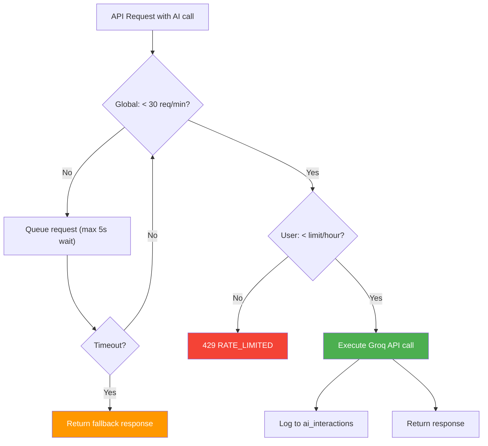

# Deliverable 5: AI & Intelligence Layer Design

> **ArtisanConnect Ghana — AI-Powered Artisan Discovery Platform**
> Version 1.0 · June 2026
>
> **AI Strategy: Groq-only architecture** — Single provider for embeddings, LLM inference, vision, and classification. Fully free. Zero OpenAI dependency.

---

## Table of Contents

1. [AI Strategy Overview](#1-ai-strategy-overview)
2. [Semantic Search Pipeline](#2-semantic-search-pipeline)
3. [Groq-Powered Smart Features](#3-groq-powered-smart-features)
4. [AI Service Architecture](#4-ai-service-architecture)
5. [Prompt Templates](#5-prompt-templates)
6. [Rate Limiting Strategy](#6-rate-limiting-strategy)
7. [AI Design Decisions](#7-ai-design-decisions)
8. [Monitoring & Logging](#8-monitoring--logging)
9. [Graceful Degradation Matrix](#9-graceful-degradation-matrix)

---

## 1. AI Strategy Overview

### Why Groq?

| Factor | Groq | OpenAI | Comparison |
|--------|------|--------|------------|
| **Cost** | Free tier | Pay-per-token | Groq is $0 for this project |
| **Latency** | ~100-300ms (LPU hardware) | ~500-2000ms | Groq is 3-5x faster |
| **API Keys** | 1 key for everything | Separate keys per service | Simpler ops |
| **Embeddings** | Included | Separate endpoint + billing | Unified |
| **Vision** | Included via multimodal | Separate GPT-4V pricing | Unified |
| **Free Limits** | 30 req/min, 14,400/day | None (pay from first call) | Viable for academic project |

### Models Used

| Model | Use Case | Context Window |
|-------|----------|----------------|
| `llama-3.3-70b-versatile` | Primary LLM — query understanding, bio generation, dispute summary, request clarifier, analytics insights, chatbot, Ghana Card extraction (vision) | 128K tokens |
| `mixtral-8x7b-32768` | Classification — review sentiment analysis | 32K tokens |
| Groq embedding model | Vector embeddings for semantic search | Depends on model |

### Capabilities Matrix



---

## 2. Semantic Search Pipeline

### Full Pipeline Diagram

```mermaid
flowchart TD
    A["Customer Query:<br/>'I need someone to fix my leaking pipe in Kasoa'"]

    A --> B["Step 1: Intent Extraction<br/>(Groq LLM)"]
    B --> B1["Cache Check<br/>(query hash)"]
    B1 -->|Miss| B2["Groq Chat Completion"]
    B1 -->|Hit| C
    B2 --> B3["Structured Intent JSON"]
    B3 --> BC["Store in Cache<br/>(TTL: 1 hour)"]
    BC --> C

    C["Step 2: Embedding Generation<br/>(Groq Embeddings)"]
    C --> C1["Generate query vector<br/>from search_query field"]

    C1 --> D["Step 3: Vector Similarity Search<br/>(pgvector)"]
    D --> D1["SELECT services<br/>ORDER BY embedding <=> query_vec<br/>LIMIT 20"]

    D1 --> E["Step 4: Distance Calculation<br/>(Mapbox API)"]
    E --> E1["Distance Matrix:<br/>customer coords → artisan coords"]

    E1 --> F["Step 5: Composite Ranking"]
    F --> F1["Score = 0.40 × semantic<br/>+ 0.30 × distance<br/>+ 0.20 × rating<br/>+ 0.10 × verification"]
    F1 --> F2["Sort by final_score DESC<br/>Take top 10"]

    F2 --> G["Step 6: Result Summary<br/>(Groq LLM)"]
    G --> G1["'Found 5 verified plumbers<br/>near Kasoa...'"]

    G1 --> H["Return Results to Client"]

    style A fill:#FF9800,color:#fff
    style B fill:#2196F3,color:#fff
    style C fill:#4CAF50,color:#fff
    style D fill:#9C27B0,color:#fff
    style E fill:#00BCD4,color:#fff
    style F fill:#F44336,color:#fff
    style G fill:#2196F3,color:#fff
```



### Intent Extraction Output

```json
{
  "service_type": "Plumbing",
  "specific_issue": "Pipe leak repair",
  "urgency": "high",
  "search_query": "plumber pipe leak fix",
  "category_hint": "plumbing"
}
```

### Composite Ranking Formula

$$\text{Final Score} = 0.40 \times S_{semantic} + 0.30 \times S_{distance} + 0.20 \times S_{rating} + 0.10 \times S_{verification}$$

| Component | Calculation | Range |
|-----------|------------|-------|
| $S_{semantic}$ | Cosine similarity from pgvector (1 - distance) | 0.0 – 1.0 |
| $S_{distance}$ | $1 - \frac{\min(d, r)}{r}$ where $d$ = distance km, $r$ = search radius | 0.0 – 1.0 |
| $S_{rating}$ | $\frac{\text{avg\_rating}}{5.0}$ | 0.0 – 1.0 |
| $S_{verification}$ | 1.0 if verified, 0.0 if not | 0.0 or 1.0 |

### Caching Strategy

| Cache Target | Key | TTL | Rationale |
|-------------|-----|-----|-----------|
| Intent extraction | SHA-256(query_text) | 1 hour | Identical queries yield same intent |
| Embedding vectors | SHA-256(search_query) | 24 hours | Same search terms yield same vectors |

### Groq Calls Per Search

| Step | Groq Calls | Can Skip? |
|------|-----------|-----------|
| Intent extraction | 1 | ✅ (if cached) |
| Query embedding | 1 | ✅ (if cached) |
| Result summary | 1 | ✅ (optional) |
| **Total** | **1-3** | Budget: ~10 per search max |

---

## 3. Groq-Powered Smart Features

### Feature 1: Smart Query Understanding

| Aspect | Detail |
|--------|--------|
| **Trigger** | Customer searches for a service |
| **Model** | `llama-3.3-70b-versatile` |
| **Input** | Raw natural language query |
| **Output** | Structured JSON: service_type, specific_issue, urgency, search_query |
| **Latency Target** | < 200ms |
| **Fallback** | Use raw query directly for embedding if Groq fails |
| **Groq Calls** | 1 |

**Example:**
- Input: `"my toilet is making a weird noise and leaking"`
- Output: `{"service_type": "Plumbing", "specific_issue": "Toilet repair - noise and leak", "urgency": "medium", "search_query": "plumber toilet repair leak fix"}`

---

### Feature 2: Artisan Profile Bio Generator

| Aspect | Detail |
|--------|--------|
| **Trigger** | Artisan clicks "✨ Generate Bio" on profile editor |
| **Model** | `llama-3.3-70b-versatile` |
| **Input** | Profession, years of experience, skills array, location |
| **Output** | Professional bio paragraph (150-200 words) |
| **UX** | Editable text field pre-filled with AI draft |
| **Prompt Strategy** | Ghanaian context, professional tone, trust signals |
| **Latency Target** | < 500ms |
| **Fallback** | Button disabled with tooltip "AI unavailable, write manually" |
| **Groq Calls** | 1 |

**Example:**
- Input: `{profession: "Plumber", experience: 8, skills: ["Pipe repair", "Water heater"], location: "Kasoa"}`
- Output: *"With over 8 years of dedicated plumbing experience serving the Kasoa community and Greater Accra region, I bring reliable, professional pipe repair and water heater installation services to your doorstep..."*

---

### Feature 3: Review Sentiment Analysis

| Aspect | Detail |
|--------|--------|
| **Trigger** | Review submitted by customer (automatic, background) |
| **Model** | `mixtral-8x7b-32768` |
| **Input** | Review text + numeric rating |
| **Output** | Sentiment (positive/neutral/negative), key themes, rating contradiction flag |
| **Use Case** | Admin dashboard sentiment trends; flag suspicious reviews |
| **Latency Target** | < 300ms |
| **Fallback** | Store null sentiment; review still saved normally |
| **Groq Calls** | 1 |

**Example:**
- Input: `{text: "Good job but arrived very late and left a mess", rating: 4}`
- Output: `{sentiment: "neutral", themes: ["quality_work", "punctuality_issue", "cleanliness_issue"], rating_sentiment_match: false}`

---

### Feature 4: Ghana Card Verification (Groq Vision)

| Aspect | Detail |
|--------|--------|
| **Trigger** | Artisan uploads Ghana Card image |
| **Model** | `llama-3.3-70b-versatile` (multimodal/vision) |
| **Input** | Ghana Card image (base64 encoded) |
| **Output** | Structured extraction: full_name, card_number, DOB, expiry_date, confidence_score |
| **UX** | Auto-fills verification form; admin sees AI extraction alongside card image |
| **Advantage** | Eliminates Tesseract.js / external OCR dependency |
| **Latency Target** | < 2000ms (image processing) |
| **Fallback** | Admin manually reads card details |
| **Groq Calls** | 1 |

**Example:**
- Input: Ghana Card image (base64)
- Output:
```json
{
  "full_name": "KWAME ASANTE",
  "card_number": "GHA-012345678-9",
  "date_of_birth": "1990-05-15",
  "expiry_date": "2030-12-31",
  "confidence_score": 0.94,
  "warnings": []
}
```

---

### Feature 5: Dispute Summarization

| Aspect | Detail |
|--------|--------|
| **Trigger** | Admin opens a disputed service request |
| **Model** | `llama-3.3-70b-versatile` |
| **Input** | Service request details, full chat history, quote info, payment status, timeline |
| **Output** | Concise dispute summary, chronological timeline, key issues, suggested resolution |
| **UX** | AI summary card at top of dispute review page |
| **Latency Target** | < 1000ms |
| **Fallback** | Admin reviews raw data manually (no summary card shown) |
| **Groq Calls** | 1-2 (depending on context length) |

---

### Feature 6: Service Request Clarifier

| Aspect | Detail |
|--------|--------|
| **Trigger** | Customer creates a vague service request |
| **Model** | `llama-3.3-70b-versatile` |
| **Input** | Customer's service description |
| **Output** | Enhanced description + clarifying questions |
| **UX** | "💡 AI suggests adding more details..." prompt below description field |
| **Latency Target** | < 300ms |
| **Fallback** | No suggestions shown; request submitted as-is |
| **Groq Calls** | 1 |

---

### Feature 7: Admin Analytics Insights

| Aspect | Detail |
|--------|--------|
| **Trigger** | Admin views analytics dashboard |
| **Model** | `llama-3.3-70b-versatile` |
| **Input** | Aggregated metrics (registrations, requests, completions, ratings for period) |
| **Output** | Natural language insights: trends, anomalies, recommendations |
| **UX** | "AI Insights" card on admin dashboard with bullet-point observations |
| **Latency Target** | < 500ms |
| **Fallback** | Insights card hidden; raw metrics still shown |
| **Groq Calls** | 1 |

**Example Output:**
> - 📈 Registrations are up 15% this week, driven by artisan sign-ups in Kumasi
> - ⚠️ Dispute rate increased to 3.2% (from 1.8%) — mostly related to plumbing services
> - 💡 Consider promoting verified electricians — high demand but low supply in Tema area

---

### Feature 8: Customer Recommendation Chatbot (Dual-Mode)

| Aspect | Detail |
|--------|--------|
| **Trigger** | Customer clicks "Help me find an artisan" chat widget |
| **Model** | `llama-3.3-70b-versatile` |
| **Mode 1: Quick Guide** | Asks 2-3 structured questions → directly triggers search |
| **Mode 2: Full Conversation** | Free-form chat, progressive intent extraction → presents artisan recommendations conversationally |
| **UX** | Floating chat widget on search page. Starts in Quick Guide, "Tell me more" expands to Full Conversation |
| **Context** | Service categories, nearby artisans, recent search trends |
| **Groq Calls** | Quick Guide: ~3 calls; Full Conversation: ~5-8 calls per session |
| **Fallback** | Widget shows static "Browse Categories" link |

**Quick Guide Flow:**
```
Bot: "What service do you need?" → [Plumbing] [Electrical] [Painting] [Other]
Bot: "Where are you located?" → [Use my location] or text input
Bot: "How urgent is it?" → [Today] [This week] [Flexible]
→ Triggers semantic search → Shows results in chat
```

**Full Conversation Flow:**
```
User: "The lights in my kitchen keep flickering and sometimes the whole house trips"
Bot: "That sounds like it could be a wiring issue or an overloaded circuit. Let me find an electrician near you. What area are you in?"
User: "Tema, Community 25"
Bot: "I found 3 verified electricians near Tema Community 25. Here are my top recommendations:
1. ⭐ Kofi E. (4.9★, 2.1km) — Specializes in residential wiring
2. ⭐ Yaw M. (4.7★, 3.5km) — Circuit breaker expert
Would you like to send a request to any of them?"
```

---

## 4. AI Service Architecture



### Module Responsibilities

| File | Responsibility |
|------|---------------|
| `groq.client.ts` | Wraps the Groq SDK. Single client instance. Methods: `chatCompletion()`, `generateEmbedding()`, `visionExtract()` |
| `ai.service.ts` | Public facade. Methods: `extractIntent()`, `generateBio()`, `analyzeSentiment()`, `extractCard()`, `summarizeDispute()`, `clarifyRequest()`, `generateInsights()`, `chat()`, `embedService()`, `embedQuery()` |
| `ai.logger.ts` | Logs every Groq call to `ai_interactions` table: user_id, feature, model, tokens, latency |
| `ai.rate-limiter.ts` | Tracks Groq API usage per minute. Returns 429 when budget exceeded. Per-user limits to prevent abuse. |
| `prompts/` | 8 template files, each exporting system prompt + user prompt template functions |

---

## 5. Prompt Templates

### 5.1 Query Intent Extraction (`prompts/query-intent.ts`)

**System Prompt:**
```
You are a search intent extractor for ArtisanConnect Ghana, a platform connecting customers with skilled artisans.

Given a customer's natural language search query, extract structured information to improve search results.

Respond ONLY with valid JSON in this exact format:
{
  "service_type": "Category name (e.g., Plumbing, Electrical, Carpentry, Painting, Masonry, Tiling, Roofing, Welding, AC Repair, Landscaping)",
  "specific_issue": "Brief description of the specific problem",
  "urgency": "low | medium | high | emergency",
  "search_query": "Optimized search terms for embedding similarity",
  "category_hint": "lowercase category key for database lookup"
}

If the query is ambiguous, make reasonable assumptions based on Ghanaian context.
Do not include any explanations or text outside the JSON.
```

**User Prompt Template:**
```
Customer search query: "{query}"
```

---

### 5.2 Bio Generator (`prompts/bio-generator.ts`)

**System Prompt:**
```
You are a professional copywriter for ArtisanConnect Ghana, a platform for skilled Ghanaian artisans.

Write a professional, warm, and trustworthy bio for an artisan based on their details. The bio should:
- Be 150-200 words
- Highlight their experience and expertise
- Mention their service area in Ghana
- Include trust signals (years of experience, specializations)
- Use a first-person perspective ("I" / "my")
- Be culturally appropriate for Ghana
- Sound professional but approachable
- NOT include pricing information
- NOT make claims about certifications unless provided

Write ONLY the bio text. No headings, bullets, or formatting.
```

**User Prompt Template:**
```
Artisan details:
- Profession: {profession}
- Years of experience: {experience_years}
- Key skills: {skills}
- Service area: {location}
- Additional info: {additional_info}
```

---

### 5.3 Review Sentiment (`prompts/review-sentiment.ts`)

**System Prompt:**
```
You are a sentiment analyzer for customer reviews on ArtisanConnect Ghana.

Analyze the review text and rating. Respond ONLY with valid JSON:
{
  "sentiment": "positive | neutral | negative",
  "themes": ["array", "of", "key_themes"],
  "rating_sentiment_match": true/false,
  "flag_reason": null or "reason if suspicious"
}

Themes should be from: quality_work, value_for_money, punctuality, communication, professionalism, cleanliness, expertise, reliability, punctuality_issue, overcharging, poor_quality, rudeness, no_show.

Flag the review if:
- 5-star rating but negative text
- 1-star rating but positive text
- Review seems fake or generic
- Contains inappropriate content
```

**User Prompt Template:**
```
Rating: {rating}/5
Review: "{review_text}"
```

---

### 5.4 Ghana Card Extraction (`prompts/card-extraction.ts`)

**System Prompt:**
```
You are analyzing a Ghana Card (Ghana National Identity Card) image. Extract the following information from the card:

Respond ONLY with valid JSON:
{
  "full_name": "Full name as printed on card",
  "card_number": "GHA-XXXXXXXXXX-X format",
  "date_of_birth": "YYYY-MM-DD format",
  "expiry_date": "YYYY-MM-DD format",
  "confidence_score": 0.0 to 1.0,
  "warnings": ["any issues with readability"]
}

If a field is unreadable, set it to null and add a warning.
The confidence_score should reflect overall extraction quality.
```

---

### 5.5 Dispute Summary (`prompts/dispute-summary.ts`)

**System Prompt:**
```
You are an impartial dispute analyst for ArtisanConnect Ghana. Summarize a service dispute between a customer and artisan for an admin reviewer.

Provide a concise, objective analysis. Respond ONLY with valid JSON:
{
  "summary": "2-3 sentence overview of the dispute",
  "timeline": [
    {"date": "YYYY-MM-DD", "event": "description"}
  ],
  "key_issues": ["issue1", "issue2"],
  "customer_position": "Brief summary of customer's complaint",
  "artisan_position": "Brief summary of artisan's defense",
  "suggested_resolution": "refund | partial_refund | release_payment | further_investigation",
  "confidence": "low | medium | high"
}

Be objective. Do not take sides. Present facts only.
```

**User Prompt Template:**
```
Service Request:
- Service: {service_title}
- Quoted Amount: GHS {amount}
- Status: {status}
- Created: {created_at}

Chat History:
{chat_messages}

Dispute Reason: {dispute_reason}
Payment Status: {payment_status}
```

---

### 5.6 Request Clarifier (`prompts/request-clarifier.ts`)

**System Prompt:**
```
You are a service request assistant for ArtisanConnect Ghana. A customer has written a vague service description. Help clarify it.

Respond ONLY with valid JSON:
{
  "clarified_description": "Enhanced, detailed version of their description",
  "suggested_questions": ["up to 3 clarifying questions"],
  "detected_service_type": "Best guess at service category"
}
```

---

### 5.7 Analytics Insights (`prompts/analytics-insights.ts`)

**System Prompt:**
```
You are a data analyst for ArtisanConnect Ghana. Given platform metrics, provide actionable insights in 3-5 bullet points.

Focus on:
- Trends (growth, decline)
- Anomalies (unusual spikes or drops)
- Opportunities (underserved categories or regions)
- Warnings (high dispute rates, low satisfaction)

Keep insights concise and actionable. Use emojis for visual scanning.
Respond ONLY with valid JSON:
{
  "insights": [
    {"emoji": "📈", "text": "insight text"},
    {"emoji": "⚠️", "text": "warning text"}
  ],
  "highlight": "Single most important takeaway"
}
```

---

### 5.8 Recommendation Chatbot (`prompts/recommendation-chat.ts`)

**System Prompt:**
```
You are ArtisanConnect's AI assistant helping customers in Ghana find the right artisan for their needs.

You have two modes:
1. Quick Guide: Ask 2-3 structured questions (service type, location, urgency) then recommend artisans
2. Full Conversation: Have a natural conversation, understand their problem, then recommend artisans

Rules:
- Be friendly, professional, and helpful
- Use Ghanaian-appropriate language and context
- When you have enough info (service type + location), trigger a search
- Present artisan recommendations naturally
- Never make up artisan names or ratings — use only provided data
- If unsure, ask clarifying questions
- Keep responses concise (2-4 sentences max)

Available service categories: {categories}
Customer location: {location}

When ready to trigger search, include in your response:
[SEARCH_TRIGGER: {"query": "...", "category": "...", "urgency": "..."}]
```

---

## 6. Rate Limiting Strategy

### Groq Free Tier Limits

| Limit | Value |
|-------|-------|
| Requests per minute | 30 |
| Requests per day | 14,400 |
| Tokens per minute | 6,000 (varies by model) |

### Per-Feature Budget Allocation

| Feature | Calls/Invocation | Max/User/Hour | Priority |
|---------|-----------------|---------------|----------|
| Search (intent + embed + summary) | 1-3 | 20 | 🔴 Critical |
| Bio generation | 1 | 5 | 🟡 Medium |
| Sentiment analysis | 1 | 10 (auto) | 🟢 Low |
| Ghana Card extraction | 1 | 3 | 🟡 Medium |
| Dispute summary | 1-2 | 5 | 🟡 Medium |
| Request clarifier | 1 | 10 | 🟢 Low |
| Analytics insights | 1 | 3 | 🟢 Low |
| Chatbot | 3-8 | 15 | 🔴 Critical |

### Rate Limiter Design



---

## 7. AI Design Decisions

| Decision | Choice | Alternatives Considered | Rationale |
|----------|--------|------------------------|-----------|
| AI provider | **Groq only** | OpenAI, Anthropic, Hugging Face | Free tier, fastest inference, single API key |
| Primary LLM | `llama-3.3-70b-versatile` | GPT-4, Claude 3, Llama 3 8B | Best quality/speed on Groq. 128K context. |
| Classification model | `mixtral-8x7b-32768` | Same as primary | More efficient for simple tasks, saves quota |
| Embedding model | Groq embedding endpoint | OpenAI ada-002, Sentence Transformers | Free, consistent with single-provider strategy |
| Vision model | `llama-3.3-70b-versatile` (multimodal) | GPT-4V, Tesseract.js | Eliminates OCR dependency. Single API call. |
| Prompt format | Structured JSON output | Free text, XML | Easy to parse, validate, and log |
| Prompt storage | TypeScript template files | Database, YAML files | Type-safe, version-controlled, IDE support |
| Failure mode | Graceful degradation | Hard failure, retry only | Core features work without AI |
| Caching | In-memory (Map) + TTL | Redis, Supabase cache | Simple for MVP; upgrade to Redis at scale |
| Logging | `ai_interactions` table | External analytics, logs only | Queryable for academic paper metrics |

---

## 8. Monitoring & Logging

### ai_interactions Table Schema

```sql
CREATE TABLE ai_interactions (
    id UUID PRIMARY KEY DEFAULT gen_random_uuid(),
    user_id UUID REFERENCES users(id),
    feature ai_feature_enum NOT NULL,
    model VARCHAR(100) NOT NULL,
    prompt_hash VARCHAR(64),
    tokens_used INTEGER,
    latency_ms INTEGER NOT NULL,
    success BOOLEAN DEFAULT true,
    error_message TEXT,
    created_at TIMESTAMPTZ DEFAULT NOW()
);
```

### Metrics Dashboard Queries

**Average latency by feature:**
```sql
SELECT feature, AVG(latency_ms) as avg_latency, COUNT(*) as total_calls
FROM ai_interactions
WHERE created_at > NOW() - INTERVAL '7 days'
GROUP BY feature
ORDER BY total_calls DESC;
```

**Success rate:**
```sql
SELECT feature,
  COUNT(*) FILTER (WHERE success = true) * 100.0 / COUNT(*) as success_rate
FROM ai_interactions
GROUP BY feature;
```

**Daily usage (for academic paper):**
```sql
SELECT DATE(created_at) as day, feature, COUNT(*) as calls, AVG(latency_ms) as avg_latency
FROM ai_interactions
GROUP BY day, feature
ORDER BY day;
```

---

## 9. Graceful Degradation Matrix

Every AI feature is designed as an **enhancement**, not a dependency. The platform is fully functional without AI.

| Feature | Normal Behavior | Fallback When Groq Unavailable |
|---------|----------------|-------------------------------|
| **Search intent** | AI extracts structured intent from query | Raw query used directly for embedding/keyword search |
| **Search embedding** | Groq generates query vector | `ILIKE` keyword search on service descriptions |
| **Search summary** | AI generates natural language summary | No summary shown; just ranked list |
| **Bio generator** | "✨ Generate Bio" produces professional text | Button disabled; artisan writes bio manually |
| **Sentiment analysis** | Auto-analyzes review sentiment | `sentiment` column stored as NULL; review still saved |
| **Ghana Card extraction** | AI extracts card fields from image | Form fields left empty; admin reads card manually |
| **Dispute summary** | AI summary card shown to admin | No summary card; admin reviews raw chat/request data |
| **Request clarifier** | AI suggests clarifications | No suggestions shown; request submitted as-is |
| **Analytics insights** | AI insights card on admin dashboard | Card hidden; raw metrics still displayed |
| **Chatbot** | AI-powered conversation | Widget shows "Browse Categories" link as static fallback |

### Fallback Detection

```typescript
// In ai.service.ts
async function withFallback<T>(
  aiCall: () => Promise<T>,
  fallback: T,
  feature: string
): Promise<{ result: T; ai_powered: boolean }> {
  try {
    const result = await aiCall();
    return { result, ai_powered: true };
  } catch (error) {
    logger.warn(`AI fallback for ${feature}:`, error.message);
    await logInteraction({ feature, success: false, error: error.message });
    return { result: fallback, ai_powered: false };
  }
}
```

---

> **Next**: [Deliverable 6 — UI/UX Wireframes & Design System](./06-ui-wireframes.md) shows the visual layout of all pages with AI feature integration points.
