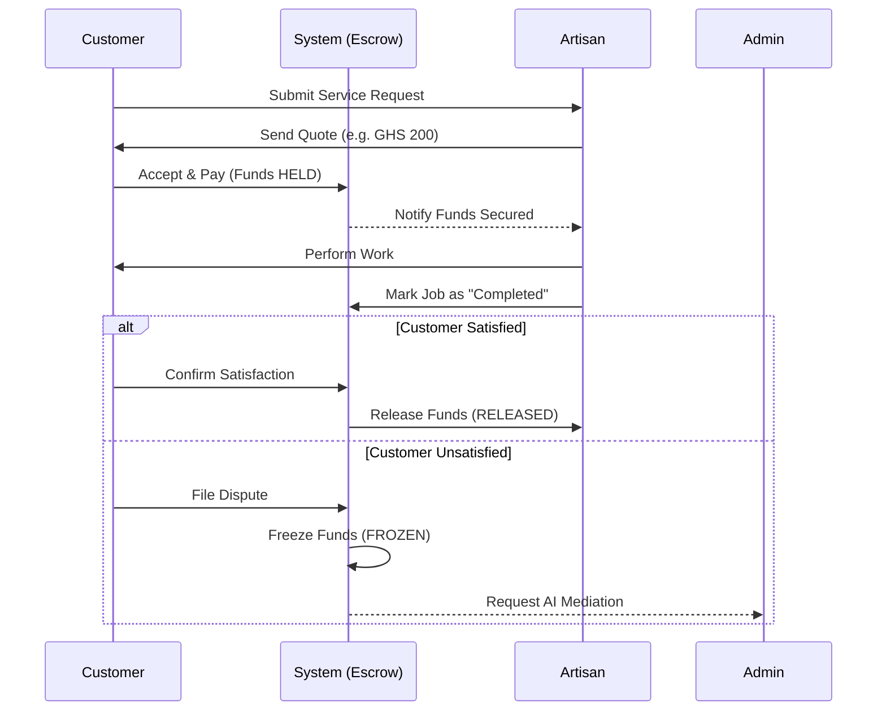
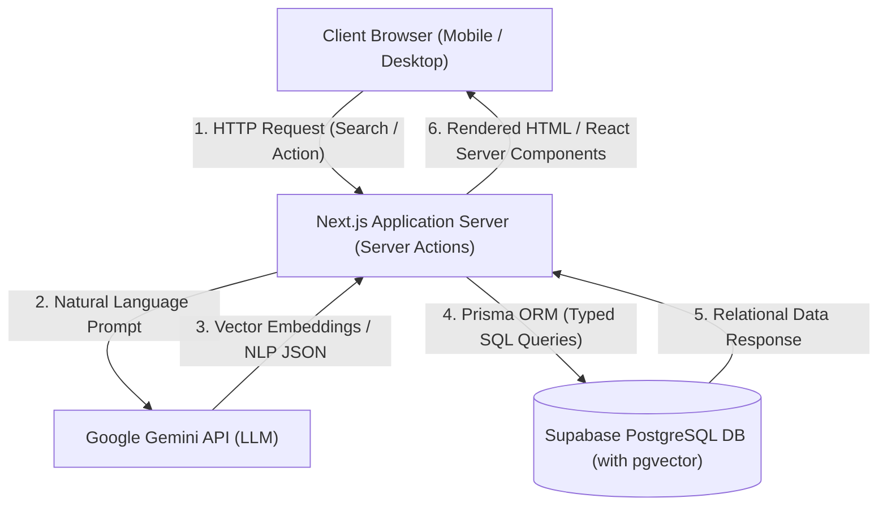
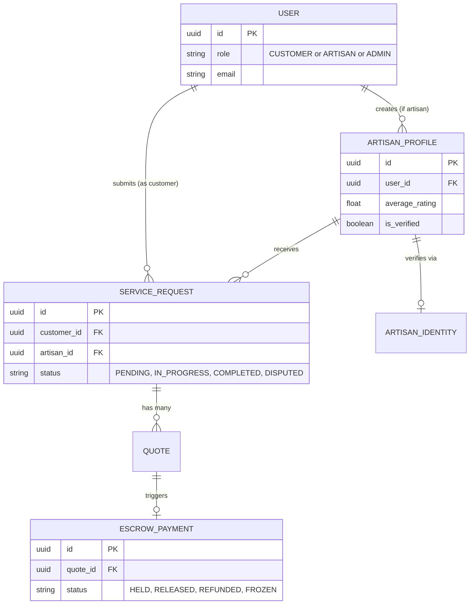

# CHAPTER THREE: METHODOLOGY AND SYSTEM DESIGN

## 3.1 Introduction
This chapter outlines the research methodology adopted for the development of ArtisanConnect. It details the comprehensive system design, including the architectural framework, database schema, state machine logic, and user interface conceptualization. The design choices presented here are strictly tailored to address the unique socio-technical constraints of the Ghanaian informal sector, emphasizing mobile-first accessibility, low-bandwidth optimization, and rigorous transaction security via Escrow.

## 3.2 Methodology
The Agile Software Development methodology was adopted for this project. Unlike traditional Waterfall models, Agile promotes iterative development, continuous feedback loops, and highly flexible responses to changing requirements. This was particularly crucial for ArtisanConnect, as the user experience required constant refinement based on how non-technical users interact with AI search bars and mobile navigation.

The development lifecycle was structured into four distinct phases:
1. **Requirement Analysis & Elicitation:** Identifying the acute pain points of existing classified platforms (like Jiji Ghana) through contextual analysis of the local gig economy. 
2. **Iterative Design & Prototyping:** Utilizing wireframing tools to conceptualize a user-friendly interface. A core design decision during this phase was abandoning the traditional "hamburger menu" in favor of a bottom-anchored navigation bar, mimicking high-engagement apps like TikTok to improve accessibility for mobile users.
3. **Sprint-Based Development:** Breaking the complex project into manageable developmental sprints (e.g., Sprint 1: Authentication & Identity; Sprint 2: AI Hybrid Search; Sprint 3: Escrow State Machine; Sprint 4: Admin Dispute Resolution).
4. **Testing and Refinement:** Conducting continuous unit testing on the database schema to ensure state transitions (e.g., from `PENDING` to `IN_PROGRESS`) remained secure and tamper-proof.

### 3.2.1 Use Case Diagram
The system involves three primary actors: the Customer, the Artisan, and the System Administrator. The Mermaid diagram below illustrates the high-level use cases for each actor.

```mermaid
usecaseDiagram
    actor Customer
    actor Artisan
    actor Admin

    package "ArtisanConnect Platform" {
        usecase "Search Artisans (AI)" as UC1
        usecase "Request Service" as UC2
        usecase "Pay to Escrow" as UC3
        usecase "File Dispute" as UC4
        
        usecase "Create Profile" as UC5
        usecase "Send Quote" as UC6
        usecase "Start/Complete Work" as UC7
        usecase "Withdraw Funds" as UC8
        
        usecase "Verify Identities" as UC9
        usecase "Resolve Disputes (AI Assisted)" as UC10
    }

    Customer --> UC1
    Customer --> UC2
    Customer --> UC3
    Customer --> UC4

    Artisan --> UC5
    Artisan --> UC6
    Artisan --> UC7
    Artisan --> UC8

    Admin --> UC9
    Admin --> UC10
```

### 3.2.2 Service Lifecycle Workflow
The following sequence diagram outlines the core workflow of a service request, from initial contact to financial resolution.



## 3.3 System Architecture
ArtisanConnect utilizes a highly modern, serverless Client-Server architecture designed for scalability and rapid deployment. The frontend is cleanly decoupled from the database but remains tightly integrated with the backend logic through server-side rendering mechanisms.

### 3.3.1 The Technology Stack
*   **Frontend (Client Tier):** The application is built using Next.js 15, an advanced React framework. It utilizes the modern "App Router" paradigm for optimized routing and layout persistence. Styling is achieved using TailwindCSS for highly customizable, utility-first design, alongside Radix UI primitives to ensure compliance with strict accessibility (a11y) standards.
*   **Backend (Application Tier):** Next.js Server Actions and API Routes manage the secure execution of business logic. This eliminates the need for a separate monolithic backend server (like Node/Express), reducing latency and infrastructure costs. The backend securely interfaces with external APIs, notably the Google Gemini API for Natural Language Processing (NLP).
*   **Database (Data Tier):** The data layer is hosted on Supabase, an open-source Firebase alternative powered by a robust PostgreSQL database. Supabase provides out-of-the-box Row Level Security (RLS) policies, ensuring that users can only access their own transactional data.
*   **ORM Layer:** Prisma ORM is utilized as the bridging layer between the Next.js server and the PostgreSQL database. Prisma generates highly optimized, strongly-typed SQL queries, drastically reducing runtime errors and preventing SQL injection vulnerabilities.

### 3.3.2 Architectural Flow Diagram
Below is the high-level system architecture, illustrating the data flow between the client, the serverless functions, the AI engine, and the database.



## 3.4 Database Design and Modeling
A strict relational database model is essential for managing the complex, heavily interconnected entities of a two-sided financial marketplace. The PostgreSQL database relies heavily on foreign key constraints and ENUMs to maintain referential integrity.

### 3.4.1 Entity Relationship Diagram (ERD)
The core entities revolve around `User` accounts, their corresponding `ArtisanProfile`, the lifecycle of a `ServiceRequest`, and the financial `EscrowPayment`.



### 3.4.2 The Escrow State Machine Logic
To prevent fraud, the `ServiceRequest` and `EscrowPayment` entities are strictly governed by a State Machine paradigm implemented at the database level. 
*   **Initialization:** When a customer accepts a quote, an `EscrowPayment` is generated with the status `HELD`, and the `ServiceRequest` advances to `IN_PROGRESS`.
*   **Completion:** The artisan cannot withdraw funds immediately. Only when the customer confirms satisfaction does the escrow transition to `RELEASED`.
*   **Dispute Intervention:** If the customer files a grievance, the `EscrowPayment` instantly transitions to `FROZEN`. At this state, neither the customer nor the artisan has access to the funds. Only an Administrator can review the case and execute a forced `RELEASE` or `REFUND`.

## 3.5 Artificial Intelligence Integration
ArtisanConnect pioneers the integration of AI directly into the operational logic of the informal gig economy, moving far beyond traditional conditional programming.

### 3.5.1 Intelligent Matchmaking (Hybrid Search)
When a customer inputs a colloquial query such as "My roof is leaking profusely," traditional keyword databases fail because the word "roofer" or "carpenter" is absent. The system intercepts this query and passes it to the Google Gemini LLM to extract semantic intent. The resulting output (e.g., intent: "Roofing Repair") is converted into high-dimensional vector embeddings. These embeddings are then queried against the artisan database using PostgreSQL's `pgvector` extension via Cosine Similarity, successfully returning the most relevant craftsmen based on context, not just keywords.

### 3.5.2 Automated Dispute Summarization (ODR)
In a high-volume marketplace, human administrators are rapidly overwhelmed if forced to manually read hundreds of chat messages to resolve a GHS 200 dispute. ArtisanConnect solves this by feeding the entire chat transcript of a disputed `ServiceRequest` into the Gemini API. The AI is prompted to act as an impartial legal mediator, outputting a highly structured JSON summary that highlights:
1. The agreed-upon quote and scope of work.
2. The chronological breakdown of the conflict.
3. Identified breaches of contract by either party.
This drastically reduces the cognitive load on administrators, allowing them to adjudicate disputes in seconds rather than minutes.

## 3.6 User Interface (UI) and Experience (UX) Design
Recognizing that the overwhelming majority of Ghanaian users access the internet exclusively via affordable mobile devices, the UI was strictly conceptualized using a "Mobile-First" paradigm.

A critical UX innovation in ArtisanConnect is the implementation of a dynamic **Bottom Navigation Bar**, heavily inspired by platforms like TikTok and Instagram. By anchoring primary actions (Home, Search, Profile) to the bottom of the screen, the interface ensures that essential functions remain within comfortable reach of the user's thumb, drastically improving navigation speed, platform engagement, and usability for non-technical demographics. Desktop users, conversely, are presented with a traditional, expanding top navigation bar to utilize the wider screen real estate efficiently.

> **[INSERT SCREENSHOT HERE: High-fidelity mockup or wireframe of the Mobile UI showing the Bottom Navigation Bar]**

> **[INSERT SCREENSHOT HERE: High-fidelity mockup or wireframe of the Desktop UI showing the Top Navigation Bar]**
