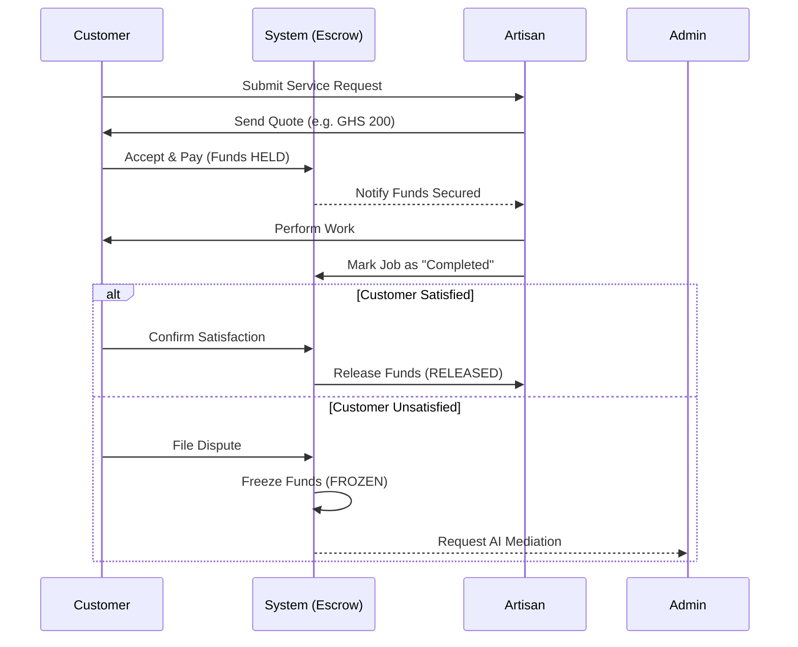
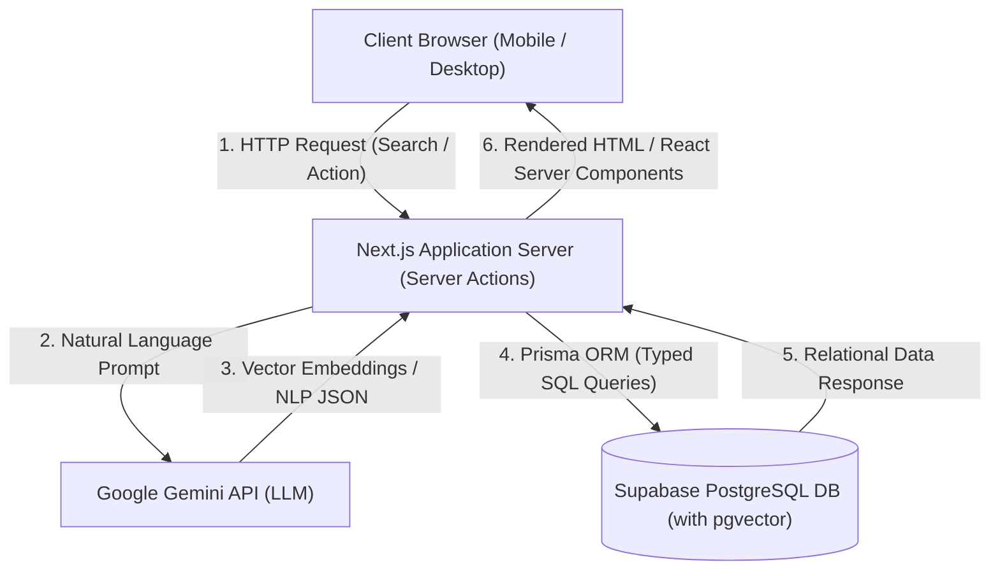
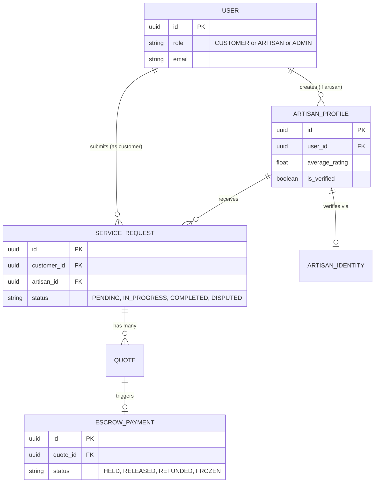

# CHAPTER THREE: METHODOLOGY AND SYSTEM DESIGN

## 3.1 Introduction
This chapter outlines the research methodology adopted for the development of ArtisanConnect. It details the comprehensive system design, including the architectural framework, database schema, state machine logic, and user interface conceptualization. The design choices presented here are strictly tailored to address the unique socio-technical constraints of the Ghanaian informal sector, emphasizing mobile-first accessibility, low-bandwidth optimization, and rigorous transaction security via Escrow.

## 3.2 Methodology
The Agile Software Development methodology was adopted for this project. Unlike traditional Waterfall models, Agile promotes iterative development, continuous feedback loops, and highly flexible responses to changing requirements. This was particularly crucial for ArtisanConnect, as the user experience required constant refinement based on how non-technical users interact with AI search bars and mobile navigation.

This methodological choice is supported by empirical software engineering evidence that iterative Agile practices improve responsiveness to evolving requirements and strengthen delivery outcomes in uncertain project environments (Dybå & Dingsøyr, 2008, DOI: https://doi.org/10.1016/j.infsof.2008.01.006).

The development lifecycle was structured into four distinct phases:
1. **Requirement Analysis & Elicitation:** Identifying the acute pain points of existing classified platforms (like Jiji Ghana) through contextual analysis of the local gig economy. 
2. **Iterative Design & Prototyping:** Utilizing wireframing tools to conceptualize a user-friendly interface. A core design decision during this phase was abandoning the traditional "hamburger menu" in favor of a bottom-anchored navigation bar, mimicking high-engagement apps like TikTok to improve accessibility for mobile users.
3. **Sprint-Based Development:** Breaking the complex project into manageable developmental sprints (e.g., Sprint 1: Authentication & Identity; Sprint 2: AI Hybrid Search; Sprint 3: Escrow State Machine; Sprint 4: Admin Dispute Resolution).
4. **Testing and Refinement:** Conducting continuous unit testing on the database schema to ensure state transitions (e.g., from `PENDING` to `IN_PROGRESS`) remained secure and tamper-proof.

### 3.2.1 Use Case Diagram
The system involves three primary actors: the Customer, the Artisan, and the System Administrator. The Mermaid diagram below illustrates the high-level use cases for each actor.

```mermaid
usecaseDiagram
    actor Customer
    actor Artisan
    actor Admin

    package "ArtisanConnect Platform" {
        usecase "Search Artisans (AI)" as UC1
        usecase "Request Service" as UC2
        usecase "Pay to Escrow" as UC3
        usecase "File Dispute" as UC4
        
        usecase "Create Profile" as UC5
        usecase "Send Quote" as UC6
        usecase "Start/Complete Work" as UC7
        usecase "Withdraw Funds" as UC8
        
        usecase "Verify Identities" as UC9
        usecase "Resolve Disputes (AI Assisted)" as UC10
    }

    Customer --> UC1
    Customer --> UC2
    Customer --> UC3
    Customer --> UC4

    Artisan --> UC5
    Artisan --> UC6
    Artisan --> UC7
    Artisan --> UC8

    Admin --> UC9
    Admin --> UC10
```

### 3.2.2 Service Lifecycle Workflow
The following sequence diagram outlines the core workflow of a service request, from initial contact to financial resolution.

```mermaid
sequenceDiagram
    participant C as Customer
    participant S as System (Escrow)
    participant A as Artisan

    C->>A: Submit Service Request
    A->>C: Send Quote (e.g. GHS 200)
    C->>S: Accept & Pay (Funds HELD)
    S-->>A: Notify Funds Secured
    A->>C: Perform Work
    A->>S: Mark Job as "Completed"
    
    alt Customer Satisfied
        C->>S: Confirm Satisfaction
        S->>A: Release Funds (RELEASED)
    else Customer Unsatisfied
        C->>S: File Dispute
        S->>S: Freeze Funds (FROZEN)
        S-->>Admin: Request AI Mediation
    end
```

### 3.2.3 Research Design Justification
The project adopted a **Design Science-oriented implementation methodology** within an Agile execution structure. In this context, the thesis does not only discuss a problem theoretically; it also builds and evaluates a functional digital artifact (ArtisanConnect) that addresses measurable trust, matching, and dispute-resolution problems in a real socio-economic setting. This is appropriate for an undergraduate Information Technology capstone because the project outcome can be validated through concrete functional requirements, system behavior, and user-oriented quality metrics.

To keep the methodology academically rigorous, each sprint output was linked to one or more objectives in Chapter One (e.g., escrow trust controls, AI hybrid search relevance, and dispute-management support). The iterative loop used in each sprint followed: **problem framing -> design decision -> implementation -> test evidence -> refinement**. This ensured that Chapter Four implementation details are traceable back to methodological decisions documented in this chapter.

### 3.2.4 Data Inputs, Elicitation, and Validation Approach
Requirements and design assumptions were validated through a triangulated process tailored to the Ghanaian context:
1. **Contextual observation and comparative platform analysis:** Existing marketplace workflows were studied to identify gaps in identity verification, payment trust, and dispute handling.
2. **Scenario-based elicitation:** Realistic service scenarios (e.g., household repairs, delayed completion, scope changes) were used to derive system states, notifications, and fallback flows.
3. **Prototype walkthrough validation:** Interface and workflow prototypes were reviewed against expected user tasks for customers, artisans, and administrators.

This approach reduced the risk of designing features that look technically correct but fail practical usability for first-time digital marketplace users.

## 3.3 System Architecture
ArtisanConnect utilizes a highly modern, serverless Client-Server architecture designed for scalability and rapid deployment. The frontend is cleanly decoupled from the database but remains tightly integrated with the backend logic through server-side rendering mechanisms.

### 3.3.1 The Technology Stack
The technology stack was carefully selected to prioritize security, deployment velocity, and high performance on low-bandwidth networks. The stack is composed of:
*   **Frontend (Client Tier):** The application is built using Next.js 15, an advanced React framework. While standard React applications suffer from slow initial load times due to Client-Side Rendering (CSR), Next.js utilizes the modern "App Router" paradigm for optimized routing, layout persistence, and highly optimized Server-Side Rendering (SSR). This ensures that pages load rapidly, even on constrained 3G mobile networks typical in rural Ghana. Styling is achieved using TailwindCSS for highly customizable, utility-first design, deliberately chosen over older frameworks like Bootstrap to minimize the final CSS bundle size. Complex interactive components utilize Radix UI primitives to ensure strict compliance with web accessibility (a11y) standards.
*   **Backend (Application Tier):** Next.js Server Actions and API Routes manage the secure execution of business logic. This entirely eliminates the need for a separate monolithic backend server (like Node/Express or Django), drastically reducing latency, preventing cross-origin (CORS) issues, and minimizing infrastructure hosting costs. The backend securely interfaces with external APIs, notably the Google Gemini API for Natural Language Processing (NLP).
*   **Database (Data Tier):** The data layer is hosted on Supabase, an open-source Firebase alternative powered by a robust PostgreSQL database. Supabase was chosen over MongoDB because financial escrow systems require strict ACID compliance and relational integrity, which NoSQL databases struggle to provide inherently. Furthermore, Supabase provides out-of-the-box Row Level Security (RLS) policies, ensuring that users can only query and access their own transactional data, preventing unauthorized data scraping.
*   **ORM Layer:** Prisma ORM is utilized as the critical bridging layer between the Next.js server and the PostgreSQL database. Prisma generates highly optimized, strongly-typed SQL queries. By enforcing strict TypeScript definitions derived from the database schema, Prisma drastically reduces runtime errors and provides impenetrable defense against SQL injection vulnerabilities.

### 3.3.2 Architectural Flow Diagram
Below is the high-level system architecture, illustrating the data flow between the client, the serverless functions, the AI engine, and the database.

```mermaid
graph TD
    Client["Client Browser (Mobile / Desktop)"]
    NextJS["Next.js Application Server (Server Actions)"]
    Supabase[("Supabase PostgreSQL DB (with pgvector)")]
    Gemini["Google Gemini API (LLM)"]
    
    Client -- "1. HTTP Request (Search / Action)" --> NextJS
    NextJS -- "2. Natural Language Prompt" --> Gemini
    Gemini -- "3. Vector Embeddings / NLP JSON" --> NextJS
    NextJS -- "4. Prisma ORM (Typed SQL Queries)" --> Supabase
    Supabase -- "5. Relational Data Response" --> NextJS
    NextJS -- "6. Rendered HTML / React Server Components" --> Client
```

### 3.3.3 Security and Trust-by-Design Principles
Given that ArtisanConnect mediates financial commitments between largely unknown parties, the architecture was designed with explicit **institution-based trust controls** rather than relying on interpersonal trust alone. Empirical marketplace research shows that escrow and institutional safeguards materially increase user trust and reduce perceived transaction risk in online environments (Pavlou & Gefen, 2004, DOI: https://doi.org/10.1287/isre.1040.0015).

Consequently, security controls were distributed across all layers:
- **Client Layer:** Sensitive operations are never finalized purely on client state; privileged actions require server-side verification.
- **Application Layer:** Server Actions and API routes enforce authorization gates and role-based pathways for customer, artisan, and admin actions.
- **Database Layer:** Referential integrity constraints, restricted write paths, and Row Level Security policies constrain data visibility and mutation boundaries.

This layered strategy ensures that even if one control is weakened, downstream controls continue to enforce transaction safety.

## 3.4 Database Design and Modeling
A strict relational database model is essential for managing the complex, heavily interconnected entities of a two-sided financial marketplace. The PostgreSQL database relies heavily on foreign key constraints and ENUMs to maintain referential integrity.

### 3.4.1 Entity Relationship Diagram (ERD)
The core entities revolve around `User` accounts, their corresponding `ArtisanProfile`, the lifecycle of a `ServiceRequest`, and the financial `EscrowPayment`.

```mermaid
erDiagram
    USER ||--o{ ARTISAN_PROFILE : "creates (if artisan)"
    USER ||--o{ SERVICE_REQUEST : "submits (as customer)"
    ARTISAN_PROFILE ||--o{ SERVICE_REQUEST : "receives"
    ARTISAN_PROFILE ||--o| ARTISAN_IDENTITY : "verifies via"
    SERVICE_REQUEST ||--o{ QUOTE : "has many"
    QUOTE ||--o| ESCROW_PAYMENT : "triggers"
    
    USER {
        uuid id PK
        string role "CUSTOMER or ARTISAN or ADMIN"
        string email
    }
    ARTISAN_PROFILE {
        uuid id PK
        uuid user_id FK
        float average_rating
        boolean is_verified
    }
    SERVICE_REQUEST {
        uuid id PK
        uuid customer_id FK
        uuid artisan_id FK
        string status "PENDING, IN_PROGRESS, COMPLETED, DISPUTED"
    }
    ESCROW_PAYMENT {
        uuid id PK
        uuid quote_id FK
        string status "HELD, RELEASED, REFUNDED, FROZEN"
    }
```

### 3.4.2 The Escrow State Machine Logic
To prevent fraud, the `ServiceRequest` and `EscrowPayment` entities are strictly governed by a State Machine paradigm implemented at the database level. 
*   **Initialization:** When a customer accepts a quote, an `EscrowPayment` is generated with the status `HELD`, and the `ServiceRequest` advances to `IN_PROGRESS`.
*   **Completion:** The artisan cannot withdraw funds immediately. Only when the customer confirms satisfaction does the escrow transition to `RELEASED`.
*   **Dispute Intervention:** If the customer files a grievance, the `EscrowPayment` instantly transitions to `FROZEN`. At this state, neither the customer nor the artisan has access to the funds. Only an Administrator can review the case and execute a forced `RELEASE` or `REFUND`.

### 3.4.3 Transactional Integrity and Concurrency Safeguards
Because escrow events can be triggered by multiple actors at different times, the database model was designed to minimize race conditions and illegal state transitions.

Core integrity safeguards include:
1. **Single source of truth for status fields:** `ServiceRequest.status` and `EscrowPayment.status` are treated as canonical state indicators for business decisions.
2. **Guarded transition rules:** Application and database checks reject invalid transitions (for example, attempting to move from `FROZEN` directly to artisan withdrawal).
3. **Atomic update expectations:** Payment release/refund decisions are executed as tightly scoped transactional operations so that status changes and ledger effects remain synchronized.
4. **Auditability:** Time-stamped state changes support post-dispute review and administrative accountability.

These safeguards are essential to preserve consistency in a digital marketplace where trust depends on predictable, tamper-resistant transaction outcomes.

## 3.5 Artificial Intelligence Integration
ArtisanConnect pioneers the integration of AI directly into the operational logic of the informal gig economy, moving far beyond traditional conditional programming or basic chatbots. The AI acts as a sophisticated cognitive layer between the user's unstructured input and the system's structured database.

### 3.5.1 Intelligent Matchmaking (Hybrid Search)
When a customer inputs a colloquial query such as "My roof is leaking profusely and damaging the ceiling," traditional keyword databases fail entirely because the specific technical words "roofer," "mason," or "carpenter" are absent. The system intercepts this query via a secure Server Action and passes it to the Google Gemini LLM with heavily engineered system prompts. The LLM extracts the semantic intent and categorizes the problem. The resulting output (e.g., intent: "Roofing Repair") is converted into high-dimensional vector embeddings. These embeddings are then queried against the artisan database using PostgreSQL's `pgvector` extension via Cosine Similarity, successfully returning the most relevant craftsmen based on deep semantic context, bridging the digital literacy gap for non-technical users.

### 3.5.2 Automated Dispute Summarization (ODR)
In a high-volume marketplace, human administrators are rapidly overwhelmed if forced to manually read hundreds of chat messages to resolve a GHS 200 dispute. ArtisanConnect solves this by feeding the entire chat transcript of a disputed `ServiceRequest` into the Gemini API. The AI is specifically prompted to act as an impartial legal mediator. Through strict prompt engineering, the LLM is instructed to avoid 'hallucinations' and solely output a highly structured JSON summary based strictly on the provided transcript, highlighting:
1. The agreed-upon quote and initial scope of work.
2. The chronological breakdown of the conflict and communication breakdown.
3. Identified breaches of contract by either the artisan (e.g., non-completion) or the customer (e.g., expanding scope without payment).
This drastically reduces the cognitive load on administrators, allowing them to adjudicate complex disputes in seconds rather than minutes, while maintaining ultimate human authority over the final financial outcome.

### 3.5.3 AI Governance, Reliability, and Human Oversight
The AI layer was designed as a **decision-support system**, not a fully autonomous adjudicator. For search, semantic embeddings are used to improve intent capture beyond keyword matching, consistent with evidence that sentence-level representations preserve richer contextual meaning for retrieval tasks (Reimers & Gurevych, 2019, DOI: https://doi.org/10.18653/v1/D19-1410).

For dispute workflows, the design intentionally preserves a human-in-the-loop control model. Prior work on AI-enabled online dispute resolution emphasizes that AI can improve triage speed and structure, but human oversight remains essential for fairness and legitimacy in contested cases (Carneiro et al., 2012, DOI: https://doi.org/10.1007/s10462-011-9305-z).

Operational controls applied in ArtisanConnect include:
- Prompt constraints that force grounded summaries from provided chat logs.
- Structured output formats (JSON) to improve consistency for admin review.
- Manual administrator approval before any irreversible escrow decision.
- Error fallback paths when AI output confidence is low or malformed.

## 3.6 System Requirements
Before development commenced, the functional and non-functional requirements were strictly defined to guide the architecture.

### 3.6.1 Functional Requirements
Functional requirements define the core capabilities the system must execute:
1. **User Authentication:** The system must allow Customers, Artisans, and Administrators to securely register, log in, and manage sessions using encrypted JWTs.
2. **Identity Verification:** Artisans must be able to upload their Ghana Card details for administrative verification before their profiles become publicly active.
3. **Service Quotation:** Artisans must be able to generate and submit fixed-price quotes (in GHS) in response to customer service requests.
4. **Escrow Integration:** The system must securely hold funds (state: `HELD`) upon quote acceptance and mathematically prevent artisan withdrawal until customer approval is granted.
5. **AI Search:** The system must accept natural language queries and return semantically relevant artisan profiles.
6. **Dispute Filing:** Both parties must have the ability to flag a transaction, triggering the `FROZEN` escrow state and initiating administrative review.

### 3.6.2 Non-Functional Requirements
Non-functional requirements define the quality attributes and performance metrics of the system:
1. **Performance:** The mobile web application must achieve a First Contentful Paint (FCP) of under 2.5 seconds on 3G networks, leveraging Next.js Server-Side Rendering.
2. **Security:** The database must enforce strict Row Level Security (RLS). Passwords must be hashed using bcrypt or equivalent secure algorithms. API keys must never be exposed to the client browser.
3. **Usability:** The interface must be highly intuitive, utilizing a mobile-first paradigm (bottom navigation bar) to cater to users with limited technical proficiency.
4. **Reliability:** The escrow state machine must maintain ACID compliance at the database level to ensure zero financial discrepancies during concurrent transactions.

### 3.6.3 Requirements Traceability Matrix (Objective Alignment)
To maintain methodological coherence, each major requirement was mapped to the project objectives:

| Objective (Chapter 1) | Related Requirement(s) | Design Artifact in Chapter 3 |
|---|---|---|
| Secure escrow workflow | 3.6.1(4), 3.6.2(2), 3.6.2(4) | Escrow lifecycle sequence + state machine |
| AI-assisted artisan discovery | 3.6.1(5), 3.6.2(1), 3.6.2(3) | Hybrid search pipeline architecture |
| Identity and trust strengthening | 3.6.1(1), 3.6.1(2), 3.6.2(2) | Actor model + role-controlled access |
| Faster dispute operations | 3.6.1(6), 3.6.2(4) | ODR summarization workflow |
| Mobile-first inclusion | 3.6.2(1), 3.6.2(3) | Bottom navigation and responsive UI strategy |

This traceability demonstrates that system requirements were not isolated technical lists; they were directly tied to the stated research objectives and implementation priorities.

## 3.7 User Interface (UI) and Experience (UX) Design
Recognizing that the overwhelming majority of Ghanaian users access the internet exclusively via affordable mobile devices, the UI was strictly conceptualized using a "Mobile-First" paradigm.

A critical UX innovation in ArtisanConnect is the implementation of a dynamic **Bottom Navigation Bar**, heavily inspired by platforms like TikTok and Instagram. By anchoring primary actions (Home, Search, Profile) to the bottom of the screen, the interface ensures that essential functions remain within comfortable reach of the user's thumb, drastically improving navigation speed, platform engagement, and usability for non-technical demographics. Desktop users, conversely, are presented with a traditional, expanding top navigation bar to utilize the wider screen real estate efficiently.

> **[INSERT SCREENSHOT HERE: High-fidelity mockup or wireframe of the Mobile UI showing the Bottom Navigation Bar]**

> **[INSERT SCREENSHOT HERE: High-fidelity mockup or wireframe of the Desktop UI showing the Top Navigation Bar]**

### 3.7.1 Accessibility and One-Handed Interaction Rationale
The mobile-first navigation decision was further informed by ergonomic smartphone research showing that device size and grip posture significantly influence one-handed reachability and interaction comfort (Hwangbo et al., 2020, DOI: https://doi.org/10.3390/app10238374). For the ArtisanConnect context, this supports placing high-frequency actions within lower-screen thumb zones, reducing interaction effort for users operating on larger low-cost Android devices.

### 3.7.2 UI Evaluation Criteria Used During Design Iterations
During iterative design reviews, the interface was checked against practical criteria:
1. **Task Completion Clarity:** Can first-time users discover search, quote, and dispute actions without guidance?
2. **Navigation Efficiency:** Are core tasks reachable within minimal taps from the home view?
3. **Error Prevention:** Are critical payment-state actions clearly distinguished from reversible actions?
4. **Role Consistency:** Do customer, artisan, and admin interfaces expose only role-relevant controls?

Applying these criteria early reduced downstream implementation rework and improved alignment between UX decisions and system safety goals.

## 3.8 Chapter Summary
This chapter presented the end-to-end methodology and design logic used to develop ArtisanConnect as a Ghana-focused, trust-centered digital marketplace. The methodology combined Agile iteration with artifact-focused system development; the architecture applied layered security and institution-based trust principles; the data model enforced escrow-safe state transitions; and the AI layer was integrated with explicit human oversight for accountability.

Overall, the expanded design demonstrates that the platform is not merely a software prototype but a structured socio-technical intervention targeted at real constraints in Ghana's informal service economy.
