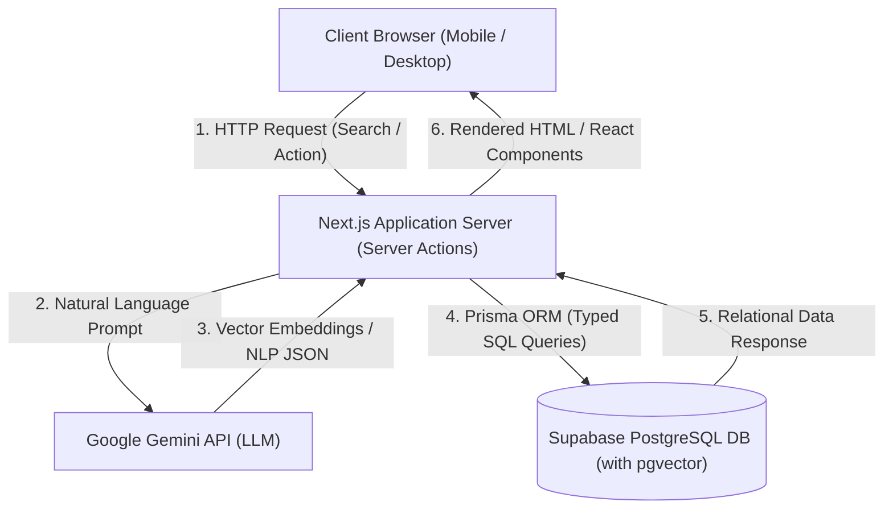
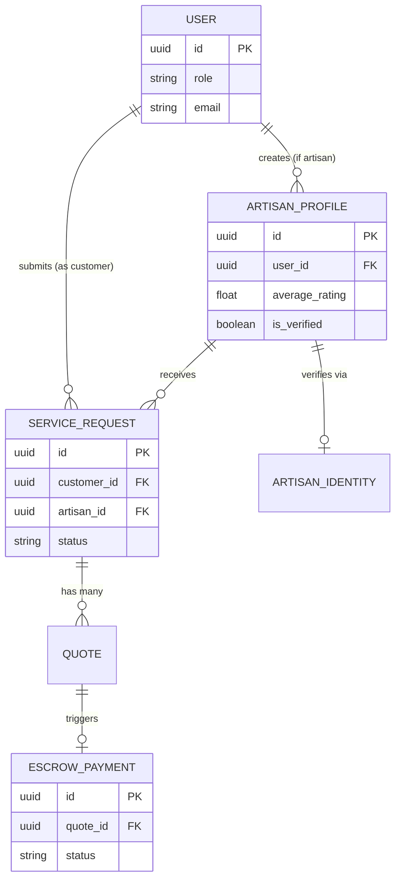
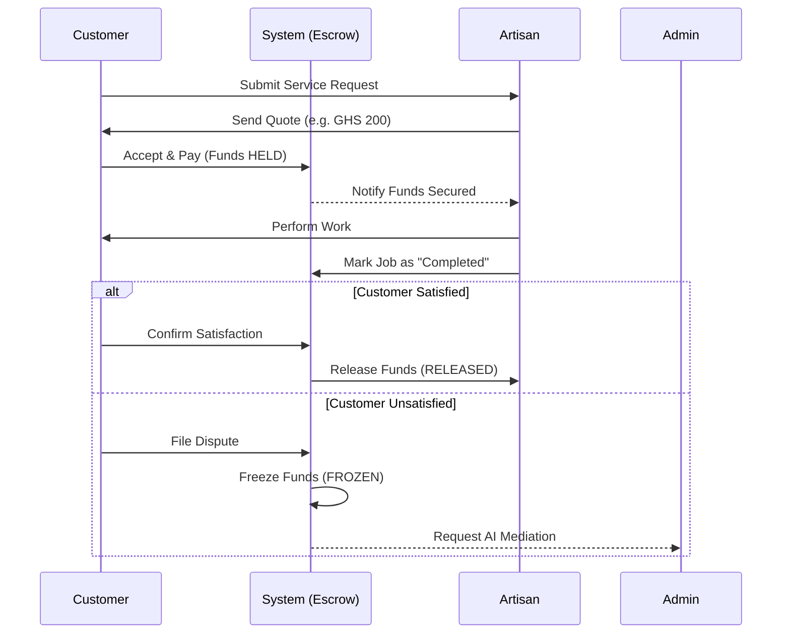
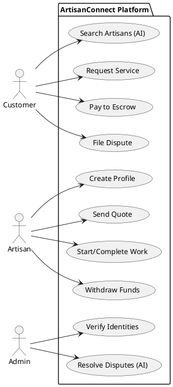

# ArtisanConnect: Draw.io Diagram Codes

*Instructions: Open [app.diagrams.net](https://app.diagrams.net/). Create a blank diagram. In the top menu, go to **Arrange > Insert > Advanced > Mermaid...** (or PlantUML for the Use Case alternative) and paste the code blocks below to automatically generate customizable shapes.*

---

## 1. System Architecture Diagram (Mermaid)

---

## 2. Entity Relationship Diagram (ERD) (Mermaid)

---

## 3. Escrow Service Lifecycle Workflow (Sequence Diagram) (Mermaid)

---

## 4. Use Case Diagram (PlantUML)
*Note: Draw.io often handles PlantUML better for Use Case diagrams than Mermaid. Go to **Arrange > Insert > Advanced > PlantUML...** and paste this:*

